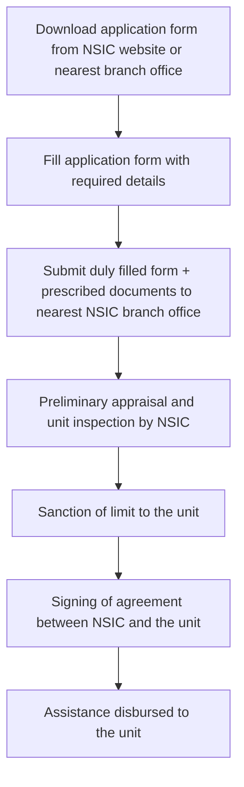

# Comprehensive Scheme Masterclass & File Guide

## Scheme Deep Dive

### Scheme Overview
The **NSIC Raw Material Assistance Scheme** (Scheme ID: row-12) is a **loan**-type scheme implemented by the **National Small Industries Corporation Ltd. (NSIC)**, a Government of India Enterprise under the Ministry of Micro, Small and Medium Enterprises (MSME). It operates on a **rolling basis** with pan-India geographic scope and was last updated in 2025. The scheme provides **credit support for raw material procurement against Bank Guarantee (BG)**, enabling MSMEs to finance the purchase of both indigenous and imported raw materials.

### Objectives
- Facilitate procurement of raw material with credit support up to 180 days  
- Help MSMEs avail economics of purchases like bulk purchase and cash discount  
- Enable MSMEs to focus better on manufacturing quality products  
- Provide financial assistance for raw material procurement against Bank Guarantee  

### Eligibility Matrix
| Eligibility Criteria | Details |
|----------------------|---------|
| **Target Beneficiaries** | MSME (Micro, Small, Medium Enterprises) |
| **Registration Requirement** | Any Manufacturing/Service MSME having Udyam Registration Certificate |
| **Exclusions** | Trading activities are not allowed under the Raw Material Assistance Scheme |
| **Geographic Scope** | Pan-India |

### Benefits & Financial Support
#### Financial Assistance Structure
| Parameter | Details |
|----------|---------|
| **Maximum Assistance** | Up to 95% of the Bank Guarantee (BG) value |
| **Credit Period** | 180 days, extendable on request of MSME with consent of Zonal Head, provided: • Unit serves interest • Total outstanding is within BG limit • BG remains valid till extended period |
| **Rate of Interest (Effective from 01.07.2025)** | **Micro Units**: • SME 1 rating: 8.75% p.a. • SME 2 rating: 9.25% p.a. • Other units: 9.75% p.a. **Small & Medium Units**: • SME 1 rating: 9.25% p.a. • SME 2 rating: 9.75% p.a. • Other units: 10.25% p.a. *Concessional rates apply only if dues are repaid within stipulated 180 days; otherwise, "Other units" rate applies.* |
| **Processing Fee** | **On new sanctions**: 1.0% p.a. for both Micro and Small & Medium units **On renewal**: 0.5% p.a. for Micro units, 1.0% p.a. for Small & Medium units |
| **Penal Charges** | 1.25% per quarter on outstanding amount for delayed payment beyond 180 days |
| **Maximum Exposure Ceilings** | • Manufacturing units: Rs. 1000 Lakhs per unit • Service units: Rs. 600 Lakhs per unit • Infrastructure units: Rs. 800 Lakhs (individual), Rs. 1000 Lakhs (group companies, 2+) • Group ceiling (associate/sister concerns): Rs. 2000 Lakh (manufacturing), Rs. 1500 Lakh (service), Rs. 1000 Lakh (Infrastructure) |

#### Non-Financial Benefits
- Materials facilitated under bulk supplies arrangements are provided at bulk supplier’s rate by eliminating middlemen  
- Discounts received under bulk supplies arrangements are shared with MSMEs, reducing cost of purchase  
- Availability of raw material on credit enables MSMEs to execute orders in hand  
- Payment is released directly to the supplier as requested by the MSME (not to the MSME)  

### Application Process

#### Required Documents Checklist
1. Passport size photograph of each Proprietor/Director/Partner/Society office bearer  
2. Valid self-attested Officially Valid Documents (OVD) for identity and address proof  
3. Self-attested copies of Udyam Registration Certificate  
4. Self-attested copy of GST Registration Certificate  
5. Self-attested statement of personal assets and liabilities along with residential address  
6. Copy of Board Resolution (for Pvt./Public Ltd. Co.), Power of Attorney (for partnership), or Governing Body Resolution (for Society)  
7. Specimen signatures of authorized signatory attested by bank  
8. Copy of sanction letter for credit limit sanctioned by FIs/banks  
9. Audited/Provisional financial statements of the unit (last year audited, provisional current year, or current year estimates for startups)  
10. Bank statement of the unit for the last six months  
11. Copy of the latest Electricity Bill  
12. Conduct Report of Account of the unit with Banks (other than BG issuing Bank) and Financial Institutions  
13. Certificate/undertaking that the unit’s name(s) do not fall in CIBIL/RBI defaulters list  
14. Copy of orders in hand (if enhancement of limit beyond five crores is sought)  

### Key Caveats
> **Trading activities are strictly prohibited** under the Raw Material Assistance Scheme.  
> **Validity of sanctioned limit**: One year, renewable for one year provided conduct of the account was satisfactory during the last year.  
> **Payment mechanism**: NSIC releases payment to the supplier as requested by the MSME, not directly to the MSME.  
> **Extension of credit period**: Possible beyond 180 days on request of MSME with Zonal Head’s consent, subject to interest servicing, outstanding within BG limit, and BG validity.  
> **Penal charges**: 1.25% per quarter on outstanding amount for delays beyond 180 days.  

### Application Portal & Sources
- **Primary Portal**: https://nsic.co.in/Schemes/RawMaterialAgainstBG  
- **Key Supporting Evidence**:  
  - Scheme Key Facts (structured data)  
  - Crawled page: https://nsic.co.in/Schemes/RawMaterialAgainstBG (Updated: 06.01.2026)  
  - FAQ document: faq-rma-scheme-18082025.pdf  
  - Application form: rma-app-14072023.pdf / rma-app-14072023.docx  
  - Document checklist: rma-doc-req-14072023.pdf  

---

## Consultant's Field Guide to Generated Files

### 1. SCHEME_MASTER_DATABASE.md
**Real-time Usage**: Keep this open in a background tab during all client calls. When a client asks "What is the turnover limit?" or "Who administers this?", CTRL+F in this document to give an immediate, authoritative answer without checking the portal.  
*Example*: During a discovery call, a client asks about the maximum exposure for service units. You instantly search "service unit exposure" and find: "Rs. 600 lakhs per unit" – answering confidently in <10 seconds.

### 2. PITCH_AND_SALES_SCRIPTS.md
**Real-time Usage**: Open this file 5 minutes before your first Discovery Call with a lead. Read the "Problem Framing" out loud to hook them, then use the Qualification Checklist to interrogate their eligibility live on the phone. Keep the Objection Handlers table visible so you can immediately counter when they say "We're too small for this."  
*Example*: A lead says, "We’re just a startup with no audited balance sheet." You flip to the Objection Handlers table and respond: "Startups can submit current year estimates certified by their auditor – we’ve helped 12 similar units get sanctioned last quarter."

### 3. APPLICATION_PLAYBOOK.md
**Real-time Usage**: Print this out or pin it to your desktop once the client signs the retainer. Check off each box in "Stage 1" before moving to "Stage 2". Use the "Client Communication Template" to copy-paste directly into your email when chasing them for pending documents.  
*Example*: After signing the retainer, you check "Stage 1: Document Collection" – verifying Udyam, GST, and bank statements are collected. When the client delays sending the electricity bill, you paste the pre-written chase email: "Hi [Name], just a friendly reminder on the latest electricity bill – we need this to proceed with NSIC submission by [date]."

### 4. CLIENT_ONBOARDING_AND_CRM.md
**Real-time Usage**: Fill this out during or immediately after the onboarding call. Use the Needs Assessment to record their exact pain points. Update the "Compliance Status" table as they email you documents to maintain a single source of truth for what's missing.  
*Example*: During onboarding, you note in Needs Assessment: "Client struggles with raw material cash flow – has 3 pending orders worth ₹50L." As documents arrive, you tick off Udyam (✓), GST (✓), but flag bank statement as missing in the Compliance Status table.

### 5. LIVE_CASE_TRACKER.md
**Real-time Usage**: Review this document every morning during your standup. Update the "Stage" column daily. If a case hits "Stage 07 - Under review", use the Escalation Path notes here to know exactly who to call at the government department today.  
*Example*: At 9 AM standup, you see Case #452 is at "Stage 07 - Under review". You check the Escalation Path: "Call Zonal Head – Mumbai Zone – Mr. Vikas Mathur at 079-27543228" and make the call before 10:30 AM.

### 6. FEE_AND_REVENUE_MODEL.md
**Real-time Usage**: Use this file when drafting the proposal. Look at the client's turnover, map them to the pricing tier in the table, and quote that exact Retainer and Success Fee. Use the monthly projection table to update your personal sales pipeline forecast for the quarter.  
*Example*: A client has ₹8Cr turnover (Small unit). Per the pricing table, you quote: Retainer: ₹1.5L, Success Fee: 8% of sanctioned amount. You then update your Q3 forecast: "Expected revenue from this case: ₹1.5L retainer + ₹0.8L success fee (if sanctioned at ₹10L limit)."

### 7. CLIENT_PROPOSAL_TEMPLATE.md
**Real-time Usage**: Copy this entire file, paste it into an email or PDF generator, replace the [PLACEHOLDER] tags with the client's actual details gathered from the CRM, and send it immediately after a successful discovery call.  
*Example*: After a discovery call where you confirmed eligibility, you open the template, replace [CLIENT_NAME], [UDYAM_NO], [TURNOVER], and [RAW_MATERIAL_NEED], then send the PDF proposal within 20 minutes – before the client loses momentum.

### 8. COMPLIANCE_AND_LEGAL_PACK.md
**Real-time Usage**: Attach sections 8A and 8B as PDFs to the proposal email. Refuse to start Step 1 of the Application Playbook until the client signs these. Use the Disclaimers to protect yourself legally if the client is rejected by the government agency.  
*Example*: You attach the signed Undertaking on CIBIL status and Personal Guarantee to the proposal email. You tell the client: "We cannot submit to NSIC until these are signed – it’s a mandatory compliance step." If NSIC rejects the case later, you reference the disclaimer: "Client acknowledged that sanction is at NSIC’s sole discretion."