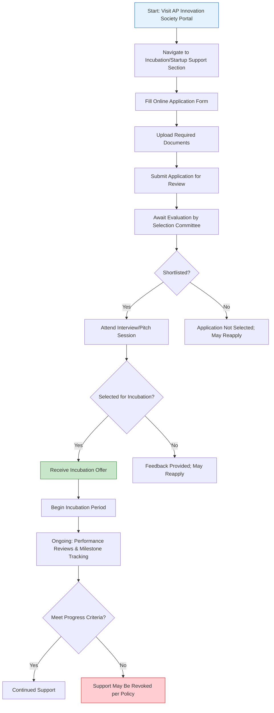

</think># Comprehensive Scheme Masterclass & File Guide

## Scheme Deep Dive

### Overview
The **AP Innovation Society & APEX Incubation** scheme (Scheme ID: row-123) is a state-level incubation initiative implemented by the **AP Innovation Society, Government of Andhra Pradesh**. It operates on a **rolling basis** throughout the year, accepting applications subject to the availability of incubation slots at designated centers across Andhra Pradesh. The scheme is designed to nurture early-stage innovation by providing holistic support to startups, entrepreneurs, and innovators based in the state.

### Objectives
The scheme aims to:
- Promote innovation and entrepreneurship across Andhra Pradesh  
- Provide incubation support including infrastructure and mentorship to early-stage startups  
- Facilitate access to technology, markets, and funding opportunities for innovators  
- Strengthen the startup ecosystem through collaboration with academia, industry, and investors  
- Support sector-specific innovation in areas such as agriculture, healthcare, and manufacturing  

### Eligibility Matrix
| Criteria | Details | Source |
|--------|---------|--------|
| **Applicant Type** | Startups, innovators, and entrepreneurs | Key Facts |
| **Geographic Requirement** | Must be based in Andhra Pradesh; preference for ventures registered in the state or committing to operate within AP | Key Facts |
| **Innovation Focus** | Working on innovative ideas, products, or services with potential for scalability and social impact | Key Facts |
| **Registration Status** | Open to both registered and unregistered entities; Certificate of Incorporation/Registration required if applicable | Required Documents |
| **Founder Documentation** | PAN and Aadhaar cards of founders required | Required Documents |
| **Location Proof** | Proof of residence or office address in Andhra Pradesh mandatory | Required Documents |

> **Note**: While the scheme is open to all eligible applicants, continued support is contingent on periodic performance reviews and achievement of progress milestones. Financial support is discretionary and based on fund availability and project evaluation.

### Benefits & Financial Support
| Benefit Category | Specific Support | Details | Source |
|------------------|------------------|---------|--------|
| **Infrastructure** | Incubation center access | Office space, labs, internet connectivity | Key Facts |
| **Mentorship & Guidance** | Expert mentorship | From industry experts and academics; guidance on product development and business modeling | Key Facts |
| **IPR Support** | Assistance in IPR filing | Help with patent, trademark, and copyright processes | Key Facts |
| **Networking** | Investor & industry connections | Opportunities to network with investors and industry partners | Key Facts |
| **Scheme Access** | Government scheme facilitation | Support in accessing other government funding and support programs | Key Facts |
| **Financial Support** | Seed funding, grants, or stipends | For prototype development and early-stage validation; exact quantum and disbursement based on proposal evaluation and fund availability | Key Facts |

> **Warning**: Financial support is not guaranteed. It is subject to evaluation by the incubation committee, availability of funds, and the specific merits of the project proposal. Disbursement mechanism varies per case.

### Required Documents
Applicants must submit the following documents via the online portal:
1. Business plan or project proposal  
2. Certificate of Incorporation / Registration (if applicable)  
3. PAN card of the applicant or entity  
4. Aadhaar card of founders  
5. Proof of residence or office address in Andhra Pradesh  
6. Details of innovation or technology being developed  
7. Team profile and qualifications  

### Application Process Flowchart

**Application Portal**: https://apinnovation.ap.gov.in  
**Status**: Rolling basis — applications accepted year-round subject to incubation slot availability  
**Evaluation**: Conducted by an internal selection committee; shortlisted candidates invited for interview/pitch  
**Outcome**: Successful applicants receive formal incubation offer; support terms defined case-by-case  

### Key Caveats
> - Incubation support is subject to availability of space and resources at designated centers  
> - Continued support is contingent on periodic performance review and progress milestones  
> - Intellectual property developed during incubation may be subject to specific terms as per society policies  
> - Financial support, if any, is discretionary and based on fund availability and project evaluation  
> - The scheme does not guarantee funding; non-financial support (infrastructure, mentorship) is core to the offering  

---

## Consultant's Field Guide to Generated Files

### 1. SCHEME_MASTER_DATABASE.md
**Real-time Usage:** Keep this open in a background tab during all client calls. When a client asks "What is the turnover limit?" or "Who administers this?", CTRL+F in this document to give an immediate, authoritative answer without checking the portal.  
*Pro Tip:* Use the search function for eligibility criteria (e.g., "Andhra Pradesh residency") or financial details (e.g., "seed funding") to respond in <10 seconds during live consultations.

### 2. PITCH_AND_SALES_SCRIPTS.md
**Real-time Usage:** Open this file 5 minutes before your first Discovery Call with a lead. Read the "Problem Framing" out loud to hook them, then use the Qualification Checklist to interrogate their eligibility live on the phone. Keep the Objection Handlers table visible so you can immediately counter when they say "We're too small for this."  
*Pro Tip:* Annotate the script with client-specific notes during the call (e.g., "Client confirmed AP office address") to seamlessly transition to onboarding.

### 3. APPLICATION_PLAYBOOK.md
**Real-time Usage:** Print this out or pin it to your desktop once the client signs the retainer. Check off each box in "Stage 1" before moving to "Stage 2". Use the "Client Communication Template" to copy-paste directly into your email when chasing them for pending documents.  
*Pro Tip:* Highlight the document upload checklist section and share your screen during document collection calls to ensure nothing is missed.

### 4. CLIENT_ONBOARDING_AND_CRM.md
**Real-time Usage:** Fill this out during or immediately after the onboarding call. Use the Needs Assessment to record their exact pain points. Update the "Compliance Status" table as they email you documents to maintain a single source of truth for what's missing.  
*Pro Tip:* Set a daily 10-minute reminder to sync this file with your CRM (e.g., HubSpot, Zoho) to avoid duplication of effort.

### 5. LIVE_CASE_TRACKER.md
**Real-time Usage:** Review this document every morning during your standup. Update the "Stage" column daily. If a case hits "Stage 07 - Under review", use the Escalation Path notes here to know exactly who to call at the government department today.  
*Pro Tip:* Color-code rows by urgency (Red = stalled >7 days, Yellow = pending client action, Green = progressing) for instant visual triage.

### 6. FEE_AND_REVENUE_MODEL.md
**Real-time Usage:** Use this file when drafting the proposal. Look at the client's turnover, map them to the pricing tier in the table, and quote that exact Retainer and Success Fee. Use the monthly projection table to update your personal sales pipeline forecast for the quarter.  
*Pro Tip:* Link this file to your quarterly bonus tracker — hitting projected revenue from this scheme triggers tiered payouts.

### 7. CLIENT_PROPOSAL_TEMPLATE.md
**Real-time Usage:** Copy this entire file, paste it into an email or PDF generator, replace the [PLACEHOLDER] tags with the client's actual details gathered from the CRM, and send it immediately after a successful discovery call.  
*Pro Tip:* Save a version with placeholders intact as a master template; never edit the original. Use version control (e.g., v1.0_ClientName) for each client proposal.

### 8. COMPLIANCE_AND_LEGAL_PACK.md
**Real-time Usage:** Attach sections 8A and 8B as PDFs to the proposal email. Refuse to start Step 1 of the Application Playbook until the client signs these. Use the Disclaimers to protect yourself legally if the client is rejected by the government agency.  
*Pro Tip:* Maintain a signed digital copy in your engagement folder and a physical copy in your compliance binder for audit readiness.