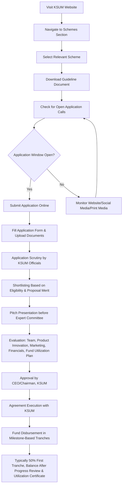

# Comprehensive Scheme Masterclass & File Guide

## Scheme Deep Dive

### Overview
Kerala Startup Mission (KSUM) is the nodal agency of the Government of Kerala for entrepreneurship development and incubation activities in Kerala, India. It operates under the aegis of the Government of Kerala and aims to foster innovation and support entrepreneurs across all stages of their journey. KSUM provides a comprehensive ecosystem including financial support, infrastructure, mentorship, market access, and investor connections.

### Objectives
- Foster innovation and support entrepreneurs across all stages of their journey
- Create a highly sustainable startup ecosystem under the aegis of the Govt. of Kerala
- Provide access to markets, capital, partnerships, and growth opportunities
- Nurture technology-driven and innovative solutions with strong commercialization potential
- Enable inclusive access to capital for first-time founders, student innovators, women-led startups, and technology-driven ventures
- Strengthen representation within Kerala’s startup ecosystem for Backward Classes and women/transgender founders
- Facilitate structured collaboration between corporates and startups to accelerate innovation adoption
- Empower women and transgender-led startups to transform their MVP into market-ready products

### Eligibility Matrix
Eligibility varies by scheme but generally requires:

| Criteria | Requirement |
|----------|-------------|
| **Entity Type** | Private Limited Company, LLP, or OPC |
| **Incorporation** | Must be incorporated in Kerala with active MCA status |
| **Recognition** | DPIIT recognition mandatory for most schemes |
| **KSUM Unique ID** | Mandatory for fund disbursement (though not always for application) |
| **Shareholding** | For women/transgender schemes: ≥51% shareholding by women/transgender founders |
| **Revenue/Traction** | Varies by scheme (e.g., Scale-up Grant: ₹10 lakhs revenue in last 6 months OR ₹30 lakhs external equity) |
| **Innovation Focus** | Must be working on an innovative product or technology |
| **Exclusions** | Not for service startups, SMEs in trade and commerce, or entities with pending dues to government agencies |
| **CIBIL Score** | >750 preferred for loan schemes (e.g., Women Soft Loan) |
| **Other** | No blacklisting by any Govt. agency in India; no pending dues with KSUM or other incubators |

### Benefits & Financial Support
KSUM offers a wide range of financial and non-financial benefits:

#### Grants (Non-dilutive)
| Grant Type | Maximum Amount | Eligibility Stage | Key Notes |
|------------|----------------|-------------------|-----------|
| Idea Grant | Up to ₹3 lakhs | Ideation, Designing, PoC stage | For early-stage innovators to validate ideas, build PoC, conduct feasibility studies |
| Productization Grant | Up to ₹7 lakhs | Product development stage | To convert MVP into market-ready product |
| Women/Transgender Productization Grant | Up to ₹12 lakhs | Product development stage | Additional support over standard Productization Grant for women/transgender-led startups with ≥51% shareholding |
| Market Acceleration Grant | Up to ₹10 lakhs | Early revenue stage | For market expansion, customer pilots, go-to-market activities |
| Scale-up Grant | Up to ₹15 lakhs | Growth stage | For startups with ₹10 lakhs revenue in last 6 months OR ₹30 lakhs external equity |
| Innovation Grant | Up to ₹15 lakhs (startups), ₹20 lakhs (women startups) | Innovator based in/out of Kerala | Conducted under 'Kerala Innovation Drive’YY’ annually or as per demand |
| NIDHI Prayas Grant | Up to ₹10 lakhs | Pre-seed stage (PoC to prototype) | For physical product development (pure software not eligible); max 18 months duration |
| NIDHI Seed Support | ₹25 lakhs to ₹1 Crore | Early-stage technology-driven startups | Requires ≥3 months association in incubator, ≥51% Indian promoter shareholding, DPIIT recognition |
| R&D Grant | Up to ₹30 lakhs | R&D activities | Maximum per entity under KSUM |
| BCDD Grant | Up to ₹10 lakhs | Early-stage | For OBC graduates aged 23–40 years; comprises Idea Grant (₹3 lakhs) + Productization Grant (₹7 lakhs) |
| Technology Transfer Scheme | Up to ₹10 lakhs | Technology acquisition | For acquiring/adapting/commercializing technologies from research institutions |
| Patent Reimbursement | ₹2 lakhs (national), ₹10 lakhs (international) | Patent filing/prosecution/maintenance | For domestic and international patents |

#### Loans (Repayable)
| Loan Type | Maximum Amount | Interest Rate | Moratorium | Repayment Period | Key Notes |
|-----------|----------------|---------------|------------|------------------|-----------|
| Seed Fund | Up to ₹15 lakhs | 6% simple interest | 12 months | 36 months | Against purchase orders; for product development, customer development, marketing, scaling up |
| Women Soft Loan | Up to ₹15 lakhs | 6% simple interest | - | 1 year or project completion | For working capital against Govt. dept/PSU purchase orders; CIBIL >750 preferred |
| Scale-up Seed Fund | Up to ₹25 lakhs | 6% simple interest | 12 months | 36 months | Collateral-free debt or CCD/CCPS; for revenue-stage startups to expand/commercialize |
| NIDHI Seed Support (Loan component) | Part of ₹25 lakhs–1 Crore | - | - | - | As part of NIDHI Seed Support program |

#### Equity-Linked Instruments
| Instrument Type | Maximum Amount | Key Notes |
|-----------------|----------------|-----------|
| Scale-up Seed Fund (CCD/CCPS) | Up to ₹25 to ₹25 lakhs | Collateral-free debt or CCD/CCPS option |
| Fund of Funds | - | KSUM as LP in SEBI-registered AIFs investing in Kerala-based startups; sector-agnostic |
| Creative Economy Fund | - | Proposed VC fund for creative economy sectors (media, design, content, gaming, cultural innovation) |

#### Non-Financial Benefits
- Incubation and acceleration programs (Pre-Incubation, Incubation, Acceleration)
- Mentorship from industry experts
- Access to world-class infrastructure:
  - Integrated Startup Complex (South Asia's largest innovation hub)
  - Super Fablab (Rapid prototyping and digital fabrication)
  - Digital Hub (South Asia's Largest Startup Hub)
  - Emerging Tech Hub (Advanced infrastructure for deep-tech)
  - Startup Pod (Fully equipped workspaces at scenic destinations)
  - Freedom Square (24×7 innovation space)
- Coworking spaces (LEAP Centres)
- Market expansion initiatives (exposure visits, showcases, strategic interactions)
- Investor connect programs (Investor Café, Pitch Days, VC 101 Bootcamp)
- Investor education (Ignite program for HNIs/UHNIs)
- Government as marketplace for procurement
- International exposure programs
- Sector-specific initiatives (Construction Innovation Hub, KERA with World Bank, etc.)

### Application Process
The following Mermaid flowchart illustrates the standard application process for KSUM schemes:

#### Detailed Application Steps:
1. Visit the KSUM website at https://startupmission.kerala.gov.in
2. Navigate to the 'Schemes' section and select the relevant scheme
3. Download the guideline document for detailed eligibility and process
4. Check for open application calls published on the website, social media, and print media
5. Submit application online through the KSUM portal during the application window
6. Fill the application form and upload required documents (incorporation, PAN, KSUM Unique ID, bank details, fund utilization plan, etc.)
7. Application scrutiny by KSUM officials
8. Shortlisting based on eligibility and proposal merit
9. Pitch presentation before the Expert Committee
10. Evaluation based on team, product innovation, marketing, financials, and fund utilization plan
11. Approval by CEO/Chairman, KSUM
12. Agreement execution with KSUM
13. Fund disbursement in milestone-based tranches (typically 50% first tranche, balance after progress review and utilization certificate)

### Key Caveats
> **WARNING**: Grants are not given for service startups and SMEs working in trade and commerce  
> **WARNING**: Startups shall not have any other pending dues with Government agencies, KSUM, or other incubators  
> **WARNING**: Startups shall not be blacklisted by any Govt. agency in India  
> **WARNING**: Founder salaries, purchase of fixed assets (land, building, high-end equipment, costly software above ₹2 lakhs), rent, and major infrastructure setup are not permitted under most grants  
> **WARNING**: Only one idea can be applied for at a time; two grants will not be sanctioned simultaneously  
> **WARNING**: If a startup has availed prior grants (Idea, Productization, Market Acceleration), only the remaining eligible amount can be claimed for subsequent grants  
> **WARNING**: KSUM Unique ID is mandatory for fund disbursement (though not always for application)  
> **WARNING**: Company incorporation and active MCA status are mandatory before fund disbursal  

### Contact Details
- **Email**: info@startupmission.in
- **Phone**: 08047180470
- **Address**: Kerala Startup Mission, G3B, Thejaswini, Technopark, Trivandrum, Kerala 695581
- **Application Portal**: https://startupmission.kerala.gov.in

### Status & Deadlines
- **Status**: Rolling basis — application windows are announced periodically through KSUM’s website, social media, and print media
- **Specific Schemes**: 
  - Innovation Grant: Conducted under 'Kerala Innovation Drive’YY’ annually or as per demand
  - EOI for Startup Space Allotment: 22 June 2026 at 5:00 PM
  - Tender for AutoCAD: 13 July 2026 at 5:00 PM
- **Last Updated**: 2026
- **Max Per Entity**: Up to ₹30 lakhs for R&D Grant

---

## Consultant's Field Guide to Generated Files

### 1. SCHEME_MASTER_DATABASE.md
**Real-time Usage:** Keep this open in a background tab during all client calls. When a client asks "What is the turnover limit?" or "Who administers this?", CTRL+F in this document to give an immediate, authoritative answer without checking the portal.

### 2. PITCH_AND_SALES_SCRIPTS.md
**Real-time Usage:** Open this file 5 minutes before your first Discovery Call with a lead. Read the "Problem Framing" out loud to hook them, then use the Qualification Checklist to interrogate their eligibility live on the phone. Keep the Objection Handlers table visible so you can immediately counter when they say "We're too small for this."

### 3. APPLICATION_PLAYBOOK.md
**Real-time Usage:** Print this out or pin it to your desktop once the client signs the retainer. Check off each box in "Stage 1" before moving to "Stage 2". Use the "Client Communication Template" to copy-paste directly into your email when chasing them for pending documents.

### 4. CLIENT_ONBOARDING_AND_CRM.md
**Real-time Usage:** Fill this out during or immediately after the onboarding call. Use the Needs Assessment to record their exact pain points. Update the "Compliance Status" table as they email you documents to maintain a single source of truth for what's missing.

### 5. LIVE_CASE_TRACKER.md
**Real-time Usage:** Review this document every morning during your standup. Update the "Stage" column daily. If a case hits "Stage 07 - Under review", use the Escalation Path notes here to know exactly who to call at the government department today.

### 6. FEE_AND_REVENUE_MODEL.md
**Real-time Usage:** Use this file when drafting the proposal. Look at the client's turnover, map them to the pricing tier in the table, and quote that exact Retainer and Success Fee. Use the monthly projection table to update your personal sales pipeline forecast for the quarter.

### 7. CLIENT_PROPOSAL_TEMPLATE.md
**Real-time Usage:** Copy this entire file, paste it into an email or PDF generator, replace the [PLACEHOLDER] tags with the client's actual details gathered from the CRM, and send it immediately after a successful discovery call.

### 8. COMPLIANCE_AND_LEGAL_PACK.md
**Real-time Usage:** Attach sections 8A and 8B as PDFs to the proposal email. Refuse to start Step 1 of the Application Playbook until the client signs these. Use the Disclaimers to protect yourself legally if the client is rejected by the government agency.