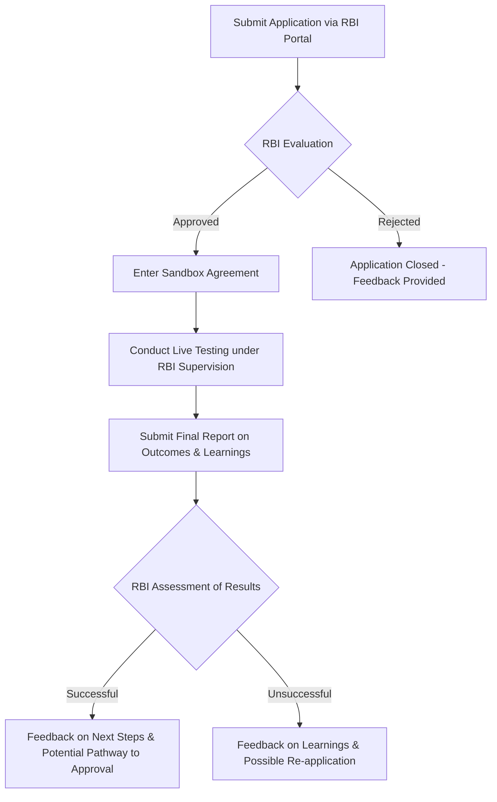

# Comprehensive Scheme Masterclass & File Guide

## Scheme Deep Dive

### Overview
The **RBI Regulatory Sandbox for Fintech** is a framework established by the Reserve Bank of India (RBI) to foster responsible innovation in the financial technology sector. It allows fintech startups and financial technology companies to test innovative products and services in a controlled environment with regulatory relaxations, under RBI supervision. The sandbox does not provide direct financial support but offers regulatory facilitation, guidance, and a potential pathway to broader regulatory approval upon successful completion.

**Implementing Agency**: Reserve Bank of India  
**Geographic Scope**: Pan-India  
**Application Portal**: [https://www.rbi.org.in/Scripts/bs_viewcontent.aspx?Id=3854](https://www.rbi.org.in/Scripts/bs_viewcontent.aspx?Id=3854)  
**Status / Deadlines**: Applications are accepted on a rolling basis; there are no fixed deadlines.  
**Contact Details**: Email: helpdoc@rbi.org.in | Phone: 022 - 2266 0502  
**Confidence Level**: Medium (based on evidence consistency)

### Objectives
The RBI Regulatory Sandbox aims to:
- Foster responsible innovation in fintech
- Enable live testing of innovative financial products and services
- Assess the benefits and risks of new technologies
- Determine if regulatory changes are needed to support innovation
- Provide sandbox participants access to regulatory guidance and support

### Eligibility Matrix
| Criteria | Requirement | Source |
|---------|-------------|--------|
| Entity Incorporation | Must be incorporated in India | Key Facts |
| Net Worth | Minimum INR 25 lakh as per last audited balance sheet | Key Facts |
| Innovation | Product/service must be innovative and not already widely available in the market | Key Facts |
| Genuine Need | Must demonstrate a genuine need for testing in the sandbox | Key Facts |
| Exit Strategy | Must have a clear exit strategy | Key Facts |
| Target Beneficiaries | Fintech startups; financial technology companies | Key Facts |

> **Note**: Participation does not guarantee regulatory approval for full-scale launch. The sandbox is not a source of funding or investment. Regulatory relaxations are limited to the specific product/service under test. Participants must comply with all other applicable laws and regulations. RBI may terminate participation if risks to consumers or systemic stability are identified.

### Benefits & Financial Support
| Benefit Type | Details | Source |
|--------------|---------|--------|
| Financial Support | **No direct financial support, grants, or funding** is provided. Support is limited to regulatory facilitation and guidance during the testing phase. | Key Facts |
| Regulatory Relaxations | Specific relaxations applicable only to the tested product/service | Key Facts |
| RBI Guidance | Access to RBI guidance during the testing period | Key Facts |
| Live Testing | Permission to test with real customers in a controlled environment | Key Facts |
| Pathway to Approval | Potential pathway to broader regulatory approval upon successful completion | Key Facts |

> **Warning**: The absence of direct funding means consultants must advise clients that the sandbox’s value lies in regulatory de-risking and validation, not capital infusion.

### Required Documents
1. Certificate of Incorporation/Registration  
2. Latest audited balance sheet  
3. Detailed description of the innovative product or service  
4. Business plan and financial projections  
5. Details of the technology to be used  
6. Customer protection and data security measures  
7. Exit strategy and scalability plan  

### Application Process
The application process consists of six sequential stages:

**Process Details**:
1. Submit an application through the RBI's designated portal with details of the innovative product/service.
2. RBI evaluates the application for eligibility and innovativeness.
3. If approved, enter into a sandbox agreement outlining the scope, duration, and regulatory relaxations.
4. Conduct live testing under RBI supervision.
5. Submit a final report on outcomes and learnings.
6. RBI assesses results and provides feedback on next steps.

> **Critical Note**: The sandbox agreement defines the exact scope, duration, and regulatory relaxations permitted. Clients must adhere strictly to these terms during testing.

### Key Caveats
- Participation does not guarantee regulatory approval for full-scale launch
- The sandbox is not a source of funding or investment
- Regulatory relaxations are limited to the specific product/service under test
- Participants must comply with all other applicable laws and regulations
- RBI may terminate participation if risks to consumers or systemic stability are identified

---

## Consultant's Field Guide to Generated Files

### 1. SCHEME_MASTER_DATABASE.md
**Real-time Usage**: Keep this open in a background tab during all client calls. When a client asks "What is the turnover limit?" or "Who administers this?", CTRL+F in this document to give an immediate, authoritative answer without checking the portal.

### 2. PITCH_AND_SALES_SCRIPTS.md
**Real-time Usage**: Open this file 5 minutes before your first Discovery Call with a lead. Read the "Problem Framing" out loud to hook them, then use the Qualification Checklist to interrogate their eligibility live on the phone. Keep the Objection Handlers table visible so you can immediately counter when they say "We're too small for this."

### 3. APPLICATION_PLAYBOOK.md
**Real-time Usage**: Print this out or pin it to your desktop once the client signs the retainer. Check off each box in "Stage 1" before moving to "Stage 2". Use the "Client Communication Template" to copy-paste directly into your email when chasing them for pending documents.

### 4. CLIENT_ONBOARDING_AND_CRM.md
**Real-time Usage**: Fill this out during or immediately after the onboarding call. Use the Needs Assessment to record their exact pain points. Update the "Compliance Status" table as they email you documents to maintain a single source of truth for what's missing.

### 5. LIVE_CASE_TRACKER.md
**Real-time Usage**: Review this document every morning during your standup. Update the "Stage" column daily. If a case hits "Stage 07 - Under review", use the Escalation Path notes here to know exactly who to call at the government department today.

### 6. FEE_AND_REVENUE_MODEL.md
**Real-time Usage**: Use this file when drafting the proposal. Look at the client's turnover, map them to the pricing tier in the table, and quote that exact Retainer and Success Fee. Use the monthly projection table to update your personal sales pipeline forecast for the quarter.

### 7. CLIENT_PROPOSAL_TEMPLATE.md
**Real-time Usage**: Copy this entire file, paste it into an email or PDF generator, replace the [PLACEHOLDER] tags with the client's actual details gathered from the CRM, and send it immediately after a successful discovery call.

### 8. COMPLIANCE_AND_LEGAL_PACK.md
**Real-time Usage**: Attach sections 8A and 8B as PDFs to the proposal email. Refuse to start Step 1 of the Application Playbook until the client signs these. Use the Disclaimers to protect yourself legally if the client is rejected by the government agency.