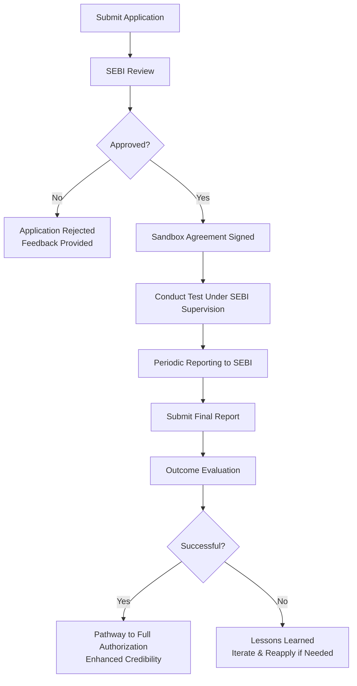

# Comprehensive Scheme Masterclass & File Guide

## Scheme Deep Dive

### Scheme Overview
The **SEBI Innovation Sandbox** is a regulatory initiative launched by the Securities and Exchange Board of India (SEBI) to foster innovation in India's securities markets. It provides a controlled environment where fintech startups, innovators, and financial institutions can test novel products, services, or business models under regulatory supervision, without immediately needing full compliance with existing regulations.

- **Scheme Name**: SEBI Innovation Sandbox  
- **Scheme ID**: row-131  
- **Implementing Agency**: Securities and Exchange Board of India (SEBI)  
- **Application Portal**: [https://www.sebi.gov.in/innovation-sandbox](https://www.sebi.gov.in/innovation-sandbox)  
- **Geographic Scope**: Pan-India  
- **Status / Deadlines**: Rolling basis — applications accepted throughout the year  
- **Scheme Type**: Other (regulatory facilitation, not financial grant)  
- **Ministry / Category**: Finance & Banking  

### Objectives
The SEBI Innovation Sandbox aims to:
- Promote innovation in the securities market  
- Enable testing of new financial products and services in a live environment  
- Ensure investor protection during experimentation  
- Provide regulatory flexibility for emerging technologies  
- Gather insights to inform future policy and regulation  
- Facilitate collaboration between regulators and innovators  

### Eligibility Matrix
To qualify for the SEBI Innovation Sandbox, applicants must meet the following criteria:

| Eligibility Criteria | Details | Source |
|----------------------|--------|--------|
| **Entity Type** | Incorporated in India (startups, fintech companies, innovators) | Key Facts |
| **Net Worth** | Minimum net worth as specified by SEBI (exact amount not disclosed in evidence; applicants must refer to latest SEBI guidelines) | Key Facts |
| **Innovation Focus** | Must propose an innovative product, service, or business model related to securities markets | Key Facts |
| **Market Need** | Innovation must address a genuine market need in the securities sector | Key Facts |
| **Investor Protection** | Must include safeguards for investor protection and risk management | Key Facts |
| **Risk Management** | Robust risk assessment and mitigation plan required | Key Facts |
| **Existing Approvals** | Details of any current regulatory approvals or licenses must be disclosed | Key Facts |

> **Note**: While the Key Facts specify a minimum net worth requirement, the exact figure is not provided in the evidence. Consultants must advise clients to consult the latest SEBI Innovation Sandbox guidelines or contact SEBI directly for current thresholds.

### Benefits & Financial Support
The SEBI Innovation Sandbox does **not** provide direct financial assistance, grants, or funding. Instead, it offers significant non-financial benefits:

| Benefit Category | Specific Benefits | Source |
|------------------|-------------------|--------|
| **Regulatory Relief** | Access to a regulated testing environment with relaxed compliance requirements for the approved scope of testing | Key Facts |
| **Regulatory Guidance** | Direct mentorship and guidance from SEBI officials during the testing phase | Key Facts |
| **Pathway to Authorization** | Potential route to full regulatory authorization upon successful testing | Key Facts |
| **Enhanced Credibility** | Association with SEBI enhances market trust and credibility | Key Facts |
| **Market Access** | Opportunities to access investors, partners, and customers within the sandbox ecosystem | Key Facts |
| **Investor Protection Focus** | Structured framework ensuring investor safety during innovation trials | Key Facts |

> **Important Caveat**: Participants bear **all costs** associated with the innovation, development, testing, and compliance within the sandbox. SEBI does not fund any part of the participant’s expenses.

### Application Process
The application process for the SEBI Innovation Sandbox consists of six sequential stages:

#### Detailed Steps:
1. **Application Submission**:  
   - Submit a detailed application via the [SEBI Innovation Sandbox portal](https://www.sebi.gov.in/innovation-sandbox)  
   - Must include:  
     - Certificate of Incorporation  
     - Detailed description of the innovative product/service/model  
     - Business plan and financial projections  
     - Risk assessment and mitigation plan  
     - Investor protection measures  
     - Details of promoters and key personnel  
     - Any existing regulatory approvals or licenses  

2. **SEBI Review**:  
   - SEBI evaluates eligibility, innovation merit, risk levels, and investor protection adequacy  
   - Focus on whether the innovation addresses a genuine market need  

3. **Sandbox Agreement**:  
   - If approved, enter into a formal sandbox agreement with SEBI  
   - Agreement outlines:  
     - Scope of testing  
     - Duration (time-limited)  
     - Specific relaxed regulations that apply  
     - Reporting and compliance conditions  

4. **Testing Phase**:  
   - Conduct the live test under SEBI supervision  
   - Adhere strictly to the agreed scope and conditions  
   - Submit periodic progress reports as required  

5. **Final Reporting**:  
   - Submit a comprehensive final report detailing:  
     - Outcomes of the test  
     - Lessons learned  
     - Performance metrics  
     - Any incidents or deviations  

6. **Outcome Evaluation**:  
   - SEBI assesses results to determine next steps  
   - **Successful testing does not guarantee future regulatory approval**  
   - SEBI may terminate participation early if risks to investors or market integrity are detected  

### Key Caveats & Warnings
> **Warning**: Participation is **time-limited** and subject to SEBI’s ongoing approval.  
> **Warning**: Regulatory relaxations apply **only** to the explicitly approved scope of testing — activities outside this scope remain subject to full regulations.  
> **Warning**: SEBI reserves the right to **terminate participation** at any time if investor protection or market integrity is compromised.  
> **Warning**: Successful sandbox completion **does not entitle** the participant to automatic licensing or regulatory approval.  
> **Warning**: All operational, technological, and testing costs are borne entirely by the participant. SEBI provides **no financial support**.  

---

## Consultant's Field Guide to Generated Files

### 1. SCHEME_MASTER_DATABASE.md
**Real-time Usage**: Keep this open in a background tab during all client calls. When a client asks "What is the turnover limit?" or "Who administers this?", CTRL+F in this document to give an immediate, authoritative answer without checking the portal.  
**Pro Tip**: Use search terms like “net worth”, “SEBI”, or “eligibility” to instantly retrieve exact criteria during qualification calls.

### 2. PITCH_AND_SALES_SCRIPTS.md
**Real-time Usage**: Open this file 5 minutes before your first Discovery Call with a lead. Read the "Problem Framing" out loud to hook them, then use the Qualification Checklist to interrogate their eligibility live on the phone. Keep the Objection Handlers table visible so you can immediately counter when they say "We're too small for this."  
**Script Example**:  
> *"Many fintech innovators struggle to test new trading platforms or AI-driven advisory tools due to heavy compliance burdens. The SEBI Innovation Sandbox removes those barriers — letting you test in a live market with SEBI’s guidance, without needing a full license upfront."*  
Then run through the checklist:  
- [ ] Incorporated in India?  
- [ ] Meets SEBI’s minimum net worth? *(Confirm latest threshold)*  
- [ ] Innovation tied to securities markets?  
- [ ] Includes investor protection measures?  

### 3. APPLICATION_PLAYBOOK.md
**Real-time Usage**: Print this out or pin it to your desktop once the client signs the retainer. Check off each box in "Stage 1" before moving to "Stage 2". Use the "Client Communication Template" to copy-paste directly into your email when chasing them for pending documents.  
**Stage 1 Example Checklist**:  
- [ ] Certificate of Incorporation obtained  
- [ ] Detailed innovation description drafted  
- [ ] Business plan and financial projections completed  
- [ ] Risk assessment and mitigation plan written  
- [ ] Investor protection measures documented  
- [ ] Promoters’ details compiled  
- [ ] Existing approvals disclosed  

**Email Template Snippet**:  
> *Hi [Client Name],*  
> *As discussed, we’re awaiting your [specific document] to proceed with Stage 1 of the SEBI Innovation Sandbox application. Could you please share this by [date]? Let me know if you need support drafting it.*  
> *Best regards,*  
> *[Your Name]*  

### 4. CLIENT_ONBOARDING_AND_CRM.md
**Real-time Usage**: Fill this out during or immediately after the onboarding call. Use the Needs Assessment to record their exact pain points. Update the "Compliance Status" table as they email you documents to maintain a single source of truth for what's missing.  
**Needs Assessment Fields**:  
- Primary Innovation: _________________________  
- Target Market (e.g., retail investors, institutions): _________________________  
- Biggest Regulatory Hurdle: _________________________  
- Desired Outcome from Sandbox: _________________________  

**Compliance Status Table**:  
| Document | Status | Received Date | Follow-up Needed |  
|---------|--------|---------------|------------------|  
| Certificate of Incorporation | [ ] | _________ | [ ] Yes [ ] No |  
| Innovation Description | [ ] | _________ | [ ] Yes [ ] No |  
| Business Plan | [ ] | _________ | [ ] Yes [ ] No |  
| Risk Assessment | [ ] | _________ | [ ] Yes [ ] No |  
| Investor Protection Plan | [ ] | _________ | [ ] Yes [ ] No |  
| Promoter Details | [ ] | _________ | [ ] Yes [ ] No |  
| Existing Approvals | [ ] | _________ | [ ] Yes [ ] No |  

### 5. LIVE_CASE_TRACKER.md
**Real-time Usage**: Review this document every morning during your standup. Update the "Stage" column daily. If a case hits "Stage 07 - Under review", use the Escalation Path notes here to know exactly who to call at the government department today.  
**Stage Definitions**:  
- Stage 01: Client Engaged & Retainer Signed  
- Stage 02: Documents Collected (Application Playbook Stage 1)  
- Stage 03: Application Drafted & Client Reviewed  
- Stage 04: Application Submitted to SEBI Portal  
- Stage 05: Under SEBI Review  
- Stage 06: Additional Info Requested by SEBI  
- Stage 07: **Under Review** ← *Critical Stage*  
- Stage 08: Sandbox Agreement Negotiated  
- Stage 09: Testing Phase Active  
- Stage 10: Final Report Submitted  
- Stage 11: Outcome Awaited  
- Stage 12: Case Closed (Approved/Rejected/Withdrawn)  

**Escalation Path for Stage 07**:  
If no update in 10+ business days:  
1. Contact SEBI Innovation Sandbox Helpdesk via portal  
2. Escalate to Deputy General Manager (DGM), FinTech Division  
3. If unresolved, approach Office of Chairman, SEBI (via formal channel)  
*Note: Always maintain polite, professional tone — SEBI values compliance and patience.*

### 6. FEE_AND_REVENUE_MODEL.md
**Real-time Usage**: Use this file when drafting the proposal. Look at the client's turnover, map them to the pricing tier in the table, and quote that exact Retainer and Success Fee. Use the monthly projection table to update your personal sales pipeline forecast for the quarter.  
**Pricing Tier Table (Based on Client Turnover)**:  
| Annual Turnover (INR) | Retainer Fee (INR) | Success Fee (% of Saved Regulatory Cost) | Notes |  
|------------------------|--------------------|------------------------------------------|-------|  
| < 50 Lakhs | 1,50,000 | 15% | For early-stage startups |  
| 50 Lakhs – 2 Cr | 3,00,000 | 12% | Standard fintech range |  
| 2 Cr – 10 Cr | 5,00,000 | 10% | Established players testing scale |  
| > 10 Cr | 7,50,000+ | 8% | Custom engagement; may include team |  

> **Note**: Success Fee is calculated based on estimated savings from avoided licensing delays, reduced legal fees, or accelerated market access — **not** on sandbox funding (as none exists).  
**Monthly Projection Example**:  
| Month | Expected Retainers | Expected Success Fees | Pipeline Value |  
|-------|--------------------|------------------------|----------------|  
| Apr 2025 | 2,00,000 | 0 | 2,00,000 |  
| May 2025 | 3,00,000 | 1,50,000 | 4,50,000 |  
| Jun 2025 | 1,00,000 | 3,00,000 | 4,00,000 |  

### 7. CLIENT_PROPOSAL_TEMPLATE.md
**Real-time Usage**: Copy this entire file, paste it into an email or PDF generator, replace the [PLACEHOLDER] tags with the client's actual details gathered from the CRM, and send it immediately after a successful discovery call.  
**Key Sections to Customize**:  
- [CLIENT_NAME]  
- [INNOVATION_DESCRIPTION]  
- [TARGET_MARKET]  
- [REGULATORY_PAIN_POINT]  
- [PROPOSED_RETAINER]  
- [SUCCESS_FEE_STRUCTURE]  
- [TIMELINE_ESTIMATE]  
- [CONSULTANT_NAME/FIRM]  

**Proposal Snippet**:  
> *Dear [CLIENT_NAME],*  
> *Based on our discussion, we propose to support your application to the SEBI Innovation Sandbox for testing your [INNOVATION_DESCRIPTION] targeting [TARGET_MARKET].*  
> *Our engagement includes:*  
> *- End-to-end application preparation*  
> *- Regulatory strategy alignment*  
> *- Document review and submission support*  
> *- Liaison with SEBI during review phase*  
> *- Final report preparation guidance*  
> *Fees: Retainer of [PROPOSED_RETAINER] INR + Success Fee of [SUCCESS_FEE_STRUCTURE] based on regulatory acceleration of regulatory efficiency gains.*  
> *Estimated timeline: 8–12 weeks from document completion to SEBI feedback.*  

### 8. COMPLIANCE_AND_LEGAL_PACK.md
**Real-time Usage**: Attach sections 8A and 8B as PDFs to the proposal email. Refuse to start Step 1 of the Application Playbook until the client signs these. Use the Disclaimers to protect yourself legally if the client is rejected by the government agency.  
**Section 8A: Client Engagement Terms**  
- Scope: Advisory services for SEBI Innovation Sandbox application only  
- Excludes: Guarantee of approval, legal representation, product development  
- Retainer: Non-refundable upon work commencement  
- Success Fee: Payable within 15 days of SEBI sandbox agreement signing  

**Section 8B: Disclaimer & Liability Limitation**  
> *The Consultant does not guarantee acceptance into the SEBI Innovation Sandbox, nor does it assure that participation will lead to regulatory approval. All decisions rest solely with SEBI. The Consultant shall not be liable for any indirect, consequential, or punitive damages arising from application outcomes. Client bears all costs of innovation, testing, and compliance.*  

**Usage Rule**:  
> **Do not proceed** with document collection or application drafting until the signed Client Engagement Terms and Disclaimer are received. This protects both parties and sets clear expectations.  

---  
*This report is generated based on evidence from the SEBI Innovation Sandbox portal and official SEBI communications. For the latest updates, always refer to [https://www.sebi.gov.in/innovation-sandbox](https://www.sebi.gov.in/innovation-sandbox).*