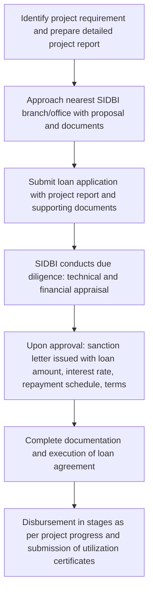

# Comprehensive Scheme Masterclass & File Guide

## Scheme Deep Dive

### Scheme Overview
The **SIDBI Make in India Soft Loan Fund (SMILE)** is a **loan**-type scheme implemented by the **Small Industries Development Bank of India (SIDBI)** under the **Finance & Banking** ministry/category. It has a **Pan-India** geographic scope and operates on a **rolling basis** — applications are accepted throughout the year based on fund availability and project viability. The scheme was last updated in **2026**.

### Objectives
The scheme aims to:
- Provide soft loans for setting up new projects in manufacturing and service sectors
- Support expansion, modernization, diversification, and technology upgradation of existing units
- Facilitate rehabilitation of sick units
- Promote Make in India initiative by enhancing domestic manufacturing capabilities
- Provide financial assistance for capital investment and operational needs of MSMEs
- Encourage technology adoption and industrial upgradation
- Support service sector enterprises for service expansion and quality improvement

### Eligibility Matrix
| Eligibility Criteria | Details |
|----------------------|---------|
| **Target Beneficiaries** | MSME; service enterprises; manufacturing units; service sector units; sick units undergoing rehabilitation |
| **Eligible Entities** | Sole proprietorships, partnerships, cooperative societies, private and public limited companies in the micro and small sector |
| **Eligible Activities** | Units undertaking new projects, expansion, modernization, diversification, technology upgradation, or rehabilitation of sick units |
| **Priority Groups** | Women entrepreneurs and units adopting state-of-the-art technology |
| **Geographic Scope** | Pan-India |

### Benefits & Financial Support
| Aspect | Details |
|--------|---------|
| **Loan Type** | Soft loan for project financing |
| **Coverage** | Expenses related to plant and machinery, technical know-how, and other project components |
| **Loan Amount** | Need-based, subject to project cost and borrower's repayment capacity |
| **Repayment Tenure** | Structured to align with project cash flows, often including a moratorium period |
| **Interest Rates** | Concessional compared to market rates |
| **Additional Benefits** | May be covered under credit guarantee schemes like CGTMSE to reduce collateral requirements; collateral relaxation and simplified documentation for eligible borrowers |
| **Key Advantages** | Favorable terms including concessional interest rates, extended repayment tenors, flexible repayment options; reduces financial burden on enterprises undertaking long gestation projects; promotes technology upgradation and modernization |

### Required Documents
1. Project report detailing project cost, means of financing, and projected financials  
2. Proof of identity and address of the promoter(s)  
3. Proof of business constitution (Partnership deed, Certificate of Incorporation, etc.)  
4. Land documents (ownership/lease agreement) and building plans  
5. Quotations for plant and machinery and other assets  
6. Sanction letters from other lenders (if any)  
7. Income tax returns and audited financial statements for existing businesses  
8. Bank account statements  
9. Project approvals and NOCs from relevant authorities (if applicable)  
10. Details of collateral security offered  

### Application Process

### Key Caveats
> - Loan approval is subject to credit appraisal, project viability, and availability of funds under the scheme  
> - The loan must be utilized strictly for the purpose specified in the sanction letter  
> - Beneficiaries must comply with all terms and conditions of the loan agreement, including timely repayment  
> - Submission of utilization certificates and progress reports may be required during the loan tenure  
> - The scheme may be subject to periodic review and revision by SIDBI based on policy changes  

### Contact Details
- **Toll Free Number**: 180-022-6753  
- **Phone**: +91 86930 33333  
- **Email**: Available via SIDBI's online enquiry form at https://sidbi.in/online-enquiry  
- **Application Portal**: https://sidbi.in/en/products/smile  

---

## Consultant's Field Guide to Generated Files

### 1. SCHEME_MASTER_DATABASE.md
**Real-time Usage:** Keep this open in a background tab during all client calls. When a client asks "What is the turnover limit?" or "Who administers this?", CTRL+F in this document to give an immediate, authoritative answer without checking the portal.

### 2. PITCH_AND_SALES_SCRIPTS.md
**Real-time Usage:** Open this file 5 minutes before your first Discovery Call with a lead. Read the "Problem Framing" out loud to hook them, then use the Qualification Checklist to interrogate their eligibility live on the phone. Keep the Objection Handlers table visible so you can immediately counter when they say "We're too small for this."

### 3. APPLICATION_PLAYBOOK.md
**Real-time Usage:** Print this out or pin it to your desktop once the client signs the retainer. Check off each box in "Stage 1" before moving to "Stage 2". Use the "Client Communication Template" to copy-paste directly into your email when chasing them for pending documents.

### 4. CLIENT_ONBOARDING_AND_CRM.md
**Real-time Usage:** Fill this out during or immediately after the onboarding call. Use the Needs Assessment to record their exact pain points. Update the "Compliance Status" table as they email you documents to maintain a single source of truth for what's missing.

### 5. LIVE_CASE_TRACKER.md
**Real-time Usage:** Review this document every morning during your standup. Update the "Stage" column daily. If a case hits "Stage 07 - Under review", use the Escalation Path notes here to know exactly who to call at the government department today.

### 6. FEE_AND_REVENUE_MODEL.md
**Real-time Usage:** Use this file when drafting the proposal. Look at the client's turnover, map them to the pricing tier in the table, and quote that exact Retainer and Success Fee. Use the monthly projection table to update your personal sales pipeline forecast for the quarter.

### 7. CLIENT_PROPOSAL_TEMPLATE.md
**Real-time Usage:** Copy this entire file, paste it into an email or PDF generator, replace the [PLACEHOLDER] tags with the client's actual details gathered from the CRM, and send it immediately after a successful discovery call.

### 8. COMPLIANCE_AND_LEGAL_PACK.md
**Real-time Usage:** Attach sections 8A and 8B as PDFs to the proposal email. Refuse to start Step 1 of the Application Playbook until the client signs these. Use the Disclaimers to protect yourself legally if the client is rejected by the government agency.