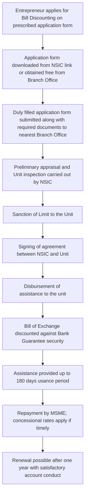

# Comprehensive Scheme Masterclass & File Guide

## Scheme Deep Dive

### Scheme Overview
The **NSIC Bill Discounting Scheme** (Scheme ID: row-133) is a loan-type financial assistance program implemented by the **National Small Industries Corporation Ltd. (NSIC)**, a Government of India Enterprise under the Ministry of Micro, Small and Medium Enterprises (MSME). The scheme operates on a **Pan-India** geographic scope and was last updated in **2025**. Its primary objective is to provide financial assistance to MSMEs by discounting bills arising from genuine trade transactions, thereby facilitating working capital financing against Bank Guarantee security and improving cash flow management.

### Objectives
- Provide financial assistance to MSMEs by discounting bills from genuine trade transactions  
- Facilitate working capital financing against Bank Guarantee security  
- Support MSMEs in managing receivables and improving cash flow  
- Enable MSMEs to avail credit up to 180 days usance period  
- Offer concessional discounting rates for MSMEs with valid SME ratings  
- Ensure timely repayment benefits through structured interest and penalty charges  

### Eligibility Matrix
| Criteria | Requirement | Source |
|---------|-------------|--------|
| **Enterprise Type** | Micro, Small & Medium Enterprises (MSMEs) engaged in manufacturing/service activities | Key Facts, Bill Discounting Scheme Page |
| **Traders Exclusion** | Traders are explicitly excluded from the scheme | Key Facts, Bill Discounting Scheme Page |
| **Registration** | Mandatory Udyam Registration | Key Facts, Bill Discounting Scheme Page |
| **Counterparty** | Supplies must be made to reputed Public Limited Companies / State and Central Govt. Departments / Undertakings / Private Limited Companies (not traders), engaged in manufacturing/service activities | Key Facts, Bill Discounting Scheme Page |
| **Bill Type** | Bills of Exchange drawn by MSMEs for supplies made and duly accepted by the Purchaser | Key Facts, Bill Discounting Scheme Page |

### Benefits & Financial Support
| Feature | Details | Source |
|--------|---------|--------|
| **Financial Assistance** | Discounting of bills arising from genuine trade transactions | Key Facts |
| **Security** | Bank Guarantee from approved banks equivalent to the value of assistance; Personal guarantee of proprietor, partners, and directors | Key Facts |
| **Usance Period** | Maximum usance period of bills (Bill of Exchange) shall not exceed **180 days** | Key Facts, Bill Discounting Scheme Page |
| **Discounting Charges (Effective 01.07.2025)** | | Bill Discounting Scheme Page |
| | **Normal Interest (Upto Usance Period)** | |
| | Units with valid SME 1 rating: **7.75%** p.a. (Micro), **8.25%** p.a. (Small & Medium) | |
| | Units with valid SME 2 rating: **8.25%** p.a. (Micro), **8.75%** p.a. (Small & Medium) | |
| | Other Units: **8.75%** p.a. (Micro), **9.25%** p.a. (Small & Medium) | |
| **Penal Charges** | **1.25% per quarter** on overdue amount (beyond original usance period) | Bill Discounting Scheme Page |
| **Processing Fee** | | Bill Discounting Scheme Page |
| | On new sanctions: **1.00% p.a.** for both Micro and Small & Medium | |
| | On renewal: **0.50% p.a.** for Micro, **1.00% p.a.** for Small & Medium | |
| **Concessional Rates** | Available for units with valid SME 1 or SME 2 ratings, subject to timely repayment | Key Facts |
| **Concession Continuity** | Continues till validity of rating awarded by rating agencies; ceases on expiry unless renewed | Key Facts |
| **Annual Limits** | Can be fixed for units by obtaining information as per prescribed application form | Key Facts |

> **> Important Caveats**  
> > - Traders are excluded from the scheme.  
> > - Concessional discounting charges for good-rated units apply **only if** units make timely repayments of NSIC’s dues.  
> > - Units failing to repay dues within the usance period lose concessional eligibility and are charged the normal rate.  
> > - Concession continues till validity of the rating awarded by rating agencies and ceases on expiry unless renewed.  
> > - Processing fees apply on new sanctions and renewals as per Micro and Small & Medium categories.  

### Application Process Flowchart

**Application Portal URL**: https://nsic.co.in/Schemes/BillDiscountingAgainstBG  
**Key Sources**:  
- Key Facts Block (Scheme ID: row-133)  
- Crawled Page: https://nsic.co.in/Schemes/BillDiscountingAgainstBG (Updated: 18.08.2025)  

---

## Consultant's Field Guide to Generated Files

### 1. SCHEME_MASTER_DATABASE.md
**Real-time Usage:** Keep this open in a background tab during all client calls. When a client asks "What is the turnover limit?" or "Who administers this?", CTRL+F in this document to give an immediate, authoritative answer without checking the portal.

### 2. PITCH_AND_SALES_SCRIPTS.md
**Real-time Usage:** Open this file 5 minutes before your first Discovery Call with a lead. Read the "Problem Framing" out loud to hook them, then use the Qualification Checklist to interrogate their eligibility live on the phone. Keep the Objection Handlers table visible so you can immediately counter when they say "We're too small for this."

### 3. APPLICATION_PLAYBOOK.md
**Real-time Usage:** Print this out or pin it to your desktop once the client signs the retainer. Check off each box in "Stage 1" before moving to "Stage 2". Use the "Client Communication Template" to copy-paste directly into your email when chasing them for pending documents.

### 4. CLIENT_ONBOARDING_AND_CRM.md
**Real-time Usage:** Fill this out during or immediately after the onboarding call. Use the Needs Assessment to record their exact pain points. Update the "Compliance Status" table as they email you documents to maintain a single source of truth for what's missing.

### 5. LIVE_CASE_TRACKER.md
**Real-time Usage:** Review this document every morning during your standup. Update the "Stage" column daily. If a case hits "Stage 07 - Under review", use the Escalation Path notes here to know exactly who to call at the government department today.

### 6. FEE_AND_REVENUE_MODEL.md
**Real-time Usage:** Use this file when drafting the proposal. Look at the client's turnover, map them to the pricing tier in the table, and quote that exact Retainer and Success Fee. Use the monthly projection table to update your personal sales pipeline forecast for the quarter.

### 7. CLIENT_PROPOSAL_TEMPLATE.md
**Real-time Usage:** Copy this entire file, paste it into an email or PDF generator, replace the [PLACEHOLDER] tags with the client's actual details gathered from the CRM, and send it immediately after a successful discovery call.

### 8. COMPLIANCE_AND_LEGAL_PACK.md
**Real-time Usage:** Attach sections 8A and 8B as PDFs to the proposal email. Refuse to start Step 1 of the Application Playbook until the client signs these. Use the Disclaimers to protect yourself legally if the client is rejected by the government agency.