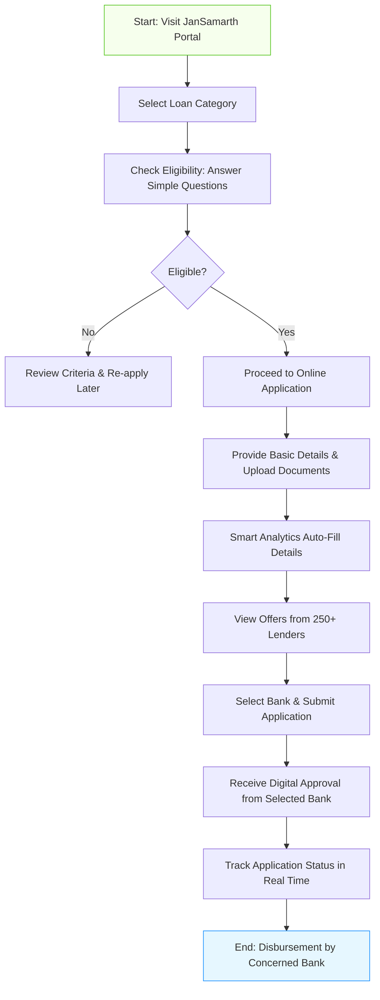

# Comprehensive Scheme Masterclass & File Guide

## Scheme Deep Dive

### Overview
The **JanSamarth Portal – Unified Credit Scheme Portal** is a one-stop digital platform launched by the Government of India to link 16 central government credit-linked schemes across 8 loan categories. It connects beneficiaries directly with 250+ lenders through a seamless, technology-driven process. The portal is managed by the **Department of Financial Services (DFS)**, Ministry of Finance, Government of India, and operates on a **rolling basis** with no fixed deadline—applications are accepted year-round.

**Application Portal:** https://www.jansamarth.in  
**Status:** Active (Last Updated: 2024)  
**Geographic Scope:** Pan-India  
**Scheme Type:** Loan  
**Implementing Agency:** Department of Financial Services (DFS), Ministry of Finance, Government of India  

### Objectives
The core objectives of the JanSamarth Portal are:
- Promote inclusive growth and development of various sectors  
- Guide beneficiaries to the right type of government benefits through simple digital processes  
- Ensure end-to-end coverage of all processes and activities of linked schemes  
- Use cutting-edge technologies and smart analytics for intuitive eligibility checking and auto-recommendation  
- Automate lending processes based on digital verification for simplicity, speed, and hassle-free experience  
- Connect stakeholders of the financial ecosystem on a single platform to promote ease of doing business  
- Provide digital access to authenticate data via integrations with UIDAI, CBDT, NSDL, LGD, NeSL  
- Enable beneficiaries to choose from multiple options offered by onboarded Member Lending Institutions (MLIs)  

### Eligibility Matrix
Eligibility varies significantly across the 16 linked schemes. Applicants must first check eligibility under their required loan category on the portal. General requirements include:

| Eligibility Criteria | Details |
|----------------------|---------|
| **Residency** | Indian resident |
| **Identity Proof** | Valid Aadhaar, PAN, Voter ID |
| **Bank Account** | Active bank account for disbursement |
| **Scheme-Specific Criteria** | Varies by scheme: • **Startups**: DPIIT recognition, age ≤10 years, turnover ≤₹100 Crore • **MSMEs**: Udyam registration • **Street Vendors (PM SVANidhi)**: Certificate of Vending/ID from ULB • **Farmers/Agri**: Land ownership, KCC eligibility • **Women/SC/ST Beneficiaries**: Special category certificates • **SHGs**: Active existence ≥6 months, Panchasutra compliance • **Home Loans (PMAY-U)**: Family income ≤₹9 lakh/year (EWS: ≤₹3 lakh, LIG: ₹3–6 lakh, MIG: ₹6–9 lakh) • **Agri-Infrastructure (AIF)**: FPOs, PACs, SHGs, agri-entrepreneurs • **Handloom Weavers (WMS)**: Involvement in weaving activity • **NAMASTE**: Manual scavengers, septic tank workers, dependents |
| **Exclusions** | Entities formed by splitting/reconstruction, HUFs, startups in default/NPA status, retired officials (for some schemes), existing units availing subsidy under other schemes (for PMEGP) |

> **> Important Caveat:** Each scheme has different documentation requirements and eligibility norms. Applicants must verify scheme-specific criteria via the portal’s eligibility check tool.

### Benefits & Financial Support
Financial support varies by scheme and includes term loans, working capital, cash credit, overdraft, and composite loans. Quantum ranges from **₹10,000 (PM SVANidhi)** to **₹1,500 crore (ECLGS for airlines)**. Support is delivered through participating banks and financial institutions, with credit guarantee coverage provided by NCGTC under schemes like CGSS, CGFMU, and CGTMSE. Interest rates are bank-determined but often capped, with subventions available under specific schemes.

#### Financial Support Summary Table
| Scheme | Loan Type | Maximum Quantum | Key Financial Benefits |
|--------|-----------|------------------|------------------------|
| **PM SVANidhi** | Working Capital Loan | ₹10,000 (Tranche 1) ₹20,000 (Tranche 2) ₹50,000 (Tranche 3) | 7% interest subsidy on timely repayment; monthly cashback up to ₹100 on digital transactions; collateral-free |
| **PMMY (Mudra)** | Term Loan, Overdraft, Working Capital | ₹20 lakhs (Tarun+ category) | No collateral for loans ≤₹10 lakhs; interest rates deregulated but advised to be reasonable |
| **PMEGP** | Term Loan for New Enterprises | ₹50 lakh (manufacturing) ₹20 lakh (service) | Margin money subsidy: 15–35% (general), 25–35% (special category); bank funds 60–75% of project cost |
| **WMS (Weavers Mudra)** | Term Loan, Cash Credit | ₹2 lakhs | 20% margin money support (max ₹25,000) by Ministry of Textiles; interest subsidy up to 6% (capped at 7%); no collateral required |
| **DAY-NRLM** | Term Loan, Cash Credit | ₹3 lakh (for women SHGs in 250 backward districts) | 7% interest subvention per annum; additional 3% for prompt repayment (effective rate 4%); no margin/collateral up to ₹10 lakh |
| **AIF (Agri Infrastructure)** | Long-term Debt | Up to ₹2 crore (full subvention) Beyond ₹2 crore: subvention capped at ₹2 crore | 3% interest subvention p.a. for up to 7 years; credit guarantee under CGTMSE for loans ≤₹2 crore; moratorium: 6 months–2 years |
| **ACABC** | Loan for Agri-Clinics/Biz Centers | ₹20 lakh (individual) ₹25 lakh (extremely successful individual) ₹100 lakh (group) | 36–44% composite subsidy on Total Project Cost (TFO); margin money as per RBI norms; NABARD may provide up to 50% margin money concession for SC/ST/women/N-E/Hill states |
| **KCC (Kisan Credit Card)** | Revolving Cash Credit | No fixed limit (based on scale of finance) | Interest subvention: 1.5% (farmers), 2% (fisheries); prompt repayment incentive: 3%; collateral-free up to ₹2 lakh |
| **KCC Fisheries** | Revolving Cash Credit | No fixed limit | Interest subvention: 2%; prompt repayment incentive: 3%; collateral-free up to ₹2 lakh |
| **Solar Roof Top (SOLAR)** | Term Loan | Based on project cost | Requires registration at PM-Surya Ghar portal; details subject to lender policy |
| **e-Kisan Upaj Nidhi (e-NWR)** | Pledge Financing | Up to ₹75 lakhs (SBI example) | 25% margin; interest: 7% p.a. for ≤6 months (subvention available for small/marginal farmers); MCLR + 0.80% beyond |
| **START (Loan for Startups)** | Term Loan, WC, Off-Balance Sheet | ₹20 crore | Covered under CGSS guarantee (85% for loans ≤₹10 crore; 75% for >₹10 crore); margin: min 25%; no collateral under CGSS |
| **CCME (Micro Enterprise Credit Card)** | Business Credit Card | Up to ₹5 lakh | Interest-free grace period; annual fee capped at 1% of limit or ₹1,000; APR capped at 18%; no cash withdrawal; rewards & optional features |
| **NAMASTE** | Capital Subsidy for Self-Employment | ₹5 lakh (individual) ₹50 lakh (group, max ₹3.75 lakh/beneficiary) | 50% subsidy on project cost ≤₹5 lakh; ₹2.5 lakh + 25% of balance for ₹5–15 lakh; interest subsidy: 5% p.a. (4% for women) on loans ≤₹1 lakh; 6% p.a. on loans >₹1 lakh; max repayment: 5 years (≤₹5 lakh), 7 years (>₹5 lakh) |
| **ECLGS 5.0** | Additional Working Capital Term Loan | ₹100 crore (MSME/Non-MSME) ₹1,500 crore (Airline) | 20% of peak fund-based WC (Q4 FY25–26) for MSME/Non-MSME 100% of peak total credit outstanding for airlines 100% guarantee for MSMEs, 90% for non-MSMEs/airlines Interest: MSMEs – EBLR+0.75% (cap 9%); Non-MSMEs – MCLR+0.75% (cap 9%); NBFCs – ROI ≤13% p.a. Tenor: 5 years (1-year moratorium) for MSME/Non-MSME; 7 years (2-year moratorium) for airlines No guarantee fee; no fresh collateral required |

#### Key Financial Support Features (Cross-Scheme)
- **Credit Guarantee Coverage**: Provided by NCGTC under CGSS (startups), CGFMU (micro units), CGTMSE (MSMEs), CRGFTLIH (housing), etc.
- **Interest Subvention**: Available under DAY-NRLM (7%), AIF (3%), WMS (up to 7%), PM SVANidhi (7%), NAMASTE (5–6%), KCC/KCCFIM (1.5–2%)
- **Margin Money Support**: PMEGP (15–35%), WMS (20% max ₹25,000), ACABC (36–44% of TFO)
- **Collateral-Free Loans**: Available under PM SVANidhi, PMMY (≤₹10 lakhs), WMS, DAY-NRLM (≤₹10 lakhs), KCC/KCCFIM (≤₹2 lakhs), START (under CGSS), CCME (no collateral for core business use)
- **No Application Fee**: JanSamarth Portal does **not** ask for payment of any kind from applicants
- **Digital End-to-End**: Eligibility check, online application, auto-fill via smart analytics, digital approval from lenders, real-time tracking
- **Lender Access**: 250+ Member Lending Institutions (MLIs) including PSBs, PVBs, NBFCs, RRBs, SFBs, DCCBs, SCBs, AIFIs

### Application Process
The JanSamarth Portal streamlines the loan application journey into 8 clear steps, powered by smart analytics and digital integrations.

#### Detailed Steps:
1. **Visit the JanSamarth portal** (https://www.jansamarth.in) and select your loan category (e.g., Business Activity Loan, Home Loan, Agri Loan, etc.).
2. **Check eligibility** by answering a few simple questions tailored to the selected category.
3. **If eligible**, proceed to apply online.
4. **Provide basic details** (name, contact, Aadhaar, PAN, etc.) and **upload required documents** (varies by scheme—see Required Documents section).
5. **The portal’s smart analytics** will auto-fill required details using integrations with UIDAI, CBDT, NSDL, LGD, NeSL.
6. **View offers from 250+ lenders** (Member Lending Institutions) and select a bank.
7. **Receive digital approval** from the selected bank via the portal.
8. **Track application status in real time** via the dashboard using login credentials.

> **> Warning:** Disbursement is done **only by the concerned bank**—never scan QR codes or use links claiming direct disbursement to your account. JanSamarth Portal does **not** ask for any payment from applicants.

### Required Documents
While each scheme has specific requirements, the **basic documents** commonly required across schemes include:
1. Aadhaar Number  
2. Voter ID  
3. PAN  
4. Bank Statements  
5. Basic details on the portal  

**Scheme-specific examples:**
- **START (Startups)**: DPIIT certificate, incorporation documents, ABS (last 3 years), CMA data, DPR, Udyam registration, Aadhaar/PAN of directors
- **PM SVANidhi**: Certificate of Vending/ID, Aadhaar, Voter ID (Assam/Meghalaya), PAN, bank statement
- **PMEGP**: Project report, EDP certificate, caste certificate (if applicable), rural area certificate, authorization letter
- **WMS**: Proof of weaving activity, identity, bank details
- **DAY-NRLM**: SHG books of accounts, Panchasutra compliance proof, Aadhaar of members
- **Home Loan (PMAY-U)**: Income proof, identity, address, bank account details
- **AIF/ABCC**: Project details, land documents, training certificates (for ACABC), FPO/PACS registration
- **NAMASTE**: Occupational Photo ID, proof of engagement in sanitation work, bank details
- **KCC/KCCFIM**: Land ownership proof, KCC application, bank account details

### Key Contacts
- **Borrower Support**: Customer[support]@jansamarth.in | 079690-76111  
- **Bank Support**: Bank[support]@jansamarth.in | 079690-76123  
- **Partner Onboarding (Banks/FIs)**: avp[dot]projectmanager2[at]psballiance[dot]com  

### Sources
- Application Portal: https://www.jansamarth.in  
- Scheme Details: https://jansamarth.in (crawled pages for all 16 schemes)  
- Grievance Redressal: https://jansamarth.in/grievances  
- Partner List: https://jansamarth.in/our-partners  

---

## Consultant's Field Guide to Generated Files

### 1. SCHEME_MASTER_DATABASE.md
**Real-time Usage:** Keep this open in a background tab during all client calls. When a client asks "What is the turnover limit?" or "Who administers this?", CTRL+F in this document to give an immediate, authoritative answer without checking the portal.

### 2. PITCH_AND_SALES_SCRIPTS.md
**Real-time Usage:** Open this file 5 minutes before your first Discovery Call with a lead. Read the "Problem Framing" out loud to hook them, then use the Qualification Checklist to interrogate their eligibility live on the phone. Keep the Objection Handlers table visible so you can immediately counter when they say "We're too small for this."

### 3. APPLICATION_PLAYBOOK.md
**Real-time Usage:** Print this out or pin it to your desktop once the client signs the retainer. Check off each box in "Stage 1" before moving to "Stage 2". Use the "Client Communication Template" to copy-paste directly into your email when chasing them for pending documents.

### 4. CLIENT_ONBOARDING_AND_CRM.md
**Real-time Usage:** Fill this out during or immediately after the onboarding call. Use the Needs Assessment to record their exact pain points. Update the "Compliance Status" table as they email you documents to maintain a single source of truth for what's missing.

### 5. LIVE_CASE_TRACKER.md
**Real-time Usage:** Review this document every morning during your standup. Update the "Stage" column daily. If a case hits "Stage 07 - Under review", use the Escalation Path notes here to know exactly who to call at the government department today.

### 6. FEE_AND_REVENUE_MODEL.md
**Real-time Usage:** Use this file when drafting the proposal. Look at the client's turnover, map them to the pricing tier in the table, and quote that exact Retainer and Success Fee. Use the monthly projection table to update your personal sales pipeline forecast for the quarter.

### 7. CLIENT_PROPOSAL_TEMPLATE.md
**Real-time Usage:** Copy this entire file, paste it into an email or PDF generator, replace the [PLACEHOLDER] tags with the client's actual details gathered from the CRM, and send it immediately after a successful discovery call.

### 8. COMPLIANCE_AND_LEGAL_PACK.md
**Real-time Usage:** Attach sections 8A and 8B as PDFs to the proposal email. Refuse to start Step 1 of the Application Playbook until the client signs these. Use the Disclaimers to protect yourself legally if the client is rejected by the government agency.