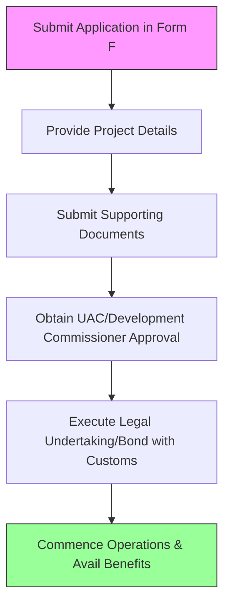

# Comprehensive Scheme Masterclass & File Guide

## Scheme Deep Dive

### Overview
The Export Oriented Unit (EOU) Scheme is a tax benefit scheme implemented by the Directorate General of Foreign Trade (DGFT), Department of Commerce, Ministry of Commerce and Industry, Government of India. It operates on a pan-India geographic scope with rolling basis applications accepted throughout the year. The scheme was last updated in 2026 and has a medium confidence level in the extracted data.

### Objectives
The EOU Scheme aims to:
- Promote export-oriented production and increase India's foreign exchange earnings
- Provide duty-free import of capital goods, raw materials, and consumables for export production
- Exempt EOUs from central excise duty and service tax on goods and services used in the production process
- Allow EOUs to sell a limited portion of their output in the Domestic Tariff Area (DTA) under specified conditions
- Simplify procedural compliance and reduce transaction costs for export-oriented units
- Enhance competitiveness of Indian exports through fiscal incentives and streamlined regulations

### Eligibility Matrix
| Eligibility Criteria | Details |
|----------------------|---------|
| **Core Requirement** | Units undertaking to export their entire production of goods and services (except permissible sales in DTA) |
| **Permitted Activities** | Manufacturing, services, software development, agriculture, aquaculture, animal husbandry, floriculture, horticulture, pisciculture, poultry, sericulture, viticulture, or mining |
| **Financial Requirement** | Must achieve a positive net foreign exchange earnings cumulatively over a period of five years from the commencement of production |
| **Negative List** | Must not be engaged in any activity listed in the negative list of exports as per the Foreign Trade Policy |
| **Target Beneficiaries** | Manufacturers; exporters; MSME; large enterprises |

### Benefits & Financial Support
The EOU Scheme does not provide direct financial subsidies or grants. Instead, it offers fiscal incentives through exemptions and concessions:

| Benefit Type | Details |
|--------------|---------|
| **Duty-Free Import** | Capital goods, raw materials, components, consumables, spares, and packaging materials required for manufacture of goods for export |
| **Tax Exemptions** | Exemption from central excise duty on goods manufactured and service tax on services utilized in the production process |
| **Procurement Privileges** | Ability to procure goods from bonded warehouses and export promotion capital goods (EPCG) scheme holders without payment of duties |
| **DTA Sales Allowance** | Permission to sell up to 50% of annual production in the Domestic Tariff Area (DTA) on payment of applicable duties |
| **Duty Drawback** | Eligibility for refunds of duties and taxes paid on inputs used in the manufacture of exported goods under the duty drawback scheme |
| **Financial Impact** | Indirect financial benefit arising from reduced input costs and tax liabilities, improving competitiveness and profitability |

### Application Process

**Step-by-Step Process:**
1. Submit an application in the prescribed format (Form F) to the Development Commissioner of the concerned Export Processing Zone (EPZ) or the Unit Approval Committee (UAC) under the Department of Commerce
2. Provide details of the proposed project, including investment, employment, export projections, and foreign exchange earnings
3. Submit supporting documents such as certificate of incorporation, project report, partnership deed, and bank solvency certificate
4. Obtain approval from the Unit Approval Committee (UAC) or the Development Commissioner
5. Execute a Legal Undertaking (LUT) or bond with customs authorities for adherence to export obligations
6. Upon approval, commence operations and begin availing benefits under the scheme

### Required Documents
1. Certificate of Incorporation / Registration
2. Memorandum and Articles of Association / Partnership Deed
3. Project Report detailing investment, employment, export projections, and foreign exchange earnings
4. Bank Solvency Certificate
5. Income Tax Returns of the promoters (for last 3 years)
6. List of Plant and Machinery with CIF value
7. Details of Technical Know-how or Collaboration Agreement (if any)
8. Undertaking to achieve positive net foreign exchange earnings
9. Letter of Authorization for signatory
10. Board Resolution authorizing the application (for companies)

### Key Caveats
> **Critical Compliance Requirements:**
> - EOUs must achieve positive net foreign exchange earnings cumulatively over five years from commencement of production
> - Sale in Domestic Tariff Area (DTA) is limited to 50% of annual export earnings or equivalent value, subject to payment of applicable duties
> - Failure to meet export obligations may result in withdrawal of benefits and recovery of duties exempted
> - Units must not engage in any activity listed in the negative list of exports under the Foreign Trade Policy
> - Benefits are contingent upon adherence to the Legal Undertaking (LUT) or bond executed with customs authorities

### Contact Information & Portal
- **Application Portal:** https://www.dgft.gov.in/CP/?opt=EOU
- **Contact Email:** dgftedi[at]nic[dot]in
- **Helpline Numbers:** 1800-572-1550 / 1800-111-550
- **Office Address:** Directorate General of Foreign Trade (Headquarters), Vanijya Bhawan, 'A' Wing, 16 Akbar Road, New Delhi – 110011
- **Last Updated:** 03-07-2026

---

## Consultant's Field Guide to Generated Files

### 1. SCHEME_MASTER_DATABASE.md
**Real-time Usage:** Keep this open in a background tab during all client calls. When a client asks "What is the turnover limit?" or "Who administers this?", CTRL+F in this document to give an immediate, authoritative answer without checking the portal.

### 2. PITCH_AND_SALES_SCRIPTS.md
**Real-time Usage:** Open this file 5 minutes before your first Discovery Call with a lead. Read the "Problem Framing" out loud to hook them, then use the Qualification Checklist to interrogate their eligibility live on the phone. Keep the Objection Handlers table visible so you can immediately counter when they say "We're too small for this."

### 3. APPLICATION_PLAYBOOK.md
**Real-time Usage:** Print this out or pin it to your desktop once the client signs the retainer. Check off each box in "Stage 1" before moving to "Stage 2". Use the "Client Communication Template" to copy-paste directly into your email when chasing them for pending documents.

### 4. CLIENT_ONBOARDING_AND_CRM.md
**Real-time Usage:** Fill this out during or immediately after the onboarding call. Use the Needs Assessment to record their exact pain points. Update the "Compliance Status" table as they email you documents to maintain a single source of truth for what's missing.

### 5. LIVE_CASE_TRACKER.md
**Real-time Usage:** Review this document every morning during your standup. Update the "Stage" column daily. If a case hits "Stage 07 - Under review", use the Escalation Path notes here to know exactly who to call at the government department today.

### 6. FEE_AND_REVENUE_MODEL.md
**Real-time Usage:** Use this file when drafting the proposal. Look at the client's turnover, map them to the pricing tier in the table, and quote that exact Retainer and Success Fee. Use the monthly projection table to update your personal sales pipeline forecast for the quarter.

### 7. CLIENT_PROPOSAL_TEMPLATE.md
**Real-time Usage:** Copy this entire file, paste it into an email or PDF generator, replace the [PLACEHOLDER] tags with the client's actual details gathered from the CRM, and send it immediately after a successful discovery call.

### 8. COMPLIANCE_AND_LEGAL_PACK.md
**Real-time Usage:** Attach sections 8A and 8B as PDFs to the proposal email. Refuse to start Step 1 of the Application Playbook until the client signs these. Use the Disclaimers to protect yourself legally if the client is rejected by the government agency.