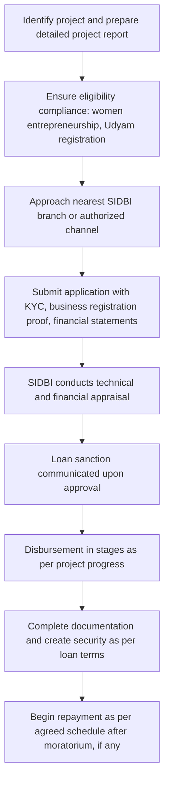

# Comprehensive Scheme Masterclass & File Guide

## Scheme Deep Dive

### Scheme Overview
The **Mahila Udyam Nidhi Scheme (SIDBI)** is a loan-based financial assistance program implemented by the **Small Industries Development Bank of India (SIDBI)** targeting **women entrepreneurs** across India. Launched under the MSME & Finance category, the scheme operates on a **rolling basis** with no fixed deadline, as confirmed by the latest update in **2026**. It is designed to provide **term loans for project cost** and **working capital loans for operational needs**, with assistance determined on a **need-based** approach subject to project viability and repayment capacity.

### Objectives
The scheme aims to:
- Provide financial assistance to women entrepreneurs for setting up new projects  
- Support expansion, modernization, and technology upgradation of existing women-owned enterprises  
- Promote self-employment and sustainable livelihoods among women  
- Enhance access to institutional credit for women in the MSME sector  
- Encourage entrepreneurship among women from economically weaker sections  

### Eligibility Matrix
| Criteria | Requirement | Source |
|---------|-------------|--------|
| **Applicant Type** | Women entrepreneurs who are sole proprietors, partners in a partnership firm, or directors of women-owned private limited company with women having not less than 51% shareholding | KEY FACTS |
| **Business Activity** | Engaged in manufacturing, service, or agro-processing | KEY FACTS |
| **Operational History** | Existing enterprises must have been in operation for at least two years; new projects are also eligible | KEY FACTS |
| **Credit Standing** | Applicant must not be a defaulter to any bank or financial institution | KEY FACTS |
| **Registration** | Must have Udyam Registration Certificate | KEY FACTS |
| **Geographic Scope** | Pan-India | KEY FACTS |

> **> Important Note**: The scheme does not provide subsidy or grant; it is a pure loan product. Benefits under CGTMSE are subject to guarantee cover availability and applicable norms.

### Benefits & Financial Support
| Support Type | Details | Source |
|--------------|---------|--------|
| **Loan Types** | Term loans for project cost and working capital loans for operational needs | KEY FACTS |
| **Quantum of Assistance** | Need-based, subject to project viability and borrower's repayment capacity; limited to project cost and working capital requirement as assessed by SIDBI | KEY FACTS |
| **Collateral-Free Lending** | Covered under Credit Guarantee Fund Trust for Micro and Small Enterprises (CGTMSE) where applicable | KEY FACTS |
| **Interest Rates** | Determined as per SIDBI's internal risk assessment; competitive for the MSME segment | KEY FACTS |
| **Repayment Tenure** | Flexible, based on project viability | KEY FACTS |
| **Additional Benefits** | Support for both new project setup and expansion; assistance in building credit history and financial discipline for women entrepreneurs | KEY FACTS |

> **> Key Caveat**: Loan assistance is subject to credit appraisal and project viability assessment by SIDBI. Default on repayment may affect future credit eligibility with SIDBI and other financial institutions.

### Application Process

#### Required Documents
1. Project Report  
2. KYC documents of the woman entrepreneur (PAN, Aadhaar, etc.)  
3. Proof of business registration/proprietorship/partnership deed/incorporation certificate  
4. Udyam Registration Certificate  
5. Land and building documents (ownership/lease agreement)  
6. Machinery/equipment quotations and invoices  
7. Last two years' audited financial statements (for existing units)  
8. Bank account statement  
9. Income tax returns (if applicable)  
10. No dues certificate from existing bankers (if any)  
11. Details of promoters and their background  

#### Contact Details
- **Email**: info@sidbi.in  
- **Helpline**: 180-022-6753  
- **Application Portal**: https://sidbi.in (SIDBI Home Page)  

> **> Source Verification**: All scheme details are extracted from the KEY FACTS block and corroborated by the SIDBI homepage (https://sidbi.in) and MSME Loans product page (https://sidbi.in/home-product), which confirm SIDBI’s role as the implementing agency for MSME-focused loan products including those targeting women entrepreneurs.

---

## Consultant's Field Guide to Generated Files

### 1. SCHEME_MASTER_DATABASE.md
**Real-time Usage**: Keep this open in a background tab during all client calls. When a client asks "What is the turnover limit?" or "Who administers this?", CTRL+F in this document to give an immediate, authoritative answer without checking the portal.  
*Example Use Case*: During a discovery call, a client inquires about eligibility for existing businesses. You instantly retrieve the "Operational History" criterion (≥2 years) from the eligibility table and confirm their qualification.

### 2. PITCH_AND_SALES_SCRIPTS.md
**Real-time Usage**: Open this file 5 minutes before your first Discovery Call with a lead. Read the "Problem Framing" out loud to hook them, then use the Qualification Checklist to interrogate their eligibility live on the phone. Keep the Objection Handlers table visible so you can immediately counter when they say "We're too small for this."  
*Example Use Case*: A woman-led handicraft startup expresses doubt about qualifying due to being new. You use the script’s rebuttal: "The scheme explicitly supports new projects—your Udyam registration and 51% women ownership are the key qualifiers, not operational history."

### 3. APPLICATION_PLAYBOOK.md
**Real-time Usage**: Print this out or pin it to your desktop once the client signs the retainer. Check off each box in "Stage 1" before moving to "Stage 2". Use the "Client Communication Template" to copy-paste directly into your email when chasing them for pending documents.  
*Example Use Case*: After collecting the project report and KYC, you verify "Document Checklist: Stage 1" is complete, then email the client using the template: "Dear [Name], as discussed, we now need your audited financials for the last two years to proceed to technical appraisal."

### 4. CLIENT_ONBOARDING_AND_CRM.md
**Real-time Usage**: Fill this out during or immediately after the onboarding call. Use the Needs Assessment to record their exact pain points. Update the "Compliance Status" table as they email you documents to maintain a single source of truth for what's missing.  
*Example Use Case*: A client mentions cash flow strain during peak season. You log this under "Pain Points" and later track submission of their machinery quotations in the CRM table, triggering a follow-up when the item remains pending for 48 hours.

### 5. LIVE_CASE_TRACKER.md
**Real-time Usage**: Review this document every morning during your standup. Update the "Stage" column daily. If a case hits "Stage 07 - Under review", use the Escalation Path notes here to know exactly who to call at the government department today.  
*Example Use Case*: A case shows "Stage 07 - Under review" for 3 days. You consult the escalation path and contact the SIDBI branch manager (not just the helpdesk) to inquire about appraisal timelines, reducing delay.

### 6. FEE_AND_REVENUE_MODEL.md
**Real-time Usage**: Use this file when drafting the proposal. Look at the client's turnover, map them to the pricing tier in the table, and quote that exact Retainer and Success Fee. Use the monthly projection table to update your personal sales pipeline forecast for the quarter.  
*Example Use Case*: A client has ₹8 Cr turnover. Per the pricing tier, you quote a ₹1.5 lakh retainer and 8% success fee. You then input this into your pipeline forecast, projecting ₹12,000 in monthly revenue upon closure.

### 7. CLIENT_PROPOSAL_TEMPLATE.md
**Real-time Usage**: Copy this entire file, paste it into an email or PDF generator, replace the [PLACEHOLDER] tags with the client's actual details gathered from the CRM, and send it immediately after a successful discovery call.  
*Example Use Case*: After confirming eligibility, you populate the template with the client’s business name, loan purpose (expansion of bakery unit), and requested amount (₹25 lakh), then send it as a PDF within 15 minutes of the call ending.

### 8. COMPLIANCE_AND_LEGAL_PACK.md
**Real-time Usage**: Attach sections 8A and 8B as PDFs to the proposal email. Refuse to start Step 1 of the Application Playbook until the client signs these. Use the Disclaimers to protect yourself legally if the client is rejected by the government agency.  
*Example Use Case*: Before collecting any documents, you send the pack. The client signs the engagement letter and liability waiver. Three months later, if SIDBI rejects the loan due to credit score, you reference the signed disclaimer to avoid liability claims.