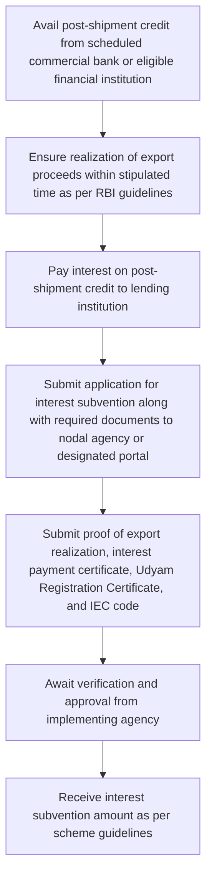

# Comprehensive Scheme Masterclass & File Guide

## Scheme Deep Dive

### Scheme Overview
**Scheme Name:** Interest Subvention Scheme for MSMEs on Post Shipment Credit  
**Scheme ID:** row-141  
**Ministry / Category:** Commerce & Trade  
**Scheme Type:** subsidy  
**Geographic Scope:** Pan-India  
**Implementing Agency:** Ministry of Micro, Small and Medium Enterprises  
**Confidence:** low  

### Objectives
- To provide interest subvention on post-shipment credit to MSME exporters  
- To reduce the cost of credit and enhance competitiveness of MSME exports  
- To improve liquidity and working capital management for MSMEs post-shipment  
- To encourage timely realization of export proceeds  
- To support sustainable growth of export-oriented MSME units  

### Eligibility Matrix
| Eligibility Criteria | Details |
|----------------------|---------|
| **Entity Type** | MSME exporters |
| **Registration Requirement** | Valid Udyam Registration (UR) Certificate |
| **Credit Type** | Post-shipment credit availed from scheduled commercial banks or other eligible financial institutions |
| **Export Requirement** | Export of goods or services |
| **Realization Timeline** | Export proceeds must be realized within the stipulated time period as per RBI guidelines |
| **MSME Definition** | Must be a valid MSME as per MSMED Act, 2006 |
| **Exclusion** | Must not have availed similar interest subvention from any other government scheme for the same transaction |

### Benefits & Financial Support
| Aspect | Details |
|--------|---------|
| **Support Mechanism** | Interest subvention on post-shipment credit availed by MSME exporters |
| **Quantum of Support** | Difference between the actual interest rate charged by the lending institution and a benchmark rate (typically linked to repo rate or LIBOR plus spread), subject to a cap |
| **Disbursement Method** | Through the lending institution or directly to the beneficiary MSME upon submission of required documents and proof of interest payment and export realization |
| **Key Benefits** | - Reduces effective cost of credit - Provides financial relief by subsidizing interest burden on post-shipment loans - Improves liquidity and supports working capital needs - Encourages timely realization of export proceeds - Enhances competitiveness in international markets |
| **Benefit Form** | Reimbursement or direct subsidy on the interest paid by the MSME exporter on post-shipment credit |

### Required Documents
1. Udyam Registration Certificate (URC)  
2. Import Export Code (IEC)  
3. Proof of export realization (e.g., bank realization certificate, shipping bill)  
4. Interest payment certificate from the lending institution  
5. Loan sanction letter for post-shipment credit  
6. Bank statement showing interest payment  
7. Shipping bill and bill of lading  
8. Bank realization certificate (BRC) or foreign inward remittance certificate (FIRC)  

### Application Process Flowchart

### Key Caveats
> - The benefit is available only on post-shipment credit, not pre-shipment or working capital loans  
> - Export proceeds must be realized within the stipulated time period as per RBI guidelines  
> - The benefit is available only to MSMEs with valid Udyam Registration Certificate  
> - The interest subvention is subject to a cap and is calculated as the difference between actual interest rate and a benchmark rate  
> - The beneficiary must not have availed similar interest subvention from any other government scheme for the same transaction  

### Application Portal
**URL:** https://msme.gov.in  

### Sources
- Ministry of Micro, Small & Medium Enterprises Homepage: https://msme.gov.in  
- Scheme Key Facts Evidence: Provided in the task  

---

## Consultant's Field Guide to Generated Files

### 1. SCHEME_MASTER_DATABASE.md
**Real-time Usage:** Keep this open in a background tab during all client calls. When a client asks "What is the turnover limit?" or "Who administers this?", CTRL+F in this document to give an immediate, authoritative answer without checking the portal.

### 2. PITCH_AND_SALES_SCRIPTS.md
**Real-time Usage:** Open this file 5 minutes before your first Discovery Call with a lead. Read the "Problem Framing" out loud to hook them, then use the Qualification Checklist to interrogate their eligibility live on the phone. Keep the Objection Handlers table visible so you can immediately counter when they say "We're too small for this."

### 3. APPLICATION_PLAYBOOK.md
**Real-time Usage:** Print this out or pin it to your desktop once the client signs the retainer. Check off each box in "Stage 1" before moving to "Stage 2". Use the "Client Communication Template" to copy-paste directly into your email when chasing them for pending documents.

### 4. CLIENT_ONBOARDING_AND_CRM.md
**Real-time Usage:** Fill this out during or immediately after the onboarding call. Use the Needs Assessment to record their exact pain points. Update the "Compliance Status" table as they email you documents to maintain a single source of truth for what's missing.

### 5. LIVE_CASE_TRACKER.md
**Real-time Usage:** Review this document every morning during your standup. Update the "Stage" column daily. If a case hits "Stage 07 - Under review", use the Escalation Path notes here to know exactly who to call at the government department today.

### 6. FEE_AND_REVENUE_MODEL.md
**Real-time Usage:** Use this file when drafting the proposal. Look at the client's turnover, map them to the pricing tier in the table, and quote that exact Retainer and Success Fee. Use the monthly projection table to update your personal sales pipeline forecast for the quarter.

### 7. CLIENT_PROPOSAL_TEMPLATE.md
**Real-time Usage:** Copy this entire file, paste it into an email or PDF generator, replace the [PLACEHOLDER] tags with the client's actual details gathered from the CRM, and send it immediately after a successful discovery call.

### 8. COMPLIANCE_AND_LEGAL_PACK.md
**Real-time Usage:** Attach sections 8A and 8B as PDFs to the proposal email. Refuse to start Step 1 of the Application Playbook until the client signs these. Use the Disclaimers to protect yourself legally if the client is rejected by the government agency.