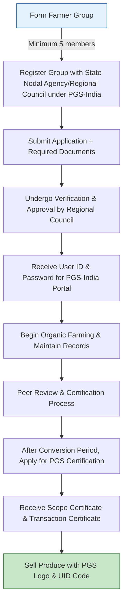

# Comprehensive Scheme Masterclass & File Guide

## Scheme Deep Dive

### Overview
**Paramparagat Krishi Vikas Yojana (PKVY) – Organic Farming** is a central sector subsidy scheme implemented by the Department of Agriculture, Cooperation and Farmers Welfare, Ministry of Agriculture & Farmers Welfare, Government of India. It promotes organic farming through the Participatory Guarantee System (PGS-India), a locally relevant quality assurance initiative operating outside third-party certification. The scheme supports farmer groups in adopting organic practices, achieving certification, and accessing premium markets. Applications are accepted year-round via the portal: [https://pgsindia-ncof.gov.in/](https://pgsindia-ncof.gov.in/). Last updated in 2025.

### Objectives
- Promote organic farming through cluster approach and PGS certification  
- Improve soil health and fertility via organic practices  
- Enhance farmer income through premium prices for organic produce  
- Develop domestic and export markets for organic products  
- Provide financial and technical assistance for organic input production  
- Strengthen certification and quality assurance mechanisms  
- Encourage sustainable agricultural practices and reduce chemical dependency  

### Eligibility Matrix
| **Eligibility Criteria** | **Details** | **Source** |
|--------------------------|-------------|------------|
| **Beneficiary Type** | Farmer groups, self-help groups, producers, and other collectives engaged in agriculture willing to adopt organic farming under PGS-India. Individual farmers can benefit through group participation. | Key Facts |
| **Preference** | Small and marginal farmers, women farmers, and those from SC/ST communities | Key Facts |
| **Group Size** | Minimum 5 members practicing or willing to adopt organic farming | Key Facts, FAQs |
| **Land Holding** | No individual member’s landholding shall exceed one-third of the group’s total landholding | FAQs |
| **Membership Requirements** | At least 25% of members must be well-versed in PGS organic guarantee systems, NPOP standards, or have undergone RC/PGS Secretariat training | Operational Manual Ch. 4 |
| **Documentation** | Each member must submit: application form, farm history sheet, farmers pledge, mobile number, Aadhar number (bank details optional) | Key Facts, FAQs |
| **Geographic Scope** | Pan-India | Key Facts |
| **Conversion Period** | 24 months for annual crops, 36 months for perennials; reducible to 12 months if de-facto compliance verified; waivable in default organic areas with RC/PGS Secretariat approval | PGS-India Standards Ch. 3, FAQs |
| **Prohibited Inputs** | Genetically modified seeds, synthetic fertilizers, chemical hormones, synthetic growth promoters, sewage sludge, human excreta, synthetic herbicides/fungicides/insecticides/plant growth regulators/dyes, genetically engineered organisms | PGS-India Standards Ch. 3, 9, 10 |
| **Allowed Inputs** | Chemically untreated conventional seeds (if organic unavailable), mined mineral fertilizers in natural composition, micronutrients mixed with compost, off-farm inputs approved by NPOP-accredited bodies, microbial preparations (biofertilizers, biodynamic, EM solutions), ethylene gas for ripening | PGS-India Standards Ch. 3, 8, 9, 10, 13 |
| **Livestock Integration** | Encouraged for dung/urine as manure; landless livestock production prohibited unless organic feed/fodder and cooperation with certified operator | PGS-India Standards Ch. 3, 4, 6, 7 |
| **Beekeeping** | One-year conversion period for reared colonies; apiaries within 3 km of organic farms; organic wax for foundations; natural products only in hives | PGS-India Standards Ch. 3, 6, 11 |
| **Processing & Handling** | On-farm/off-farm under LG supervision; separate time/space from non-organic; adequate labeling; pest control via physical/mechanical/biological means; irradiation prohibited; ethylene gas permitted for ripening | PGS-India Standards Ch. 3, 12, 13, 14, 15 |
| **Wild Harvest** | Permitted if from designated sustainable zones, no prohibited treatments, appropriate distance from pollution, sustainable yield not exceeded | PGS-India Standards Ch. 3, 10 |

### Benefits & Financial Support
| **Support Type** | **Details** | **Amount (INR)** | **Allocation** | **Source** |
|------------------|-------------|------------------|----------------|------------|
| **Financial Assistance** | Per hectare for 3 years | Rs. 50,000/ha | — | Key Facts |
| **Incentive Component** | Organic conversion, input production, labeling, packaging, transportation, marketing | Rs. 31,000/ha (62%) | — | Key Facts |
| **Support Component** | Mobilization, capacity building, training, exposure visits, documentation, certification | Rs. 19,000/ha (38%) | — | Key Facts |
| **Release Mechanism** | Installments based on progress and verification | — | — | Key Facts |
| **Non-Financial Benefits** | Technical guidance, quality assurance, institutional support for PGS certification, capacity building, training, exposure visits, handholding, market linkage development | — | — | Key Facts |
| **Market Access** | Access to organic premium markets via PGS certification | — | — | Key Facts |
| **Certification** | PGS-India certification (equivalent to NSOP under NPOP) | — | — | Key Facts, FAQs |
| **Input Production Support** | Assistance for organic input production (fertilizers, pesticides) | — | — | Key Facts |
| **Labeling & Packaging** | Support for labeling, packaging, and marketing of organic produce | — | — | Key Facts |
| **Exposure Visits** | Facilitation of visits to successful organic farms | — | — | Key Facts |
| **Documentation & Certification** | Coverage for record-keeping and certification expenses | — | — | Key Facts |

> **> Important Note:** Financial support is provided **only to organized farmer groups**, not individuals directly. Benefits are contingent upon adherence to PGS-India standards and active participation in group activities. Certification is subject to verification and compliance with organic production norms. Support is limited to a maximum of 3 years per beneficiary group.

### Application Process

#### Detailed Steps:
1. **Group Formation**: Form a farmer group or self-help group with minimum 5 members practicing or willing to adopt organic farming. Preferably 7-10 members to avoid status loss if members leave.  
2. **Group Registration**: Register the group with the concerned State Nodal Agency or Regional Council under PGS-India.  
3. **Document Submission**: Submit application with:  
   - Application form  
   - Farm history sheet  
   - Farmers pledge  
   - Mobile number (mandatory)  
   - Aadhar number (mandatory)  
   - Bank account details (optional)  
4. **Verification & Approval**: Regional Council verifies documents and approves registration.  
5. **Portal Access**: Upon approval, receive user ID and password to upload data on PGS-India portal.  
6. **Farming & Record-Keeping**: Begin organic practices; maintain input usage and management practices for peer review.  
7. **Peer Appraisal**: Conduct peer review of farms at least once per season; maintain attendance and appraisal records.  
8. **Certification Decision**: Group or certification committee declares certification status (PGS-Organic or PGS-Green).  
9. **Data Upload**: Enter details online via PGS-India website; send signed appraisal summary to RC.  
10. **Scope Certificate Issuance**: RC issues scope certificate with crop name, area, and UID code.  
11. **Yield Upload**: After harvest, upload actual yields within 60 days.  
12. **Transaction Certificate (TC)**: RC approves yields; TCs issued online for each farmer member separately.  
13. **Marketing & Sale**: Sell produce with PGS-India logo and UID code; access premium markets.  
14. **Renewal/Continuation**: For continued certification, upload peer appraisal summary sheets seasonally; physical verification every 2 years.  

#### Timelines & Deadlines:
- **Group Meetings**: Minimum 2-4 times/year (2 for perennial, 4 for annual crops) at key seasonal times.  
- **Peer Appraisal**: During crop growth (15 days post-sowing to 15 days pre-harvest); for plantation crops: flowering season + 6 months post.  
- **Appraisal Summary Upload**: Within 7 days before harvest date.  
- **Actual Yield Upload**: Within 60 days of harvest.  
- **Scope Certificate Validity**: 12 months from RC approval date.  
- **Stock Holding Limit**: Within scope certificate validity; unsold stock auto-deleted after 12 months post-harvest if no TCs issued.  
- **RC Application Processing**: Within 30 days of submission.  
- **RC Certification Approval**: Within 30 days of peer appraisal summary submission (or 15 days if resubmitted after RC return).  
- **RC Yield Approval**: Within 15 days of actual yield upload.  
- **Physical Inspection**: First within 12 months; subsequently at least once every 24 months for LGs.  
- **Appeals**: Must be filed within 2 weeks of sanction notification; disposed within 30 days (90 days if investigation needed).  

#### Required Documents (Hard Copy, Duly Signed):
1. Application form  
2. Farm history sheet  
3. Farmers pledge  
4. Mobile number  
5. Aadhar number  
6. Bank account details (optional)  

#### Contact Details:
- **Email**: nbdc[AT]nic[DOT]in  
- **Phone**: +91 120-2764906, +91 120-2764212  
- **Fax**: +91 120-2764901  
- **Address**: National Center of Organic Farming, 19 Hapur Road, Near CBI Academy, Ghaziabad - 201002, Uttar Pradesh, India  
- **Website**: [nconf.dac.gov.in](http://nconf.dac.gov.in)  

#### Key Caveats:
- Financial support only to organized farmer groups, not individuals directly  
- Benefits contingent upon adherence to PGS-India standards and active group participation  
- Certification subject to verification and compliance with organic production norms  
- Support limited to maximum 3 years per beneficiary group  
- Landholding of any single member must not exceed one-third of group’s total land  
- Parallel production and part conversion normally not allowed (exceptions possible via RC)  
- Group must maintain minimum 50% member attendance at meetings and sign attendance register  
- At least one member must be literate and versed in appraisal forms for peer review teams  
- No reciprocal review between two-member farms (A reviews B and B reviews A prohibited)  
- PGS-Green status not claimable as organic; only “Under Conversion to Organic” indication allowed  
- PGS-India certification valid for domestic/local markets only; export as conventional for premium price if available  
- Individual farmer certification is interim (max 2 years to form group); thereafter attached to nearest group if unsuccessful  

> **> Critical Warning:** Misuse of PGS-India logo or false claims of organic status can lead to sanctions including certification denial, withdrawal of TCs, and deletion of produce from PGS-India website. Regional Councils may suspend/cancel authorization for non-compliance with timelines or documentation requirements.

---

## Consultant's Field Guide to Generated Files

### 1. SCHEME_MASTER_DATABASE.md
**Real-time Usage:** Keep this open in a background tab during all client calls. When a client asks "What is the turnover limit?" or "Who administers this?", CTRL+F in this document to give an immediate, authoritative answer without checking the portal.

### 2. PITCH_AND_SALES_SCRIPTS.md
**Real-time Usage:** Open this file 5 minutes before your first Discovery Call with a lead. Read the "Problem Framing" out loud to hook them, then use the Qualification Checklist to interrogate their eligibility live on the phone. Keep the Objection Handlers table visible so you can immediately counter when they say "We're too small for this."

### 3. APPLICATION_PLAYBOOK.md
**Real-time Usage:** Print this out or pin it to your desktop once the client signs the retainer. Check off each box in "Stage 1" before moving to "Stage 2". Use the "Client Communication Template" to copy-paste directly into your email when chasing them for pending documents.

### 4. CLIENT_ONBOARDING_AND_CRM.md
**Real-time Usage:** Fill this out during or immediately after the onboarding call. Use the Needs Assessment to record their exact pain points. Update the "Compliance Status" table as they email you documents to maintain a single source of truth for what's missing.

### 5. LIVE_CASE_TRACKER.md
**Real-time Usage:** Review this document every morning during your standup. Update the "Stage" column daily. If a case hits "Stage 07 - Under review", use the Escalation Path notes here to know exactly who to call at the government department today.

### 6. FEE_AND_REVENUE_MODEL.md
**Real-time Usage:** Use this file when drafting the proposal. Look at the client's turnover, map them to the pricing tier in the table, and quote that exact Retainer and Success Fee. Use the monthly projection table to update your personal sales pipeline forecast for the quarter.

### 7. CLIENT_PROPOSAL_TEMPLATE.md
**Real-time Usage:** Copy this entire file, paste it into an email or PDF generator, replace the [PLACEHOLDER] tags with the client's actual details gathered from the CRM, and send it immediately after a successful discovery call.

### 8. COMPLIANCE_AND_LEGAL_PACK.md
**Real-time Usage:** Attach sections 8A and 8B as PDFs to the proposal email. Refuse to start Step 1 of the Application Playbook until the client signs these. Use the Disclaimers to protect yourself legally if the client is rejected by the government agency.