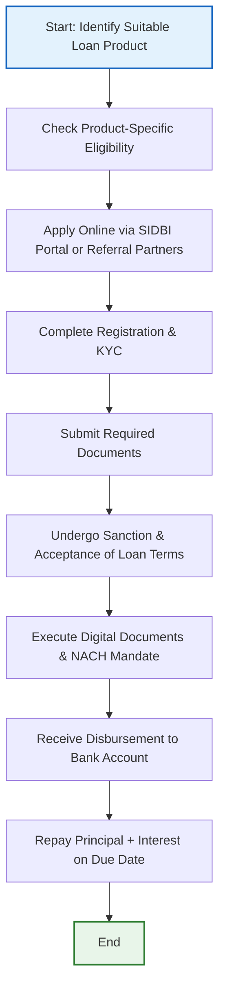

# Comprehensive Scheme Masterclass & File Guide

## Scheme Deep Dive

### Overview
The **SIDBI Direct Credit Scheme** is a pan-India loan scheme implemented by the Small Industries Development Bank of India (SIDBI) to fill credit gaps in the MSME sector through demonstrative and innovative lending products. It operates on a rolling basis with no fixed deadlines, offering a suite of financial products tailored to diverse MSME needs. The scheme is administered by SIDBI, with application portal access at [https://sidbi.in/home-product](https://sidbi.in/home-product). Last updated in 2026, it reflects current policy and product offerings as of the latest evidence.

### Objectives
The scheme’s objectives are explicitly defined in the evidence and include:
- Filling existing credit gaps in the MSME sector
- Providing demonstrative and innovative lending products
- Supporting expansion, modernization, and technology upgradation of MSMEs
- Enabling scalable and globally competitive growth
- Enhancing financial accessibility through tailored credit solutions
- Promoting sustainable development and green finance initiatives
- Supporting MSME clusters through infrastructure development
- Facilitating access to capital for deeper integration into domestic and global value chains

### Eligibility Matrix
Eligibility varies by product but follows common baseline criteria. The table below synthesizes all eligibility requirements from the evidence:

| **Eligibility Criteria** | **Details** | **Product-Specific Variations** | **Source** |
|--------------------------|-------------|----------------------------------|------------|
| **Business Vintage** | Minimum operational period required | • Project Funding: 2 years • Machinery Loan: 3 years • GST Sahay: 2 years • Venture Debt: <10 years (startup age) • Seed Funding: Early-stage (no fixed vintage but requires incubator partnership) | Key Facts; Machinery Loan page; GST Sahay PDF; Venture Debt PDF; Seed Funding PDF |
| **Udyam Registration** | Mandatory for all products | Required across all loan products; verified during KYC | Key Facts; Machinery Loan page; GST Sahay PDF |
| **GST Registration** | Mandatory for all products | Required for GST-based products (GST Sahay, FPS Sahay); generally required for all MSME loans | Key Facts; GST Sahay PDF; FPS Sahay PDF |
| **No Defaults to Banks/FIs** | Absolute disqualifier | Applies universally; any default history disqualifies applicant | Key Facts; Machinery Loan page; Project Funding page |
| **Audited Accounts** | Required for assessment | Must submit audited financials; cash profit in recent years often required | Key Facts; Project Funding page; 4E Financing Scheme PDF |
| **Cash Profit** | Required in recent financial years | • Project Funding: Cash profit in last audited year • Machinery Loan: Cash profit in recent years • 4E Financing: Cash profit in last 2 years • Venture Debt: ₹10 Cr operational income in last 2 years | Key Facts; Project Funding page; 4E Financing Scheme PDF; Venture Debt PDF |
| **CIBIL Score** | Creditworthiness assessment | • Minimum 550 for Gig Flexi Loans • External rating AA- and above for clean limits in Receivable Finance • Internal/external rating used for pricing in most products | Key Facts; Gig Flexi Loans PDF; Receivable Finance Scheme PDF |
| **Project Report** | Required for project-based funding | Mandatory for Project Loan applications detailing land, machinery, installation, etc. | Key Facts; Project Funding page |
| **Quotation for Machinery** | Required for Machinery Loan | Must submit supplier quotation for machinery being financed | Key Facts; Machinery Loan page |
| **Purchase/Sales Invoice** | Required for invoice-based financing | Mandatory for GST Sahay, FPS Sahay, Receivable Finance; invoice value determines loan amount | Key Facts; GST Sahay PDF; FPS Sahay PDF; Receivable Finance Scheme PDF |
| **Land & Building Documents** | Required if applicable | Needed for Project Loan involving property acquisition/construction | Key Facts |
| **Collateral Details** | Required if security is stipulated | • Machinery Loan: 25% FD security for up to 100% financing • Project Loan: May require collateral based on risk profile • Receivable Finance: Hypothecation of assets, CGTMSE cover optional | Key Facts; Machinery Loan page; Receivable Finance Scheme PDF |
| **Authorization Letter** | Mandatory for all applications | From signatory authorizing application and document submission | Key Facts |
| **NACH Mandate** | Required for disbursement & repayment | For auto-debit of EMIs; part of digital execution | Key Facts |
| **Digital Document Execution** | Mandatory | E-signature of loan agreements via portal | Key Facts |
| **Specialized Criteria** | Product-dependent | • Venture Debt: ₹10 Cr equity + VC/AIF backing • Seed Funding: Incubator partnership required • GST Sahay-JAKs: 6 months operations, PMBI registration • FPS Sahay: 2 years FPS operations, State govt. license | Key Facts; Venture Debt PDF; Seed Funding PDF; GST Sahay-JAKs PDF; FPS Sahay PDF |

> **Note**: Staff and senior citizens may receive additional interest on fixed deposits, but this is **not applicable** to loan schemes under Direct Credit. Fixed deposit schemes are separate products.

### Benefits & Financial Support
The scheme offers a wide range of financial products with varying tenors, margins, and features. The table below consolidates all financial support details from the evidence:

| **Product** | **Loan Amount** | **Margin / Security** | **Tenure** | **Interest Rate** | **Key Features** | **Source** |
|-------------|-----------------|------------------------|------------|-------------------|------------------|------------|
| **Project Loan** | Up to Rs. 50 crore | Max 80% of project cost | Up to 7 years | MCLR-linked, attractive | Moratorium up to 2 years; for land, building, plant & machinery, rooftop solar, energy efficiency devices; expansion/modernization/tech upgradation | Key Facts; Project Funding page |
| **Machinery Loan** | Up to Rs. 3 crore | Up to 100% financing with 25% FD security | Up to 60 months (5 years) | MCLR-linked, attractive | Quick sanction via automated platform using GST returns, ITRs, bank statements, CIBIL score; processing fee 0.50% + GST | Key Facts; Machinery Loan page |
| **Working Capital Loan** | Not specified (product-based) | Varies by sub-product | Varies | MCLR-linked | Includes DigiCash, GST Sahay, FPS Sahay, Receivable Finance; quick sanction | Key Facts; Home Product page |
| **Green Finance Loan** | Not specified | Varies | Varies | Attractive rate | For sustainable development, energy efficiency, clean tech; part of Financing Schemes for Sustainable Development | Key Facts; 4E Financing Scheme PDF |
| **GST Sahay (IBF)** | Up to Rs. 50 lakh | Collateral free | Based on invoice usance (90–180 days) | Attractive rate & quick disbursement | Invoice-based financing (purchase/sales); on-tap via App; uses OCEN, Account Aggregator, India Stack (Aadhaar, UPI, GST); embedded in supply chain | Key Facts; GST Sahay PDF |
| **FPS Sahay** | Up to Rs. 2 lakh | Collateral free | Based on invoice usance | Attractive rate & quick disbursement | Pilot basis; for Fair Price Shop dealers; purchase invoice-based financing | Key Facts; FPS Sahay PDF |
| **GST Sahay-JAKs** | Up to Rs. 2 lakh | Collateral free | Based on invoice usance | Attractive rate & quick disbursement | Pilot basis; for Jan Aushadhi Kendras; PMBI registration required; 6+ months operations | Key Facts; GST Sahay-JAKs PDF |
| **Receivable Finance Scheme** | Up to Rs. 50 crore | Based on purchaser/MSME creditworthiness | Usance of bills/invoice: 90–180 days | Discount rate linked to internal/external credit rating | Finance against bills of exchange/invoices; clean limit for purchasers with AA- and above rating; MSME sellers can discount dues | Key Facts; Receivable Finance Scheme PDF |
| **Venture Debt Financing** | Rs. 10–15 crore | Covered under risk-sharing facilities (CGTMSE, CGSS) | 3 years (including moratorium) | Not specified (risk-based) | Non-dilutive term loan; for MSMEs <10 years with ₹10 Cr equity + VC/AIF backing; ₹10 Cr operational income last 2 years; DER ≤ 2:1 | Key Facts; Venture Debt PDF |
| **Seed Funding (Incubator Partnership)** | Equity investment | N/A (equity, not debt) | N/A | N/A | Equity investment via incubators; supports IP-driven/product startups; helps navigate "valley of death"; connects to SIDBI Fund of Funds ecosystem | Key Facts; Seed Funding PDF |
| **4E Financing Scheme** | Up to Rs. 150 lakh | Min 10% promoter’s contribution; hypothecation of assets; CGTMSE cover optional | ≤36 months (loans ≤50 lakh); ≤60 months (loans >50 lack) | As per internal rating | For end-to-end energy efficiency; requires Detailed Energy Audit (DEA) and DPR vetted by EEC, SIDBI; min loan Rs. 10 lakh | Key Facts; 4E Financing Scheme PDF |
| **Gig Flexi Loan** | Up to 80% of accrued payout | Based on repayment capacity | 30–60 days | Lowest interest rate in segment | For gig workers; end-to-end digital; no manual intervention; partnered with Karmalife.ai; min payout Rs. 2500; CIBIL vision score ≥550 | Key Facts; Gig Flexi Loans PDF |
| **PRAYAAS (IES Pilot)** | Low-cost borrowings | N/A (partner-mediated) | N/A | N/A | For micro-entrepreneurs; focus on women (SVEP) and SHG graduates; operational in Bihar & Maharashtra; partner institutions: CLFs under SRLMs | Key Facts; PRAYAAS-IES PDF |
| **Cash Defence** | Up to Rs. 20 crore (established MSMEs) Up to Rs. 5 crore (new entities) | 100% Purchase Order Financing + 10% additional for unexpected needs | Up to 60 months | Attractive interest rate | For validated defence orders; bullet/equal/staggered repayment options; working capital term loan | Key Facts; Cash Defence PDF |
| **Fixed Deposit Scheme** | N/A (deposit product) | N/A | 12–60 months (multiples of 1 month) | • 12–24 months: up to 6.61% effective annual yield • 25–36 months: up to 6.71% • 37–60 months: up to 6.77% • Senior citizens: +50 bps • Staff (existing/former): +100 bps • Retired staff + senior citizens: +150 bps | AAA(FD)-rated; nomination facility; ECS interest credit; TDS exemption for interest ≤Rs. 10,000; eligible for individuals, HUFs, firms, companies, societies | Key Facts; FD Scheme pages; FD Interest Rate PDF |

> **Note**: Interest rates are MCLR-linked and vary by product, borrower profile, and tenure. Specific rates are not uniformly published but are described as "attractive" and competitive.

### Application Process
The application process is standardized across products with minor variations in document requirements. The flowchart below illustrates the end-to-end journey:

**Key Process Notes from Evidence**:
- Application portal: [https://sidbi.in/home-product](https://sidbi.in/home-product) (primary) or via referral partners (list available in [Referral Partners PDF](https://sidbi.in/list-of-referral-partners-registered-with-sidbi-december-update.pdf))
- Registration & KYC: Includes Udyam, GST, PAN, Aadhaar verification; digital onboarding via SIDBI 4U mobile app or web portal
- Document submission: Uploaded digitally; varies by product (see Eligibility Matrix and Required Documents in Key Facts)
- Sanction: Involves credit assessment; some products (e.g., Machinery Loan, GST Sahay) offer instant in-principle offer
- Digital execution: E-signature of loan agreement; NACH mandate for auto-debit
- Disbursement: Direct to borrower’s bank account; no intermediary
- Repayment: Auto-debit via NACH; schedule based on product (monthly, quarterly, or bullet)

> **Warning**: Default to banks/FIs disqualifies applicant permanently until cleared. Collateral requirements vary—some products (GST Sahay, FPS Sahay, Gig Flexi) are collateral-free, while others (Machinery Loan, Project Loan) may require security based on risk profile.

### Key Caveats & Warnings
> - Loan amount is subject to credit assessment and eligibility; sanctioned amount may be less than applied.
> - Collateral may be required depending on product and risk profile (e.g., Machinery Loan requires 25% FD security for 100% financing).
> - Tenure and interest rates vary by product and borrower profile; MCLR-linked rates reset periodically.
> - Some products are pilot-based (e.g., GST Sahay for JAKs, FPS Sahay) and may have limited availability or geographic restrictions.
> - Default to banks/FIs is an absolute disqualifier; no exceptions.
> - Minimum vintage of business operations is mandatory and varies by product (2–3 years for most term loans).
> - Staff and senior citizen interest benefits apply **only** to fixed deposit schemes, not loan products.
> - Fixed deposit schemes are **separate** from direct credit lending and should not be conflated.

### Supporting Evidence Sources
- **Application Portal**: [https://sidbi.in/home-product](https://sidbi.in/home-product)
- **Core Scheme Details**: Key Facts block (Scheme ID: row-15)
- **Product-Specific Pages**:
  - Project Loan: [https://sidbi.in/project-funding](https://sidbi.in/project-funding)
  - Machinery Loan: [https://sidbi.in/machinery-loan](https://sidbi.in/machinery-loan)
  - Working Capital / Green Finance: [https://sidbi.in/home-product](https://sidbi.in/home-product)
  - GST Sahay: [gst-sahay-invoice-based-financing-to-sidbi-customers.pdf](gst-sahay-invoice-based-financing-to-sidbi-customers.pdf)
  - FPS Sahay: [fps-sahay-fair-price-shops-sahay.pdf](fps-sahay-fair-price-shops-sahay.pdf)
  - GST Sahay-JAKs: [gst-sahay-jan-aushadhi-kendras-jaks.pdf](gst-sahay-jan-aushadhi-kendras-jaks.pdf)
  - Receivable Finance: [1-receivable-finance-scheme-final.pdf](1-receivable-finance-scheme-final.pdf)
  - Venture Debt: [venture-debt-financing-to-msmes.pdf](venture-debt-financing-to-msmes.pdf)
  - Seed Funding: [seed-funding-through-incubators.pdf](seed-funding-through-incubators.pdf)
  - 4E Financing: [3-financing-schemes-for-sustainable-development.pdf](3-financing-schemes-for-sustainable-development.pdf)
  - Gig Flexi: [sidbi-gig-flexi-loans.pdf](sidbi-gig-flexi-loans.pdf)
  - PRAYAAS: [prayaas-ies.pdf](prayaas-ies.pdf)
  - Cash Defence: [cash-defence.pdf](cash-defence.pdf)
  - Fixed Deposit: [fixed-scheme](https://sidbi.in/fixed-scheme) and [fd-interest-rate-20-05-2026.pdf](fd-interest-rate-20-05-2026.pdf)
- **Referral Partners**: [list-of-referral-partners-registered-with-sidbi-december-update.pdf](list-of-referral-partners-registered-with-sidbi-december-update.pdf)
- **Contact Details**: Toll Free: 180-022-6753 | +91 86930 33333

---

## Consultant's Field Guide to Generated Files

### 1. SCHEME_MASTER_DATABASE.md
**Real-time Usage**: Keep this open in a background tab during all client calls. When a client asks "What is the turnover limit?" or "Who administers this?", CTRL+F in this document to give an immediate, authoritative answer without checking the portal.  
**Pro Tip**: Use search terms like "Udyam", "GST", "tenure", "loan amount", or "interest rate" to instantly retrieve product-specific details during eligibility checks.

### 2. PITCH_AND_SALES_SCRIPTS.md
**Real-time Usage**: Open this file 5 minutes before your first Discovery Call with a lead. Read the "Problem Framing" out loud to hook them, then use the Qualification Checklist to interrogate their eligibility live on the phone. Keep the Objection Handlers table visible so you can immediately counter when they say "We're too small for this."  
**Pro Tip**: Mirror the client’s language when stating benefits—e.g., if they mention cash flow stress, lead with GST Sahay’s "on-tap" invoice financing; if they discuss expansion, lead with Project Loan’s 7-year tenure and moratorium.

### 3. APPLICATION_PLAYBOOK.md
**Real-time Usage**: Print this out or pin it to your desktop once the client signs the retainer. Check off each box in "Stage 1" before moving to "Stage 2". Use the "Client Communication Template" to copy-paste directly into your email when chasing them for pending documents.  
**Pro Tip**: Stage 3 (Document Submission) is where 60% of delays occur—use the checklist to pre-validate documents (e.g., ensure ITRs are audited, GST returns match bank statements) before upload to avoid rework.

### 4. CLIENT_ONBOARDING_AND_CRM.md
**Real-time Usage**: Fill this out during or immediately after the onboarding call. Use the Needs Assessment to record their exact pain points. Update the "Compliance Status" table as they email you documents to maintain a single source of truth for what's missing.  
**Pro Tip**: Color-code the CRM status: Red = Missing/Critical, Yellow = Submitted (Pending Review), Green = Approved. This visual cue prevents oversight during busy periods.

### 5. LIVE_CASE_TRACKER.md
**Real-time Usage**: Review this document every morning during your standup. Update the "Stage" column daily. If a case hits "Stage 07 - Under review", use the Escalation Path notes here to know exactly who to call at the government department today.  
**Pro Tip**: For SIDBI cases, Stage 07 typically involves credit officer review—escalate to the Relationship Manager (RM) assigned to your region via the Referral Partners list if no update in 48 hours.

### 6. FEE_AND_REVENUE_MODEL.md
**Real-time Usage**: Use this file when drafting the proposal. Look at the client's turnover, map them to the pricing tier in the table, and quote that exact Retainer and Success Fee. Use the monthly projection table to update your personal sales pipeline forecast for the quarter.  
**Pro Tip**: Success fees are typically 8–12% of sanctioned loan amount—adjust based on product complexity (e.g., higher for Project Loan requiring tech appraisal, lower for GST Sahay).

### 7. CLIENT_PROPOSAL_TEMPLATE.md
**Real-time Usage**: Copy this entire file, paste it into an email or PDF generator, replace the [PLACEHOLDER] tags with the client's actual details gathered from the CRM, and send it immediately after a successful discovery call.  
**Pro Tip**: Always attach the relevant product brochure (e.g., Machinery Loan PDF) from the SIDBI website to increase credibility—clients trust official sources more than consultant-generated material.

### 8. COMPLIANCE_AND_LEGAL_PACK.md
**Real-time Usage**: Attach sections 8A and 8B as PDFs to the proposal email. Refuse to start Step 1 of the Application Playbook until the client signs these. Use the Disclaimers to protect yourself legally if the client is rejected by the government agency.  
**Pro Tip**: Section 8B (Client Declaration) must include a clause acknowledging that "loan approval is solely at SIDBI’s discretion based on credit assessment"—this shifts rejection risk appropriately and is non-negotiable.