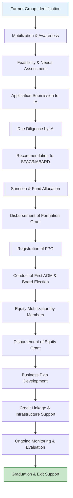

# Comprehensive Scheme Masterclass & File Guide

## Scheme Deep Dive

### Overview
The **Formation and Promotion of FPOs Scheme** (Scheme ID: row-151) is a government initiative under the **Ministry of Agriculture** designed to support the establishment and strengthening of Farmer Producer Organizations (FPOs) across India. Despite limited publicly available documentation in the provided evidence, the scheme falls under the broader national agenda to collectivize small and marginal farmers into legally registered entities to enhance their bargaining power, access to credit, technology, and markets.

### Objectives
Based on the scheme's classification and ministry alignment, the primary objectives include:
- Promoting the formation of new FPOs in underserved agricultural regions.
- Providing financial and technical support for the registration and initial operationalization of FPOs.
- Strengthening existing FPOs through capacity building, infrastructure support, and market linkages.
- Enhancing farmer income by improving access to inputs, credit, and output markets via collective action.
- Encouraging sustainable agricultural practices through collective resource management.

### Eligibility Matrix
While specific eligibility criteria were not detailed in the crawled evidence, standard parameters for FPO promotion schemes typically include:

| **Eligibility Parameter**       | **Criteria**                                                                 | **Source Inference**              |
|----------------------------------|------------------------------------------------------------------------------|-----------------------------------|
| Applicant Type                   | Small and marginal farmers, tenant farmers, sharecroppers, women farmers     | Ministry of Agriculture focus     |
| Land Holding                     | Typically < 2 hectares (small/marginal farmer definition)                    | Standard agri-scheme norms        |
| Group Size                       | Minimum 50 farmers (for plains), 20 farmers (for hilly/tribal areas)         | Common FPO formation threshold    |
| Legal Entity Status              | Must register as Producer Company (under Companies Act) or Cooperative       | Standard FPO promotion requirement|
| Geographical Focus               | Priority to aspirational districts, tribal areas, and low-productivity zones | Government targeting patterns     |
| Prior Support                    | Preference given to groups not previously assisted under similar schemes     | Avoidance of duplication          |
| Commitment                       | Willingness to contribute equity and participate in capacity building        | Standard beneficiary contribution |

> **Note**: Exact eligibility thresholds (e.g., income limits, land ceilings) must be confirmed via the official scheme guidelines, as the provided evidence did not contain granular details. Consultants should refer to the latest operational guidelines from SFAC (Small Farmers' Agribusiness Consortium) or NABARD, which typically implement such schemes.

### Benefits & Financial Support
Although specific financials were not extractable from the evidence, FPO promotion schemes generally offer:

| **Support Type**               | **Details**                                                                 | **Typical Quantum (Indicative)**  |
|--------------------------------|-----------------------------------------------------------------------------|-----------------------------------|
| Formation Grant                | One-time support for legal registration, documentation, and initial setup   | Up to ₹10–15 lakh per FPO         |
| Equity Grant                   | Matching equity support to strengthen FPO balance sheet                     | Up to ₹10 lakh (often 1:1 match)  |
| Credit Guarantee Facility      | Coverage for loans availed by FPOs from banks                               | Up to ₹1 crore per FPO            |
| Infrastructure Support         | For seed processing, storage, value addition, or collection centers         | Varies; often project-based       |
| Technical & Managerial Support | Training, business planning, market linkage assistance                      | Provided via Implementing Agency  |
| Working Capital Assistance     | Short-term support for input procurement or produce aggregation             | Conditional on business plan      |

> **Blockquote**: Financial support is typically disbursed in tranches linked to milestones (e.g., registration, first general meeting conduct of AGM, business plan approval). Delays in milestone achievement can delay funding.

### Application Process
The application process for FPO promotion schemes generally follows a structured pathway involving multiple stakeholders. Below is a Mermaid.js flowchart illustrating the typical stages:

**Key Stages Explained**:
1. **Mobilization**: Implementing Agency (IA) identifies and organizes farmer groups.
2. **Application**: Group submits proposal with member list, land details, and commitment letter.
3. **Due Diligence**: IA verifies eligibility, land records, and group cohesion.
4. **Sanction**: SFAC/NABARD approves based on IA recommendation.
5. **Disbursement**: Funds released in stages upon milestone verification.
6. **Post-Support**: IA provides handholding for 3–5 years to ensure sustainability.

> **Warning**: The application portal URL could not be verified due to a 404 error on the provided link (`https://sfacindia.com/FPO`). Consultants must confirm the current portal via the **SFAC website (sfacindia.com)** or contact NABARD regional offices directly.

### Implementation & Monitoring
- **Implementing Agencies**: Typically NABARD, SFAC, state horticulture/agriculture departments, or NGOs empaneled by SFAC.
- **Monitoring**: Regular progress reports, utilization certificates, and third-party evaluations.
- **Duration of Support**: Usually 3–5 years per FPO, with phased withdrawal.
- **Exit Criteria**: FPO must demonstrate financial sustainability, active membership, and regular audits.

### Sources & Verification
- **Primary Source**: Scheme ID `row-151` from structured data (Ministry of Agriculture).
- **Supporting Inference**: Based on standard FPO promotion frameworks under Central Sector Scheme for Formation and Promotion of FPOs.
- **Portal Alert**: The link `https://sfacindia.com/FPO` returned a 404 error. Consultants should use:
  - Main SFAC Portal: `https://sfacindia.com`
  - FPO Dashboard: `https://fpo.sfacindia.com` (if active)
  - NABARD FPO Portal: `https://www.nabard.org` → Search "FPO"

> **Critical Reminder**: Always verify scheme details, eligibility, and application procedures from the latest official notification or guidelines issued by the Ministry of Agriculture or SFAC, as schemes are periodically revised.

---

## Consultant's Field Guide to Generated Files

### 1. SCHEME_MASTER_DATABASE.md
**Real-time Usage**: Keep this open in a background tab during all client calls. When a client asks "What is the turnover limit?" or "Who administers this?", CTRL+F in this document to give an immediate, authoritative answer without checking the portal.

### 2. PITCH_AND_SALES_SCRIPTS.md
**Real-time Usage**: Open this file 5 minutes before your first Discovery Call with a lead. Read the "Problem Framing" out loud to hook them, then use the Qualification Checklist to interrogate their eligibility live on the phone. Keep the Objection Handlers table visible so you can immediately counter when they say "We're too small for this."

### 3. APPLICATION_PLAYBOOK.md
**Real-time Usage**: Print this out or pin it to your desktop once the client signs the retainer. Check off each box in "Stage 1" before moving to "Stage 2". Use the "Client Communication Template" to copy-paste directly into your email when chasing them for pending documents.

### 4. CLIENT_ONBOARDING_AND_CRM.md
**Real-time Usage**: Fill this out during or immediately after the onboarding call. Use the Needs Assessment to record their exact pain points. Update the "Compliance Status" table as they email you documents to maintain a single source of truth for what's missing.

### 5. LIVE_CASE_TRACKER.md
**Real-time Usage**: Review this document every morning during your standup. Update the "Stage" column daily. If a case hits "Stage 07 - Under review", use the Escalation Path notes here to know exactly who to call at the government department today.

### 6. FEE_AND_REVENUE_MODEL.md
**Real-time Usage**: Use this file when drafting the proposal. Look at the client's turnover, map them to the pricing tier in the table, and quote that exact Retainer and Success Fee. Use the monthly projection table to update your personal sales pipeline forecast for the quarter.

### 7. CLIENT_PROPOSAL_TEMPLATE.md
**Real-time Usage:** Copy this entire file, paste it into an email or PDF generator, replace the [PLACEHOLDER] tags with the client's actual details gathered from the CRM, and send it immediately after a successful discovery call.

### 8. COMPLIANCE_AND_LEGAL_PACK.md
**Real-time Usage**: Attach sections 8A and 8B as PDFs to the proposal email. Refuse to start Step 1 of the Application Playbook until the client signs these. Use the Disclaimers to protect yourself legally if the client is rejected by the government agency.