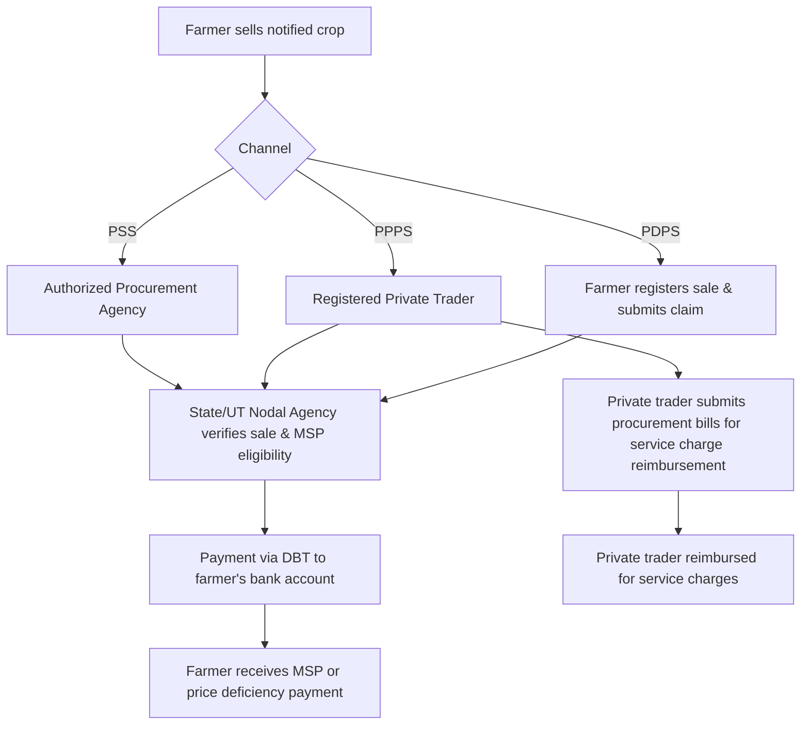

</think># Comprehensive Scheme Masterclass & File Guide

## Scheme Deep Dive

### Overview
PM Annadata Aay Sanrakshan Abhiyan (PM-AASHA) is a centrally sponsored subsidy scheme under the Ministry of Agriculture and Farmers Welfare, designed to ensure remunerative prices for farmers through three interconnected components: Price Support Scheme (PSS), Price Deficiency Payment Scheme (PDPS), and Private Procurement & Stockist Scheme (PPPS). The scheme operates on a pan-India basis with implementation varying by state, harvest season, and notified crops.

### Objectives
- Ensure remunerative prices to farmers for their produce  
- Prevent distress sale of agricultural commodities  
- Effective implementation of Minimum Support Price (MSP) through procurement  
- Provide income support to farmers via price deficiency payments  
- Encourage private sector participation in procurement and stocking  
- Stabilize agricultural prices and ensure food security  

### Eligibility Matrix
| **Criteria**               | **Details**                                                                 | **Source** |
|----------------------------|-----------------------------------------------------------------------------|------------|
| Target Beneficiaries       | All farmers selling notified agricultural commodities under the scheme      | Key Facts  |
| Eligible Crops             | Crops covered under MSP as declared by Government of India from time to time | Key Facts  |
| Selling Channel Requirement| Must sell through authorized agencies (PSS) or registered private traders (PPPS) | Key Facts  |
| Geographic Scope           | Pan-India                                                                   | Key Facts  |
| Implementation Dependency  | Based on harvest season and market arrival of notified crops; varies by state and commodity | Key Facts  |

### Benefits & Financial Support
| **Component** | **Mechanism**                                                                 | **Financial Support Details**                                                                 | **Benefits to Farmers**                                                                 | **Source** |
|---------------|-------------------------------------------------------------------------------|---------------------------------------------------------------------------------------------|---------------------------------------------------------------------------------------|------------|
| PSS           | Direct procurement at MSP by Central/State nodal agencies                     | Central Government bears financial liability as per norms; funds released to nodal agencies | Assured MSP payment; reduced post-harvest losses; timely payments via DBT             | Key Facts  |
| PDPS          | Direct payment of price deficiency (difference between MSP and actual/modal price) | Central Government bears financial liability; payment via DBT after verification              | Income support via price difference; prevents distress sale                           | Key Facts  |
| PPPS          | Private players procure at MSP; compensated with service charges              | Service charges reimbursed to private traders upon submission of procurement bills          | Encourages private sector participation; expands procurement network                  | Key Facts  |

> **Key Caveats**  
> - Benefits limited to notified crops under MSP  
> - Implementation depends on state/UT participation and readiness  
> - PPPS is currently under pilot in select districts  
> - PDPS payments are subject to verification of modal prices  
> - Farmers must sell through authorized channels to avail benefits  

### Application Process Flowchart

**Application Portal**: [https://agricoop.nic.in](https://agricoop.nic.in)  
**Implementing Agency**: Department of Agriculture, Cooperation & Farmers Welfare, Ministry of Agriculture and Farmers Welfare  

---

## Consultant's Field Guide to Generated Files

### 1. SCHEME_MASTER_DATABASE.md
**Real-time Usage:** Keep this open in a background tab during all client calls. When a client asks "What is the turnover limit?" or "Who administers this?", CTRL+F in this document to give an immediate, authoritative answer without checking the portal.

### 2. PITCH_AND_SALES_SCRIPTS.md
**Real-time Usage:** Open this file 5 minutes before your first Discovery Call with a lead. Read the "Problem Framing" out loud to hook them, then use the Qualification Checklist to interrogate their eligibility live on the phone. Keep the Objection Handlers table visible so you can immediately counter when they say "We're too small for this."

### 3. APPLICATION_PLAYBOOK.md
**Real-time Usage:** Print this out or pin it to your desktop once the client signs the retainer. Check off each box in "Stage 1" before moving to "Stage 2". Use the "Client Communication Template" to copy-paste directly into your email when chasing them for pending documents.

### 4. CLIENT_ONBOARDING_AND_CRM.md
**Real-time Usage:** Fill this out during or immediately after the onboarding call. Use the Needs Assessment to record their exact pain points. Update the "Compliance Status" table as they email you documents to maintain a single source of truth for what's missing.

### 5. LIVE_CASE_TRACKER.md
**Real-time Usage:** Review this document every morning during your standup. Update the "Stage" column daily. If a case hits "Stage 07 - Under review", use the Escalation Path notes here to know exactly who to call at the government department today.

### 6. FEE_AND_REVENUE_MODEL.md
**Real-time Usage:** Use this file when drafting the proposal. Look at the client's turnover, map them to the pricing tier in the table, and quote that exact Retainer and Success Fee. Use the monthly projection table to update your personal sales pipeline forecast for the quarter.

### 7. CLIENT_PROPOSAL_TEMPLATE.md
**Real-time Usage:** Copy this entire file, paste it into an email or PDF generator, replace the [PLACEHOLDER] tags with the client's actual details gathered from the CRM, and send it immediately after a successful discovery call.

### 8. COMPLIANCE_AND_LEGAL_PACK.md
**Real-time Usage:** Attach sections 8A and 8B as PDFs to the proposal email. Refuse to start Step 1 of the Application Playbook until the client signs these. Use the Disclaimers to protect yourself legally if the client is rejected by the government agency.