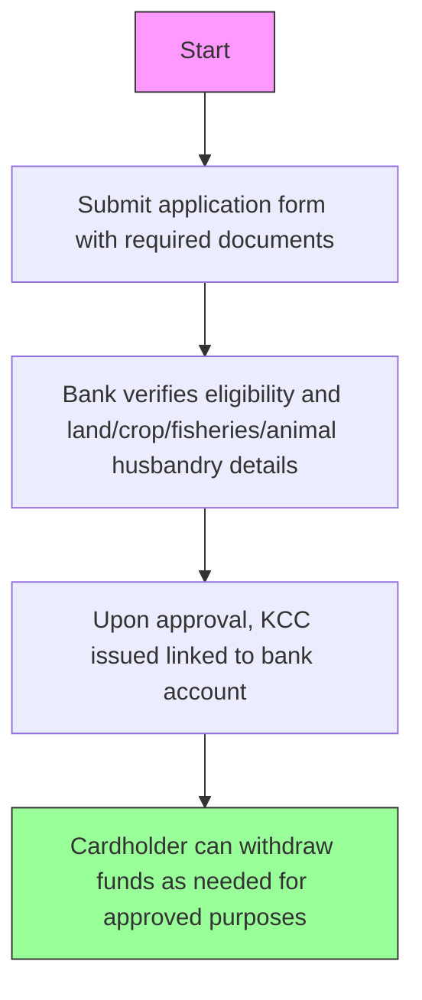

# Comprehensive Scheme Masterclass & File Guide

## Scheme Deep Dive

### Overview
The **Kisan Credit Card for Fisheries & Animal Husbandry** (Scheme ID: row-158) is a **loan-type** scheme implemented pan-India by the **Department of Fisheries, Ministry of Fisheries, Animal Husbandry and Dairying**. It operates on a **rolling basis** with no fixed deadline. The scheme extends the Kisan Credit Card (KCC) framework—originally introduced in 1998 for crop farmers—to **fishers, fish farmers, livestock farmers, and cultivators** engaged in agricultural and allied activities. Its core purpose is to provide **timely and affordable credit support** for short-term financing needs in crop production, fisheries, animal husbandry, and household requirements.

### Objectives
- Provide timely and affordable credit support to farmers  
- Enable access to short-term loans for crop production and allied activities  
- Support household requirements of farmers  
- Extend credit facilities to fishers and livestock farmers under KCC  
- Issue credit cards linked to bank accounts for flexible fund withdrawal  

### Eligibility Matrix
| **Beneficiary Category**       | **Eligibility Criteria**                                                                 | **Source** |
|-------------------------------|------------------------------------------------------------------------------------------|------------|
| Cultivators                   | Engaged in agricultural and allied activities; require credit for crop production        | Key Facts  |
| Livestock farmers             | Engaged in agricultural and allied activities; require credit for animal husbandry       | Key Facts  |
| Fishers                       | Engaged in agricultural and allied activities; require credit for fisheries              | Key Facts  |
| Fish farmers                  | Engaged in agricultural and allied activities; require credit for fisheries              | Key Facts  |
| Farmers requiring household credit | Need credit for household requirements alongside agricultural/allied activities      | Key Facts  |

> **Note**: The scheme is available to farmers who require credit for **crop production, fisheries, animal husbandry, animal husbandry, and household needs**.

### Benefits & Financial Support
| **Benefit/Feature**                              | **Description**                                                                                                                               | **Source** |
|--------------------------------------------------|---------------------------------------------------------------------------------------------------------------------------------------------|------------|
| Credit Card Linked to Bank Account               | Farmers issued a Kisan Credit Card linked to their bank account                                                                              | Key Facts  |
| Flexible Withdrawal of Funds                     | Card enables withdrawal of funds as needed for approved purposes                                                                            | Key Facts  |
| Short-Term Loan Access                           | Access to short-term loans for crop production, allied activities, and household requirements                                               | Key Facts  |
| Timely and Affordable Credit                     | Provides timely and affordable credit support                                                                                               | Key Facts  |
| Credit Limit Basis                               | Based on landholding, cropping pattern, and scale of fisheries/animal husbandry activities                                                  | Key Facts  |
| Approved Uses                                    | Crop production, fisheries, animal husbandry, and household needs                                                                           | Key Facts  |
| Repayment Requirement                            | Timely repayment required to maintain creditworthiness and continue availing benefits                                                       | Key Facts  |

> |

### Application Process

### Required Documents
1. Application form  
2. Proof of identity  
3. Proof of address  
4. Land ownership or lease documents (for crop farmers)  
5. Details of fisheries or animal husbandry activities  
6. Bank account details  

### Key Caveats
- Credit limit is based on landholding, cropping pattern, and scale of fisheries/animal husbandry activities  
- Loan must be used only for approved purposes like crop production, fisheries, animal husbandry, and household needs  
- Timely repayment is required to maintain creditworthiness and continue availing benefits  

### Application Portal
**Official Portal**: [https://dof.gov.in](https://dof.gov.in)  
**Relevant Section**: Schemes and Services | Department of Fisheries (https://dof.gov.in/offerings)  

> **Warning**: The Kisan Credit Card for Fisheries & Animal Husbandry is administered through **banks offering KCC facility**, not directly via the Department of Fisheries portal. Applicants must approach a participating bank.

---

## Consultant's Field Guide to Generated Files

### 1. SCHEME_MASTER_DATABASE.md
**Real-time Usage**: Keep this open in a background tab during all client calls. When a client asks "What is the turnover limit?" or "Who administers this?", CTRL+F in this document to give an immediate, authoritative answer without checking the portal.

### 2. PITCH_AND_SALES_SCRIPTS.md
**Real-time Usage**: Open this file 5 minutes before your first Discovery Call with a lead. Read the "Problem Framing" out loud to hook them, then use the Qualification Checklist to interrogate their eligibility live on the phone. Keep the Objection Handlers table visible so you can immediately counter when they say "We're too small for this."

### 3. APPLICATION_PLAYBOOK.md
**Real-time Usage**: Print this out or pin it to your desktop once the client signs the retainer. Check off each box in "Stage 1" before moving to "Stage 2". Use the "Client Communication Template" to copy-paste directly into your email when chasing them for pending documents.

### 4. CLIENT_ONBOARDING_AND_CRM.md
**Real-time Usage**: Fill this out during or immediately after the onboarding call. Use the Needs Assessment to record their exact pain points. Update the "Compliance Status" table as they email you documents to maintain a single source of truth for what's missing.

### 5. LIVE_CASE_TRACKER.md
**Real-time Usage**: Review this document every morning during your standup. Update the "Stage" column daily. If a case hits "Stage 07 - Under review", use the Escalation Path notes here to know exactly who to call at the government department today.

### 6. FEE_AND_REVENUE_MODEL.md
**Real-time Usage**: Use this file when drafting the proposal. Look at the client's turnover, map them to the pricing tier in the table, and quote that exact Retainer and Success Fee. Use the monthly projection table to update your personal sales pipeline forecast for the quarter.

### 7. CLIENT_PROPOSAL_TEMPLATE.md
**Real-time Usage**: Copy this entire file, paste it into an email or PDF generator, replace the [PLACEHOLDER] tags with the client's actual details gathered from the CRM, and send it immediately after a successful discovery call.

### 8. COMPLIANCE_AND_LEGAL_PACK.md
**Real-time Usage**: Attach sections 8A and 8B as PDFs to the proposal email. Refuse to start Step 1 of the Application Playbook until the client signs these. Use the Disclaimers to protect yourself legally if the client is rejected by the government agency.