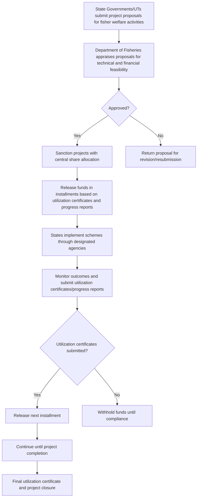

# Comprehensive Scheme Masterclass & File Guide

## Scheme Deep Dive

### Overview
The **National Scheme on Welfare of Fishermen** (Scheme ID: row-159) is a **subsidy-type** scheme implemented pan-India by the **Department of Fisheries, Ministry of Fisheries, Animal Husbandry and Dairying**. It operates on a **rolling basis**—proposals can be submitted throughout the year as per budget cycle and scheme guidelines. The scheme was last updated in **2026**.

### Objectives
The scheme aims to:
- Provide financial assistance for livelihood support to fishermen  
- Enhance social security coverage for fishers and their families  
- Support infrastructure development for fisheries welfare  
- Promote sustainable fisheries practices through welfare interventions  
- Strengthen institutional mechanisms for fisher welfare delivery  
- Facilitate access to credit and insurance for fishers  
- Improve living and working conditions of fisher communities  

### Eligibility Matrix
| **Beneficiary Category**       | **Citizenship Requirement** | **Economic Status**                              | **Engagement Activity**                                  | **Identifying Authority**         |
|-------------------------------|-----------------------------|--------------------------------------------------|----------------------------------------------------------|-----------------------------------|
| Traditional and small-scale fishermen | Citizens of India           | Belong to economically weaker sections           | Capture fisheries                                        | State Governments/UTs             |
| Fish farmers                  | Citizens of India           | Belong to economically weaker sections           | Aquaculture                                              | State Governments/UTs             |
| Members of fisher communities | Citizens of India           | Belong to economically weaker sections           | Allied activities                                        | State Governments/UTs             |

> **Note**: Beneficiary selection must follow transparency and socio-economic criteria as identified by State Governments/UTs.

### Benefits & Financial Support
| **Benefit Category**          | **Details**                                                                                                                               | **Financial Mechanism**                                                                 |
|-------------------------------|-------------------------------------------------------------------------------------------------------------------------------------------|---------------------------------------------------------------------------------------|
| Housing, sanitation, drinking water | Financial assistance for construction and provision                                                                                       | Central share released as grants-in-aid based on approved project proposals and utilization certificates |
| Community assets              | Support for development of community infrastructure                                                                                       | Central share released as grants-in-aid based on approved project proposals and utilization certificates |
| Livelihood support            | Assistance for income-generating activities                                                                                               | Central share released as grants-in-aid based on approved project proposals and utilization certificates |
| Accident insurance and health coverage | Access to insurance schemes                                                                                                               | Central share released as grants-in-aid based on approved project proposals and utilization certificates |
| Formation of fisher cooperatives and self-help groups | Support for institutional strengthening                                                                                                   | Central share released as grants-in-aid based on approved project proposals and utilization certificates |
| Skill development and training programs | Capacity building for fisheries and allied activities                                                                                     | Central share released as grants-in-aid based on approved project proposals and utilization certificates |
| Subsidies for fisheries-related equipment and infrastructure | Financial support for boats, nets, cold storage, processing units, etc.                                                                   | Central share released as grants-in-aid based on approved project proposals and utilization certificates |

> **Financial Support Mechanism**: The Department of Fisheries provides financial assistance to State Governments/UTs for implementation of welfare activities. Central share is released as grants-in-aid based on approved project proposals and utilization certificates.  
> **Key Caveat**: Central assistance is subject to availability of funds and budget allocations; State Governments/UTs must contribute matching share as per scheme norms.

### Application Process (Mermaid Flowchart)

### Application Portal & Key Sources
- **Application Portal**: [https://dof.gov.in](https://dof.gov.in) (Department of Fisheries official website)  
- **Key Sources**:  
  - Scheme Key Facts (structured data)  
  - Detailed Demands for Grants documents (2023-24, 2025-26, 2026-27)  
  - Department of Fisheries offerings and guidelines pages  

---

## Consultant's Field Guide to Generated Files

### 1. SCHEME_MASTER_DATABASE.md
**Real-time Usage**: Keep this open in a background tab during all client calls. When a client asks "What is the turnover limit?" or "Who administers this?", CTRL+F in this document to give an immediate, authoritative answer without checking the portal.  
*Example*: If a client asks about the implementing agency, search for "Implementing Agency" to find: "Department of Fisheries, Ministry of Fisheries, Animal Husbandry and Dairying".

### 2. PITCH_AND_SALES_SCRIPTS.md
**Real-time Usage**: Open this file 5 minutes before your first Discovery Call with a lead. Read the "Problem Framing" out loud to hook them, then use the Qualification Checklist to interrogate their eligibility live on the phone. Keep the Objection Handlers table visible so you can immediately counter when they say "We're too small for this."  
*Example*: Use the objection handler for "We're too small" by citing that the scheme targets traditional and small-scale fishermen explicitly, with no minimum turnover requirement—eligibility is based on economic weaker section status, not business size.

### 3. APPLICATION_PLAYBOOK.md
**Real-time Usage**: Print this out or pin it to your desktop once the client signs the retainer. Check off each box in "Stage 1" before moving to "Stage 2". Use the "Client Communication Template" to copy-paste directly into your email when chasing them for pending documents.  
*Example*: After signing the retainer, verify that the State Government/UT has prepared the project proposal (Stage 1, Task 1) before proceeding to financial feasibility review (Stage 2).

### 4. CLIENT_ONBOARDING_AND_CRM.md
**Real-time Usage**: Fill this out during or immediately after the onboarding call. Use the Needs Assessment to record their exact pain points. Update the "Compliance Status" table as they email you documents to maintain a single source of truth for what's missing.  
*Example*: If a client mentions lack of access to accident insurance, log this under "Pain Points" in the Needs Assessment. When they send the beneficiary list, update the Compliance Status table to mark "Beneficiary list and selection criteria" as received.

### 5. LIVE_CASE_TRACKER.md
**Real-time Usage**: Review this document every morning during your standup. Update the "Stage" column daily. If a case hits "Stage 07 - Under review", use the Escalation Path notes here to know exactly who to call at the government department today.  
*Example*: When a case reaches "Under review", contact the Section Officer (Fisheries Welfare) at the Department of Fisheries via the directory in this file to check status and expedite processing.

### 6. FEE_AND_REVENUE_MODEL.md
**Real-time Usage**: Use this file when drafting the proposal. Look at the client's turnover, map them to the pricing tier in the table, and quote that exact Retainer and Success Fee. Use the monthly projection table to update your personal sales pipeline forecast for the quarter.  
*Example*: For a State Government client with annual turnover of ₹50 crore, refer to the pricing tier for "₹40–60 crore" to quote a retainer of ₹2.5 lakh and success fee of 8% of sanctioned amount.

### 7. CLIENT_PROPOSAL_TEMPLATE.md
**Real-time Usage**: Copy this entire file, paste it into an email or PDF generator, replace the [PLACEHOLDER] tags with the client's actual details gathered from the CRM, and send it immediately after a successful discovery call.  
*Example*: After a discovery call where the client confirmed they are a State Fisheries Department seeking welfare funds, replace [CLIENT_NAME], [PROJECT_TYPE], and [BENEFICIARY_COUNT] with their specifics before sending.

### 8. COMPLIANCE_AND_LEGAL_PACK.md
**Real-time Usage**: Attach sections 8A and 8B as PDFs to the proposal email. Refuse to start Step 1 of the Application Playbook until the client signs these. Use the Disclaimers to protect yourself legally if the client is rejected by the government agency.  
*Example*: Before submitting the project proposal (Application Playbook Step 1), ensure the client has signed the Undertaking on Matching Share and Beneficiary Selection Criteria (from 8A and 8B). If rejected, cite the disclaimer that "adherence to socio-economic criteria is the State's sole responsibility" to limit liability.