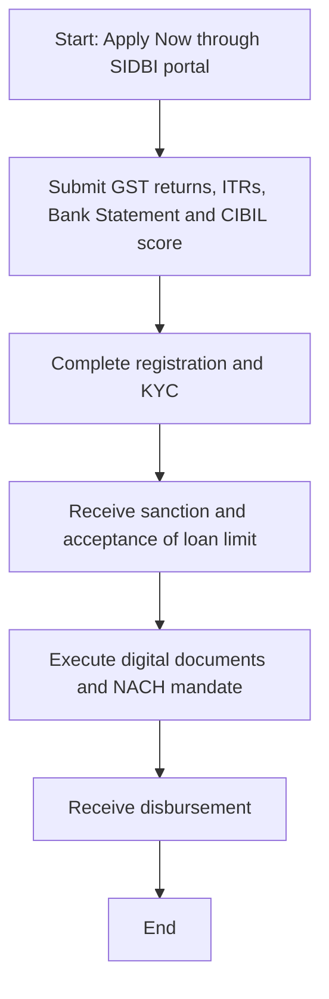

# Comprehensive Scheme Masterclass & File Guide

## Scheme Deep Dive

### Overview
The Equipment Finance for MSMEs (SIDBI) scheme is a direct loan product offered by the Small Industries Development Bank of India (SIDBI) to facilitate access to affordable credit for MSMEs to procure machinery and equipment. It is a pan-India scheme with rolling basis applications, last updated in 2026. The implementing agency is SIDBI, and the application portal is https://sidbi.in/machinery-loan.

### Objectives
- Facilitate access to affordable credit for MSMEs to procure machinery and equipment
- Support technology upgradation and modernization of existing enterprises
- Enhance productivity and operational efficiency of MSMEs
- Promote business expansion and scalability through capital investment
- Strengthen the manufacturing and service capabilities of MSMEs

### Eligibility Matrix
| Criteria | Requirement | Source |
|----------|-------------|--------|
| Operational History | Minimum 3 years of operations | Key Facts, Machinery Loan Page |
| Registration | Mandatory Udyam & GST registration | Key Facts, Machinery Loan Page |
| Credit Standing | No defaults to Banks/FIs | Key Facts, Machinery Loan Page |
| Financial Performance | Cash profit in last audited financial results | Key Facts, Machinery Loan Page |
| Beneficiary Type | MSME units | Key Facts |

### Benefits & Financial Support
| Feature | Details | Source |
|---------|---------|--------|
| Loan Amount | Up to Rs. 3 Crore | Key Facts, Machinery Loan Page |
| Financing | Up to 100% financing with 25% security in the form of fixed deposit | Key Facts, Machinery Loan Page |
| Processing Fees | 0.50% plus applicable GST | Key Facts, Machinery Loan Page |
| Interest Rate | MCLR Linked attractive rate of Interest | Key Facts, Machinery Loan Page |
| Repayment Tenure | Up to 60 months | Key Facts, Machinery Loan Page |
| Sanction Process | Quick sanction through automated platform using GST returns, ITRs, Bank Statement and CIBIL score | Key Facts, Machinery Loan Page |
| In-Principle Offer | Immediate in-principle offer | Key Facts, Machinery Loan Page |

> **> WARNING:** The 25% security in the form of fixed deposit is mandatory for availing up to 100% financing. Failure to provide this security will limit the financing percentage.

### Application Process

**Application Portal:** https://sidbi.in/machinery-loan

### Key Caveats
- Mandatory Udyam & GST registration required
- No defaults to Bank/FIs allowed
- Minimum three years of operations required
- 25% security in the form of fixed deposit required for up to 100% financing

### Supporting Evidence Summary
The scheme details are consistently confirmed across multiple sources including the SIDBI homepage, machinery loan product page, and supporting documents. The application process emphasizes digital submission of core financial documents (GST returns, ITRs, Bank Statement, CIBIL score) and leverages automation for quick sanction. The scheme aligns with SIDBI's broader mission to facilitate access to capital and build capacity of MSMEs for deeper integration into Indian and global value chains.

---

## Consultant's Field Guide to Generated Files

### 1. SCHEME_MASTER_DATABASE.md
**Real-time Usage:** Keep this open in a background tab during all client calls. When a client asks "What is the turnover limit?" or "Who administers this?", CTRL+F in this document to give an immediate, authoritative answer without checking the portal.

### 2. PITCH_AND_SALES_SCRIPTS.md
**Real-time Usage:** Open this file 5 minutes before your first Discovery Call with a lead. Read the "Problem Framing" out loud to hook them, then use the Qualification Checklist to interrogate their eligibility live on the phone. Keep the Objection Handlers table visible so you can immediately counter when they say "We're too small for this."

### 3. APPLICATION_PLAYBOOK.md
**Real-time Usage:** Print this out or pin it to your desktop once the client signs the retainer. Check off each box in "Stage 1" before moving to "Stage 2". Use the "Client Communication Template" to copy-paste directly into your email when chasing them for pending documents.

### 4. CLIENT_ONBOARDING_AND_CRM.md
**Real-time Usage:** Fill this out during or immediately after the onboarding call. Use the Needs Assessment to record their exact pain points. Update the "Compliance Status" table as they email you documents to maintain a single source of truth for what's missing.

### 5. LIVE_CASE_TRACKER.md
**Real-time Usage:** Review this document every morning during your standup. Update the "Stage" column daily. If a case hits "Stage 07 - Under review", use the Escalation Path notes here to know exactly who to call at the government department today.

### 6. FEE_AND_REVENUE_MODEL.md
**Real-time Usage:** Use this file when drafting the proposal. Look at the client's turnover, map them to the pricing tier in the table, and quote that exact Retainer and Success Fee. Use the monthly projection table to update your personal sales pipeline forecast for the quarter.

### 7. CLIENT_PROPOSAL_TEMPLATE.md
**Real-time Usage:** Copy this entire file, paste it into an email or PDF generator, replace the [PLACEHOLDER] tags with the client's actual details gathered from the CRM, and send it immediately after a successful discovery call.

### 8. COMPLIANCE_AND_LEGAL_PACK.md
**Real-time Usage:** Attach sections 8A and 8B as PDFs to the proposal email. Refuse to start Step 1 of the Application Playbook until the client signs these. Use the Disclaimers to protect yourself legally if the client is rejected by the government agency.