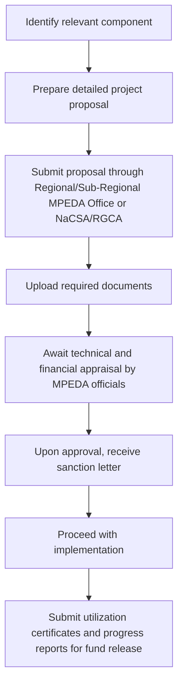

# Comprehensive Scheme Masterclass & File Guide

## Scheme Deep Dive

### Overview
The Aquaculture Development Scheme (MPEDA) is a subsidy scheme implemented by the Marine Products Export Development Authority (MPEDA), Ministry of Commerce & Industry, Government of India. It operates on a pan-India geographic scope with a rolling basis application process subject to budget availability. The scheme was last updated in 2023 and has a medium confidence level in the extracted data.

### Objectives
- Promote sustainable aquaculture practices and species diversification
- Support value addition and export-oriented aquaculture technology incubation
- Enhance market promotion and participation in international seafood fairs
- Provide financial assistance for infrastructure development and quality assurance
- Strengthen training and capacity building for farmers and technicians
- Facilitate certification for export traceability of wild caught and farmed products
- Encourage adoption of Better Management Practices (BMPs) in aquaculture
- Augment revenue through fee-based data and research support

### Eligibility Matrix
| Eligible Beneficiary | Registration Requirement | Priority Consideration | Additional Conditions |
|----------------------|--------------------------|------------------------|------------------------|
| Aquaculture farmers | Registered with MPEDA or affiliated societies (NaCSA/RGCA) | Small-scale and marginal farmers adopting cluster-based farming and BMPs | Must demonstrate export potential for value addition components |
| Exporters | Registered with MPEDA or affiliated societies (NaCSA/RGCA) | Units seeking support for value addition, cold storage, or processing infrastructure | Must demonstrate export potential and compliance with quality standards |
| Fisheries cooperatives | Registered with MPEDA or affiliated societies (NaCSA/RGCA) | Priority given to small-scale and marginal farmers | Must maintain proper records and submit utilization certificates for audit |
| MSMEs engaged in marine products sector | Registered with MPEDA or affiliated societies (NaCSA/RGCA) | Priority given to small-scale and marginal farmers | Support for value addition prioritized for export-oriented units with proven market linkage |

### Benefits & Financial Support
| Component | Financial Assistance Details | Disbursement Mechanism | Key Notes |
|-----------|------------------------------|------------------------|-----------|
| Cold storage | Subsidy for eligible components | Disbursed through NaCSA and RGCA after verification of project proposals and utilization certificates | Assistance based on project scope; higher support for value addition and technology adoption |
| Processing machinery | Subsidy for eligible components | Disbursed through NaCSA and RGCA after verification of project proposals and utilization certificates | Assistance based on project scope; higher support for value addition and technology adoption |
| Hatchery development | Subsidy for eligible components | Disbursed through NaCSA and RGCA after verification of project proposals and utilization certificates | Assistance based on project scope; higher support for value addition and technology adoption |
| Farm infrastructure | Subsidy for eligible components | Disbursed through NaCSA and RGCA after verification of project proposals and utilization certificates | Assistance based on project scope; higher support for value addition and technology adoption |
| Value addition units | Financial support for infrastructure development, technology upgradation, and value addition units | Disbursed through NaCSA and RGCA after verification of project proposals and utilization certificates | Higher support for value addition and technology adoption initiatives |
| Technology upgradation | Financial support for infrastructure development, technology upgradation, and value addition units | Disbursed through NaCSA and RGCA after verification of project proposals and utilization certificates | Higher support for value addition and technology adoption initiatives |
| Training programs | Technical assistance through training programs, capacity building, and access to Better Management Practices (BMPs) | Disbursed through NaCSA and RGCA after verification of project proposals and utilization certificates | Support for species diversification via RGCA and NaCSA |
| Capacity building | Technical assistance through training programs, capacity building, and access to Better Management Practices (BMPs) | Disbursed through NaCSA and RGCA after verification of project proposals and utilization certificates | Support for species diversification via RGCA and NaCSA |
| Species diversification | Support for species diversification via RGCA and NaCSA | Disbursed through NaCSA and RGCA after verification of project proposals and utilization certificates | Assistance in obtaining export facilitation certificates and quality certifications |
| Export facilitation certificates | Assistance in obtaining export facilitation certificates and quality certifications | Disbursed through NaCSA and RGCA after verification of project proposals and utilization certificates | Access to institutional finance and insurance linkages |
| Quality certifications | Assistance in obtaining export facilitation certificates and quality certifications | Disbursed through NaCSA and RGCA after verification of project proposals and utilization certificates | Market promotion through participation in international fairs and buyer-seller meets |
| Institutional finance | Access to institutional finance and insurance linkages | Disbursed through NaCSA and RGCA after verification of project proposals and utilization certificates | Subsidized testing and certification services through MPEDA laboratories |
| Insurance linkages | Access to institutional finance and insurance linkages | Disbursed through NaCSA and RGCA after verification of project proposals and utilization certificates | Subsidized testing and certification services through MPEDA laboratories |
| Market promotion | Market promotion through participation in international fairs and buyer-seller meets | Disbursed through NaCSA and RGCA after verification of project proposals and utilization certificates | Subsidized testing and certification services through MPEDA laboratories |
| Testing services | Subsidized testing and certification services through MPEDA laboratories | Disbursed through NaCSA and RGCA after verification of project proposals and utilization certificates | Financial assistance is provided as a subsidy for eligible components |

### Application Process

### Required Documents
1. Registration certificate with MPEDA or affiliated societies (NaCSA/RGCA)
2. Project report detailing objectives, methodology, and budget
3. Proof of land ownership or lease agreement for farm/infrastructure
4. Bank statement or financial solvency certificate
5. Quotations for machinery/equipment to be procured
6. Environmental and pollution clearance certificates (if applicable)
7. Training completion certificates (for capacity building components)
8. Utilization certificates and progress reports (for subsequent installments)

### Key Details
- **Application Portal**: https://e-mpeda.nic.in/registration/Reg_login.aspx
- **Status / Deadlines**: Rolling basis — applications are accepted throughout the year subject to budget availability.
- **Contact Details**: Email: ho[at]mpeda[dot]gov[dot]in | Phone: +91 484 2311901, +91 484 2311854, +91 484 2311803, +91 484 2313415, +91 484 2314468, +91 484 2315065
- **Key Caveats**:
  - Financial assistance is subject to availability of funds under the annual budget outlay
  - Beneficiaries must maintain proper records and submit utilization certificates for audit
  - Support for value addition is prioritized for export-oriented units with proven market linkage
  - Training and capacity building support is limited to registered farmers and technicians
  - Subsidy claims must be supported by valid invoices and payment proofs

### Financial Support Details from Evidence
- The scheme operates on a demand-driven basis with budgetary support allocated annually.
- Financial assistance is provided as a subsidy for eligible components such as cold storage, processing machinery, hatchery development, and farm infrastructure.
- The support is disbursed through NaCSA and RGCA after verification of project proposals and utilization certificates.
- Assistance is provided based on the scope of the project, with higher support for value addition and technology adoption initiatives.

### Benefits Details from Evidence
- Financial support for infrastructure development, technology upgradation, and value addition units.
- Technical assistance through training programs, capacity building, and access to Better Management Practices (BMPs).
- Support for species diversification via RGCA and NaCSA.
- Assistance in obtaining export facilitation certificates and quality certifications.
- Access to institutional finance and insurance linkages.
- Market promotion through participation in international fairs and buyer-seller meets.
- Subsidized testing and certification services through MPEDA laboratories.

### Eligibility Details from Evidence
- Eligible beneficiaries include aquaculture farmers, exporters, fisheries cooperatives, and MSMEs engaged in marine products sector.
- Applicants must be registered with MPEDA or its affiliated societies like NaCSA and RGCA.
- Priority is given to small-scale and marginal farmers, particularly those adopting cluster-based farming and Better Management Practices (BMPs).
- Exporters seeking support for value addition, cold storage, or processing infrastructure must demonstrate export potential and compliance with quality standards.

### Target Beneficiaries from Evidence
- aquaculture farmers
- exporters
- MSME
- fisheries cooperatives

### Required Documents Details from Evidence
1. Registration certificate with MPEDA or affiliated societies (NaCSA/RGCA)
2. Project report detailing objectives, methodology, and budget
3. Proof of land ownership or lease agreement for farm/infrastructure
4. Bank statement or financial solvency certificate
5. Quotations for machinery/equipment to be procured
6. Environmental and pollution clearance certificates (if applicable)
7. Training completion certificates (for capacity building components)
8. Utilization certificates and progress reports (for subsequent installments)

### Application Process Details from Evidence
1. Identify the relevant component of the scheme (value addition, infrastructure, training, etc.).
2. Prepare a detailed project proposal including objectives, budget, and expected outcomes.
3. Submit the proposal through the respective Regional/Sub-Regional Office of MPEDA or via NaCSA/RGCA for aquaculture-specific interventions.
4. Upload required documents such as registration certificates, project reports, and financial statements.
5. Await technical and financial appraisal by MPEDA officials.
6. Upon approval, receive sanction letter and proceed with implementation.
7. Submit utilization certificates and progress reports for fund release.

### Objectives Details from Evidence
- Promote sustainable aquaculture practices and species diversification
- Support value addition and export-oriented aquaculture technology incubation
- Enhance market promotion and participation in international seafood fairs
- Provide financial assistance for infrastructure development and quality assurance
- Strengthen training and capacity building for farmers and technicians
- Facilitate certification for export traceability of wild caught and farmed products
- Encourage adoption of Better Management Practices (BMPs) in aquaculture
- Augment revenue through fee-based data and research support

### Key Caveats Details from Evidence
- Financial assistance is subject to availability of funds under the annual budget outlay
- Beneficiaries must maintain proper records and submit utilization certificates for audit
- Support for value addition is prioritized for export-oriented units with proven market linkage
- Training and capacity building support is limited to registered farmers and technicians
- Subsidy claims must be supported by valid invoices and payment proofs

## Consultant's Field Guide to Generated Files

### 1. SCHEME_MASTER_DATABASE.md
**Real-time Usage:** Keep this open in a background tab during all client calls. When a client asks "What is the turnover limit?" or "Who administers this?", CTRL+F in this document to give an immediate, authoritative answer without checking the portal.

### 2. PITCH_AND_SALES_SCRIPTS.md
**Real-time Usage:** Open this file 5 minutes before your first Discovery Call with a lead. Read the "Problem Framing" out loud to hook them, then use the Qualification Checklist to interrogate their eligibility live on the phone. Keep the Objection Handlers table visible so you can immediately counter when they say "We're too small for this."

### 3. APPLICATION_PLAYBOOK.md
**Real-time Usage:** Print this out or pin it to your desktop once the client signs the retainer. Check off each box in "Stage 1" before moving to "Stage 2". Use the "Client Communication Template" to copy-paste directly into your email when chasing them for pending documents.

### 4. CLIENT_ONBOARDING_AND_CRM.md
**Real-time Usage:** Fill this out during or immediately after the onboarding call. Use the Needs Assessment to record their exact pain points. Update the "Compliance Status" table as they email you documents to maintain a single source of truth for what's missing.

### 5. LIVE_CASE_TRACKER.md
**Real-time Usage:** Review this document every morning during your standup. Update the "Stage" column daily. If a case hits "Stage 07 - Under review", use the Escalation Path notes here to know exactly who to call at the government department today.

### 6. FEE_AND_REVENUE_MODEL.md
**Real-time Usage:** Use this file when drafting the proposal. Look at the client's turnover, map them to the pricing tier in the table, and quote that exact Retainer and Success Fee. Use the monthly projection table to update your personal sales pipeline forecast for the quarter.

### 7. CLIENT_PROPOSAL_TEMPLATE.md
**Real-time Usage:** Copy this entire file, paste it into an email or PDF generator, replace the [PLACEHOLDER] tags with the client's actual details gathered from the CRM, and send it immediately after a successful discovery call.

### 8. COMPLIANCE_AND_LEGAL_PACK.md
**Real-time Usage:** Attach sections 8A and 8B as PDFs to the proposal email. Refuse to start Step 1 of the Application Playbook until the client signs these. Use the Disclaimers to protect yourself legally if the client is rejected by the government agency.