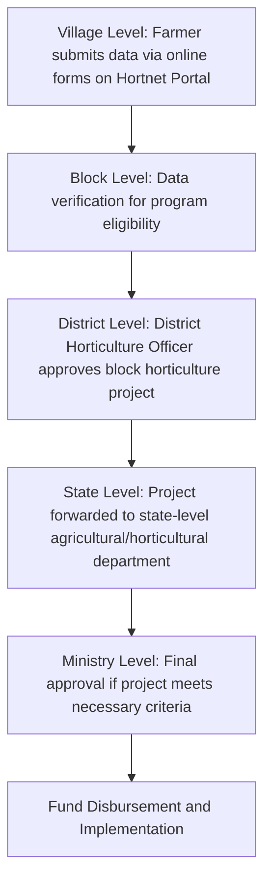

# Comprehensive Scheme Masterclass & File Guide

## Scheme Deep Dive

### Overview
The Mission for Integrated Development of Horticulture (MIDH) is a Centrally Sponsored Scheme for the holistic growth of the horticulture sector covering fruits, vegetables, root & tuber crops, mushrooms, spices, flowers, aromatic plants, coconut, cashew, cocoa and bamboo. It is implemented by the Mission for Integrated Development of Horticulture (MIDH), Department of Agriculture & Farmers Welfare, Government of India, with a pan-India geographic scope.

### Objectives
- Promote holistic growth of horticulture sector, including bamboo and coconut through area based regionally differentiated strategies, which includes research, technology promotion, extension, post harvest management, processing and marketing, in consonance with comparative advantage of each State/region and its diverse
- Encourage aggregation of farmers into farmer groups like FIGs/FPOs and FPCs to bring economy of scale and scope.
- Enhance horticulture production, augment farmers, income and strengthen nutritional security.
- Improve productivity by way of quality germplasm, planting material and water use efficiency through Micro Irrigation.
- Support skill development and create employment generation opportunities for rural youth in horticulture and post harvest management, especially in the cold chain sector.

### Eligibility Matrix
| **Beneficiary Type** | **Eligibility Criteria** | **Application Channel** | **Implementing Agency** |
|----------------------|--------------------------|-------------------------|--------------------------|
| Farmers / beneficiaries | Must contact the Horticulture Officer of the concerned district for availing benefits and assistance under the scheme. | Online forms via Hortnet Portal (Village Level) → Block Level verification → District Level approval by District Horticulture Officer → State Level forwarding → Ministry Level final approval | State Horticulture Missions (SHM) in selected districts of 18 States and 6 Union Territories for NHM; SHM in North Eastern States and Himalayan States for HMNEH; National Horticulture Board (NHB), Coconut Development Board (CDB), Central Institute for Horticulture (CIH), Nagaland, and National Level Agencies (NLA) |
| Farmer groups (FIGs/FPOs/FPCs) | Eligible for aggregation benefits under the scheme to bring economy of scale and scope. | Same as above | Same as above |
| Rural youth | Eligible for skill development and employment generation opportunities in horticulture and post harvest management, especially in the cold chain sector. | Same as above | Same as above |

> **Note**: The scheme is implemented by State Horticulture Missions (SHM) in selected districts of 18 States and 6 Union Territories for NHM, and in North Eastern States and Himalayan States for HMNEH. National Horticulture Board (NHB), Coconut Development Board (CDB), Central Institute for Horticulture (CIH), Nagaland and National Level Agencies (NLA) also implement schemes under MIDH.

### Benefits & Financial Support
| **Aspect** | **Details** |
|------------|-------------|
| **Government of India (GOI) Contribution** | - 85% of total outlay for developmental programmes in all states except North East and Himalayan States. - 15% share contributed by State Governments in non-NE/Himalayan states. - 100% GOI contribution in North Eastern States and Himalayan States. - 100% GOI contribution for development of bamboo and programmes of National Horticulture Board (NHB), Coconut Development Board (CDB), Central Institute for Horticulture (CIH), Nagaland and National Level Agencies (NLA). |
| **Key Benefit Areas** | - Holistic growth of horticulture sector (fruits, vegetables, root & tuber crops, mushrooms, spices, flowers, aromatic plants, coconut, cashew, cocoa, bamboo). - Research, technology promotion, extension. - Post harvest management, processing and marketing. - Encouraging aggregation of farmers into FIGs/FPOs/FPCs. - Enhancing horticulture production and farmer income. - Improving productivity via quality germplasm, planting material and water use efficiency through Micro Irrigation. - Skill development and employment generation for rural youth in horticulture and post harvest management, especially cold chain. |
| **Fund Release Data (Historical)** | - Total Allocation (last 5 years): ₹901.32 Crore - Total Releases (last 5 years): ₹283.62 Crore - Total Beneficiaries (last 5 years): 3,36,914 - State-wise fund released data available for all states/UTs (e.g., Andhra Pradesh: ₹24 Cr released for 33,319 beneficiaries; Gujarat: ₹39.36 Cr released for 32,179 beneficiaries; Tamil Nadu: ₹49.2 Cr released for 23,393 beneficiaries; West Bengal: 50,385 beneficiaries with ₹0 Cr released). |
| **Cold Storage Assistance** | - Financial assistance provided for cold storage projects (e.g., Gujarat: ₹2,33,681 Lakh for 249 projects with 14,53,487 MT capacity; Uttar Pradesh: ₹33,170 Lakh for 57 projects with 3,49,721 MT capacity; Odisha: ₹20,070 Lakh for 32 projects with 1,54,000 MT capacity). |
| **Centre of Excellence (CoE) Support** | - 52 CoEs established across states with technical partners (Israel/Dutch). - Examples: Maharashtra (Dutch CoE for Vegetables at Baramati: ₹1,000 Lakh sanctioned); Andhra Pradesh (Israel CoE for Flower and Vegetables at Kuppam: ₹892 Lakh sanctioned); Punjab (Israel CoE for Vegetables at Kartarpur: ₹973 Lakh sanctioned). - Status: 36 Completed, 16 Under Process. |

### Application Process

> **Application Portal**: Farmers can submit applications online via the Hortnet Portal at https://midh.gov.in (MIDH Suraksha platform).  
> **Key Source**: MIDH Workflow description consistently appears across multiple crawled pages (home, About, etc.) detailing the Village → Block → District → State → Ministry approval chain.  
> **Critical Detail**: No offline submission is required; the entire process is designed for online filing "from anywhere across the globe."

---

## Consultant's Field Guide to Generated Files

### 1. SCHEME_MASTER_DATABASE.md
**Real-time Usage:** Keep this open in a background tab during all client calls. When a client asks "What is the turnover limit?" or "Who administers this?", CTRL+F in this document to give an immediate, authoritative answer without checking the portal.

### 2. PITCH_AND_SALES_SCRIPTS.md
**Real-time Usage:** Open this file 5 minutes before your first Discovery Call with a lead. Read the "Problem Framing" out loud to hook them, then use the Qualification Checklist to interrogate their eligibility live on the phone. Keep the Objection Handlers table visible so you can immediately counter when they say "We're too small for this."

### 3. APPLICATION_PLAYBOOK.md
**Real-time Usage:** Print this out or pin it to your desktop once the client signs the retainer. Check off each box in "Stage 1" before moving to "Stage 2". Use the "Client Communication Template" to copy-paste directly into your email when chasing them for pending documents.

### 4. CLIENT_ONBOARDING_AND_CRM.md
**Real-time Usage:** Fill this out during or immediately after the onboarding call. Use the Needs Assessment to record their exact pain points. Update the "Compliance Status" table as they email you documents to maintain a single source of truth for what's missing.

### 5. LIVE_CASE_TRACKER.md
**Real-time Usage:** Review this document every morning during your standup. Update the "Stage" column daily. If a case hits "Stage 07 - Under review", use the Escalation Path notes here to know exactly who to call at the government department today.

### 6. FEE_AND_REVENUE_MODEL.md
**Real-time Usage:** Use this file when drafting the proposal. Look at the client's turnover, map them to the pricing tier in the table, and quote that exact Retainer and Success Fee. Use the monthly projection table to update your personal sales pipeline forecast for the quarter.

### 7. CLIENT_PROPOSAL_TEMPLATE.md
**Real-time Usage:** Copy this entire file, paste it into an email or PDF generator, replace the [PLACEHOLDER] tags with the client's actual details gathered from the CRM, and send it immediately after a successful discovery call.

### 8. COMPLIANCE_AND_LEGAL_PACK.md
**Real-time Usage:** Attach sections 8A and 8B as PDFs to the proposal email. Refuse to start Step 1 of the Application Playbook until the client signs these. Use the Disclaimers to protect yourself legally if the client is rejected by the government agency.