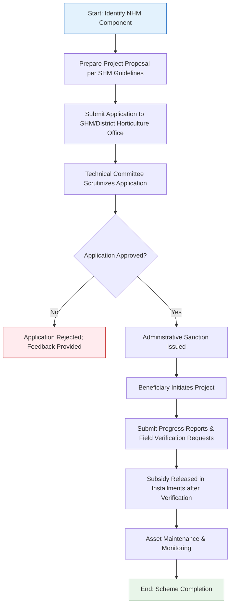

</think># Comprehensive Scheme Masterclass & File Guide

## Scheme Deep Dive

### Overview
The **National Horticulture Mission (NHM)** is a centrally sponsored scheme launched by the **Department of Agriculture, Cooperation & Farmers Welfare**, under the **Ministry of Agriculture and Farmers Welfare**, Government of India. It operates on a **pan-India** geographic scope and is implemented through **State Horticulture Missions (SHMs)**. The scheme functions as a **subsidy** program with **rolling basis** applications accepted throughout the year, subject to State Horticulture Mission notifications.

### Objectives
The NHM aims to achieve the following strategic goals:
- Increase horticultural production and productivity  
- Improve nutritional security and income support to farm households  
- Promote and develop post-harvest management and processing  
- Develop market infrastructure for horticultural produce  
- Encourage adoption of improved varieties and technologies  
- Strengthen institutional capacity and human resource development  
- Promote export of horticultural products  
- Ensure convergence with other related programs  

### Eligibility Matrix
The scheme is open to a broad range of entities engaged in horticulture activities. Eligibility may vary by component and state-level implementation guidelines.

| **Beneficiary Category**       | **Eligibility Criteria**                                                                 | **Notes**                                                                 |
|-------------------------------|----------------------------------------------------------------------------------------|---------------------------------------------------------------------------|
| Farmers                       | Must be involved in cultivation, processing, marketing, or post-harvest management of horticultural crops | Includes small, marginal, SC/ST, and women farmers (eligible for higher subsidy) |
| Self-Help Groups (SHGs)       | Engaged in horticulture-related activities                                             | Must be registered and active                                             |
| Farmer Producer Organizations (FPOs) | Involved in aggregation, processing, or marketing of horticultural produce           | Must be legally registered                                                |
| Entrepreneurs                 | Setting up horticulture-based enterprises (e.g., nurseries, processing units)          | Must demonstrate technical and financial viability                        |
| NGOs                          | Working in horticulture development, training, or extension                            | Must have relevant experience and registration                            |
| Cooperatives                  | Engaged in collective horticulture farming, processing, or marketing                   | Must be registered under relevant cooperative acts                        |

> **Note**: Specific eligibility (e.g., landholding limits, project size) may vary by component (e.g., protected cultivation, beekeeping) and is defined in State Horticulture Mission (SHM) guidelines.

### Benefits & Financial Support
Financial assistance is provided as **back-ended subsidies** released in installments based on field-level verification. The subsidy is **credit-linked** and routed through nodal banks or implementing agencies.

| **Support Type**              | **Details**                                                                                                                               | **Rate / Limit**                                                                 |
|-------------------------------|-------------------------------------------------------------------------------------------------------------------------------------------|----------------------------------------------------------------------------------|
| Subsidy Rate                  | Back-ended subsidy on project cost                                                                                                        | **40% to 50%** of project cost                                                   |
| Higher Assistance             | For SC/ST, small, marginal, and women farmers                                                                                             | **Up to 50%** of project cost                                                    |
| Disbursement Mode             | Released in installments after verification of field progress                                                                             | Tied to achievement of milestones                                                |
| Credit Linkage                | Assistance is routed through nodal banks or implementing agencies                                                                         | Requires bank loan sanction for credit-linked components                         |
| Covered Components            | Nurseries, tissue culture units, vegetable seed production, floriculture units, protected cultivation (polyhouses, shade nets), organic farming, vermicompost, mushroom cultivation, beekeeping, post-harvest management (pack houses, cold storage, ripening chambers), market infrastructure (wholesale markets, rural primary markets), training, demonstration, exposure visits | Varies by component; detailed in SHM guidelines                                  |
| Fund Availability             | Subject to availability of funds and state-specific allocation                                                                            | Subject to annual budget and SHM allocation                                      |

> **Warning**: Subsidy is **back-ended** and released **only after verification of field progress**. No upfront payment is made. Beneficiaries must maintain the asset for a minimum period (as specified by SHM) to avoid clawback.

### Application Process Flowchart
The application process involves coordination between the beneficiary, State Horticulture Mission (SHM), technical committees, and nodal banks.

**Application Portal**: Applications are submitted to the **State Horticulture Mission (SHM)** or **District Horticulture Office**. There is no centralized national portal; applicants must refer to their respective SHM website (e.g., [https://shm.maharashtra.gov.in](https://shm.maharashtra.gov.in) for Maharashtra) for notifications, guidelines, and forms.

### Key Caveats
- Subsidy is **back-ended** and released only after verification of field progress  
- Assistance is subject to availability of funds and state-specific allocation  
- Beneficiaries must maintain the asset for a minimum period as specified by SHM  
- Duplicate assistance for the same activity/component is not permitted  
- Implementation and monitoring are done at the state level through SHMs  
- Land ownership/lease documents, Aadhaar, PAN, bank details, and quotations are mandatory  
- Training certificates may be required for certain components (e.g., organic farming, protected cultivation)

### Required Documents
1. Application form  
2. Project proposal  
3. Land ownership/lease documents  
4. Bank account details  
5. Aadhaar card  
6. PAN card (if applicable)  
7. Quotations for inputs/equipment  
8. Training certificates (if required)  
9. Other documents as specified by SHM  

### Confidence Level
**Medium** – While core scheme details are consistent, implementation specifics (subsidy rates, components, documentation) vary significantly by state and are governed by State Horticulture Mission (SHM) notifications.

---

## Consultant's Field Guide to Generated Files

### 1. SCHEME_MASTER_DATABASE.md
**Real-time Usage:** Keep this open in a background tab during all client calls. When a client asks "What is the turnover limit?" or "Who administers this?", CTRL+F in this document to give an immediate, authoritative answer without checking the portal.

### 2. PITCH_AND_SALES_SCRIPTS.md
**Real-time Usage:** Open this file 5 minutes before your first Discovery Call with a lead. Read the "Problem Framing" out loud to hook them, then use the Qualification Checklist to interrogate their eligibility live on the phone. Keep the Objection Handlers table visible so you can immediately counter when they say "We're too small for this."

### 3. APPLICATION_PLAYBOOK.md
**Real-time Usage:** Print this out or pin it to your desktop once the client signs the retainer. Check off each box in "Stage 1" before moving to "Stage 2". Use the "Client Communication Template" to copy-paste directly into your email when chasing them for pending documents.

### 4. CLIENT_ONBOARDING_AND_CRM.md
**Real-time Usage:** Fill this out during or immediately after the onboarding call. Use the Needs Assessment to record their exact pain points. Update the "Compliance Status" table as they email you documents to maintain a single source of truth for what's missing.

### 5. LIVE_CASE_TRACKER.md
**Real-time Usage:** Review this document every morning during your standup. Update the "Stage" column daily. If a case hits "Stage 07 - Under review", use the Escalation Path notes here to know exactly who to call at the government department today.

### 6. FEE_AND_REVENUE_MODEL.md
**Real-time Usage:** Use this file when drafting the proposal. Look at the client's turnover, map them to the pricing tier in the table, and quote that exact Retainer and Success Fee. Use the monthly projection table to update your personal sales pipeline forecast for the quarter.

### 7. CLIENT_PROPOSAL_TEMPLATE.md
**Real-time Usage:** Copy this entire file, paste it into an email or PDF generator, replace the [PLACEHOLDER] tags with the client's actual details gathered from the CRM, and send it immediately after a successful discovery call.

### 8. COMPLIANCE_AND_LEGAL_PACK.md
**Real-time Usage:** Attach sections 8A and 8B as PDFs to the proposal email. Refuse to start Step 1 of the Application Playbook until the client signs these. Use the Disclaimers to protect yourself legally if the client is rejected by the government agency.