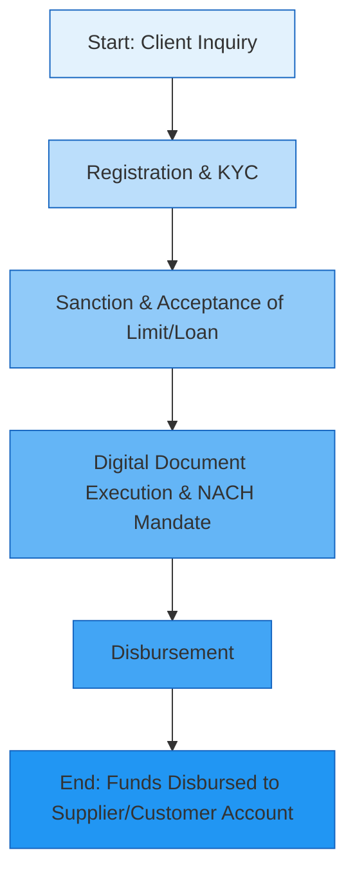

# Comprehensive Scheme Masterclass & File Guide

## Scheme Deep Dive

### Scheme Overview
The **Working Capital Loan Scheme (SIDBI)** is a loan-based financial product designed to provide need-based working capital finance to Micro and Small Enterprises (MSEs) through invoice-based financing mechanisms. Implemented by the Small Industries Development Bank of India (SIDBI), the scheme operates on a rolling basis with no fixed deadline, offering digital, straight-through processing using India Stack technologies such as Aadhaar, UPI, GST, and open API systems. The scheme is accessible via the application portal: [https://sidbi.in/home-product](https://sidbi.in/home-product).

### Objectives
The scheme aims to:
- Provide cash flow-based financing for the purchase of raw materials or credit sales.
- Enable 'on tap' working capital through invoice-based financing via the GST Sahay App.
- Offer collateral-free credit with quick disbursement and attractive interest rates.
- Support GST and Udyam-registered micro and small enterprises with 2+ years of operations.
- Facilitate digital, straight-through processing using OCEN and Account Aggregator frameworks.
- Improve liquidity and cash flow management for MSMEs.
- Enable financing against purchase or sales invoices with up to 90% of invoice value processed.

### Eligibility Matrix
| Criteria | Requirement | Source |
|---------|-------------|--------|
| Customer Status | Must be an existing SIDBI customer | Key Facts |
| Enterprise Type | Micro & Small Enterprises (MSEs) | Key Facts, Target Beneficiaries |
| Registration | GST and Udyam Registration mandatory | Key Facts, Eligibility, Benefits |
| Business Vintage | Minimum 2 years of business operations | Key Facts, Eligibility, Required Documents |
| Financial Health | Cash accruals in the last audited financial year | Key Facts, Eligibility, Required Documents |
| Geographic Scope | Pan-India | Key Facts |
| Target Beneficiaries | MSME, micro enterprises, small enterprises, existing SIDBI customers | Key Facts |

> **Warning**: The scheme is **only available to existing SIDBI customers**. New customers must first establish a relationship with SIDBI before applying.

### Benefits & Financial Support
| Feature | Detail | Source |
|--------|--------|--------|
| Maximum Credit Limit | Up to ₹50 lakh (need-based) | Key Facts, Financial Support |
| Purchase Invoice Based Financing (PIBF) | 100% of invoice value processed and paid to supplier’s bank account | Key Facts, Financial Support |
| Sales Invoice Based Financing (SIBF) | Up to 90% of invoice value processed and paid to customer’s bank account | Key Facts, Financial Support |
| Repayment Mechanism | Customer repays principal + applicable interest on due date via NACH mandate | Key Facts, Financial Support |
| Collateral Requirement | Collateral-free financing | Key Facts, Benefits |
| Disbursement Speed | Quick disbursement; digital, straight-through process | Key Facts, Benefits |
| Interest Rates | Attractive interest rates (linked to credit rating) | Key Facts, Benefits |
| Digital Infrastructure | Uses India Stack (Aadhaar, UPI, GST, open API), OCEN, Account Aggregator | Key Facts, Benefits |
| Direct Payment | Funds paid directly to supplier’s or customer’s bank account | Key Facts, Benefits |
| Mandate | NACH mandate for repayment | Key Facts, Benefits, Required Documents |

> **Note**: For SIBF, only up to 90% of the invoice value is financed; the remaining 10% must be borne by the beneficiary.

### Required Documents
1. GST Registration  
2. Udyam Registration  
3. Proof of 2 years of business operations  
4. Last audited financial statement showing cash accruals  
5. Purchase or Sales Invoice (as applicable)  
6. KYC documents  
7. Bank account details for NACH mandate  

> **Source**: Key Facts section under "Required Documents"

### Application Process (Mermaid Flowchart)

> **Process Source**: Key Facts section under "Application Process" and supported by PDF documents such as `gst-sahay-invoice-based-financing-to-sidbi-customers.pdf` and `fps-sahay-fair-price-shops-sahay.pdf`.

### Key Caveats
- Available **only to existing SIDBI customers**  
- Mandatory **GST and Udyam Registration**  
- Minimum **2 years of business operations** required  
- **Cash accruals in last audited financial year** required  
- Maximum credit limit capped at **₹50 lakh**  
- For Sales Invoice Based Financing (SIBF), only **up to 90% of invoice value** is financed  

> **Source**: Key Facts section under "Key Caveats"

### Contact Details
- Toll Free Number: **180-022-6753**  
- Alternative: **+91 86930 33333**  
> **Source**: Key Facts and multiple crawled pages (e.g., https://sidbi.in)

---

## Consultant's Field Guide to Generated Files

### 1. SCHEME_MASTER_DATABASE.md
**Real-time Usage:** Keep this open in a background tab during all client calls. When a client asks "What is the turnover limit?" or "Who administers this?", CTRL+F in this document to give an immediate, authoritative answer without checking the portal.

### 2. PITCH_AND_SALES_SCRIPTS.md
**Real-time Usage:** Open this file 5 minutes before your first Discovery Call with a lead. Read the "Problem Framing" out loud to hook them, then use the Qualification Checklist to interrogate their eligibility live on the phone. Keep the Objection Handlers table visible so you can immediately counter when they say "We're too small for this."

### 3. APPLICATION_PLAYBOOK.md
**Real-time Usage:** Print this out or pin it to your desktop once the client signs the retainer. Check off each box in "Stage 1" before moving to "Stage 2". Use the "Client Communication Template" to copy-paste directly into your email when chasing them for pending documents.

### 4. CLIENT_ONBOARDING_AND_CRM.md
**Real-time Usage:** Fill this out during or immediately after the onboarding call. Use the Needs Assessment to record their exact pain points. Update the "Compliance Status" table as they email you documents to maintain a single source of truth for what's missing.

### 5. LIVE_CASE_TRACKER.md
**Real-time Usage:** Review this document every morning during your standup. Update the "Stage" column daily. If a case hits "Stage 07 - Under review", use the Escalation Path notes here to know exactly who to call at the government department today.

### 6. FEE_AND_REVENUE_MODEL.md
**Real-time Usage:** Use this file when drafting the proposal. Look at the client's turnover, map them to the pricing tier in the table, and quote that exact Retainer and Success Fee. Use the monthly projection table to update your personal sales pipeline forecast for the quarter.

### 7. CLIENT_PROPOSAL_TEMPLATE.md
**Real-time Usage:** Copy this entire file, paste it into an email or PDF generator, replace the [PLACEHOLDER] tags with the client's actual details gathered from the CRM, and send it immediately after a successful discovery call.

### 8. COMPLIANCE_AND_LEGAL_PACK.md
**Real-time Usage:** Attach sections 8A and 8B as PDFs to the proposal email. Refuse to start Step 1 of the Application Playbook until the client signs these. Use the Disclaimers to protect yourself legally if the client is rejected by the government agency.