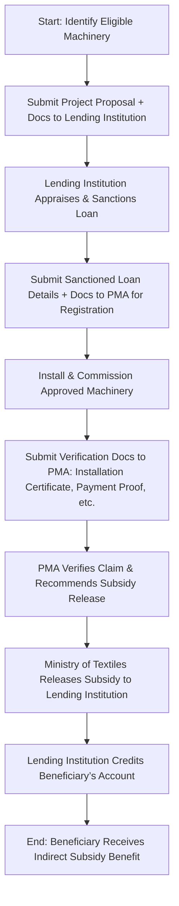

</think># Comprehensive Scheme Masterclass & File Guide

## Scheme Deep Dive

### Overview
The **Amended Technology Upgradation Fund Scheme (ATUFS)** is a **subsidy-based initiative** launched by the **Ministry of Textiles, Government of India**, aimed at promoting technological modernization across the textile value chain. It operates on a **rolling basis** with applications accepted throughout the year, subject to fund availability. The scheme is administered nationally (Pan-India) and targets both existing and new textile units seeking to upgrade their machinery with indigenous, state-of-the-art, and energy-efficient technology.

### Objectives
The scheme seeks to achieve the following strategic goals:
- Promote investment in technology upgradation in the textile industry  
- Enhance productivity, quality, and global competitiveness of textile units  
- Encourage adoption of indigenous, state-of-the-art, and energy-efficient technology  
- Support employment generation in the textile sector  
- Facilitate sustainable and inclusive growth of the textile industry  

### Eligibility Matrix
| **Criteria** | **Details** | **Source** |
|--------------|-------------|------------|
| **Beneficiary Type** | Existing and new textile units engaged in spinning, weaving, processing, garmenting, technical textiles, and jute | Key Facts |
| **Legal Registration** | Must be registered under Companies Act, 1956/2013, or any other relevant statute; must have valid Udyog Aadhaar Memorandum (UAM) or Udyam Registration | Key Facts |
| **Geographic Scope** | Pan-India | Key Facts |
| **Technology Requirement** | Project must involve technology upgradation through indigenous, state-of-the-art, and energy-efficient machinery as per the approved list under ATUFS | Key Facts |
| **Exclusion Clause** | Units must not have availed benefits under any other similar scheme for the same machinery | Key Facts |
| **Target Segment** | MSMEs; textile units; existing and new textile enterprises | Key Facts |

> **> ⚠️ Critical Caveat:** Subsidy is available **only for machinery listed in the approved list under ATUFS**. Garmenting and technical textiles segments are eligible for **10% subsidy**, while all other segments (spinning, weaving, processing, jute) receive **15%**. The maximum subsidy per unit is capped at **INR 30 crores**, and funds are released **only after verification of installation and commissioning by the Project Management Agency (PMA)**.

### Benefits & Financial Support
| **Parameter** | **Details** | **Source** |
|---------------|-------------|------------|
| **Subsidy Rate** | 15% of qualifying capital investment (10% for garmenting and technical textiles) | Key Facts |
| **Maximum Subsidy per Unit** | INR 30 crores | Key Facts |
| **Subsidy Mechanism** | Credit-linked subsidy: Government reimburses the lending institution, which passes the benefit to the beneficiary unit | Key Facts |
| **Disbursement Basis** | Released in installments based on verification of machinery installation and commissioning by PMA | Key Facts |
| **Additional Benefits** | Improved operational efficiency, reduced energy consumption, enhanced product quality | Key Facts |
| **Application Portal** | [https://tufs.nic.in](https://tufs.nic.in) | Key Facts |
| **Application Timeline** | Rolling basis — applications accepted throughout the year subject to availability of funds | Key Facts |

> **> 💡 Key Takeaway:** The subsidy is **not paid directly to the beneficiary** but is routed through the lending institution. The beneficiary receives the benefit indirectly via reduced effective loan cost or direct credit to their account after the lending institution receives the subsidy from the Ministry of Textiles.

### Required Documents
| **S.No** | **Document** | **Purpose** |
|----------|--------------|-------------|
| 1 | Project report detailing the technology upgradation | Justifies the need and scope of upgradation |
| 2 | Quotations and invoices of approved machinery | Validates cost and eligibility of machinery |
| 3 | Loan sanction letter from the lending institution | Confirms financial backing |
| 4 | Certificate of Incorporation / Udyam Registration | Proves legal entity status |
| 5 | PAN and GST registration of the unit | Tax compliance verification |
| 6 | Bank account details | For subsidy credit routing |
| 7 | Undertaking regarding indigenous and energy-efficient nature of machinery | Self-declaration for compliance |
| 8 | Installation and commissioning certificate of machinery | Mandatory for subsidy claim verification |
| 9 | Proof of payment to machinery suppliers | Confirms actual expenditure incurred |

### Application Process Flow

> **> 📌 Process Note:** The lending institution plays a dual role — as a financier and as the conduit for subsidy disbursement. The PMA (Project Management Agency) is the critical verification body; no subsidy is released without its positive verification report.

### Status & Deadlines
- **Status:** Active  
- **Application Timeline:** Rolling basis — applications accepted throughout the year  
- **Fund Availability:** Subject to annual budget allocation and utilization; applicants advised to apply early in the fiscal year to avoid fund exhaustion  
- **Portal:** [https://tufs.nic.in](https://tufs.nic.in) — all applications, tracking, and updates must be routed through this official portal  

---

## Consultant's Field Guide to Generated Files

### 1. SCHEME_MASTER_DATABASE.md
**Real-time Usage:** Keep this open in a background tab during all client calls. When a client asks "What is the turnover limit?" or "Who administers this?", CTRL+F in this document to give an immediate, authoritative answer without checking the portal.  
*Example:* If a client asks, *"Is there a minimum turnover to qualify?"*, search for "turnover" — the document will confirm **no turnover threshold is specified** in ATUFS (eligibility is based on Udyam registration and machinery type, not revenue), allowing you to respond confidently and avoid misinformation.

### 2. PITCH_AND_SALES_SCRIPTS.md
**Real-time Usage:** Open this file 5 minutes before your first Discovery Call with a lead. Read the "Problem Framing" out loud to hook them, then use the Qualification Checklist to interrogate their eligibility live on the phone. Keep the Objection Handlers table visible so you can immediately counter when they say "We're too small for this."  
*Example:* When a garmenting unit says, *"We only have 10 looms — is this scheme for big players?"*, use the objection handler: *"ATUFS specifically supports MSMEs — there’s no minimum machinery count. Even a single approved machine upgrade qualifies, as long as it’s on the ATUFS list and financed via a loan."* Then pivot to verifying their Udyam registration and machinery quotes.

### 3. APPLICATION_PLAYBOOK.md
**Real-time Usage:** Print this out or pin it to your desktop once the client signs the retainer. Check off each box in "Stage 1" before moving to "Stage 2". Use the "Client Communication Template" to copy-paste directly into your email when chasing them for pending documents.  
*Example:* After client signs, begin Stage 1: "Identify Eligible Machinery." Use the checklist to verify each machinery item against the ATUFS approved list (attached as Annexure). When chasing for the project report, use the pre-written email: *"Dear [Client Name], as discussed, we require a detailed project report outlining the technology upgradation objectives, expected benefits, and machinery specifications. Kindly share by [Date] to keep the loan application on track."*

### 4. CLIENT_ONBOARDING_AND_CRM.md
**Real-time Usage:** Fill this out during or immediately after the onboarding call. Use the Needs Assessment to record their exact pain points. Update the "Compliance Status" table as they email you documents to maintain a single source of truth for what's missing.  
*Example:* During onboarding, log in the Needs Assessment: *"Client’s primary pain point: high energy costs in weaving section; seeks to replace 1990s looms with shuttle-less looms."* As documents arrive, update the Compliance Status table:  
| Document | Status | Received Date | Follow-up Needed |  
|----------|--------|---------------|------------------|  
| Udyam Registration | ✅ Received | 2024-06-10 | No |  
| Machinery Quotations | ⏳ Pending | — | Yes – Email sent 2024-06-12 |  
This ensures no document is overlooked and enables proactive follow-ups.

### 5. LIVE_CASE_TRACKER.md
**Real-time Usage:** Review this document every morning during your standup. Update the "Stage" column daily. If a case hits "Stage 07 - Under review", use the Escalation Path notes here to know exactly who to call at the government department today.  
*Example:* When a case reaches "Stage 07 - Under review (PMA verification)", consult the Escalation Path:  
> *Escalation Path: PMA Verification Delay → Contact: Regional PMA Officer (Name: [To be filled], Email: pma.region@tufs.nic.in) → If no response in 48h: 3 working days → Escalate to: Ministry of Textiles, ATUFS Desk (atuFs.desk@texmin.gov.in)*  
Call the PMA officer with the application ID ready to inquire on verification timelines.

### 6. FEE_AND_REVENUE_MODEL.md
**Real-time Usage:** Use this file when drafting the proposal. Look at the client's turnover, map them to the pricing tier in the table, and quote that exact Retainer and Success Fee. Use the monthly projection table to update your personal sales pipeline forecast for the quarter.  
*Example:* Client has INR 50 crores turnover → falls under Tier 2 (INR 25–100 Cr) → Retainer: INR 1.5 lakhs, Success Fee: 8% of subsidy received. If subsidy approved is INR 12 crores (15% of INR 80 Cr investment), success fee = INR 96,000. Update pipeline: *"Q3 Forecast: Add INR 2.46 lakhs (retainer + estimated success fee) from ATUFS textile client."*

### 7. CLIENT_PROPOSAL_TEMPLATE.md
**Real-time Usage:** Copy this entire file, paste it into an email or PDF generator, replace the [PLACEHOLDER] tags with the client's actual details gathered from the CRM, and send it immediately after a successful discovery call.  
*Example:* After a positive discovery call where client confirmed Udyam registration, loan sanction, and machinery quotes, open the template, replace:  
- `[CLIENT_NAME]` → "Sakthi Textiles Ltd."  
- `[UNIT_LOCATION]` → "Tiruppur, Tamil Nadu"  
- `[MACHINERY_DETAILS]` → "12 units of air-jet looms (Model: XYZ-2000, ATUFS Approved Ref: ATUFS/LOOM/2023/045)"  
- `[SUBSIDY_AMOUNT]` → "INR 9 lakhs (15% of INR 60 lakhs investment)"  
Generate PDF and send within 1 hour of call close while engagement is high.

### 8. COMPLIANCE_AND_LEGAL_PACK.md
**Real-time Usage:** Attach sections 8A and 8B as PDFs to the proposal email. Refuse to start Step 1 of the Application Playbook until the client signs these. Use the Disclaimers to protect yourself legally if the client is rejected by the government agency.  
*Example:* Before initiating any work (e.g., document checklist), email the client:  
> *"Please find attached: 8A – ATUFS Engagement Terms & 8B – Client Undertaking & Indemnity. As per our compliance protocol, we cannot commence Step 1 (Machinery Eligibility Check) until these are signed and returned. This protects both parties under Ministry of Textiles guidelines."*  
If the client is later rejected due to non-approved machinery, refer to Disclaimer 8B.3: *"Consultant not liable for rejection arising from client’s submission of machinery not listed in the ATUFS approved list, provided due diligence was performed based on client-provided quotations."*