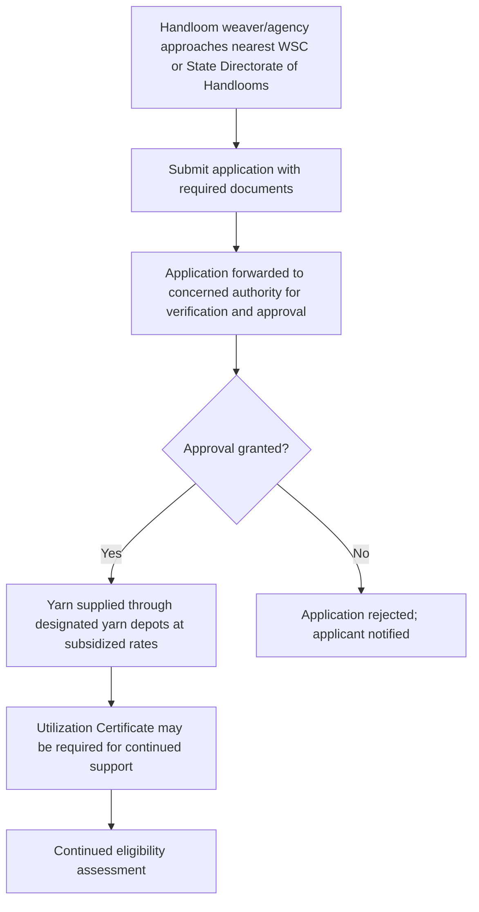

# Comprehensive Scheme Masterclass & File Guide

## Scheme Deep Dive

### Scheme Overview
**Scheme Name:** Yarn Supply Scheme for Handloom Weavers  
**Scheme ID:** row-178  
**Ministry / Category:** Textiles  
**Scheme Type:** Subsidy  
**Geographic Scope:** Pan-India  
**Implementing Agency:** Office of the Development Commissioner for Handlooms, Ministry of Textiles  
**Status / Deadlines:** Rolling basis  
**Last Updated:** 2024  
**Application Portal URL:** https://handlooms.nic.in  

### Objectives
- To provide easy access to raw material at subsidized prices  
- To reduce the input cost burden on handloom weavers  
- To ensure timely availability of yarn for uninterrupted production  
- To support the livelihood and sustainability of handloom weaving activities  
- To enhance the quality and competitiveness of handloom products through consistent raw material supply  

### Eligibility Matrix
| Eligible Entity | Description | Verification Required |
|-----------------|-------------|------------------------|
| Handloom weavers | Individual weavers engaged in handloom weaving | Valid handloom weaver's identity card or EPehchan registration |
| Handloom agencies | Entities where weavers are members (SHGs, JLGs, Cooperative Societies) | Recommendation by State Government and approval by Development Commissioner (Handlooms) |
| Self Help Groups (SHGs) | Voluntary associations of weavers for mutual assistance | Recommendation by State Government and approval by Development Commissioner (Handlooms) |
| Producer Companies | Legally registered producer companies of handloom weavers | Recommendation by State Government and approval by Development Commissioner (Handlooms) |
| Other eligible handloom entities | As recommended by State Government and approved by Development Commissioner (Handlooms) | Case-by-case verification |

> **Key Caveats:**  
> - Subsidy is subject to availability of funds and yarn stock  
> - Beneficiaries must possess valid handloom weaver's identity or EPehchan registration  
> - Supply is subject to verification and approval by the State Directorate or Weavers' Service Centre (WSC)  
> - Utilization Certificate (UC) may be required for continued support  

### Benefits & Financial Support
| Benefit Type | Description | Quantum / Rate | Mechanism |
|--------------|-------------|----------------|-----------|
| Transport Subsidy | Freight reimbursement for transportation of yarn (all types) | General States: 2.5% of yarn value NER & Hilly areas: 7.5% of yarn value | Reimbursement to depot operating agencies |
| Price Subsidy | Direct Benefit Transfer (DBT) to linked bank account | 15% on yarn (cotton hank, domestic silk, woollen, linen, blended natural fibre yarn) with quantitative restrictions | Credited directly to beneficiary's bank account |
| Depot Operating Charges | Support to yarn depot operating agencies | 2% of yarn value (General States) 2.25% of yarn value (NER & Hilly areas) | Paid to depot operating agencies |
| Service Charge to NHDC | Administrative charge for National Handloom Development Corporation | 10% of yarn value (Silk/Jute/Coir yarn) 2% of yarn value (Other than Silk/Jute/Coir yarn) | Paid to NHDC |
| Non-Financial Benefits | Assured supply of quality yarn | Through network of 511 yarn depots and 46 warehouses | Reduced drudgery in procuring raw materials, improved productivity and income |

**Physical and Financial Achievements (as on 31.03.2024):**  
- Total yarn supplied: **9139.88 lakh kg** under Transport Subsidy & Price Subsidy  
- Beneficiaries: **5.38 lakh handloom weavers**  
- Infrastructure: **511 yarn depots** and **46 warehouses** functioning across the country  

### Application Process

**Required Documents:**  
1. Application form  
2. Identity proof of the weaver/agency  
3. Address proof  
4. Bank account details  
5. Handloom weaver's identity card or EPehchan registration  
6. Details of yarn requirement  
7. Any other document as specified by the implementing agency  

**Contact Details:**  
- Email: wscguw@gmail.com (example from WSC Guwahati)  
- Helpline numbers available via Weavers' Service Centres  
- Central office: Dr. M. Beena, Development Commissioner (Handlooms), Udyog Bhawan, New Delhi  

### Yarn Supply Mechanism
- **Yarn Depots:** 511 functioning across the country  
- **Yarn Warehouses:** 46 functioning across the country (at least one per state with weaver presence)  
- **Supply Flow:** NHDC → Yarn Depots/Warehouses → Beneficiaries (via WSC/State Directorate verification)  
- **Subsidy Delivery:**  
  - Transport subsidy: Reimbursed to depot operating agencies  
  - Price subsidy: 15% via DBT to beneficiary's linked bank account  

> **Important Notes:**  
> - All yarn supplied under Price Subsidy component also receives Transport Subsidy  
> - Rates for freight reimbursement, depot operating charges, and service charges vary by yarn type and region (General States vs NER/Hilly areas)  
> - Scheme is implemented through National Handloom Development Corporation (NHDC), a Government of India Undertaking  

## Consultant's Field Guide to Generated Files

### 1. SCHEME_MASTER_DATABASE.md
**Real-time Usage:** Keep this open in a background tab during all client calls. When a client asks "What is the turnover limit?" or "Who administers this?", CTRL+F in this document to give an immediate, authoritative answer without checking the portal.

### 2. PITCH_AND_SALES_SCRIPTS.md
**Real-time Usage:** Open this file 5 minutes before your first Discovery Call with a lead. Read the "Problem Framing" out loud to hook them, then use the Qualification Checklist to interrogate their eligibility live on the phone. Keep the Objection Handlers table visible so you can immediately counter when they say "We're too small for this."

### 3. APPLICATION_PLAYBOOK.md
**Real-time Usage:** Print this out or pin it to your desktop once the client signs the retainer. Check off each box in "Stage 1" before moving to "Stage 2". Use the "Client Communication Template" to copy-paste directly into your email when chasing them for pending documents.

### 4. CLIENT_ONBOARDING_AND_CRM.md
**Real-time Usage:** Fill this out during or immediately after the onboarding call. Use the Needs Assessment to record their exact pain points. Update the "Compliance Status" table as they email you documents to maintain a single source of truth for what's missing.

### 5. LIVE_CASE_TRACKER.md
**Real-time Usage:** Review this document every morning during your standup. Update the "Stage" column daily. If a case hits "Stage 07 - Under review", use the Escalation Path notes here to know exactly who to call at the government department today.

### 6. FEE_AND_REVENUE_MODEL.md
**Real-time Usage:** Use this file when drafting the proposal. Look at the client's turnover, map them to the pricing tier in the table, and quote that exact Retainer and Success Fee. Use the monthly projection table to update your personal sales pipeline forecast for the quarter.

### 7. CLIENT_PROPOSAL_TEMPLATE.md
**Real-time Usage:** Copy this entire file, paste it into an email or PDF generator, replace the [PLACEHOLDER] tags with the client's actual details gathered from the CRM, and send it immediately after a successful discovery call.

### 8. COMPLIANCE_AND_LEGAL_PACK.md
**Real-time Usage:** Attach sections 8A and 8B as PDFs to the proposal email. Refuse to start Step 1 of the Application Playbook until the client signs these. Use the Disclaimers to protect yourself legally if the client is rejected by the government agency.