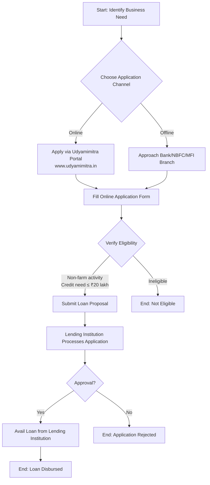

# Comprehensive Scheme Masterclass & File Guide

## Scheme Deep Dive

### Scheme Overview
The **MUDRA Loan for Weavers (Weaver MUDRA Scheme)** is a loan-type scheme under the **Pradhan Mantri Mudra Yojana (PMMY)**, implemented by the **Micro Units Development & Refinance Agency Ltd. (MUDRA)**. It operates on a **Pan-India** geographic scope with **rolling basis** application status and no fixed deadlines. The scheme was last updated in **2026**.

### Objectives
- To provide loans up to ₹20 lakh to non-corporate, non-farm small/micro enterprises  
- To fund the unfunded segment by extending credit through last-mile financiers  
- To support income-generating activities in manufacturing, processing, trading, services, and agri-allied sectors  
- To prioritize lending to SC/ST/OBC and women entrepreneurs  
- To create an inclusive, sustainable, and value-based entrepreneurial culture  
- To strengthen formal credit channels for micro enterprises at the grassroots level  
- To monitor PMMY implementation via a dedicated portal  
- To facilitate credit guarantees for loans granted under PMMY  

### Eligibility Matrix
| Criteria | Details |
|---------|---------|
| **Applicant Type** | Any Indian Citizen |
| **Business Plan Requirement** | Must have a business plan for a non-farm income generating activity such as manufacturing, processing, trading, service sector, or agri-allied activities (e.g., pisciculture, bee keeping, poultry farming) |
| **Credit Need Limit** | Up to ₹20 lakh |
| **Eligible Lending Institutions** | Commercial Banks, RRBs, Small Finance Banks, MFIs, NBFCs |
| **Application Channels** | Approach lending institutions directly or apply online via [www.udyamimitra.in](https://www.udyamimitra.in) |
| **Key Restrictions** | Loans only for non-farm income generating activities; no direct lending by MUDRA; no agents/middlemen engaged by MUDRA |
| **Target Beneficiaries** | Weavers; micro enterprises; small businesses; SC/ST; OBC; women entrepreneurs; non-corporate entities |

> **> Important Caveat:** MUDRA does not lend directly to micro entrepreneurs/individuals. Borrowers must approach Banks, NBFCs, or MFIs. Avoid persons posing as agents/facilitators of MUDRA/PMMY.

### Benefits & Financial Support
#### Loan Products Under PMMY
| Product | Loan Range | Purpose |
|--------|------------|---------|
| **Shishu** | Up to ₹50,000 | Early-stage micro units |
| **Kishor** | Above ₹50,000 and up to ₹5 lakh | Growth-stage enterprises |
| **Tarun** | Above ₹5 lakh and up to ₹10 lakh | Established micro units |
| **TarunPlus** | Above ₹10 lakh and up to ₹20 lakh | For entrepreneurs who have availed and successfully repaid previous loans under the 'Tarun' category |

#### Refinance Mechanism
- MUDRA is a **refinancing institution** and does not lend directly.
- Refinance is available for **term loan** and **working capital loan** up to **₹20 lakh per unit**.
- Eligible Banks/NBFCs/MFIs that comply with notified requirements can avail refinance from MUDRA for loans given under PMMY for eligible activities.

#### MUDRA Card
- A debit card issued against the MUDRA loan account for the working capital portion.
- Enables multiple drawals and credits to manage working capital efficiently and minimize interest burden.
- Helps in digitalization of transactions and creating credit history.
- Operable across India for cash withdrawal from any ATM/micro ATM and payments via Point of Sale (POS) machines.

#### Eligible Purposes for Loan Utilization
- Business loans for vendors, traders, shopkeepers, and service sector activities  
- Working capital loans via MUDRA Cards  
- Equipment finance for micro units  
- Transport vehicle loans (commercial use only)  
- Loans for agri-allied non-farm income-generating activities (pisciculture, bee keeping, poultry farming, etc.)  
- Tractors, tillers, and two-wheelers (commercial use only)  

### Application Process

#### Step-by-Step Process
1. Approach any lending institution (Commercial Banks, RRBs, Small Finance Banks, MFIs, NBFCs) **or** apply online via [www.udyamimitra.in](https://www.udyamimitra.in).  
2. File online application for MUDRA loans on the Udyamimitra portal.  
3. Ensure the loan proposal is for a **non-farm income generating activity** (manufacturing, processing, trading, service sector, or agri-allied).  
4. Ensure **credit need is up to ₹20 lakh**.  
5. Follow the usual terms and conditions of the lending agency.  
6. Avail the loan from the selected lending institution.  

### Key Statistics & Performance (FY 2022-23)
- **Total Disbursement under PMMY**: ₹4.50 lakh crore  
- **Total Loan Accounts Disbursed**: 6.23 crore  
- **Average Loan Size**: ₹72,286.85  
- **Women Beneficiaries**:  
  - 71.03% of loan accounts  
  - 47.74% of disbursed amount  
- **Weaker Sections (SC/ST/OBC)**:  
  - 50.48% of loan accounts  
  - 36.41% of disbursed amount  
- **New Entrepreneur Accounts**:  
  - 16.16% of loan accounts  
  - 28.73% of disbursed amount  
- **Mudra Card Issuance (FY 2022-23)**: 1.71 lakh cards for ₹4,402.61 crore  
- **Cumulative Mudra Cards in Use**: Over 20 lakh  

### Interest Rates & Charges
- Lending rates are as per **RBI guidelines** issued from time to time.  
- No subsidy under PMMY unless linked to a government scheme providing capital subsidy.  
- Interest caps for refinancing:  
  - Commercial Banks: Yield on 10-year G-Sec  
  - RRBs: 3.50% over MUDRA refinance rate  
  - NBFCs: 8% over MUDRA refinance rate  

### Sources
- Scheme Key Facts: MUDRA Loan for Weavers (Weaver MUDRA Scheme)  
- Supporting Evidence: mudra.org.in (Vision, Mission, Offerings, FAQ, Annual Reports 2019-20, 2022-23)  
- Application Portal: [www.udyamimitra.in](https://www.udyamimitra.in)  

---

## Consultant's Field Guide to Generated Files

### 1. SCHEME_MASTER_DATABASE.md
**Real-time Usage:** Keep this open in a background tab during all client calls. When a client asks "What is the turnover limit?" or "Who administers this?", CTRL+F in this document to give an immediate, authoritative answer without checking the portal.  
*Example Use Case:* During a call, a client asks, "What’s the maximum loan I can get under this scheme?" You search "₹20 lakh" in the file and respond instantly with the exact limit and product categories (Shishu, Kishor, Tarun, TarunPlus).

### 2. PITCH_AND_SALES_SCRIPTS.md
**Real-time Usage:** Open this file 5 minutes before your first Discovery Call with a lead. Read the "Problem Framing" out loud to hook them, then use the Qualification Checklist to interrogate their eligibility live on the phone. Keep the Objection Handlers table visible so you can immediately counter when they say "We're too small for this."  
*Example Use Case:* A lead says, "We’re just a home-based tailoring unit—too small for government loans." You flip to the Objection Handlers table and respond: "Actually, Shishu loans start at ₹500 and go up to ₹50,000—perfect for home-based units like yours. Over 69% of PMMY loans are Shishu-sized."

### 3. APPLICATION_PLAYBOOK.md
**Real-time Usage:** Print this out or pin it to your desktop once the client signs the retainer. Check off each box in "Stage 1" before moving to "Stage 2". Use the "Client Communication Template" to copy-paste directly into your email when chasing them for pending documents.  
*Example Use Case:* After signing a retainer, you check Stage 1: "Confirm client’s business is non-farm income generating." You verify their poultry farming plan, check it off, then email them using the template: "Hi [Name], as discussed, please send your business plan and ID proof by EOD so we can proceed to Stage 2."

### 4. CLIENT_ONBOARDING_AND_CRM.md
**Real-time Usage:** Fill this out during or immediately after the onboarding call. Use the Needs Assessment to record their exact pain points. Update the "Compliance Status" table as they email you documents to maintain a single source of truth for what's missing.  
*Example Use Case:* During onboarding, you note in Needs Assessment: "Client struggles with working capital for raw materials." When they send their Aadhaar later, you update Compliance Status: "ID Proof – Received ✅". Next day, you see "Business Plan – Missing ❌" and call them to follow up.

### 5. LIVE_CASE_TRACKER.md
**Real-time Usage:** Review this document every morning during your standup. Update the "Stage" column daily. If a case hits "Stage 07 - Under review", use the Escalation Path notes here to know exactly who to call at the government department today.  
*Example Use Case:* At 9 AM standup, you see Case #452 is at "Stage 07 - Under review". You check the Escalation Path: "Call DFS Nodal Officer at 011-2309XXXX". You call immediately to check status and avoid delays.

### 6. FEE_AND_REVENUE_MODEL.md
**Real-time Usage:** Use this file when drafting the proposal. Look at the client's turnover, map them to the pricing tier in the table, and quote that exact Retainer and Success Fee. Use the monthly projection table to update your personal sales pipeline forecast for the quarter.  
*Example Use Case:* A client has ₹8 lakh turnover. You see they fall in Tier 2 (₹5–10 lakh turnover), quote Retainer: ₹75,000 + Success Fee: 12%. You then update your pipeline forecast: "Add ₹75k to Q3 revenue."

### 7. CLIENT_PROPOSAL_TEMPLATE.md
**Real-time Usage:** Copy this entire file, paste it into an email or PDF generator, replace the [PLACEHOLDER] tags with the client's actual details gathered from the CRM, and send it immediately after a successful discovery call.  
*Example Use Case:* After a discovery call confirming eligibility, you open the template, replace [CLIENT_NAME], [TURNOVER], [LOAN_AMOUNT_NEEDED], and send: "Proposal for MUDRA Loan Assistance – [Client Name]" within 10 minutes.

### 8. COMPLIANCE_AND_LEGAL_PACK.md
**Real-time Usage:** Attach sections 8A and 8B as PDFs to the proposal email. Refuse to start Step 1 of the Application Playbook until the client signs these. Use the Disclaimers to protect yourself legally if the client is rejected by the government agency.  
*Example Use Case:* You attach the signed NDA and liability waiver to the proposal email. You tell the client: "I cannot begin document collection until these are signed—this protects both of us if the bank raises compliance issues later." If rejected, you refer to the disclaimer: "Our fee is for application support only; approval rests with the lending institution."