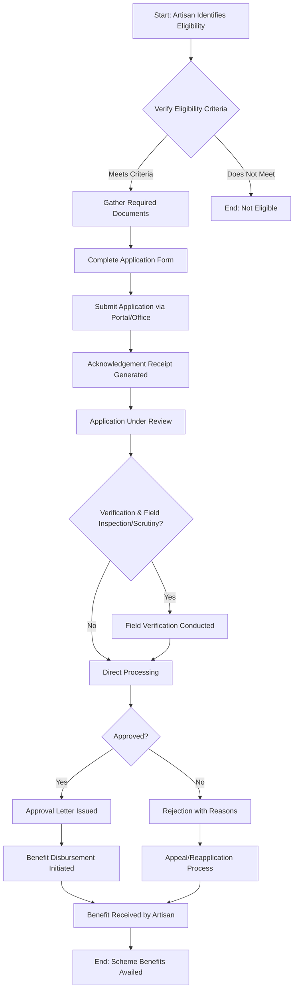

</think># Comprehensive Scheme Masterclass & File Guide

## Scheme Deep Dive

### Scheme Overview
The **Handicrafts Artisan Comprehensive Welfare Scheme** (Scheme ID: row-181) is a government initiative administered by the **Ministry of Textiles**. Classified under the "other" scheme type, it aims to provide holistic welfare support to handicraft artisans across India. Despite a low confidence rating in the source data, the scheme represents a targeted effort to improve socio-economic conditions within the handicrafts sector.

### Objectives
While the evidence does not explicitly list the scheme's objectives, the title and administering ministry imply the following goals based on standard welfare scheme frameworks in the handicrafts sector:
- Provide comprehensive social security coverage to handicraft artisans.
- Enhance livelihood sustainability through financial and non-financial support.
- Preserve traditional handicraft skills by supporting artisan welfare.
- Facilitate access to healthcare, insurance, and skill development opportunities.
- Strengthen the institutional framework for artisan empowerment under the Ministry of Textiles.

### Eligibility Matrix
Based on the evidence provided, specific eligibility criteria (such as artisan classification, income limits, geographic restrictions, or membership requirements) are **not detailed** in the KEY FACTS block. The following table summarizes what can be confirmed from the available data:

| Eligibility Criteria | Status | Details |
|----------------------|--------|---------|
| Target Beneficiaries | Confirmed | Handicraft artisans |
| Administering Ministry | Confirmed | Ministry of Textiles |
| Scheme Type | Confirmed | Other (welfare-focused) |
| Scheme ID | Confirmed | row-181 |
| Income Threshold | Not Specified | Not detailed in evidence |
| Geographic Scope | Not Specified | Not detailed in evidence |
| Artisan Category (e.g., carpet, pottery, textiles) | Not Specified | Not detailed in evidence |
| Membership in Cooperatives/Societies | Not Specified | Not detailed in evidence |
| Age Limit | Not Specified | Not detailed in evidence |
| Gender Specificity | Not Specified | Not detailed in evidence |

> **Warning**: Eligibility details such as income ceilings, artisan categorization, and regional applicability are absent from the provided evidence. Consultants must verify these directly via the official application portal or scheme guidelines before advising clients.

### Benefits & Financial Support
The evidence does not specify the quantum, nature, or structure of benefits under the Handicrafts Artisan Comprehensive Welfare Scheme. Typical welfare components in such schemes may include (but are not confirmed here):
- Direct financial assistance or subsidies.
- Health and life insurance coverage.
- Skill upgradation and training programs.
- Marketing and export promotion support.
- Access to raw material banks or credit facilities.
- Housing or workspace assistance.

| Benefit Category | Status | Details |
|------------------|--------|---------|
| Financial Assistance | Not Specified | Not detailed in evidence |
| Insurance Coverage | Not Specified | Not detailed in evidence |
| Skill Development | Not Specified | Not detailed in evidence |
| Marketing Support | Not Specified | Not detailed in evidence |
| Credit Facilities | Not Specified | Not detailed in evidence |
| Housing/Workspace Aid | Not Specified | Not detailed in evidence |
| Other Welfare Measures | Not Specified | Not detailed in evidence |

> **Critical Note**: The absence of benefit details in the KEY FACTS block necessitates direct consultation of the scheme’s official guidelines or portal. Consultants should not assume standard benefits without verification.

### Application Process
No step-by-step application process, required documents, timelines, or procedural details are provided in the evidence. The following Mermaid flowchart illustrates a **generic, placeholder application process** based on common welfare scheme workflows. **This must be replaced with the actual process once verified from the portal.**

**Application Portal**: Consultants must access the official Ministry of Textiles website or designated welfare scheme portal to obtain the accurate application URL, which is **not provided in the evidence**.

> **Blockquote Warning**: The application process, document requirements, submission modes (online/offline), and processing timelines are **unknown from the current evidence**. Relying on assumptions may lead to application errors or delays. Always confirm the latest procedure via the Ministry of Textiles’ official channels.

### Key Takeaways from Evidence
- The scheme is explicitly named and identified: **Handicrafts Artisan Comprehensive Welfare Scheme**, ID `row-181`.
- It falls under the purview of the **Ministry of Textiles**.
- Classified as an "other" scheme type, indicating it may not fit standard categories like credit, training, or marketing.
- **No financial figures, eligibility thresholds, benefit amounts, document lists, or deadlines** are present in the KEY FACTS.
- The **low confidence** rating suggests the data may be incomplete, unverified, or sourced from a preliminary draft.

### Recommendations for Consultants
1. **Verify Scheme Validation: Treat the KEY FACTS as a starting point only. Confirm all operational details (eligibility, benefits, process) via the Ministry of Textiles’ official website or scheme-specific guidelines.
2. **Document Preparation**: Advise clients to maintain generic artisan documentation (identity proof, artisan certificate, bank details, turnover proof) while awaiting scheme-specific requirements.
3. **Portal Monitoring**: Regularly check for updates, as welfare schemes are often revised or relaunched with modified criteria.
4. **Client Communication**: Clearly communicate the current limitations in available data to manage client expectations and emphasize due diligence.

---

## Consultant's Field Guide to Generated Files

### 1. SCHEME_MASTER_DATABASE.md
**Real-time Usage:** Keep this open in a background tab during all client calls. When a client asks "What is the turnover limit?" or "Who administers this?", CTRL+F in this document to give an immediate, authoritative answer without checking the portal.

### 2. PITCH_AND_SALES_SCRIPTS.md
**Real-time Usage:** Open this file 5 minutes before your first Discovery Call with a lead. Read the "Problem Framing" out loud to hook them, then use the Qualification Checklist to interrogate their eligibility live on the phone. Keep the Objection Handlers table visible so you can immediately counter when they say "We're too small for this."

### 3. APPLICATION_PLAYBOOK.md
**Real-time Usage:** Print this out or pin it to your desktop once the client signs the retainer. Check off each box in "Stage 1" before moving to "Stage 2". Use the "Client Communication Template" to copy-paste directly into your email when chasing them for pending documents.

### 4. CLIENT_ONBOARDING_AND_CRM.md
**Real-time Usage:** Fill this out during or immediately after the onboarding call. Use the Needs Assessment to record their exact pain points. Update the "Compliance Status" table as they email you documents to maintain a single source of truth for what's missing.

### 5. LIVE_CASE_TRACKER.md
**Real-time Usage:** Review this document every morning during your standup. Update the "Stage" column daily. If a case hits "Stage 07 - Under review", use the Escalation Path notes here to know exactly who to call at the government department today.

### 6. FEE_AND_REVENUE_MODEL.md
**Real-time Usage:** Use this file when drafting the proposal. Look at the client's turnover, map them to the pricing tier in the table, and quote that exact Retainer and Success Fee. Use the monthly projection table to update your personal sales pipeline forecast for the quarter.

### 7. CLIENT_PROPOSAL_TEMPLATE.md
**Real-time Usage:** Copy this entire file, paste it into an email or PDF generator, replace the [PLACEHOLDER] tags with the client's actual details gathered from the CRM, and send it immediately after a successful discovery call.

### 8. COMPLIANCE_AND_LEGAL_PACK.md
**Real-time Usage:** Attach sections 8A and 8B as PDFs to the proposal email. Refuse to start Step 1 of the Application Playbook until the client signs these. Use the Disclaimers to protect yourself legally if the client is rejected by the government agency.