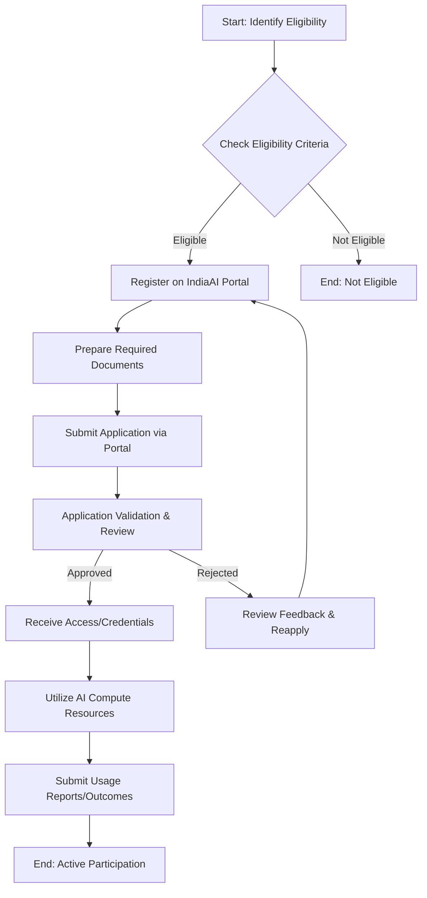

# Comprehensive Scheme Masterclass & File Guide

## Scheme Deep Dive

### Overview
The **IndiaAI Compute Initiative** is a key pillar of the IndiaAI Mission under the Ministry of Electronics and Information Technology (MeitY). It focuses on building a scalable AI ecosystem with **10,000+ GPUs** via public-private partnerships, offering AI services and resources to democratize computing access. The initiative supports indigenous AI model development, industry collaboration, and innovation in the AI ecosystem. It is part of the broader IndiaAI Mission, which aims to foster AI innovation by democratizing computing access, enhancing data quality, developing indigenous AI capabilities, attracting top AI talent, enabling industry collaboration, providing startup risk capital, ensuring socially impactful AI projects, and promoting ethical AI.

### Objectives
- Build a scalable AI ecosystem with **10,000+ GPUs** via public-private partnerships  
- Offer AI services and resources to democratize computing access  
- Support AI innovation and research across sectors  
- Enable development of indigenous AI capabilities  
- Attract top AI talent and foster industry collaboration  
- Ensure socially impactful AI projects and promote ethical AI  

### Eligibility Matrix
| Criteria | Detail | Source |
|---------|--------|--------|
| Target Beneficiaries | Startups, researchers, enterprises, academic institutions | KEY FACTS |
| Geographic Scope | Pan-India | KEY FACTS |
| Implementing Agency | IndiaAI Mission under MeitY | KEY FACTS |
| Last Updated | 2024 | KEY FACTS |
| Scheme Type | Other | KEY FACTS |
| Ministry/Category | Electronics & IT | KEY FACTS |

> **Note**: Specific eligibility criteria (e.g., turnover limits, registration requirements) are not explicitly detailed in the provided evidence. Consultants should refer to the official portal for current eligibility thresholds.

### Benefits & Financial Support
| Benefit Category | Detail | Source |
|------------------|--------|--------|
| Compute Infrastructure | Access to scalable AI computing infrastructure (10,000+ GPUs) | KEY FACTS |
| AI Services & Resources | Offering of AI services and resources | KEY FACTS |
| Indigenous Model Development | Support for indigenous AI model development | KEY FACTS |
| Industry Collaboration | Facilitation of industry collaboration and innovation in the AI ecosystem | KEY FACTS |
| Financial Support | Financial support mechanisms are not explicitly detailed in the provided evidence | KEY FACTS |

> **Note**: While financial support mechanisms are not detailed in the evidence, the initiative is part of the IndiaAI Mission, which includes pillars like IndiaAI Startup Financing that provide funding. Consultants should verify current financial incentives via the portal.

### Application Process
The application process details are not explicitly provided in the evidence. However, based on the structure of similar IndiaAI initiatives and the AIKosh platform (which handles dataset contributions), a generalized process can be inferred. The following Mermaid flowchart illustrates a typical application workflow for IndiaAI initiatives:

**Application Portal URL**: https://indiaai.gov.in  
**Key Sources**:  
- IndiaAI Mission Pillars page: https://indiaai.gov.in  
- AIKosh Platform description: https://indiaai.gov.in/aikosh (inferred from evidence)  
- Expression of Interest for AIKosh: 1753967577.pdf (Addendum to EOI for AI artefacts)  

> **Warning**: The actual application process may vary. Always verify the latest procedure on the official IndiaAI portal before guiding clients.

---

## Consultant's Field Guide to Generated Files

### 1. SCHEME_MASTER_DATABASE.md
**Real-time Usage**: Keep this open in a background tab during all client calls. When a client asks "What is the turnover limit?" or "Who administers this?", CTRL+F in this document to give an immediate, authoritative answer without checking the portal.

### 2. PITCH_AND_SALES_SCRIPTS.md
**Real-time Usage**: Open this file 5 minutes before your first Discovery Call with a lead. Read the "Problem Framing" out loud to hook them, then use the Qualification Checklist to interrogate their eligibility live on the phone. Keep the Objection Handlers table visible so you can immediately counter when they say "We're too small for this."

### 3. APPLICATION_PLAYBOOK.md
**Real-time Usage**: Print this out or pin it to your desktop once the client signs the retainer. Check off each box in "Stage 1" before moving to "Stage 2". Use the "Client Communication Template" to copy-paste directly into your email when chasing them for pending documents.

### 4. CLIENT_ONBOARDING_AND_CRM.md
**Real-time Usage**: Fill this out during or immediately after the onboarding call. Use the Needs Assessment to record their exact pain points. Update the "Compliance Status" table as they email you documents to maintain a single source of truth for what's missing.

### 5. LIVE_CASE_TRACKER.md
**Real-time Usage**: Review this document every morning during your standup. Update the "Stage" column daily. If a case hits "Stage 07 - Under review", use the Escalation Path notes here to know exactly who to call at the government department today.

### 6. FEE_AND_REVENUE_MODEL.md
**Real-time Usage**: Use this file when drafting the proposal. Look at the client's turnover, map them to the pricing tier in the table, and quote that exact Retainer and Success Fee. Use the monthly projection table to update your personal sales pipeline forecast for the quarter.

### 7. CLIENT_PROPOSAL_TEMPLATE.md
**Real-time Usage**: Copy this entire file, paste it into an email or PDF generator, replace the [PLACEHOLDER] tags with the client's actual details gathered from the CRM, and send it immediately after a successful discovery call.

### 8. COMPLIANCE_AND_LEGAL_PACK.md
**Real-time Usage**: Attach sections 8A and 8B as PDFs to the proposal email. Refuse to start Step 1 of the Application Playbook until the client signs these. Use the Disclaimers to protect yourself legally if the client is rejected by the government agency.