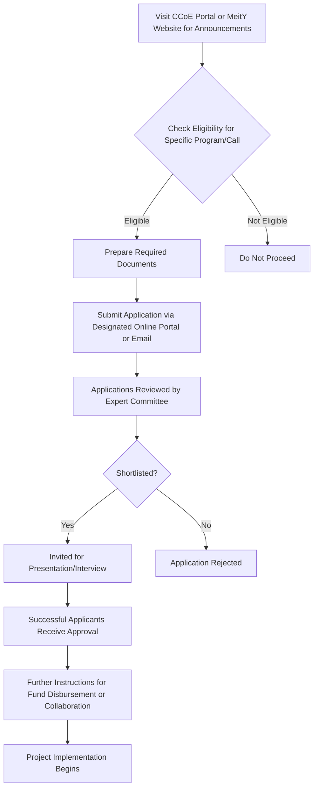

# Comprehensive Scheme Masterclass & File Guide

## Scheme Deep Dive

### Overview
The **Cyber Security Centre of Excellence (CCoE)** is a pan-India initiative implemented by the **Ministry of Electronics and Information Technology (MeitY)** under the Electronics & IT category. It operates as an incubation-type scheme with rolling basis applications, though specific calls for proposals may have defined deadlines announced periodically. The scheme was last updated in 2026 and remains active. The official application portal is [https://www.meity.gov.in/ccoe](https://www.meity.gov.in/ccoe), and general inquiries can be directed to **ceo-dibd@digitalindia.gov.in**.

### Objectives
The CCoE aims to:
- Develop indigenous cybersecurity technologies and solutions  
- Enhance capacity building and skill development in cybersecurity  
- Foster collaboration between government, industry, and academia  
- Support innovation and entrepreneurship in the cybersecurity domain  
- Strengthen protection of critical information infrastructure  
- Promote research and development in emerging cybersecurity threats  
- Create a robust ecosystem for cybersecurity startups and SMEs  
- Establish standards and best practices for cybersecurity implementation  

### Eligibility Matrix
| **Beneficiary Type**       | **Registration Requirement** | **Domain Requirement**                     | **Additional Criteria**                                                                 |
|----------------------------|------------------------------|--------------------------------------------|---------------------------------------------------------------------------------------|
| Indian Startups            | Registered in India          | Cybersecurity innovation, research, or solution development | Must demonstrate capability or potential in cybersecurity                              |
| MSMEs                      | Registered in India          | Cybersecurity innovation, research, or solution development | Must demonstrate capability or potential in cybersecurity                              |
| Academic Institutions      | Registered in India          | Cybersecurity innovation, research, or solution development | Must demonstrate capability or potential in cybersecurity                              |
| Research Organizations     | Registered in India          | Cybersecurity innovation, research, or solution development | Must demonstrate capability or potential in cybersecurity                              |

> **Note**: Specific eligibility may vary based on the nature of engagement (e.g., incubation, collaboration, or funding support). Entities must be registered in India and demonstrate capability or potential in cybersecurity innovation, research, or solution development.

### Benefits & Financial Support
Financial support is provided through **grants, seed funding, or subsidies** for prototype development, proof-of-concept, and scaling of cybersecurity innovations. The exact quantum and mechanism depend on the specific program or call for proposals under CCoE, with support typically disbursed in milestones based on project progress.

| **Support Type**         | **Description**                                                                 | **Disbursement Mechanism**       |
|--------------------------|---------------------------------------------------------------------------------|----------------------------------|
| Grants                   | Non-repayable funding for eligible project activities                           | Milestone-based                  |
| Seed Funding             | Early-stage funding for prototype and PoC development                           | Milestone-based                  |
| Subsidies                | Cost reduction support for scaling innovations                                  | Milestone-based                  |

**Key Benefits Include**:
- Access to cybersecurity infrastructure  
- Mentorship from experts  
- Funding support for prototype development  
- Opportunities for technology transfer  
- Collaboration with government and defense sectors  
- Participation in cybersecurity drills and exercises  
- Access to testing and certification facilities  
- Guidance on regulatory compliance and standards  

### Required Documents
Applicants must submit the following documents:
1. Project proposal detailing objectives, methodology, and expected outcomes  
2. Certificate of Incorporation or Registration of the entity  
3. PAN and GST details of the applicant  
4. Technical specifications or proof of concept (if applicable)  
5. Bank account details for financial transactions  
6. Authorized signatory letter  
7. Details of existing funding or partnerships (if any)  

### Application Process
The application process is structured as follows:

> **Source**: Application process details extracted from the Scheme Key Facts block under "Application Process".

### Key Caveats
- Financial support is subject to availability of funds and approval by the competent authority  
- Intellectual property rights arising from CCoE-supported projects may be governed by specific agreements  
- Beneficiaries must comply with reporting, monitoring, and evaluation requirements  
- Support may be discontinued if milestones are not met or if the project deviates from approved objectives  
- Participation does not guarantee future procurement or deployment by government agencies  

### Contact Information
- **Application Portal**: [https://www.meity.gov.in/ccoe](https://www.meity.gov.in/ccoe)  
- **General Inquiry Email**: ceo-dibd@digitalindia.gov.in  
- **Last Updated**: 2026  
- **Status**: Active (Rolling basis with periodic call-specific deadlines)  

---

## Consultant's Field Guide to Generated Files

### 1. SCHEME_MASTER_DATABASE.md
**Real-time Usage**: Keep this open in a background tab during all client calls. When a client asks "What is the turnover limit?" or "Who administers this?", CTRL+F in this document to give an immediate, authoritative answer without checking the portal.

### 2. PITCH_AND_SALES_SCRIPTS.md
**Real-time Usage**: Open this file 5 minutes before your first Discovery Call with a lead. Read the "Problem Framing" out loud to hook them, then use the Qualification Checklist to interrogate their eligibility live on the phone. Keep the Objection Handlers table visible so you can immediately counter when they say "We're too small for this."

### 3. APPLICATION_PLAYBOOK.md
**Real-time Usage**: Print this out or pin it to your desktop once the client signs the retainer. Check off each box in "Stage 1" before moving to "Stage 2". Use the "Client Communication Template" to copy-paste directly into your email when chasing them for pending documents.

### 4. CLIENT_ONBOARDING_AND_CRM.md
**Real-time Usage**: Fill this out during or immediately after the onboarding call. Use the Needs Assessment to record their exact pain points. Update the "Compliance Status" table as they email you documents to maintain a single source of truth for what's missing.

### 5. LIVE_CASE_TRACKER.md
**Real-time Usage**: Review this document every morning during your standup. Update the "Stage" column daily. If a case hits "Stage 07 - Under review", use the Escalation Path notes here to know exactly who to call at the government department today.

### 6. FEE_AND_REVENUE_MODEL.md
**Real-time Usage**: Use this file when drafting the proposal. Look at the client's turnover, map them to the pricing tier in the table, and quote that exact Retainer and Success Fee. Use the monthly projection table to update your personal sales pipeline forecast for the quarter.

### 7. CLIENT_PROPOSAL_TEMPLATE.md
**Real-time Usage**: Copy this entire file, paste it into an email or PDF generator, replace the [PLACEHOLDER] tags with the client's actual details gathered from the CRM, and send it immediately after a successful discovery call.

### 8. COMPLIANCE_AND_LEGAL_PACK.md
**Real-time Usage**: Attach sections 8A and 8B as PDFs to the proposal email. Refuse to start Step 1 of the Application Playbook until the client signs these. Use the Disclaimers to protect yourself legally if the client is rejected by the government agency.