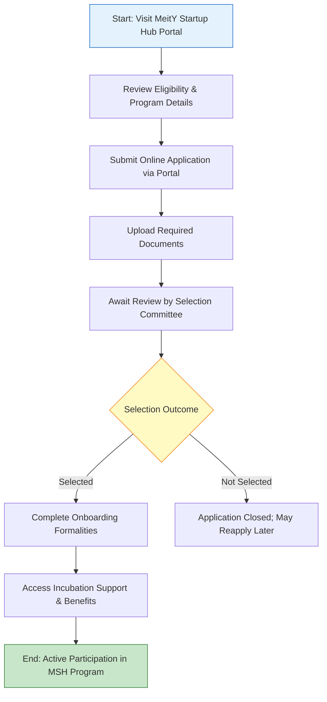

</think># Comprehensive Scheme Masterclass & File Guide

## Scheme Deep Dive

### Overview
The **MeitY Startup Hub (MSH)** is a pan-India incubation initiative launched by the **Ministry of Electronics and Information Technology (MeitY of Electronics and Information Technology (MeitY)** to nurture early-stage technology startups. It operates on a **rolling basis**, accepting applications throughout the year via its official portal: [https://msh.meity.gov.in](https://msh.meity.gov.in). The scheme focuses on fostering innovation in emerging technologies such as AI, IoT, blockchain, and electronics, with the overarching goal of strengthening India’s electronics and IT startup ecosystem.

### Objectives
- To provide incubation support to early-stage technology startups  
- To facilitate access to funding, mentorship, and infrastructure  
- To promote innovation in emerging technologies like AI, IoT, and blockchain  
- To create market linkages and industry connect for startups  
- To strengthen the electronics and IT startup ecosystem in India  

### Eligibility Matrix
| Criteria | Requirement | Source |
|--------|-------------|--------|
| **Entity Type** | Technology-based startups incorporated in India | Key Facts |
| **Sector Focus** | Electronics, IT, AI, IoT, blockchain, and other emerging technologies | Key Facts |
| **Innovation Focus** | Must demonstrate innovation and scalability | Key Facts |
| **Geographic Scope** | Pan-India (no regional restrictions) | Key Facts |
| **Stage of Startup** | Early-stage (incubation-focused) | Key Facts, Objectives |

> **Note**: While no explicit turnover or funding limits are stated, the scheme targets early-stage startups, implying pre-revenue or low-revenue ventures or those in early traction phases are preferred.

### Benefits & Financial Support
| Benefit Category | Specific Support Provided | Source |
|------------------|----------------------------|--------|
| **Infrastructure** | Access to incubation facilities | Key Facts |
| **Mentorship** | Mentorship from industry experts | Key Facts |
| **Networking** | Networking opportunities, investor connect | Key Facts |
| **Technical Support** | Prototype development support, testing and certification support | Key Facts |
| **Compliance Guidance** | Guidance on regulatory compliance | Key Facts |
| **Funding Access** | Support in accessing government grants, seed funding, VC, and angel investors *(Note: No direct quantum specified)* | Key Facts |

> **Important Caveat**:  
> > Financial support is **indirect** — MSH does not provide direct grants or seed funding but facilitates access to external funding sources. Final selection and support levels are determined by the MeitY Startup Hub Selection Committee based on evaluation of innovation, scalability, and team strength.

### Required Documents
| Document | Purpose | Source |
|--------|---------|--------|
| Certificate of Incorporation | Legal proof of entity registration | Key Facts |
| Business plan or project proposal | Outline of vision, technology, market, and roadmap | Key Facts |
| Details of technology or innovation focus | Core innovation description (e.g., AI model, IoT device) | Key Facts |
| PAN of the entity | Tax identification for compliance | Key Facts |
| Authorization letter from authorized signatory | Legal authority to apply and commit | Key Facts |
| Details of any existing funding or support received | To avoid duplication and assess current stage | Key Facts |

### Application Process (Mermaid Flowchart)

**Application Portal**: [https://msh.meity.gov.in](https://msh.meity.gov.in)  
**Status**: Rolling basis — no fixed deadlines; applications accepted year-round  
**Review Timeline**: Not specified in evidence; dependent on committee cycles  
**Post-Selection**: Onboarding required to unlock benefits; support subject to periodic performance review  

### Key Caveats & Warnings
> - Support is **primarily focused on technology and innovation-driven startups**; non-tech or low-innovation ventures are unlikely to qualify.  
> - Final selection is **solely based on evaluation by the MeitY Startup Hub Selection Committee**; meeting eligibility does not guarantee acceptance.  
> - Incubation support may be **subject to periodic review and performance assessment**; underperformance could lead to withdrawal of benefits.  
> - **No direct financial aid** is provided; startups must leverage MSH’s network to secure funding independently.  
> - The portal experience and document requirements may evolve; always verify latest updates on [https://msh.meity.gov.in](https://msh.meity.gov.in).

---

## Consultant's Field Guide to Generated Files

### 1. SCHEME_MASTER_DATABASE.md
**Real-time Usage**: Keep this open in a background tab during all client calls. When a client asks "What is the turnover limit?" or "Who administers this?", CTRL+F in this document to give an immediate, authoritative answer without checking the portal.  
**Pro Tip**: Use search terms like “Implementing Agency”, “Eligibility”, or “Financial Support” to instantly retrieve verified scheme details during live consultations.

### 2. PITCH_AND_SALES_SCRIPTS.md
**Real-time Usage**: Open this file 5 minutes before your first Discovery Call with a lead. Read the "Problem Framing" out loud to hook them, then use the Qualification Checklist to interrogate their eligibility live on the phone. Keep the Objection Handlers table visible so you can immediately counter when they say "We're too small for this."  
**Example Script**:  
> *“Many early-stage tech founders struggle to access credible mentorship and lab infrastructure without giving up equity — MSH solves that by offering MeitY-backed incubation with zero dilution.”*  
Then run through the checklist: “Are you incorporated in India? Working in AI, IoT, or electronics? Have a prototype or MVP in mind?”  

### 3. APPLICATION_PLAYBOOK.md
**Real-time Usage**: Print this out or pin it to your desktop once the client signs the retainer. Check off each box in "Stage 1" before moving to "Stage 2". Use the "Client Communication Template" to copy-paste directly into your email when chasing them for pending documents.  
**Stage 1 Example**:  
- [ ] Confirm incorporation in India  
- [ ] Validate tech focus (AI/IoT/blockchain/etc.)  
- [ ] Collect Certificate of Incorporation  
- [ ] Draft business plan outline  
- [ ] Obtain PAN and authorization letter  
Use the template:  
> *“Hi [Name], just a friendly reminder to send over your PAN card and authorization letter so we can finalize your MSH application. Let me know if you need a template for the authorization letter!”*

### 4. CLIENT_ONBOARDING_AND_CRM.md
**Real-time Usage**: Fill this out during or immediately after the onboarding call. Use the Needs Assessment to record their exact pain points. Update the "Compliance Status" table as they email you documents to maintain a single source of truth for what's missing.  
**Needs Assessment Fields**:  
- Primary tech challenge (e.g., “Need PCB prototyping support”)  
- Funding gap (e.g., “Seeking ₹50L seed round”)  
- Mentorship need (e.g., “Regulatory guidance for medical device”)  
**Compliance Status Table**:  
| Document | Status | Received Date | Follow-up Needed |  
|---------|--------|---------------|------------------|  
| Incorporation Certificate | ✅ Received | 2024-06-01 | No |  
| Business Plan | ⏳ Pending | — | Yes – Send reminder |  

### 5. LIVE_CASE_TRACKER.md
**Real-time Usage**: Review this document every morning during your standup. Update the "Stage" column daily. If a case hits "Stage 07 - Under review", use the Escalation Path notes here to know exactly who to call at the government department today.  
**Stage Definitions**:  
- Stage 01: Lead Engaged  
- Stage 02: Documents Collected  
- Stage 03: Application Submitted  
- Stage 04: Under Initial Review  
- Stage 05: Additional Info Requested  
- Stage 06: Interview Scheduled  
- **Stage 07: Under Review (Selection Committee)** ← *Critical Stage*  
- Stage 08: Selected / Onboarding  
- Stage 09: Active in Program  
- Stage 10: Closed / Withdrawn  
**Escalation Path for Stage 07**:  
> If no update in 10+ business days, contact MSH Helpdesk via portal portal ticket or email msh@meity.gov.in with subject: “Esquiry: Application ID [XXXX] – Pending Review Beyond SLA”. Do not call unless escalation is approved.

### 6. FEE_AND_REVENUE_MODEL.md
**Real-time Usage**: Use this file when drafting the proposal. Look at the client's turnover, map them to the pricing tier in the table, and quote that exact Retainer and Success Fee. Use the monthly projection table to update your personal sales pipeline forecast for the quarter.  
**Pricing Tier Table (Consultant-Facing)**:  
| Client Turnover (Annual) | Retainer Fee | Success Fee (Upon Selection) | Notes |  
|--------------------------|--------------|-------------------------------|-------|  
| < ₹50 Lakhs | ₹15,000 | ₹25,000 | Early-stage focus; most MSH clients |  
| ₹50L – ₹2 Cr | ₹25,000 | ₹40,000 | Post-MVP, seeking scale-up support |  
| > ₹2 Cr | ₹40,000 | ₹60,000 | Rare for MSH; flag for alternative schemes |  
> **Note**: Success fee only payable upon formal selection into MSH incubation program.  
**Monthly Projection Example**:  
| Month | Expected Leads | Conversion Rate | Closed Cases | Revenue Forecast |  
|-------|----------------|------------------|--------------|------------------|  
| Jun 2024 | 12 | 25% | 3 | ₹1,05,000 |  
| Jul 2024 | 15 | 30% | 4.5 | ₹1,57,500 |  

### 7. CLIENT_PROPOSAL_TEMPLATE.md
**Real-time Usage**: Copy this entire file, paste it into an email or PDF generator, replace the [PLACEHOLDER] tags with the client's actual details gathered from the CRM, and send it immediately after a successful discovery call.  
**Key Placeholders to Replace**:  
- `[CLIENT_NAME]`  
- `[STARTUP_NAME]`  
- `[TECH_FOCUS]` (e.g., “AI-based predictive maintenance for industrial IoT”)  
- `[INCORPORATION_DATE]`  
- `[FOUNDER_NAMES]`  
- `[PROBLEM_STATEMENT]`  
- `[PROPOSED_SUPPORT_NEEDED]` (e.g., “Prototype lab access, investor connect”)  
- `[RETAINER_FEE]`  
- `[SUCCESS_FEE]`  
**Post-Send Action**: Attach `COMPLIANCE_AND_LEGAL_PACK.md` (as PDF) and set a follow-up task for 48 hours later.

### 8. COMPLIANCE_AND_LEGAL_PACK.md
**Real-time Usage**: Attach sections 8A and 8B as PDFs to the proposal email. Refuse to start Step 1 of the Application Playbook until the client signs these. Use the Disclaimers to protect yourself legally if the client is rejected by the government agency.  
**Section 8A: Client Engagement Agreement (Excerpt)**  
> *“The Consultant shall provide advisory services related to the MeitY Startup Hub application process. Success fee is contingent upon formal selection into the incubation program and payable within 15 days of notification.”*  
**Section 8B: Disclaimer & Liability Waiver**  
> *“The Consultant does not guarantee selection into MeitY Startup Hub. Final decisions are made solely by the MeitY Startup Hub Selection Committee. The Consultant is not liable for delays, rejections, or changes in scheme guidelines beyond their control.”*  
**Critical Instruction**:  
> Do NOT proceed with document collection or application drafting until signed copies of both 8A and 8B are received. Store signed copies in the client’s CRM folder under `Legal/Signed_Agreements/`.

---  
*All scheme-specific data sourced from official MeitY Startup Hub portal: [https://msh.meity.gov.in](https://msh.meity.gov.in)*  
*Last verified: Based on crawled evidence as of scheme ID row-184*