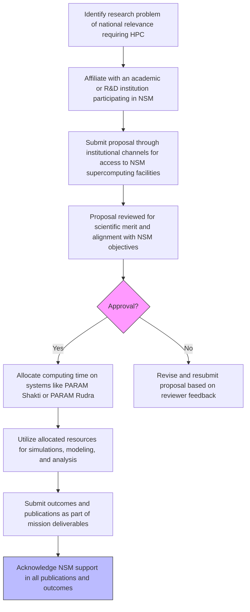

# Comprehensive Scheme Masterclass & File Guide

## Scheme Deep Dive

### Overview
The **National Supercomputing Mission (NSM)** is a flagship initiative of the Government of India aimed at achieving self-reliance in supercomputing technology and building a national infrastructure of high-performance computing (HPC) systems distributed across the country. Implemented jointly by the **Department of Science and Technology (DST)** and the **Ministry of Electronics and Information Technology (MeitY)**, the mission operates with a total outlay of **Rs. 4500 crore** over a seven-year period. The scheme is currently active with a **rolling basis** for proposal submissions, meaning applications are accepted throughout the year based on availability and review cycles.

### Objectives
The NSM seeks to accomplish the following strategic goals:
- Achieve self-reliance in supercomputing technology  
- Build a national infrastructure of supercomputing systems distributed across India  
- Integrate supercomputing facilities through the **National Knowledge Network (NKN)**  
- Develop highly professional HPC-aware human resources  
- Enable solving multi-disciplinary grand challenge problems  
- Support R&D and problem-solving in scientific and technological domains  
- Position India's supercomputing ecosystem at a globally competitive level  
- Promote indigenous development of HPC systems and software  

### Eligibility Matrix
Access to NSM facilities is restricted to specific beneficiary categories engaged in research of national relevance. The following table outlines eligibility criteria based on the evidence:

| **Eligible Entity** | **Criteria** | **Access Mechanism** | **Notes** |
|---------------------|------------|----------------------|---------|
| Academic Institutions | Must be affiliated with NSM-participating institutions | Through institutional channels | Includes IITs, IISERs, NITs, central/state universities |
| R&D Labs | Government-recognized research organizations | Via institutional affiliation | Must demonstrate scientific merit and national relevance |
| Scientific Community / Researchers | Individuals affiliated with eligible institutions | Through project proposal submission | Must acknowledge NSM support in publications |
| Students | Enrolled in academic/R&D institutions | Via supervisor/institutional lead | Training programs available for skill development |
| Key User Departments/Ministries | Government bodies requiring HPC for decision support | Direct participation | e.g., IMD, municipal corporations for flood prediction, urban modeling |

> **Important**: Access is **not** available for commercial exploitation. Systems are primarily for academic and R&D use. Beneficiaries must acknowledge NSM support in all publications and outcomes derived from the facility.

### Benefits & Financial Support
While NSM does not provide direct financial grants to users, it offers substantial in-kind support through access to high-performance computing infrastructure. The mission’s financial structure is as follows:

| **Aspect** | **Detail** | **Source/Evidence** |
|----------|-----------|---------------------|
| Total Fund Size | Rs. 4500 crore | Key Facts, About NSM page |
| Duration | Seven years | Key Facts, About NSM page |
| Implementing Agencies | Department of Science and Technology (DST) and Ministry of Electronics and Information Technology (MeitY) | Key Facts, About NSM page |
| Infrastructure Access | Free access to supercomputing systems (e.g., PARAM Shakti, PARAM Rudra) | Key Facts, Infrastructure/Systems pages |
| Supported Research Areas | AI, quantum phenomena, turbulence simulations, catalyst design, flood prediction, urban modeling, computational biology, weather prediction, climate modeling, engineering (CFD, CEM), seismic imaging, disaster management, computational chemistry, material science, astrophysics, big data analytics | Key Facts, Applications page |
| Human Resource Development (HRD) | Training programs to inspire rural students and develop HPC-aware professionals | Key Facts, Testimonials, HRD section (note: HRD pages return 404, but testimonials confirm training activities) |
| Indigenous Development | Promotion of domestically built HPC systems and software (e.g., Rudra servers, Trinetra interconnect, open-source HPC stack) | Key Facts, R&D pages |
| Collaboration Enablement | Linkage with agencies like IMD and municipal corporations for decision support systems | Key Facts, Urban Modelling project outcomes |

### Required Documents
To apply for access to NSM supercomputing facilities, the following documents must be submitted through institutional channels:

1. **Project proposal** detailing objectives and methodology  
2. **Institutional affiliation proof**  
3. **Scientific justification for HPC requirement**  
4. **Expected outcomes and deliverables**  
5. **Budget and resource plan**  

> **Note**: Proposals are reviewed for scientific merit and alignment with NSM objectives. Approval leads to allocation of computing time on systems such as PARAM Shakti or PARAM Rudra.

### Application Process
The application process for accessing NSM resources is structured and institution-mediated. Below is a Mermaid.js flowchart illustrating the step-by-step journey from research conception to outcome submission:

### Key Caveats and Operational Notes
- **Access is limited** to institutions and researchers with approved projects of national relevance  
- **Computing time allocation** is subject to availability and peer review  
- **Systems are not for commercial use**; strictly for academic and R&D purposes  
- **Mandatory acknowledgment** of NSM support in all resulting publications, reports, and innovations  
- **Proposals accepted on a rolling basis** — no fixed deadlines, but subject to review cycle availability  
- **Utilization rates** are monitored; collective last week utilization averaged **81.15% CPU** and **68.32% GPU** as per infrastructure data  

### Infrastructure Highlights
NSM has deployed a diverse range of supercomputing systems across premier institutions:

| **System Name** | **Performance** | **Location** | **Notes** |
|-----------------|-----------------|------------|---------|
| PARAM Shivay | 838 TF | IIT BHU Varanasi | Early phase system |
| PARAM Shakti | 1.66 PF | IIT Kharagpur | Widely cited in testimonials for AI, turbulence, catalysis |
| PARAM Brahma | 1.75 PF | IISER Pune | Used for quantum phenomena studies |
| PARAM Yukti | 1.8 PF | JNCASR Bangalore | Materials and computational chemistry |
| PARAM Sanganak | 1.67 PF | IIT Kanpur | General-purpose HPC |
| PARAM Pravega | 3.3 PF | IISc Bangalore | High-end system for advanced research |
| PARAM Seva / Smriti / Utkarsh | 838 TF each | IIT Hyderabad, NABI Mohali, C-DAC Bangalore | 838 TF class systems |
| PARAM Ganga | 1.67 PF | IIT Roorkee | General HPC |
| PARAM Ananta / Porul / Himalaya / Kamrupa / Siddhi-AI | 838 TF / 5.27 PF | Various IITs, NITs, C-DAC | Specialized systems (e.g., Siddhi-AI for AI workloads) |
| PARAM Rudra | 3 PF / 838 TF / 1.3 PF / 200 TF | Multiple locations (IUAC Delhi, SN Bose Kolkata, GMRT Narayangaon, C-DAC Delhi, IIT Bombay, IIT Madras, IIT Patna) | Multiple variants deployed; 3 PF version at IUAC Delhi highlighted |
| **Upcoming** | 20 PF | C-DAC, Bangalore | Next-gen system under development |
| **Upcoming** | 838 TF | IIT, Jammu | Planned expansion |

### Applications and Impact
NSM-enabled research has led to tangible societal and scientific outcomes:
- **Urban Modelling Project (UES2S)**: Developed a science-based decision support system for meteorology, hydrology, and air quality; deployed in Pune and Bhubaneswar; MoU signed with Pimpri-Chinchwad Municipal Corporation (Oct 30, 2024) for ward-level data sharing with IMD and municipal bodies  
- **Publications**: Over 36 peer-reviewed journal papers and 13 conference papers from the Urban Modelling project alone  
- **Disaster Management**: Flood prediction and early warning systems for Indian river basins  
- **Healthcare**: Dopamine and glucose sensor development with detection limits down to 10 nM via DFT calculations on Param Shakti  
- **Energy**: Seismic imaging software (SeisRTM) for oil and gas exploration  
- **Materials Science**: Indigenous development of linear scaling DFT, multi-reference methods, excited-state dynamics toolkits  
- **Training**: CDAC-led programs have inspired rural students to pursue computational science careers  

### Key Portals and Sources
- **Main Portal**: https://nsmindia.in  
- **Infrastructure & Systems**: https://nsmindia.in/infrastructure/nsm-systems/  
- **Applications & Projects**: https://nsmindia.in/applications/projects/  
- **Support & Escalation**: https://nsmindia.in/infrastructure/support-and-escalation/  
- **News & Events**: https://nsmindia.in/news-events/  
- **About NSM**: https://nsmindia.in/about-nsm  

> **Warning**: The HRD (Human Resource Development) section URLs (e.g., /hrd/, /hrd/trainings/) return "Page not found" errors. However, testimonials confirm that training programs are conducted by the CDAC team and have been instrumental in skill development. Consultants should verify current training offerings via direct contact with NSM nodal offices or C-DAC.

---

## Consultant's Field Guide to Generated Files

### 1. SCHEME_MASTER_DATABASE.md
**Real-time Usage:** Keep this open in a background tab during all client calls. When a client asks "What is the turnover limit?" or "Who administers this?", CTRL+F in this document to give an immediate, authoritative answer without checking the portal.

### 2. PITCH_AND_SALES_SCRIPTS.md
**Real-time Usage:** Open this file 5 minutes before your first Discovery Call with a lead. Read the "Problem Framing" out loud to hook them, then use the Qualification Checklist to interrogate their eligibility live on the phone. Keep the Objection Handlers table visible so you can immediately counter when they say "We're too small for this."

### 3. APPLICATION_PLAYBOOK.md
**Real-time Usage:** Print this out or pin it to your desktop once the client signs the retainer. Check off each box in "Stage 1" before moving to "Stage 2". Use the "Client Communication Template" to copy-paste directly into your email when chasing them for pending documents.

### 4. CLIENT_ONBOARDING_AND_CRM.md
**Real-time Usage:** Fill this out during or immediately after the onboarding call. Use the Needs Assessment to record their exact pain points. Update the "Compliance Status" table as they email you documents to maintain a single source of truth for what's missing.

### 5. LIVE_CASE_TRACKER.md
**Real-time Usage:** Review this document every morning during your standup. Update the "Stage" column daily. If a case hits "Stage 07 - Under review", use the Escalation Path notes here to know exactly who to call at the government department today.

### 6. FEE_AND_REVENUE_MODEL.md
**Real-time Usage:** Use this file when drafting the proposal. Look at the client's turnover, map them to the pricing tier in the table, and quote that exact Retainer and Success Fee. Use the monthly projection table to update your personal sales pipeline forecast for the quarter.

### 7. CLIENT_PROPOSAL_TEMPLATE.md
**Real-time Usage:** Copy this entire file, paste it into an email or PDF generator, replace the [PLACEHOLDER] tags with the client's actual details gathered from the CRM, and send it immediately after a successful discovery call.

### 8. COMPLIANCE_AND_LEGAL_PACK.md
**Real-time Usage:** Attach sections 8A and 8B as PDFs to the proposal email. Refuse to start Step 1 of the Application Playbook until the client signs these. Use the Disclaimers to protect yourself legally if the client is rejected by the government agency.