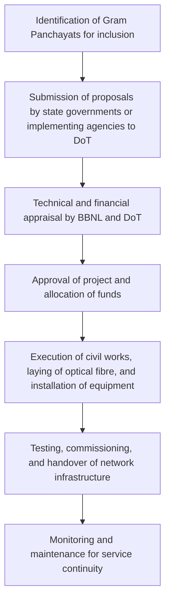

# Comprehensive Scheme Masterclass & File Guide

## Scheme Deep Dive

### Overview
The BharatNet Broadband Infrastructure scheme is a pan-India subsidy initiative implemented by Bharat Broadband Network Limited (BBNL), a Special Purpose Vehicle (SPV) under the Department of Telecommunications, Ministry of Communications. The scheme operates on a rolling basis, with projects sanctioned according to annual budget allocations and implementation readiness. Its primary objective is to provide broadband connectivity to all Gram Panchayats in the country, enabling digital services such as telemedicine, online education, e-agriculture, and digital banking, while supporting government-to-citizen (G2C) and government-to-government (G2G) services.

### Objectives
- Provide broadband connectivity to all Gram Panchayats in the country  
- Enable delivery of e-governance, e-health, e-education, and other public services  
- Bridge the digital divide between urban and rural areas  
- Support national digital initiatives like Digital India  
- Create a scalable and future-ready broadband infrastructure  
- Promote inclusive growth through affordable internet access  

### Eligibility Matrix
| Eligibility Criteria | Details |
|----------------------|---------|
| **Target Beneficiaries** | Rural populations; Gram Panchayats; government institutions; citizens in remote areas |
| **Primary Unit for Connectivity** | Gram Panchayats |
| **Implementing Agency** | Bharat Broadband Network Limited (BBNL) |
| **Facilitating Entities** | State governments and local bodies (for right-of-way and infrastructure sharing) |
| **Funding Model** | Central and state funding based on a defined cost-sharing model |
| **Geographic Scope** | Pan-India |

### Benefits & Financial Support
| Aspect | Details |
|--------|---------|
| **Financial Support Sources** | Government budgetary support, Universal Service Obligation Fund (USOF), and contributions from state governments |
| **Form of Assistance** | Subsidies for laying optical fibre, setting up network infrastructure, and operational sustainability |
| **Disbursement Mechanism** | Funds disbursed to BBNL and implementing agencies based on milestone achievement |
| **Key Benefits** | High-speed broadband connectivity enabling access to digital services (telemedicine, online education, e-agriculture, digital banking); supports G2C and G2G services; enhances socio-economic development in rural areas by reducing information asymmetry and enabling digital entrepreneurship |

### Required Documents
1. Project proposal from state government  
2. Technical feasibility report  
3. Financial plan and cost estimates  
4. Right-of-way clearance documents  
5. Implementation agency details  
6. Monitoring and maintenance plan  

### Application Process

### Key Caveats
> - Progress depends on timely availability of right-of-way and coordination with state and local authorities  
> - Funding is subject to annual budgetary allocations and utilization certificates  
> - Operational sustainability requires ongoing maintenance and revenue models  
> - Last-mile connectivity to individual households may require additional interventions  

### Application Portal
For official guidelines, notifications, and application procedures, refer to the Department of Telecommunications website:  
**https://dot.gov.in/bharatnet**

---

## Consultant's Field Guide to Generated Files

### 1. SCHEME_MASTER_DATABASE.md
**Real-time Usage:** Keep this open in a background tab during all client calls. When a client asks "What is the turnover limit?" or "Who administers this?", CTRL+F in this document to give an immediate, authoritative answer without checking the portal.

### 2. PITCH_AND_SALES_SCRIPTS.md
**Real-time Usage:** Open this file 5 minutes before your first Discovery Call with a lead. Read the "Problem Framing" out loud to hook them, then use the Qualification Checklist to interrogate their eligibility live on the phone. Keep the Objection Handlers table visible so you can immediately counter when they say "We're too small for this."

### 3. APPLICATION_PLAYBOOK.md
**Real-time Usage:** Print this out or pin it to your desktop once the client signs the retainer. Check off each box in "Stage 1" before moving to "Stage 2". Use the "Client Communication Template" to copy-paste directly into your email when chasing them for pending documents.

### 4. CLIENT_ONBOARDING_AND_CRM.md
**Real-time Usage:** Fill this out during or immediately after the onboarding call. Use the Needs Assessment to record their exact pain points. Update the "Compliance Status" table as they email you documents to maintain a single source of truth for what's missing.

### 5. LIVE_CASE_TRACKER.md
**Real-time Usage:** Review this document every morning during your standup. Update the "Stage" column daily. If a case hits "Stage 07 - Under review", use the Escalation Path notes here to know exactly who to call at the government department today.

### 6. FEE_AND_REVENUE_MODEL.md
**Real-time Usage:** Use this file when drafting the proposal. Look at the client's turnover, map them to the pricing tier in the table, and quote that exact Retainer and Success Fee. Use the monthly projection table to update your personal sales pipeline forecast for the quarter.

### 7. CLIENT_PROPOSAL_TEMPLATE.md
**Real-time Usage:** Copy this entire file, paste it into an email or PDF generator, replace the [PLACEHOLDER] tags with the client's actual details gathered from the CRM, and send it immediately after a successful discovery call.

### 8. COMPLIANCE_AND_LEGAL_PACK.md
**Real-time Usage:** Attach sections 8A and 8B as PDFs to the proposal email. Refuse to start Step 1 of the Application Playbook until the client signs these. Use the Disclaimers to protect yourself legally if the client is rejected by the government agency.