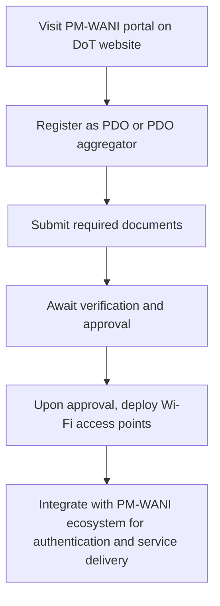

# Comprehensive Scheme Masterclass & File Guide

## Scheme Deep Dive

### Overview
PM-WANI (WiFi Access Network Interface) is a subsidy-type scheme under the Ministry of Electronics & IT, implemented by the Department of Telecommunications, Ministry of Communications, with a pan-India geographic scope, operates on a rolling basis with no direct financial subsidies or grants. Instead, it enables revenue generation through user fees collected at Public Data Offices (PDOs), with PDO aggregators facilitating billing, settlement, and reimbursement processes. Financial returns depend on user uptake and service usage, with no guaranteed or fixed financial support from the government.

### Objectives
- To provide public Wi-Fi services through Public Data Offices (PDOs) and PDO aggregators
- To expand broadband access and enhance last-mile connectivity across India
- To promote interoperability and ease of access for users via a centralized registry
- To encourage the proliferation of Wi-Fi networks in public and semi-public spaces
- To support digital inclusion by enabling affordable internet access
- To create employment and entrepreneurial opportunities in the telecom sector

### Eligibility Matrix
| Eligibility Criteria | Details | Source |
|----------------------|---------|--------|
| Entity Type | Any entity, including startups, MSMEs, entrepreneurs, or small businesses | Key Facts |
| Compliance Requirement | Must comply with technical and operational guidelines issued by the Department of Telecommunications | Key Facts |
| Registration | Must register on the designated portal | Key Facts |
| Security Standards | Must adhere to security and service quality standards | Key Facts |
| Target Beneficiaries | Startups, MSMEs, entrepreneurs, small businesses | Key Facts |

### Benefits & Financial Support
| Benefit/Financial Aspect | Details | Source |
|--------------------------|---------|--------|
| Direct Financial Subsidy | No direct financial subsidy or grant is provided under the scheme | Key Facts |
| Revenue Generation Model | Enables revenue generation through user fees collected at Public Data Offices (PDOs) | Key Facts |
| PDO Aggregator Role | PDO aggregators facilitate billing, settlement, and reimbursement processes | Key Facts |
| Financial Returns Dependency | Financial returns depend on user uptake and service usage | Key Facts |
| Licensing Requirement | Enables easy setup and operation of Wi-Fi hotspots without requiring individual licensing for each access point | Key Facts |
| Centralized System | Provides a centralized authentication and billing system through PDO aggregators | Key Facts |
| Revenue-Sharing | Offers revenue-sharing opportunities for PDO owners | Key Facts |
| Digital Inclusion | Promotes digital inclusion by expanding internet access in underserved areas | Key Facts |
| Ecosystem Growth | Supports the growth of a distributed Wi-Fi ecosystem across India | Key Facts |
| Infrastructure Cost | Entities must bear the cost of setting up and maintaining Wi-Fi infrastructure | Key Facts |

### Application Process

**Required Documents:**
1. Proof of identity (Aadhaar, PAN, etc.)
2. Proof of address
3. Business registration certificate
4. Bank account details
5. Technical details of Wi-Fi equipment to be deployed

**Application Portal:** https://dot.gov.in/pm-wani

**Key Caveats:**
- No direct financial subsidy or grant is provided under the scheme
- Entities must bear the cost of setting up and maintaining Wi-Fi infrastructure
- Compliance with technical guidelines and security standards is mandatory
- Revenue generation depends on user adoption and service usage

## Consultant's Field Guide to Generated Files

### 1. SCHEME_MASTER_DATABASE.md
**Real-time Usage:** Keep this open in a background tab during all client calls. When a client asks "What is the turnover limit?" or "Who administers this?", CTRL+F in this document to give an immediate, authoritative answer without checking the portal.

### 2. PITCH_AND_SALES_SCRIPTS.md
**Real-time Usage:** Open this file 5 minutes before your first Discovery Call with a lead. Read the "Problem Framing" out loud to hook them, then use the Qualification Checklist to interrogate their eligibility live on the phone. Keep the Objection Handlers table visible so you can immediately counter when they say "We're too small for this."

### 3. APPLICATION_PLAYBOOK.md
**Real-time Usage:** Print this out or pin it to your desktop once the client signs the retainer. Check off each box in "Stage 1" before moving to "Stage 2". Use the "Client Communication Template" to copy-paste directly into your email when chasing them for pending documents.

### 4. CLIENT_ONBOARDING_AND_CRM.md
**Real-time Usage:** Fill this out during or immediately after the onboarding call. Use the Needs Assessment to record their exact pain points. Update the "Compliance Status" table as they email you documents to maintain a single source of truth for what's missing.

### 5. LIVE_CASE_TRACKER.md
**Real-time Usage:** Review this document every morning during your standup. Update the "Stage" column daily. If a case hits "Stage 07 - Under review", use the Escalation Path notes here to know exactly who to call at the government department today.

### 6. FEE_AND_REVENUE_MODEL.md
**Real-time Usage:** Use this file when drafting the proposal. Look at the client's turnover, map them to the pricing tier in the table, and quote that exact Retainer and Success Fee. Use the monthly projection table to update your personal sales pipeline forecast for the quarter.

### 7. CLIENT_PROPOSAL_TEMPLATE.md
**Real-time Usage:** Copy this entire file, paste it into an email or PDF generator, replace the [PLACEHOLDER] tags with the client's actual details gathered from the CRM, and send it immediately after a successful discovery call.

### 8. COMPLIANCE_AND_LEGAL_PACK.md
**Real-time Usage:** Attach sections 8A and 8B as PDFs to the proposal email. Refuse to start Step 1 of the Application Playbook until the client signs these. Use the Disclaimers to protect yourself legally if the client is rejected by the government agency.