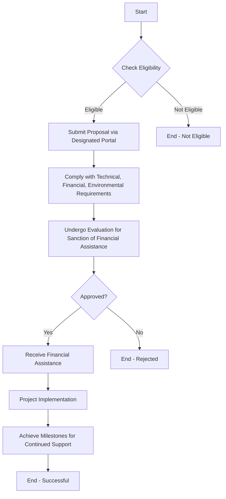

# Comprehensive Scheme Masterclass & File Guide

## Scheme Deep Dive

### Overview
The **Offshore Wind Energy Policy** is a subsidy-type scheme implemented by the **Ministry of New and Renewable Energy (MNRE)** with pan-India geographic scope. It was last updated in 2026 and aims to promote offshore wind energy development through financial and regulatory support.

### Objectives
- Promote development of offshore wind energy projects in India  
- Harness offshore wind potential to meet renewable energy targets  
- Reduce dependence on fossil fuels through clean energy generation  
- Attract investment via financial incentives like viability gap funding  
- Establish a robust offshore wind energy ecosystem in the country  

### Eligibility Matrix
| Eligibility Criteria | Details |
|----------------------|---------|
| **Target Beneficiaries** | Project developers; investors; energy companies |
| **Eligible Entities** | Project developers and investors interested in setting up offshore wind energy projects in India |
| **Technical Capability** | Must demonstrate technical capability as outlined in scheme guidelines |
| **Financial Capability** | Must demonstrate financial capability as outlined in scheme guidelines |
| **Regulatory Compliance** | Must comply with regulatory norms as outlined in scheme guidelines |
| **Environmental & Safety Standards** | Must adhere to environmental and safety standards as outlined in scheme guidelines |

### Benefits & Financial Support
| Benefit Type | Details |
|--------------|---------|
| **Financial Support Mechanism** | Viability Gap Funding (VGF) for 1,000 MW of offshore wind energy projects |
| **VGF Quantum & Disbursement** | Defined in scheme guidelines; aimed at bridging the gap between project costs and revenue to ensure financial viability |
| **Regulatory Facilitation** | Single-window clearances |
| **Grid Connectivity & Infrastructure** | Support for grid connectivity and infrastructure development |
| **Domestic Manufacturing & Job Creation** | Encourages domestic manufacturing and job creation in renewable energy sector |

### Application Process (Mermaid Flowchart)

### Key Caveats
> - Financial support is subject to availability of funds and approval by competent authorities  
> - Projects must comply with environmental, safety, and regulatory standards  
> - Support may be contingent on achieving project milestones and timely completion  

### Sources
- Scheme Key Facts: Offshore Wind Energy Policy (Scheme ID: row-194)  
- Application Portal: https://mnre.gov.in (MNRE Homepage)  

---

## Consultant's Field Guide to Generated Files

### 1. SCHEME_MASTER_DATABASE.md
**Real-time Usage:** Keep this open in a background tab during all client calls. When a client asks "What is the turnover limit?" or "Who administers this?", CTRL+F in this document to give an immediate, authoritative answer without checking the portal.

### 2. PITCH_AND_SALES_SCRIPTS.md
**Real-time Usage:** Open this file 5 minutes before your first Discovery Call with a lead. Read the "Problem Framing" out loud to hook them, then use the Qualification Checklist to interrogate their eligibility live on the phone. Keep the Objection Handlers table visible so you can immediately counter when they say "We're too small for this."

### 3. APPLICATION_PLAYBOOK.md
**Real-time Usage:** Print this out or pin it to your desktop once the client signs the retainer. Check off each box in "Stage 1" before moving to "Stage 2". Use the "Client Communication Template" to copy-paste directly into your email when chasing them for pending documents.

### 4. CLIENT_ONBOARDING_AND_CRM.md
**Real-time Usage:** Fill this out during or immediately after the onboarding call. Use the Needs Assessment to record their exact pain points. Update the "Compliance Status" table as they email you documents to maintain a single source of truth for what's missing.

### 5. LIVE_CASE_TRACKER.md
**Real-time Usage:** Review this document every morning during your standup. Update the "Stage" column daily. If a case hits "Stage 07 - Under review", use the Escalation Path notes here to know exactly who to call at the government department today.

### 6. FEE_AND_REVENUE_MODEL.md
**Real-time Usage:** Use this file when drafting the proposal. Look at the client's turnover, map them to the pricing tier in the table, and quote that exact Retainer and Success Fee. Use the monthly projection table to update your personal sales pipeline forecast for the quarter.

### 7. CLIENT_PROPOSAL_TEMPLATE.md
**Real-time Usage:** Copy this entire file, paste it into an email or PDF generator, replace the [PLACEHOLDER] tags with the client's actual details gathered from the CRM, and send it immediately after a successful discovery call.

### 8. COMPLIANCE_AND_LEGAL_PACK.md
**Real-time Usage:** Attach sections 8A and 8B as PDFs to the proposal email. Refuse to start Step 1 of the Application Playbook until the client signs these. Use the Disclaimers to protect yourself legally if the client is rejected by the government agency.