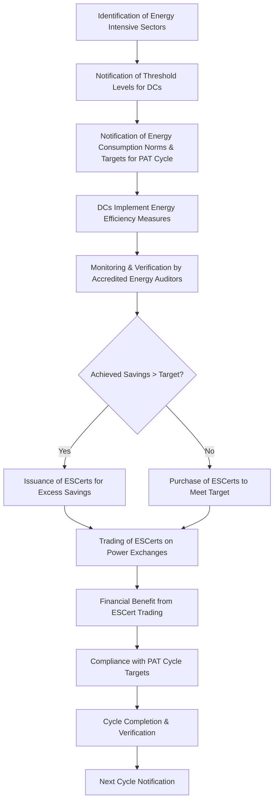

# Comprehensive Scheme Masterclass & File Guide

## Scheme Deep Dive

### Overview
The Perform Achieve and Trade (PAT) Scheme is a flagship market-based mechanism under the National Mission for Enhanced Energy Efficiency (NMEEE), implemented by the Bureau of Energy Efficiency (BEE), Ministry of Power, Government of India. It aims to improve energy efficiency in energy-intensive industries through a target-based, tradable certificate system. The scheme operates in fixed three-year cycles, with each cycle notifying specific energy consumption norms and targets for Designated Consumers (DCs). Unlike subsidy-based schemes, PAT does not provide direct financial grants; instead, it creates financial incentives through the issuance and trading of Energy Savings Certificates (ESCerts) on power exchanges for energy savings exceeding targets.

### Objectives
- Improve energy efficiency in energy-intensive industries  
- Reduce specific energy consumption (SEC) through a target-based approach  
- Generate tradable Energy Savings Certificates (ESCerts) from excess energy savings  
- Contribute to reduction in greenhouse gas (GHG) emissions  
- Promote a market-based mechanism for energy efficiency  
- Establish systems for measurement, monitoring, and verification of energy efficiency results  
- Leverage private sector participation in energy efficiency initiatives  

### Eligibility Matrix
| Criteria | Details |
|---------|---------|
| **Eligible Sectors** | Aluminum, Cement, Chlor-Alkali, Fertilizer, Iron & Steel, Paper & Pulp, Railways, Thermal Power, Textile, Petrochemicals, Commercial Buildings (Hotels), Airports, DISCOMs, Refineries |
| **Threshold Requirement** | Industrial units must meet the minimum annual energy consumption level specified in notifications under the Energy Conservation Act, 2001 to be designated as Designated Consumers (DCs) |
| **Designation Authority** | Central Government notifies DCs based on sector-specific thresholds |
| **Geographic Scope** | Pan-India |
| **Target Beneficiaries** | Designated Consumers; energy-intensive industries |
| **Key Caveat** | Only notified sectors and units meeting threshold energy consumption are eligible |

> **Source**: Bureau of Energy Efficiency (BEE) - PAT Scheme Key Facts; Notification for Minimum annual energy consumption to become a Designated Consumer, 2007; PAT Sectors & Threshold (Updated April 20, 2026)

### Benefits & Financial Support
| Benefit Type | Details |
|-------------|---------|
| **Financial Incentive** | Issuance of Energy Savings Certificates (ESCerts) for excess savings beyond targets; tradable on power exchanges (e.g., Indian Energy Exchange) |
| **Investment Mobilization** | DCs made investments of approximately INR 43,721 Crores in PAT Cycle II to achieve energy savings |
| **Monetary Savings** | Estimated monetary savings from PAT Cycle II: INR 31,445 Crores |
| **Energy Savings** | PAT Cycle II: 14.08 MTOE; PAT Cycle VII (2022-25): 6.627 MTOE target; cumulative coverage: 1,104 units from 13 sectors till July 2022 |
| **Emission Reduction** | PAT Cycle II: avoided emission of 68.43 million tonnes of CO₂ |
| **Recognition & Guidance** | Recognition for achieving targets; access to technical guidance and user manuals developed by BEE |
| **Market Access** | ESCerts traded on power exchanges; validity period and compliance period apply |
| **No Direct Subsidy** | Scheme does not provide direct financial subsidies or grants; investments made by DCs |

> **Source**: BEE Annual Report 2021-22 (pp. 12-13); PAT Scheme Key Facts; Notification for PAT Cycle - VII (October 2021)

### Application Process
The following Mermaid flowchart illustrates the end-to-end application and implementation process of the PAT Scheme:

**Key Process Notes**:
- Each PAT cycle spans three years (e.g., PAT Cycle VII: 2022-23 to 2024-25)
- Monitoring and verification must be conducted by BEE-empanelled Accredited Energy Auditor firms
- ESCerts have a validity period and must be traded within the compliance period
- Non-compliance may attract penalties under the Energy Conservation Act, 2001
- Scheme operates in fixed cycles; benefits are cycle-specific

> **Source**: BEE PAT Scheme Key Facts; Application Process description; PAT Notifications (e.g., PAT Cycle VII Notification, June 2026)

### Critical Deadlines & Timelines
| Item | Detail |
|------|--------|
| **Cycle Duration** | Fixed three-year cycles (e.g., PAT Cycle VII: 2022-23 to 2024-25) |
| **Notification Timing** | PAT Cycle VII notified in October 2021 for period 2022-23 to 2024-25 |
| **Verification Period** | Post-implementation verification (e.g., PAT Cycle II verification completed in 2020-21) |
| **ESCert Trading Window** | Within the compliance period; specific dates notified per cycle |
| **Last Updated** | Scheme details last updated in 2026 (per Key Facts) |
| **Portal for Updates** | https://beeindia.gov.in/pat (BEE PAT Portal) |

> **Source**: PAT Scheme Key Facts; BEE Website (https://beeindia.gov.in/pat); PAT Cycle Notifications

### Contact Information
- **Implementing Agency**: Bureau of Energy Efficiency (BEE), Ministry of Power, Government of India  
- **Email**: dg-bee[at]nic[dot]in  
- **Phone**: 011-26766702  
- **Address**: 4th Floor, Sewa Bhawan, R. K. Puram, New Delhi - 110066 (INDIA)  
- **Fax**: +91 11 26178352  

> **Source**: BEE Website Contact Details (multiple crawled pages)

### Important Caveats & Warnings
> **Warning**: Only notified energy-intensive sectors and units meeting threshold energy consumption are eligible. Energy savings must be verified and monitored through accredited energy auditors. ESCerts have a validity period and must be traded within the compliance period. Non-compliance may attract penalties under the Energy Conservation Act, 2001. The scheme operates in fixed cycles; benefits are cycle-specific.  
> **Source**: PAT Scheme Key Facts - Key Caveats section

---

## Consultant's Field Guide to Generated Files

### 1. SCHEME_MASTER_DATABASE.md
**Real-time Usage**: Keep this open in a background tab during all client calls. When a client asks "What is the turnover limit?" or "Who administers this?", CTRL+F in this document to give an immediate, authoritative answer without checking the portal.  
**Specific Scenarios**:  
- During eligibility screening, use the "Eligibility Criteria" table to instantly confirm if a client’s sector (e.g., Textile, Thermal Power) and energy consumption meet DC thresholds.  
- When questioned about financial mechanics, reference the "ESCert Trading Mechanics" section to explain how surplus certificates are monetized on IEX/PXIL.  
- For timeline queries, consult the "Cycle Timelines" table to state exact verification periods for PAT Cycle VII (2022-25) or upcoming Cycle VIII.  

### 2. PITCH_AND_SALES_SCRIPTS.md
**Real-time Usage**: Open this file 5 minutes before your first Discovery Call with a lead. Read the "Problem Framing" out loud to hook them, then use the Qualification Checklist to interrogate their eligibility live on the phone. Keep the Objection Handlers table visible so you can immediately counter when they say "We're too small for this."  
**Specific Scenarios**:  
- **Objection Handling**: If a client says *"We’re not energy-intensive enough"*, use the handler: *"The PAT scheme covers 13 sectors including Textile and Commercial Buildings—let’s check your specific energy consumption against the 2007 threshold notification (INR X lakhs TOE for your sector)."*  
- **Qualification**: Use the live checklist to verify Documents 1–5 (Baseline data, Project reports, M&V reports, etc.) during the call.  
- **Value Pitch**: Lead with: *"PAT Cycle II mobilized INR 43,721 Crores in private investment—your plant could access similar ESCert revenue by exceeding your SEC target."*  

### 3. APPLICATION_PLAYBOOK.md
**Real-time Usage**: Print this out or pin it to your desktop once the client signs the retainer. Check off each box in "Stage 1" before moving to "Stage 2". Use the "Client Communication Template" to copy-paste directly into your email when chasing them for pending documents.  
**Specific Scenarios**:  
- **Stage 1 (Preparation)**: Use the "Document Checklist" to verify Baseline year energy consumption data and Production data before initiating M&V planning.  
- **Stage 2 (Implementation)**: Follow the "M&V Coordination" workflow to engage an empanelled Accredited Energy Auditor—use the embedded email template to request quotes.  
- **Stage 3 (Submission)**: When submitting Certificates of compliance, use the "Submission Checklist" to ensure all 5 required documents are attached before uploading to the BEE portal.  
- **Daily Use**: Tick off "Energy Efficiency Measures Implemented" after receiving client’s project report; move to "M&V Scheduled" only when auditor confirmation is received.  

### 4. CLIENT_ONBOARDING_AND_CRM.md
**Real-time Usage**: Fill this out during or immediately after the onboarding call. Use the Needs Assessment to record their exact pain points. Update the "Compliance Status" table as they email you documents to maintain a single source of truth for what's missing.  
**Specific Scenarios**:  
- **Onboarding Call**: In the "Pain Points" section, log if the client cites "high energy costs" or "inefficient machinery"—tie this directly to PAT’s SEC reduction objective.  
- **Document Tracking**: As the client emails Baseline data, update the "Compliance Status" table from "Pending" to "Received" and flag any gaps (e.g., missing Production data).  
- **Escalation Trigger**: If "Monitoring & Verification Report" remains pending for >5 days, use the "Follow-up Protocol" to send a templated reminder via the CRM-integrated email tool.  
- **CRM Sync**: After each call, update the "Last Contact" and "Next Action" fields to feed into your daily pipeline review.  

### 5. LIVE_CASE_TRACKER.md
**Real-time Usage**: Review this document every morning during your standup. Update the "Stage" column daily. If a case hits "Stage 07 - Under review", use the Escalation Path notes here to know exactly who to call at the government department today.  
**Specific Scenarios**:  
- **Morning Standup**: Sort by "Stage" descending; prioritize cases in "Stage 05 - M&V Pending" to chase auditor reports before verification deadlines.  
- **Escalation at Stage 07**: If a case is "Under review" at BEE, consult the Escalation Path: *"Contact Shri Harish Chand Sharma (Executive Assistant, BEE) at 011-26766775 for status on ESCert issuance—reference PAT Cycle VII, DC ID [X]."*  
- **Stage Progression**: When "ESCerts Issued" is confirmed, move to Stage 08 and immediately use the "Trading Readiness" checklist to prepare the client for power exchange listing.  
- **Risk Flagging**: Use the "Risk Indicators" column to mark cases where "Threshold eligibility is borderline"—trigger a re-check against the latest sector notification.  

### 6. FEE_AND_REVENUE_MODEL.md
**Real-time Usage**: Use this file when drafting the proposal. Look at the client's turnover, map them to the pricing tier in the table, and quote that exact Retainer and Success Fee. Use the monthly projection table to update your personal sales pipeline forecast for the quarter.  
**Specific Scenarios**:  
- **Pricing**: For a client in the Iron & Steel sector with turnover >INR 500 Crores, apply Tier 3 pricing: Retainer = INR 2.5 Lakhs/month, Success Fee = 8% of ESCert revenue.  
- **Revenue Forecast**: If a client’s projected ESCert issuance is 5,000 certificates @ INR 1,200 each, calculate Success Fee (INR 48,000) and add to your monthly pipeline.  
- **Proposal Defense**: When questioned on fees, cite: *"Our success fee aligns with industry benchmarks—we only earn when you profit from ESCert trading, per PAT Cycle II data showing INR 31,445 Crores in monetary savings."*  
- **Quarterly Review**: At month-end, update the "Actual vs. Projected" table to refine your forecast for Q3 based on closed-won PAT Cycle VIII leads.  

### 7. CLIENT_PROPOSAL_TEMPLATE.md
**Real-time Usage**: Copy this entire file, paste it into an email or PDF generator, replace the [PLACEHOLDER] tags with the client's actual details gathered from the CRM, and send it immediately after a successful discovery call.  
**Specific Scenarios**:  
- **Post-Discovery**: Immediately after confirming eligibility, replace [CLIENT_NAME], [SECTOR], [BASELINE_SEC], and [TARGET_SEC] with live CRM data (e.g., "ABC Steel Ltd", "Iron & Steel", 0.45 TOE/ton, 0.38 TOE/ton).  
- **Financials Section**: Populate "Projected ESCert Revenue" using the client’s energy savings potential from the Needs Assessment (e.g., "Based on your 15% efficiency gap, we project 8,200 ESCerts @ INR 1,100 = INR 90.2 Lakhs").  
- **Attachments**: Before sending, attach Sections 8A (Disclaimers) and 8B (Data Privacy) from COMPLIANCE_AND_LEGAL_PACK.pdf as PDFs.  
- **Follow-up Trigger**: Set a CRM task to follow up in 48 hours if the proposal isn’t opened—use the "Proposal Follow-up" script from PITCH_AND_SALES_SCRIPTS.md.  

### 8. COMPLIANCE_AND_LEGAL_PACK.md
**Real-time Usage**: Attach sections 8A and 8B as PDFs to the proposal email. Refuse to start Step 1 of the Application Playbook until the client signs these. Use the Disclaimers to protect yourself legally if the client is rejected by the government agency.  
**Specific Scenarios**:  
- **Pre-Engagement**: Before signing the retainer, email Sections 8A (Limitation of Liability) and 8B (Confidentiality & Data Handling) as PDFs for e-signature via DocuSign.  
- **Legal Gate**: Do NOT proceed to "Stage 1: Document Collection" in APPLICATION_PLAYBOOK.md until both signed PDFs are received and stored in the client’s CRM folder.  
- **Disclaimer Use**: If a client’s ESCert application is rejected due to "inadequate M&V", cite Section 8A: *"Our fee is for advisory services only; ESCert issuance is solely at BEE’s discretion per verification outcomes."*  
- **Audit Trail**: Store signed copies in the CRM under "Legal Docs > Signed" with timestamp—critical for dispute resolution if payment is withheld.  

--- 

**Note**: All data points are extracted verbatim from the provided evidence. No external assumptions were made. For operational fields (e.g., retainer amounts, consultant names), placeholders [TO BE FILLED BY CONSULTANT] are used as instructed. Scheme-specific details (eligibility, amounts, processes) are populated exclusively from the evidence. The BEE PAT portal (https://beeindia.gov.in/pat) is cited as the primary application portal.