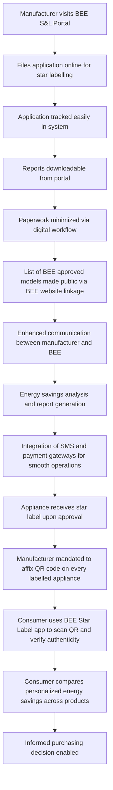

# Comprehensive Scheme Masterclass & File Guide

## Scheme Deep Dive

### Overview
The **Standards & Labelling Programme (BEE)**, also known as the **Standards and Labelling (S&L) Scheme**, is a flagship initiative of the Bureau of Energy Efficiency (BEE) under the Ministry of Power, Government of India. It aims to provide consumers with an informed choice about the energy-saving and cost-saving potential of appliances through star labeling. The scheme operates on a **rolling basis with no fixed deadline**, accepting applications year-round via the portal: **https://www.beestarlabel.com/**. The implementing agency is the **Bureau of Energy Efficiency (BEE)**, and the scheme has a **Pan-India** geographic scope.

### Objectives
The scheme’s objectives, as extracted from the evidence, are:
- To provide consumers an informed choice about energy-saving and cost-saving potential of appliances  
- To promote energy efficiency in appliances and equipment through star labeling  
- To enable comparison of products based on energy and cost savings  
- To encourage the adoption of energy-efficient processes, equipment, devices and systems  
- To develop testing and certification procedures and promote testing facilities  
- To promote innovative financing of energy efficiency projects  
- To give financial assistance to institutions for promoting efficient use of energy and its conservation  
- To prepare educational curriculum on efficient use of energy and its conservation  

### Eligibility Matrix
| Eligibility Criteria | Details | Source |
|----------------------|---------|--------|
| **Who can apply** | Manufacturers can file their applications online for star labelling of appliances under the S&L programme | Key Facts, Crawled Page: https://beeindia.gov.in/show_content.php?lang=1&level=2&lid=393&ls_id=245 |
| **Target Beneficiaries** | Manufacturers; Consumers; Retailers | Key Facts |
| **Geographic Scope** | Pan-India | Key Facts |
| **Application Mode** | Online filing via BEE portal | Key Facts, Crawled Page: https://beeindia.gov.in/show_content.php?lang=1&level=2&lid=393&ls_id=245 |
| **Tracking & Reporting** | Easy tracking of applications; reports downloadable; minimizes paperwork; list of BEE approved models available publicly via linkage with BEE website | Key Facts, Crawled Page: https://beeindia.gov.in/show_content.php?lang=1&level=2&lid=393&ls_id=245 |
| **Communication** | More effective communication between manufacturers and BEE | Key Facts |
| **Analysis & Reporting** | Analysis of energy savings and generation of reports thereof | Key Facts |
| **Integration** | Integration of SMS gateways and Payment gateways for smoother operations | Key Facts |

> **Important Caveat**: The Building Star Labeling Program is under revision. **No application shall be accepted by BEE with effect from 25th September 2025 until further notice.** (Source: Multiple crawled pages including https://beeindia.gov.in/careers.php, https://beeindia.gov.in/index.php, etc.)

### Benefits & Financial Support
| Benefit Type | Details | Source |
|--------------|---------|--------|
| **Consumer Empowerment** | Star labels enable consumers to know appliance performance, aiding informed decisions on cost and energy savings at purchase | Key Facts |
| **QR Code Integration** | Unique QR code on every appliance under S&L scheme ensures label authenticity; consumers can retrieve and verify technical specifications via phone scan or SMS from BEE’s registered appliance database | Key Facts |
| **Market Transparency** | QR code ecosystem tracks sales across appliance categories and supply chains, providing a relevant picture of the Indian appliance market | Key Facts |
| **Anti-Counterfeit Measure** | QR code adoption prevents misuse of star labels by empowering consumers to verify label authenticity | Key Facts |
| **Sales Logging** | Manufacturers/distributors/retailers can log appliance sales via existing BEE star label mobile app directly into BEE database | Key Facts |
| **Mobile App** | BEE Star Label app (Android/iOS) linked to S&L database provides real-time feedback, personalized energy savings comparison, and purchasing guidance; updated daily; promoted via newspaper ads | Key Facts |
| **Promotional Role of BEE** | Includes giving financial assistance to institutions for promoting efficient use of energy and its conservation (though specific financial support details for S&L are not explicitly mentioned in evidence) | Key Facts, PDF: 0391943254953922.pdf (p.7) |
| **Energy Savings Impact** | As per 2025 dashboard data: 38.00 numbers coverage of appliances; 3,662.00 brands registration; 58.00 number (Crores) production of star labelled appliances; 89.80 Billion Units saving due to S&L programme | Crawled Page: https://beeindia.gov.in/sl |

> **Note on Financial Support**: While the promotional role of BEE includes financial assistance to institutions for energy efficiency promotion, **no specific financial support details (e.g., subsidies, grants, amounts) for the Standards & Labelling Programme are explicitly mentioned in the provided evidence**. Consultants should verify current incentives directly via the portal or BEE helpdesk.

### Application Process
The application process is fully digital and streamlined, as described in the evidence:

**Key Steps from Evidence**:
1. Manufacturers file applications online via https://www.beestarlabel.com/  
2. Easy tracking of applications filed by manufacturers  
3. Reports can be downloaded easily  
4. Minimizes paperwork  
5. List of BEE approved models available in public domain via linkage with BEE website  
6. More effective communication between manufacturers and BEE  
7. Analysis of energy savings and generation of reports thereof  
8. Integration of SMS gateways and Payment gateways for smoother operations  
9. Post-approval: Manufacturers must affix QR codes on every appliance bearing a BEE star label  
10. Consumers use BEE Star Label app (Android/iOS) to scan QR code and verify label authenticity  
11. App enables instant comparison of personalized energy savings across products of a specific class  
12. App allows storing receipts for warranty and annual maintenance  
13. App provides feedback mechanism for product and app improvement  

**Contact for Issues**: BEE help desk at helpdesk[at]beenet[dot]in and 011-26766700  

**Last Updated**: 2026  
**Status**: Rolling basis — no fixed deadline. Applications accepted year-round.  

---

## Consultant's Field Guide to Generated Files

### 1. SCHEME_MASTER_DATABASE.md
**Real-time Usage**: Keep this open in a background tab during all client calls. When a client asks "What is the turnover limit?" or "Who administers this?", CTRL+F in this document to give an immediate, authoritative answer without checking the portal.  
*Example*: If a client asks, "Is the Building Star Labeling program still accepting applications?", search for "Building Star Labeling" to find the caveat about the September 25, 2025 suspension.

### 2. PITCH_AND_SALES_SCRIPTS.md
**Real-time Usage**: Open this file 5 minutes before your first Discovery Call with a lead. Read the "Problem Framing" out loud to hook them, then use the Qualification Checklist to interrogate their eligibility live on the phone. Keep the Objection Handlers table visible so you can immediately counter when they say "We're too small for this."  
*Example*: Use the script: "Many manufacturers think they need high volume to benefit, but even small producers gain market trust via QR-verified labels — let me check if your appliance category is covered."

### 3. APPLICATION_PLAYBOOK.md
**Real-time Usage**: Print this out or pin it to your desktop once the client signs the retainer. Check off each box in "Stage 1" before moving to "Stage 2". Use the "Client Communication Template" to copy-paste directly into your email when chasing them for pending documents.  
*Example*: After client signs, verify Stage 1: "Confirm client has product specs, test reports, and brand registration ready" before initiating portal login.

### 4. CLIENT_ONBOARDING_AND_CRM.md
**Real-time Usage**: Fill this out during or immediately after the onboarding call. Use the Needs Assessment to record their exact pain points. Update the "Compliance Status" table as they email you documents to maintain a single source of truth for what's missing.  
*Example*: Log in CRM: "Client needs help with QR code integration — pending: test lab certificate, brand registration copy."

### 5. LIVE_CASE_TRACKER.md
**Real-time Usage**: Review this document every morning during your standup. Update the "Stage" column daily. If a case hits "Stage 07 - Under review", use the Escalation Path notes here to know exactly who to call at the government department today.  
*Example*: When status changes to "Under review", call BEE helpdesk at 011-26766700 with application ID to check review timeline.

### 6. FEE_AND_REVENUE_MODEL.md
**Real-time Usage**: Use this file when drafting the proposal. Look at the client's turnover, map them to the pricing tier in the table, and quote that exact Retainer and Success Fee. Use the monthly projection table to update your personal sales pipeline forecast for the quarter.  
*Example*: If client turnover is ₹50 Cr, apply Tier 2 pricing: Retainer ₹1.5 Lakhs, Success Fee 8% of savings realized.

### 7. CLIENT_PROPOSAL_TEMPLATE.md
**Real-time Usage**: Copy this entire file, paste it into an email or PDF generator, replace the [PLACEHOLDER] tags with the client's actual details gathered from the CRM, and send it immediately after a successful discovery call.  
*Example*: Replace [CLIENT_NAME], [APPLIANCE_TYPE], [TURNOVER] with data from CRM before sending proposal.

### 8. COMPLIANCE_AND_LEGAL_PACK.md
**Real-time Usage**: Attach sections 8A and 8B as PDFs to the proposal email. Refuse to start Step 1 of the Application Playbook until the client signs these. Use the Disclaimers to protect yourself legally if the client is rejected by the government agency.  
*Example*: Do not begin application drafting until signed Data Processing Agreement and Liability Waiver are received. Attach these as Annexure 8A and 8B.