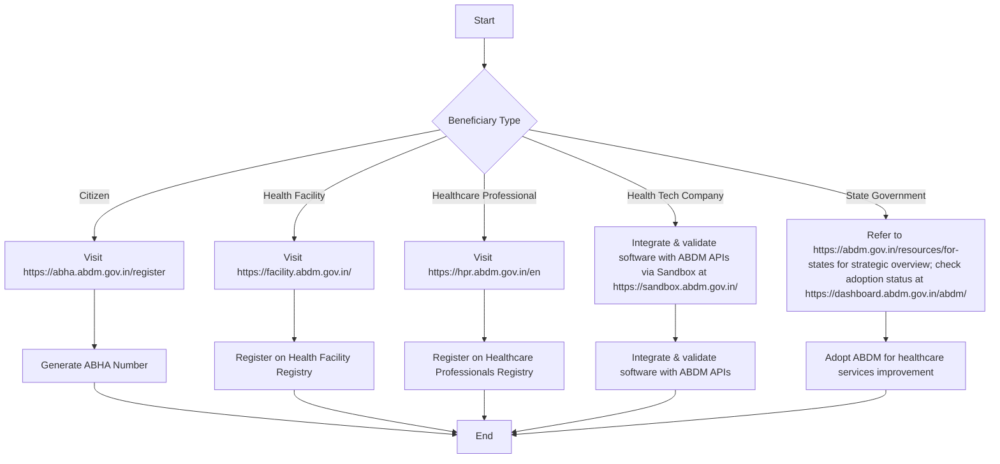

# Comprehensive Scheme Masterclass & File Guide

## Scheme Deep Dive

### Overview
The **National Digital Health Mission (NDHM)**, also known as the **Ayushman Bharat Digital Mission (ABDM)**, is a pan-India digital infrastructure initiative implemented by the **National Health Authority (NHA)** under the Ministry of Health and Family Welfare. It aims to develop the backbone necessary to support the integrated digital health infrastructure of the country by bridging gaps among healthcare stakeholders through digital highways. The mission operates on a rolling basis with no fixed deadline, accepting applications year-round. The official application portal is [https://abha.abdm.gov.in/register](https://abha.abdm.gov.in/register).

### Objectives
- Develop the backbone necessary to support the integrated digital health infrastructure of the country
- Bridge the existing gap amongst different stakeholders of the healthcare ecosystem through digital highways
- Enable citizens to generate a unique health identifier (ABHA) for accessing and sharing health records digitally
- Create a comprehensive repository of public and private health facilities across different systems of medicine
- Empower healthcare professionals to join the ABDM ecosystem and be part of the healthcare digital transformation in India
- Foster integration of digital platforms in healthcare through engagement with health tech companies
- Accelerate the adoption of ABDM in public and private health systems through state government and health authorities

### Eligibility Matrix
| Beneficiary Category | Eligibility Criteria | Registration Portal |
|----------------------|----------------------|---------------------|
| Citizens/Individuals | Can generate a unique health identifier (ABHA) | [https://abha.abdm.gov.in/register](https://abha.abdm.gov.in/register) |
| Health Facilities (Public & Private) | Across all systems of medicine | [https://facility.abdm.gov.in/](https://facility.abdm.gov.in/) |
| Healthcare Professionals | Doctors, nurses, paramedics, allied health workers across all systems | [https://hpr.abdm.gov.in/en](https://hpr.abdm.gov.in/en) |
| Health Tech Companies | Engage with ABDM to integrate and validate software systems with ABDM APIs | [https://sandbox.abdm.gov.in/](https://sandbox.abdm.gov.in/) |
| State Governments & Health Authorities | Adopt ABDM to improve healthcare services | [https://abdm.gov.in/resources/for-states](https://abdm.gov.in/resources/for-states) |

### Benefits & Financial Support
The ABDM does **not** provide direct financial support to beneficiaries. It is a digital infrastructure initiative focused on creating registries, enabling interoperability, and providing digital health services. Financial aspects are not detailed in the evidence; the mission operates through government funding and partnerships without specifying grants, loans, or subsidies to end users.

| Stakeholder | Benefits |
|-------------|----------|
| **Citizens** | Access and share health records digitally; receive digital lab reports, prescriptions, and diagnosis seamlessly from verified healthcare providers |
| **Health Facilities** | Connected to India's digital health ecosystem |
| **Healthcare Professionals** | Connected to India's digital health ecosystem |
| **Health Tech Companies** | Increasing market demand for ABDM-compliant HMIS; increased credibility for ABDM-certified products; improved ease of doing business |
| **States** | Improved healthcare planning and management; formulation of data-driven policies; enhanced healthcare availability, accessibility, and quality for citizens |

### Required Documents
| For | Required Documents |
|-----|--------------------|
| **ABHA Registration (Citizens)** | 1. Aadhaar ID 2. Mobile number linked to Aadhaar (for OTP verification) 3. Personal details: Name, Year of Birth, Gender, State, District, Email |
| **Health Facility Registry (HFR)** | Facility name, location, operational status, services offered, ownership details |
| **Healthcare Professionals Registry (HPR)** | Healthcare professional details |
| **e-Sushrut Clinic Registration** | Credentials to create an account on e-Sushrut Clinic |

### Application Process

### Key Caveats
> - Participation in the National Digital Health Ecosystem (NDHE (NDHE is purely voluntary.
> - ABHA creation requires consent for data sharing and processing.
> - Data retention and deletion are subject to user consent and applicable laws.
> - The mission does not guarantee availability of linked external pages or endorse third-party content.
> - Information on the website may change prior to updating, and NHA assumes no legal liability for completeness or accuracy.

### Contact Details
- **Email**: abdm[at]nha[dot]gov[dot]in
- **Toll-free-number**: 1800-11-4477
- **Contact Address**: 9th Floor, Tower-I, Jeevan Bharati Building, Connaught Place, New Delhi - 110 001

### Supporting Statistics (as of 05/07/2026 08:56 PM)
| Metric | Value |
|--------|-------|
| ABHA Numbers | 93,61,07,465 |
| ABHA Linked Health Records | 1,04,75,90,377 |
| Health Facilities Registered | 5,31,612 |
| Healthcare Professionals Registered | 9,72,185 |
| ABHA App Downloads | 3,22,73,710 |
| Active Integrators | 2,729 |
| Successful Integrators | 502 |

---

## Consultant's Field Guide to Generated Files

### 1. SCHEME_MASTER_DATABASE.md
**Real-time Usage:** Keep this open in a background tab during all client calls. When a client asks "What is the turnover limit?" or "Who administers this?", CTRL+F in this document to give an immediate, authoritative answer without checking the portal.

### 2. PITCH_AND_SALES_SCRIPTS.md
**Real-time Usage:** Open this file 5 minutes before your first Discovery Call with a lead. Read the "Problem Framing" out loud to hook them, then use the Qualification Checklist to interrogate their eligibility live on the phone. Keep the Objection Handlers table visible so you can immediately counter when they say "We're too small for this."

### 3. APPLICATION_PLAYBOOK.md
**Real-time Usage:** Print this out or pin it to your desktop once the client signs the retainer. Check off each box in "Stage 1" before moving to "Stage 2". Use the "Client Communication Template" to copy-paste directly into your email when chasing them for pending documents.

### 4. CLIENT_ONBOARDING_AND_CRM.md
**Real-time Usage:** Fill this out during or immediately after the onboarding call. Use the Needs Assessment to record their exact pain points. Update the "Compliance Status" table as they email you documents to maintain a single source of truth for what's missing.

### 5. LIVE_CASE_TRACKER.md
**Real-time Usage:** Review this document every morning during your standup. Update the "Stage" column daily. If a case hits "Stage 07 - Under review", use the Escalation Path notes here to know exactly who to call at the government department today.

### 6. FEE_AND_REVENUE_MODEL.md
**Real-time Usage:** Use this file when drafting the proposal. Look at the client's turnover, map them to the pricing tier in the table, and quote that exact Retainer and Success Fee. Use the monthly projection table to update your personal sales pipeline forecast for the quarter.

### 7. CLIENT_PROPOSAL_TEMPLATE.md
**Real-time Usage:** Copy this entire file, paste it into an email or PDF generator, replace the [PLACEHOLDER] tags with the client's actual details gathered from the CRM, and send it immediately after a successful discovery call.

### 8. COMPLIANCE_AND_LEGAL_PACK.md
**Real-time Usage:** Attach sections 8A and 8B as PDFs to the proposal email. Refuse to start Step 1 of the Application Playbook until the client signs these. Use the Disclaimers to protect yourself legally if the client is rejected by the government agency.