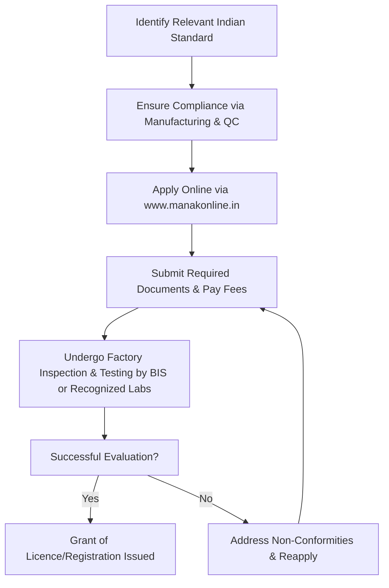

# Comprehensive Scheme Masterclass & File Guide

## Scheme Deep Dive

### Overview
The **BIS Certification Scheme** is a recognition-type scheme implemented pan-India by the **Bureau of Indian Standards (BIS)**, operating under the Department of Consumer Affairs, Ministry of Consumer Affairs, Food and Public Distribution. The scheme is administered via the online portal **www.manakonline.in** and accepts applications on a rolling basis year-round with no fixed deadlines. Last updated in 2024, the scheme does not provide direct financial support but generates revenue through fees for licensing, testing, and certification services. Its primary objectives include the harmonious development of standardization, marking, and quality certification; providing thrust to standardization and quality control for industrial growth and consumer protection; developing consensus-based voluntary national standards through stakeholder consultation; operating product certification, hallmarking, and management systems certification schemes; and ensuring conformity of goods and services to relevant Indian standards through testing and inspection.

### Objectives
- Harmonious development of standardization, marking, and quality certification activities  
- Provide thrust to standardization and quality control for industrial growth and consumer protection  
- Develop consensus-based voluntary national standards through stakeholder consultation  
- Operate product certification, hallmarking, and management systems certification schemes  
- Ensure conformity of goods and services to relevant Indian standards through testing and inspection  

### Eligibility Matrix
Eligibility varies by sub-scheme under the BIS Certification Scheme:

| **Sub-Scheme** | **Target Beneficiaries** | **Eligibility Criteria** |
|----------------|--------------------------|---------------------------|
| Product Certification | Manufacturers | Must comply with relevant Indian Standards for the product; ensure appropriate manufacturing and quality control arrangements |
| Hallmarking | Jewellers, Assaying Centres | Must meet BIS requirements for hallmarking; licences are region-specific and require renewal |
| Laboratory Recognition | Outside Laboratories | Must meet IS/ISO/IEC 17025 criteria for testing and calibration competence |
| Compulsory Registration (CRS) | Electronics and IT Goods Manufacturers | Must register under the order notified by MeitY for notified electronics and IT goods categories |
| Foreign Manufacturers Certification Scheme (FMCS) | Foreign Manufacturers | Can seek certification from BIS for use of BIS Standard Mark on imported goods |
| Registration Scheme for Self Declaration | Manufacturers of Notified Products | Must apply for registration along with test reports from BIS-recognized laboratories |

> **Note**: Certification is voluntary except for specific products made compulsory by government orders (e.g., under CRS). Hallmarking licences require region-specific renewal. Laboratory recognition requires adherence to IS/ISO/IEC 17025 standards. Compulsory registration applies only to notified electronics and IT goods categories.

### Benefits & Financial Support
BIS does not provide direct financial support to beneficiaries. Revenue is generated from fees for services such as licensing, testing, and certification.

| **Benefit Category** | **Specific Benefits** |
|----------------------|------------------------|
| Legal & Regulatory | Legal compliance; recognition under national and international frameworks; access to government tenders |
| Market & Consumer | Consumer trust; market access; quality assurance; ability to use BIS standard mark; hallmarking purity guarantee |
| Operational | Access to BIS laboratory services; hallmarking and assaying centre recognition; product certification licensing |

### Application Process
The application process is standardized across sub-schemes but varies slightly in documentation and portal usage. Below is a Mermaid.js flowchart illustrating the general process:

#### Required Documents (Common Across Schemes)
1. Application form  
2. Proof of factory address  
3. Product details and specifications  
4. Quality control arrangements  
5. Test reports from BIS or recognized laboratories  
6. Fee payment proof  

#### Sub-Scheme Specific Portals & Contacts
- **Product Certification / Hallmarking / FMCS / Self-Declaration Registration**: Apply via [www.manakonline.in](https://www.manakonline.in)  
- **Laboratory Recognition**: Apply via [lims.bis.gov.in](https://lims.bis.gov.in)  
- **Contact**: Email: dg@bis.org.in | Website: www.bis.org.in  

> **Warning**: Applications are accepted only in online mode via the BIS portal. All payments must be made online. Incomplete documentation or non-payment of fees will result in application rejection.

---

## Consultant's Field Guide to Generated Files

### 1. SCHEME_MASTER_DATABASE.md
**Real-time Usage**: Keep this open in a background tab during all client calls. When a client asks "What is the turnover limit?" or "Who administers this?", CTRL+F in this document to give an immediate, authoritative answer without checking the portal.

### 2. PITCH_AND_SALES_SCRIPTS.md
**Real-time Usage**: Open this file 5 minutes before your first Discovery Call with a lead. Read the "Problem Framing" out loud to hook them, then use the Qualification Checklist to interrogate their eligibility live on the phone. Keep the Objection Handlers table visible so you can immediately counter when they say "We're too small for this."

### 3. APPLICATION_PLAYBOOK.md
**Real-time Usage**: Print this out or pin it to your desktop once the client signs the retainer. Check off each box in "Stage 1" before moving to "Stage 2". Use the "Client Communication Template" to copy-paste directly into your email when chasing them for pending documents.

### 4. CLIENT_ONBOARDING_AND_CRM.md
**Real-time Usage**: Fill this out during or immediately after the onboarding call. Use the Needs Assessment to record their exact pain points. Update the "Compliance Status" table as they email you documents to maintain a single source of truth for what's missing.

### 5. LIVE_CASE_TRACKER.md
**Real-time Usage**: Review this document every morning during your standup. Update the "Stage" column daily. If a case hits "Stage 07 - Under review", use the Escalation Path notes here to know exactly who to call at the government department today.

### 6. FEE_AND_REVENUE_MODEL.md
**Real-time Usage**: Use this file when drafting the proposal. Look at the client's turnover, map them to the pricing tier in the table, and quote that exact Retainer and Success Fee. Use the monthly projection table to update your personal sales pipeline forecast for the quarter.

### 7. CLIENT_PROPOSAL_TEMPLATE.md
**Real-time Usage**: Copy this entire file, paste it into an email or PDF generator, replace the [PLACEHOLDER] tags with the client's actual details gathered from the CRM, and send it immediately after a successful discovery call.

### 8. COMPLIANCE_AND_LEGAL_PACK.md
**Real-time Usage**: Attach sections 8A and 8B as PDFs to the proposal email. Refuse to start Step 1 of the Application Playbook until the client signs these. Use the Disclaimers to protect yourself legally if the client is rejected by the government agency.