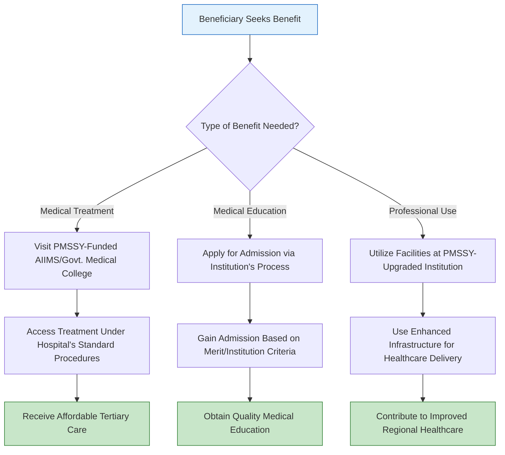

</think># Comprehensive Scheme Masterclass & File Guide

## Scheme Deep Dive

### Overview
The **Pradhan Mantri Swasthya Suraksha Yojana (PMSSY)** is a centrally sponsored scheme implemented by the **Ministry of Health and Family Welfare** with pan-India geographic scope. It is classified as a subsidy-type scheme focused on healthcare infrastructure development. The scheme does not have a fixed deadline, as benefits are accessed through ongoing hospital services and academic admissions at the respective institutions.

### Objectives
The primary objectives of PMSSY are:
- Correct regional imbalances in availability of affordable and reliable tertiary healthcare services
- Augment facilities for quality medical education in the country
- Set up new AIIMS-like institutions
- Upgrade existing government medical colleges and institutions

### Eligibility Matrix
Eligibility under PMSSY is indirect and mediated through the services of the institutions created or upgraded. There is no direct application process for beneficiaries. Eligibility is determined by the respective institutions for:
- Patients seeking treatment at upgraded or newly established AIIMS and government medical colleges
- Medical students seeking admission to courses at these facilities
- Healthcare professionals utilizing the enhanced infrastructure

| Beneficiary Category | Eligibility Criteria | Determining Authority |
|----------------------|----------------------|------------------------|
| General Public (Patients) | Must seek treatment at PMSSY-funded AIIMS or upgraded medical colleges | Respective hospital/institution administration |
| Medical Students | Must meet admission criteria for courses offered at PMSSY-funded institutions | Respective academic institution (e.g., AIIMS, government medical college) |
| Healthcare Professionals | Must be employed or affiliated with PMSSY-upgraded institutions | Institution's HR/admin department |

> **Key Caveat**: The scheme focuses on infrastructure development; direct individual benefits are mediated through the services of the institutions created or upgraded. Implementation timelines may vary across states and institutions.

### Benefits & Financial Support
PMSSY provides central financial assistance for capital costs related to infrastructure development. The funding supports civil works, medical equipment, and other infrastructure needs.

| Support Type | Details | Funding Mechanism |
|--------------|---------|-------------------|
| Capital Cost Assistance | For setting up new AIIMS and upgrading existing government medical colleges | Central government grants to implementing agencies |
| Covered Components | Civil works, medical equipment, infrastructure development | Grants disbursed directly to implementing agencies (e.g., CPWD, HSCC, or state agencies) |
| Benefitution) | Access to affordable tertiary healthcare services | Indirect benefit via service delivery at funded institutions |
| Educational Benefits | Improved medical education infrastructure, increased specialist doctor availability | Through enhanced academic facilities at upgraded institutions |
| Regional Impact | Enhanced healthcare delivery in underserved regions | Via new AIIMS and upgraded colleges in deficit areas |

> **Important Note**: There is no direct financial transfer to individuals. Benefits are realized through access to improved services and facilities at the institutions supported under PMSSY.

### Application Process
As PMSSY involves infrastructure development and service delivery through established institutions, there is **no direct application process** for beneficiaries to access the scheme. Benefits are availed by:
- Seeking treatment at the respective AIIMS or upgraded medical colleges under their normal treatment procedures
- Applying for admission to medical courses through the standard admission processes of the respective institutions

The following flowchart illustrates the indirect benefit access mechanism:

> **Source**: Ministry of Health and Family Welfare, PMSSY Scheme Guidelines  
> **Portal Reference**: Benefits accessed via standard procedures at [AIIMS websites](https://www.aiims.edu) and respective government medical college admission portals

---

## Consultant's Field Guide to Generated Files

### 1. SCHEME_MASTER_DATABASE.md
**Real-time Usage:** Keep this open in a background tab during all client calls. When a client asks "What is the turnover limit?" or "Who administers this?", CTRL+F in this document to give an immediate, authoritative answer without checking the portal.

### 2. PITCH_AND_SALES_SCRIPTS.md
**Real-time Usage:** Open this file 5 minutes before your first Discovery Call with a lead. Read the "Problem Framing" out loud to hook them, then use the Qualification Checklist to interrogate their eligibility live on the phone. Keep the Objection Handlers table visible so you can immediately counter when they say "We're too small for this."

### 3. APPLICATION_PLAYBOOK.md
**Real-time Usage:** Print this out or pin it to your desktop once the client signs the retainer. Check off each box in "Stage 1" before moving to "Stage 2". Use the "Client Communication Template" to copy-paste directly into your email when chasing them for pending documents.

### 4. CLIENT_ONBOARDING_AND_CRM.md
**Real-time Usage:** Fill this out during or immediately after the onboarding call. Use the Needs Assessment to record their exact pain points. Update the "Compliance Status" table as they email you documents to maintain a single source of truth for what's missing.

### 5. LIVE_CASE_TRACKER.md
**Real-time Usage:** Review this document every morning during your standup. Update the "Stage" column daily. If a case hits "Stage 07 - Under review", use the Escalation Path notes here to know exactly who to call at the government department today.

### 6. FEE_AND_REVENUE_MODEL.md
**Real-time Usage:** Use this file when drafting the proposal. Look at the client's turnover, map them to the pricing tier in the table, and quote that exact Retainer and Success Fee. Use the monthly projection table to update your personal sales pipeline forecast for the quarter.

### 7. CLIENT_PROPOSAL_TEMPLATE.md
**Real-time Usage:** Copy this entire file, paste it into an email or PDF generator, replace the [PLACEHOLDER] tags with the client's actual details gathered from the CRM, and send it immediately after a successful discovery call.

### 8. COMPLIANCE_AND_LEGAL_PACK.md
**Real-time Usage:** Attach sections 8A and 8B as PDFs to the proposal email. Refuse to start Step 1 of the Application Playbook until the client signs these. Use the Disclaimers to protect yourself legally if the client is rejected by the government agency.