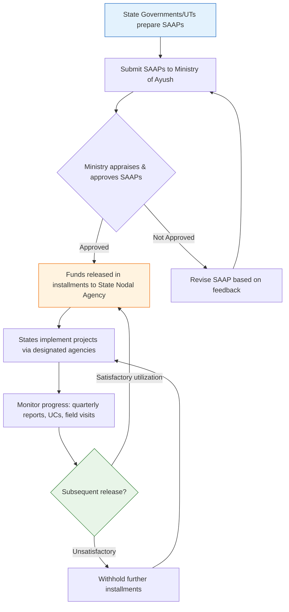

# Comprehensive Scheme Masterclass & File Guide

## Scheme Deep Dive

### Overview
The **National AYUSH Mission (National AYUSH Mission (NAM)** is a centrally sponsored scheme under the **Ministry of Ayush, Government of India**, designed to promote and strengthen AYUSH (Ayurveda, Yoga & Naturopathy, Unani, Siddha, and Homoeopathy) systems of healthcare across India. It operates on an **annual cycle**, with State Annual Action Plans (SAAPs) submitted before the start of each financial year for approval. The scheme provides **grant-in-aid** to State Governments and Union Territories based on approved SAAPs, covering infrastructure, equipment, medicines, human resources, and program management. Funding is released in installments subject to utilization certificates and progress reports, with cost-sharing between the Centre and States (typically **60:40** for most states and **90:10** for Northeastern and Himalayan states).

### Objectives
The National AYUSH Mission aims to:
- Provide cost-effective AYUSH services with universal access through upgrading AYUSH hospitals and dispensaries.
- Strengthen institutional capacity at the state level by upgrading AYUSH educational institutions.
- Ensure availability of quality raw materials for AYUSH systems by supporting cultivation and conservation of medicinal plants.
- Promote sustainable management of medicinal plant resources.
- Support setting up of up to 50-bedded integrated AYUSH hospitals.
- Co-locate AYUSH facilities at Primary Health Centres (PHCs), Community Health Centres (CHCs), and District Hospitals (DHs).
- Support AYUSH wellness centres, including yoga and naturopathy centres.
- Develop and promote AYUSH education and research.

### Eligibility Matrix
| Eligible Entity | Specific Eligibility Criteria | Notes |
|-----------------|-------------------------------|-------|
| State Governments | Eligible to avail financial assistance under NAM | Must submit State Annual Action Plans (SAAPs) approved by the Ministry of Ayush |
| Union Territories | Eligible to avail financial assistance under NAM | Must submit SAAPs approved by the Ministry of Ayush |
| AYUSH Institutions | Supported for upgrading hospitals, dispensaries, and educational institutions | Eligibility based on state-specific project proposals in SAAPs |
| Farmers | Engaged in medicinal plant cultivation | Supported for cultivation and conservation of medicinal plants |
| Medicinal Plant Growers | Involved in conservation and sustainable management | Eligible for support under NAM |
| Organizations | Involved in conservation and sustainable management of medicinal plants | Eligible based on SAAP proposals |

> **Key Caveat**: Eligibility is contingent on submission of State Annual Action Plans (SAAPs) aligned with scheme guidelines and national AYUSH priorities. Land for infrastructure must be free from encumbrances and available for government use.

### Benefits & Financial Support
| Benefit Category | Details | Financial Mechanism |
|------------------|---------|---------------------|
| Infrastructure Development | Upgrading AYUSH hospitals and dispensaries; setting up integrated AYUSH hospitals (up to 50-bedded); co-locating AYUSH facilities at PHCs/CHCs/DHs; establishing AYUSH wellness centres | Grant-in-aid released in installments |
| Equipment & Medicines Procurement | Supply of medicines, list of equipment to be procured | Covered under SAAP; funds released subject to UCs |
| Human Resource Engagement | HR deployment plan for project implementation | Funded via SAAP; requires progress reports |
| Program Management | Administrative and operational costs | Included in SAAP funding |
| Medicinal Plants | Cultivation, conservation, and sustainable management | Financial support for farmers and growers |
| AYUSH Education | Strengthening AYUSH educational institutions | Grant-in-aid for infrastructure and HR |
| AYUSH R&D | Promoting research and development | Supported under SAAP |
| Non-Financial Benefits | Technical guidance, quality standards for AYUSH drugs, benchmark rates for insurance coverage | Provided by Ministry of Ayush; benchmark rates revised periodically (e.g., 2026 revision) |

**Financial Support Notes**:
- Funds are released in **installments** upon submission of Utilization Certificates (UCs) and progress reports.
- Cost-sharing ratio: **60:40 (Centre:State)** for most states; **90:10 (Centre:State)** for Northeastern and Himalayan states.
- Subsequent releases are **contingent on satisfactory utilization** of previous installments.
- The scheme operates as a **centrally sponsored scheme**.

### Application Process

**Application Portal**: [https://ayush.gov.in](https://ayush.gov.in)  
**Key Sources**: Ministry of Ayush guidelines, SAAP submission protocol, fund release mechanics.

### Required Documents
1. State Annual Action Plan (SAAP)
2. Utilization Certificates (UCs)
3. Progress Reports (Physical and Financial)
4. Audit Reports
5. Details of land availability and ownership
6. Architectural and structural plans for infrastructure projects
7. List of equipment and medicines to be procured
8. Human resource deployment plan

### Timelines
| Activity | Timeline | Notes |
|---------|----------|-------|
| SAAP Preparation | Ongoing, based on local needs | Aligned with scheme guidelines |
| SAAP Submission | Before start of each financial year | Annual cycle |
| Ministry Appraisal & Approval | Post-submission | Typically within financial year |
| Fund Release (1st Installment) | Post-approval | Subject to SAAP approval |
| Quarterly Reporting | Every 3 months | Physical and financial progress |
| Utilization Certificate Submission | After each installment | Prerequisite for next release |
| Field Visits & Monitoring | Ongoing | By Ministry/State Nodal Agency |
| Subsequent Installments | Contingent on UC & progress | Based on satisfactory utilization |

> **Important**: The scheme has **no fixed deadline** beyond the annual SAAP cycle; however, delays in SAAP submission or UC submission directly impact fund disbursement.

### Key Takeaways
> The National AYUSH Mission is a **state-driven, centrally funded** initiative where success hinges on **quality SAAP preparation**, **timely UC submission**, and **adherence to cost-sharing norms**. States must treat SAAPs as living documents reflecting local AYUSH needs, while consultants must ensure all 8 required documents are meticulously prepared to avoid funding delays.

---

## Consultant's Field Guide to Generated Files

### 1. SCHEME_MASTER_DATABASE.md
**Real-time Usage**: Keep this open in a background tab during all client calls. When a client asks "What is the turnover limit?" or "Who administers this?", CTRL+F in this document to give an immediate, authoritative answer without checking the portal.

### 2. PITCH_AND_SALES_SCRIPTS.md
**Real-time Usage**: Open this file 5 minutes before your first Discovery Call with a lead. Read the "Problem Framing" out loud to hook them, then use the Qualification Checklist to interrogate their eligibility live on the phone. Keep the Objection Handlers table visible so you can immediately counter when they say "We're too small for this."

### 3. APPLICATION_PLAYBOOK.md
**Real-time Usage**: Print this out or pin it to your desktop once the client signs the retainer. Check off each box in "Stage 1" before moving to "Stage 2". Use the "Client Communication Template" to copy-paste directly into your email when chasing them for pending documents.

### 4. CLIENT_ONBOARDING_AND_CRM.md
**Real-time Usage**: Fill this out during or immediately after the onboarding call. Use the Needs Assessment to record their exact pain points. Update the "Compliance Status" table as they email you documents to maintain a single source of truth for what's missing.

### 5. LIVE_CASE_TRACKER.md
**Real-time Usage**: Review this document every morning during your standup. Update the "Stage" column daily. If a case hits "Stage 07 - Under review", use the Escalation Path notes here to know exactly who to call at the government department today.

### 6. FEE_AND_REVENUE_MODEL.md
**Real-time Usage**: Use this file when drafting the proposal. Look at the client's turnover, map them to the pricing tier in the table, and quote that exact Retainer and Success Fee. Use the monthly projection table to update your personal sales pipeline forecast for the quarter.

### 7. CLIENT_PROPOSAL_TEMPLATE.md
**Real-time Usage**: Copy this entire file, paste it into an email or PDF generator, replace the [PLACEHOLDER] tags with the client's actual details gathered from the CRM, and send it immediately after a successful discovery call.

### 8. COMPLIANCE_AND_LEGAL_PACK.md
**Real-time Usage**: Attach sections 8A and 8B as PDFs to the proposal email. Refuse to start Step 1 of the Application Playbook until the client signs these. Use the Disclaimers to protect yourself legally if the client is rejected by the government agency.