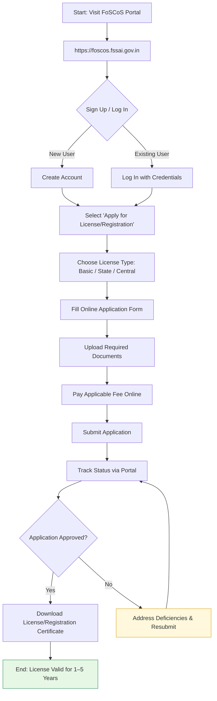

</think># Comprehensive Scheme Masterclass & File Guide

## Scheme Deep Dive

### Overview
The **FSSAI Licensing & Registration** scheme, administered by the **Food Safety and Standards Authority of India (FSSAI)** under the Ministry of Health and Family Welfare, is a mandatory regulatory compliance mechanism for all food business operators (FBOs) in India. It operates via the **Food Safety Compliance System (FoSCoS)** portal at [https://foscos.fssai.gov.in](https://foscos.fssai.gov.in). Unlike subsidy-based schemes, FSSAI licensing does not provide direct financial support; instead, it requires applicants to pay prescribed fees for license issuance and renewal. The scheme ensures food safety and hygiene standards across the food supply chain through a unified online platform enabling real-time tracking, monitoring, and ease of doing business.

### Objectives
- Ensure food safety and hygiene standards across the food supply chain  
- Provide a unified online platform for FSSAI licensing and registration  
- Enable real-time tracking and monitoring of food business compliance  
- Facilitate ease of doing business for food operators through digital services  
- Strengthen regulatory oversight and enforcement of food safety laws  

### Eligibility Matrix
Any person or entity engaged in food business activities—including manufacturing, processing, packaging, storage, distribution, sale, or import of food products—must obtain an FSSAI license or registration based on turnover and scale of operation.

| **Criteria** | **Requirement** | **Details** |
|--------------|-----------------|-----------|
| **Business Activity** | Mandatory for all FBOs | Includes manufacturing, processing, packaging, storage, distribution, sale, or import of food products |
| **Turnover-Based License Type** | Basic / State / Central | Determined by annual turnover and nature of food business (see Financial Support section) |
| **Person Supervising Production** | Qualified personnel required | Must possess at least a degree in Science with Chemistry/Bio Chemistry/Food and Nutrition/Microbiology **OR** a degree/diploma in food technology, dairy technology, dairy microbiology, dairy chemistry, dairy engineering, oil technology, veterinary science, hotel management & catering technology, or any related discipline from a recognized university/institute |
| **Geographic Scope** | Pan-India | Applicable across all states and union territories |
| **Target Beneficiaries** | Food business operators | Manufacturers, traders, retailers, importers, MSMEs |

> **Key Caveat**: The person supervising the production process must meet the educational qualification criteria. Failure to comply may result in application rejection or penalties under the FSS Act, 2006.

### Benefits & Financial Support
FSSAI licensing does **not** provide direct financial support (grants, loans, subsidies). Instead, it involves payment of fees by the applicant. Benefits are operational, legal, and market-access oriented.

| **Benefit Category** | **Specific Benefit** | **Impact** |
|----------------------|----------------------|----------|
| **Legal Compliance** | Legal authorization to operate | Avoids penalties, fines, or business closure under FSS Act, 2006 |
| **Consumer Trust** | Brand reputation enhancement | Builds consumer confidence in product safety and quality |
| **Market Access** | Eligibility for government tenders | Enables participation in public procurement and institutional supply chains |
| **Export Facilitation** | Supports food exports | Required for customs clearance and international market access |
| **Scheme Linkage** | Access to other government schemes | Prerequisite for availing subsidies, incentives, or support under related programs |
| **Branding** | Right to display FSSAI logo | Authorized use of FSSAI logo on products and premises |

| **Fee Structure** | **License Type** | **Applicable Fee** | **Notes** |
|-------------------|------------------|--------------------|---------|
| **Basic Registration** | Petty food businesses | ₹100 per year | For FBOs with annual turnover up to ₹12 lakhs |
| **State License** | Medium-scale FBOs | ₹2,000–₹5,000 per year | For FBOs with annual turnover between ₹12 lakhs and ₹20 crores (varies by state and business type) |
| **Central License** | Large-scale / Importers / Exporters | ₹7,500 per year | For FBOs with annual turnover above ₹20 crores, or those involved in import/export, or operating in multiple states |

> **Important**: Fees are non-refundable and must be paid online via the FoSCoS portal. Licenses are valid for 1 to 5 years (chosen by applicant) and require renewal before expiry. Annual returns must be filed by licensed food businesses.

### Application Process
The application is processed entirely online via the FoSCoS portal. The system undergoes daily maintenance from **11:30 PM to 3:00 AM**; avoid operations during this window.

#### Required Documents
Applicants must upload the following documents during the application process:

1. Photo ID proof of proprietor/partner/director  
2. Address proof of business premises  
3. List of food products to be manufactured/processed/sold  
4. Blueprint/layout plan of the processing unit (for manufacturing units)  
5. List of equipment and machinery installed  
6. No Objection Certificate (NOC) from municipality or local body  
7. Water potability report  
8. Recall plan (where applicable)  
9. Ministry of Commerce certificate for 100% EOU  
10. NOC/PA document issued by FSSAI  
11. IE code document issued by DGFT (for importers/exporters)  
12. Form IX: Nomination of persons by a company along with the board resolution  
13. Certificate from Ministry of Tourism (for hotels)  
14. Proof of possession of premises (sale deed, rent agreement, electricity bill, etc.)  
15. Partnership deed/affidavit of proprietorship/Memorandum & Articles of Association  

> **Warning**: Incomplete or incorrect document submission is a common cause of application delay or rejection. Ensure all documents are clear, legible, and valid at the time of submission.

### Status & Deadlines
- **Application Basis**: Rolling — applications can be submitted throughout the year  
- **License Validity**: 1 to 5 years (selected by applicant at time of application)  
- **Renewal**: Must be renewed before expiry; failure to renew results in lapse of license  
- **System Maintenance**: Daily from **11:30 PM to 3:00 AM** — portal unavailable; avoid transactions during this window  
- **Annual Returns**: Licensed food businesses must file annual returns as per FSSAI regulations  

---

## Consultant's Field Guide to Generated Files

### 1. SCHEME_MASTER_DATABASE.md
**Real-time Usage:** Keep this open in a background tab during all client calls. When a client asks "What is the turnover limit?" or "Who administers this?", CTRL+F in this document to give an immediate, authoritative answer without checking the portal.

### 2. PITCH_AND_SALES_SCRIPTS.md
**Real-time Usage:** Open this file 5 minutes before your first Discovery Call with a lead. Read the "Problem Framing" out loud to hook them, then use the Qualification Checklist to interrogate their eligibility live on the phone. Keep the Objection Handlers table visible so you can immediately counter when they say "We're too small for this."

### 3. APPLICATION_PLAYBOOK.md
**Real-time Usage:** Print this out or pin it to your desktop once the client signs the retainer. Check off each box in "Stage 1" before moving to "Stage 2". Use the "Client Communication Template" to copy-paste directly into your email when chasing them for pending documents.

### 4. CLIENT_ONBOARDING_AND_CRM.md
**Real-time Usage:** Fill this out during or immediately after the onboarding call. Use the Needs Assessment to record their exact pain points. Update the "Compliance Status" table as they email you documents to maintain a single source of truth for what's missing.

### 5. LIVE_CASE_TRACKER.md
**Real-time Usage:** Review this document every morning during your standup. Update the "Stage" column daily. If a case hits "Stage 07 - Under review", use the Escalation Path notes here to know exactly who to call at the government department today.

### 6. FEE_AND_REVENUE_MODEL.md
**Real-time Usage:** Use this file when drafting the proposal. Look at the client's turnover, map them to the pricing tier in the table, and quote that exact Retainer and Success Fee. Use the monthly projection table to update your personal sales pipeline forecast for the quarter.

### 7. CLIENT_PROPOSAL_TEMPLATE.md
**Real-time Usage:** Copy this entire file, paste it into an email or PDF generator, replace the [PLACEHOLDER] tags with the client's actual details gathered from the CRM, and send it immediately after a successful discovery call.

### 8. COMPLIANCE_AND_LEGAL_PACK.md
**Real-time Usage:** Attach sections 8A and 8B as PDFs to the proposal email. Refuse to start Step 1 of the Application Playbook until the client signs these. Use the Disclaimers to protect yourself legally if the client is rejected by the government agency.