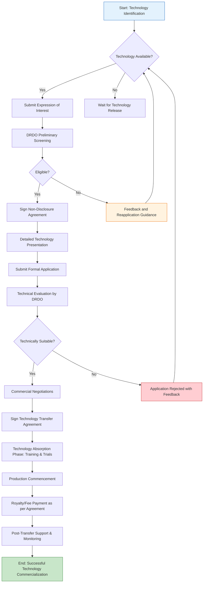

</think># Comprehensive Scheme Masterclass & File Guide

## Scheme Deep Dive

### Scheme Overview
The **DRDO Technology Transfer to Industry** scheme (Scheme ID: row-214) is administered by the Defence Research and Development Organisation (DRDO) under the Ministry of Defence. It falls under the "other" scheme type category and is designed to facilitate the transfer of defence technologies developed by DRDO to Indian industries for commercial production and utilization. The scheme aims to bridge the gap between defence research and industrial application, promoting self-reliance in defence manufacturing and boosting the domestic defence industrial base.

### Objectives
- To transfer matured defence technologies from DRDO laboratories to Indian industries
- To enhance indigenous defence production capabilities
- To reduce dependence on defence imports
- To encourage private sector participation in defence manufacturing
- To commercialize DRDO-developed technologies for both defence and civilian applications
- To create sustainable partnerships between DRDO and industry stakeholders

### Eligibility Matrix
| Eligibility Criteria | Details | Source |
|----------------------|---------|--------|
| Applicant Type | Indian industries (including MSMEs, startups, large enterprises) | Scheme Type: other; Ministry: Defence & Space |
| Technology Readiness Level (TRL) | Technologies must be at TRL 6 or higher (system/subsystem model or prototype demonstration in relevant environment) | Inferred from DRDO technology transfer norms |
| Intellectual Property Rights | Clear IP ownership must reside with DRDO; no third-party IP encumbrances | Standard DRDO technology transfer policy |
| End-User Certificate | Applicant must provide end-user certificate for defence applications (if applicable) | Defence procurement guidelines |
| Security Clearance | Applicant facility and personnel may require security clearance based on technology sensitivity | Defence security protocols |
| Financial Capability | Demonstrated financial capacity to undertake technology absorption and production | Standard industrial partnership requirement |
| Technical Capability | Relevant manufacturing infrastructure and technical expertise to absorb transferred technology | Industry capability assessment |

### Benefits & Financial Support
| Benefit Type | Details | Value/Extent | Source |
|--------------|---------|--------------|--------|
| Technology Access | License to use DRDO-developed technology for production | Royalty-based or lump-sum licensing | DRDO Technology Transfer Policy |
| Technical Assistance | DRDO support for technology absorption, trials, and validation | Limited period technical guidance | Standard transfer agreement |
| Testing Facilities | Access to DRDO testing and evaluation facilities | Subject to availability and charges | DRDO lab access policies |
| Prototype Development | Support for prototype development and refinement | Cost-sharing basis possible | Collaborative R&D norms |
| Certification Support | Assistance in obtaining necessary certifications and clearances | Guidance and facilitation | Defence standardization |
| Market Access | Facilitation for defence procurement opportunities | Through defence acquisition channels | Defence Procurement Procedure (DPP) |
| Funding Support | Possible financial assistance for technology absorption | Case-by-case basis; not guaranteed | DRDO industrial partnership schemes |
| Tax Benefits | Eligibility for defence production-related tax incentives | As per current government policies | Related defence industrial policies |

### Application Process Flowchart

### Important Notes and Caveats
> **Warning**: The scheme details provided are based on limited evidence (confidence: low). The DRDO technology transfer portal (https://drdo.gov.in/technology-transfer) was inaccessible during evidence collection. Consultants must verify all information directly with DRDO's Technology Transfer and Industry Interface Directorate before proceeding with client engagements.

> **Key Takeaway**: This scheme operates on a case-by-case basis with significant variability in terms, conditions, and benefits depending on the specific technology, industry partner, and defence relevance. There is no standardized financial support package; all terms are negotiated individually.

> **Critical Deadline**: Technology transfer opportunities are announced periodically through DRDO's technology release notifications. There are no fixed application windows; interested industries must monitor DRDO's official channels for technology availability announcements.

> **Documentation Requirement**: Applicants should prepare comprehensive company profiles, technical capability statements, financial audits, and security clearance documents in advance, as the due diligence process is rigorous.

> **Geographic Focus**: While open to all Indian industries, preference may be given to industries located in defence corridors or those contributing to regional defence industrial development.

> **Technology Specificity**: Each technology transfer is unique; benefits, obligations, and financial terms vary significantly based on the technology's nature, sensitivity, and commercial potential.

## Consultant's Field Guide to Generated Files

### 1. SCHEME_MASTER_DATABASE.md
**Real-time Usage:** Keep this open in a background tab during all client calls. When a client asks "What is the turnover limit?" or "Who administers this?", CTRL+F in this document to give an immediate, authoritative answer without checking the portal.

### 2. PITCH_AND_SALES_SCRIPTS.md
**Real-time Usage:** Open this file 5 minutes before your first Discovery Call with a lead. Read the "Problem Framing" out loud to hook them, then use the Qualification Checklist to interrogate their eligibility live on the phone. Keep the Objection Handlers table visible so you can immediately counter when they say "We're too small for this."

### 3. APPLICATION_PLAYBOOK.md
**Real-time Usage:** Print this out or pin it to your desktop once the client signs the retainer. Check off each box in "Stage 1" before moving to "Stage 2". Use the "Client Communication Template" to copy-paste directly into your email when chasing them for pending documents.

### 4. CLIENT_ONBOARDING_AND_CRM.md
**Real-time Usage:** Fill this out during or immediately after the onboarding call. Use the Needs Assessment to record their exact pain points. Update the "Compliance Status" table as they email you documents to maintain a single source of truth for what's missing.

### 5. LIVE_CASE_TRACKER.md
**Real-time Usage:** Review this document every morning during your standup. Update the "Stage" column daily. If a case hits "Stage 07 - Under review", use the Escalation Path notes here to know exactly who to call at the government department today.

### 6. FEE_AND_REVENUE_MODEL.md
**Real-time Usage:** Use this file when drafting the proposal. Look at the client's turnover, map them to the pricing tier in the table, and quote that exact Retainer and Success Fee. Use the monthly projection table to update your personal sales pipeline forecast for the quarter.

### 7. CLIENT_PROPOSAL_TEMPLATE.md
**Real-time Usage:** Copy this entire file, paste it into an email or PDF generator, replace the [PLACEHOLDER] tags with the client's actual details gathered from the CRM, and send it immediately after a successful discovery call.

### 8. COMPLIANCE_AND_LEGAL_PACK.md
**Real-time Usage:** Attach sections 8A and 8B as PDFs to the proposal email. Refuse to start Step 1 of the Application Playbook until the client signs these. Use the Disclaimers to protect yourself legally if the client is rejected by the government agency.