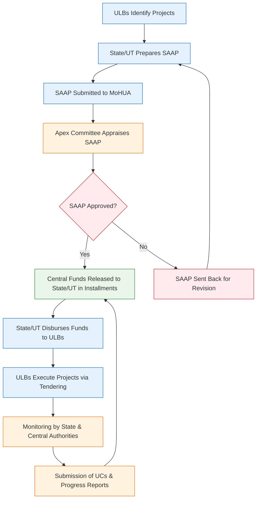

</think># Comprehensive Scheme Masterclass & File Guide

## Scheme Deep Dive

### Overview
The Atal Mission for Rejuvenation and Urban Transformation (AMRUT 1.0) was a centrally sponsored scheme implemented by the Ministry of Housing and Urban Affairs (MoHUA), Government of India, from 2015-16 to 2019-20. It targeted 500 selected cities across India to improve basic urban infrastructure and service delivery. The scheme has since been subsumed into AMRUT 2.0, launched in 2021, and no new applications are being accepted under AMRUT 1.0.

### Objectives
AMRUT 1.0 aimed to:
- Ensure every household has access to a tap with assured water supply and a sewerage connection.
- Increase the amenity value of cities by developing greenery and well-maintained open spaces (e.g., parks).
- Reduce pollution by promoting public transport and constructing facilities for non-motorized transport (e.g., walking and cycling).
- Strengthen the institutional and financial capacity of Urban Local Bodies (ULBs) for effective service delivery.
- Promote reforms in urban governance and service delivery through incentive-based mechanisms.

### Geographic Scope and Implementing Agency
- **Geographic Scope**: Pan-India, covering 500 selected cities.
- **Implementing Agency**: Ministry of Housing and Urban Affairs (MoHUA), Government of India.
- **Application Portal**: [https://amrut.gov.in](https://amrut.gov.in)

### Eligibility Matrix
AMRUT 1.0 covered 500 cities selected based on specific criteria. Eligible entities were Urban Local Bodies (ULBs) of these cities.

| Eligibility Criterion | Details |
|-----------------------|---------|
| Population Threshold | All cities and towns with a population of over one lakh (100,000) with notified Municipalities, including Cantonment Boards. |
| Capital Cities | All capital cities of States and Union Territories. |
| Heritage Cities | Cities classified as Heritage Cities by MoHUA under the HRIDAY scheme. |
| Riverfront Cities | Cities located on the stem of major rivers (between 5-50 km from the riverbank). |
| Eligible Entities | Urban Local Bodies (ULBs) of the selected 500 cities, including municipal corporations, municipalities, and notified area committees. |
| Target Beneficiaries | Urban local bodies, municipal corporations, state governments, and the urban poor. |

### Financial Support and Fund Allocation
AMRUT 1.0 had a total central outlay of INR 50,000 crore for the period 2015-16 to 2019-20. Funding was shared between the Centre and States/UTs based on prescribed ratios.

| Entity Type | Central Share | State/UT Share | Notes |
|-------------|---------------|----------------|-------|
| North Eastern and Himalayan States | 90% | 10% | Higher central share due to special category status. |
| Other States | 80% | 20% | Standard funding pattern for most states. |
| Union Territories | 50% | 50% | Equal sharing between Centre and UT administration. |

**Key Financial Details**:
- **Total Scheme Outlay**: INR 50,000 crore (central allocation).
- **Funding Mechanism**: Central Assistance provided as grant-in-aid to States/UTs based on project proposals submitted in State Annual Action Plans (SAAPs).
- **Approval Body**: SAAPs are appraised and approved by the Apex Committee chaired by the Secretary, MoHUA.
- **Fund Disbursement**: Released in installments to States/UTs upon submission of Utilization Certificates (UCs) and progress reports.
- **Further Disbursement**: States/UTs disburse funds to ULBs for project implementation.

### Benefits and Sectoral Coverage
AMRUT 1.0 provided financial assistance for infrastructure projects in the following sectors:

| Sector | Specific Components |
|--------|---------------------|
| Water Supply | Household tap connections, augmentation of existing systems, rehabilitation of old pipelines. |
| Sewerage and Septage Management | Sewerage networks, sewage treatment plants (STPs), septage management, public and community toilets. |
| Storm Water Drainage | Construction and improvement of drains, flood management systems. |
| Green Spaces and Parks | Development of parks, green belts, rejuvenation of water bodies, urban forestry. |
| Non-Motorized Urban Transport | Footpaths, cycle tracks, pedestrian zones, non-motorized transport (NMT) infrastructure. |

**Additional Benefits**:
- Promotes convergence with other central schemes: Swachh Bharat Mission (Urban), Housing for All (Urban), and Smart Cities Mission.
- Encourages Public-Private Partnerships (PPPs) in project execution.
- Aims to improve service delivery and urban governance through institutional reforms and capacity building of ULBs.
- Focus on achieving Service Level Benchmarks (SLBs) and urban reform milestones.

### Required Documents
Entities seeking funding under AMRUT 1.0 were required to submit the following documents as part of the State Annual Action Plan (SAAP) process:

1. State Annual Action Plan (SAAP)
2. Utilization Certificates (UCs)
3. Progress Reports (Physical and Financial)
4. Project Detailed Project Reports (DPRs)
5. Land availability and ownership documents
6. Environmental and social clearances (if applicable)
7. Approval from State Level Sanctioning Committee (SLSC)

### Application Process
The application process under AMRUT 1.0 was state-driven, with ULBs proposing projects through their respective State Governments. The process involved multiple stages of appraisal and approval.

**Key Process Notes**:
- SAAPs detail project proposals for water supply, sewerage, drainage, green spaces, and non-motorized transport.
- Central funds are released only upon submission of Utilization Certificates and progress reports.
- States/UTs must contribute their matching share as per the prescribed funding pattern (90:10, 80:20, or 50:50).
- Projects must conform to approved Service Level Benchmarks (SLBs) and urban reform milestones.

### Key Caveats and Warnings
> **Critical Limitations**:
> - AMRUT 1.0 has been completed and subsumed into AMRUT 2.0, which was launched in 2021. **No new applications are being accepted under AMRUT 1.0.**
> - Central assistance is released strictly upon submission of Utilization Certificates (UCs) and progress reports; delays in submission halt further funding.
> - States/UTs are mandatorily required to contribute their matching share (10%, 20%, or 50%) as per the funding pattern; failure to do so results in non-release of central funds.
> - All projects must adhere to approved Service Level Benchmarks (SLBs) and achieve specified urban reform milestones; non-compliance risks fund withdrawal or penalties.
> - The scheme operates through a state-centric model; direct applications by ULBs or private entities are not permitted. All proposals must flow via the State Government and SAAP mechanism.

> **Strategic Note for Consultants**: While AMRUT 1.0 is closed, understanding its structure is vital for advising clients on AMRUT 2.0 or similar urban infrastructure schemes. Focus on SAAP preparation, UC compliance, and SLB achievement remains relevant across successive missions.

## Consultant's Field Guide to Generated Files

### 1. SCHEME_MASTER_DATABASE.md
**Real-time Usage:** Keep this open in a background tab during all client calls. When a client asks "What is the turnover limit?" or "Who administers this?", CTRL+F in this document to give an immediate, authoritative answer without checking the portal.

### 2. PITCH_AND_SALES_SCRIPTS.md
**Real-time Usage:** Open this file 5 minutes before your first Discovery Call with a lead. Read the "Problem Framing" out loud to hook them, then use the Qualification Checklist to interrogate their eligibility live on the phone. Keep the Objection Handlers table visible so you can immediately counter when they say "We're too small for this."

### 3. APPLICATION_PLAYBOOK.md
**Real-time Usage:** Print this out or pin it to your desktop once the client signs the retainer. Check off each box in "Stage 1" before moving to "Stage 2". Use the "Client Communication Template" to copy-paste directly into your email when chasing them for pending documents.

### 4. CLIENT_ONBOARDING_AND_CRM.md
**Real-time Usage:** Fill this out during or immediately after the onboarding call. Use the Needs Assessment to record their exact pain points. Update the "Compliance Status" table as they email you documents to maintain a single source of truth for what's missing.

### 5. LIVE_CASE_TRACKER.md
**Real-time Usage:** Review this document every morning during your standup. Update the "Stage" column daily. If a case hits "Stage 07 - Under review", use the Escalation Path notes here to know exactly who to call at the government department today.

### 6. FEE_AND_REVENUE_MODEL.md
**Real-time Usage:** Use this file when drafting the proposal. Look at the client's turnover, map them to the pricing tier in the table, and quote that exact Retainer and Success Fee. Use the monthly projection table to update your personal sales pipeline forecast for the quarter.

### 7. CLIENT_PROPOSAL_TEMPLATE.md
**Real-time Usage:** Copy this entire file, paste it into an email or PDF generator, replace the [PLACEHOLDER] tags with the client's actual details gathered from the CRM, and send it immediately after a successful discovery call.

### 8. COMPLIANCE_AND_LEGAL_PACK.md
**Real-time Usage:** Attach sections 8A and 8B as PDFs to the proposal email. Refuse to start Step 1 of the Application Playbook until the client signs these. Use the Disclaimers to protect yourself legally if the client is rejected by the government agency.