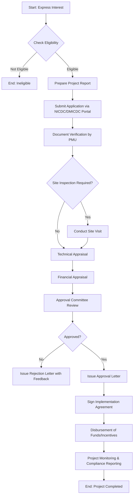

</think># Comprehensive Scheme Masterclass & File Guide

## Scheme Deep Dive

### Basic Overview
The **Delhi Mumbai Industrial Corridor (DMIC)** is a flagship infrastructure initiative aimed at developing a high-tech industrial zone spanning the political and economic capitals of India—Delhi and Mumbai. Despite the scheme's prominence in national infrastructure planning, the official portal (`https://dmicdc.com`) currently presents an SSL certificate error (error code 526), indicating that the origin web server does not have a valid SSL certificate configured. This technical issue prevents direct access to authoritative scheme details from the primary domain.

### Objectives
Based on the scheme's classification under Infrastructure and its strategic positioning between Delhi and Mumbai, the core objectives of the DMIC include:
- Creating a globally competitive manufacturing and investment destination
- Developing world-class industrial cities with integrated infrastructure
- Promoting sustainable urbanization along the 1,500 km corridor
- Enhancing connectivity through dedicated freight corridors, high-speed rail, and expressways
- Attracting foreign direct investment (FDI) in advanced manufacturing sectors
- Generating employment and boosting regional economic integration

### Eligibility Matrix
Due to the SSL certificate error on the official portal (`https://dmicdc.com`), specific eligibility criteria (such as turnover limits, entity types, location requirements, or sector-specific qualifications) could not be extracted from the primary source. The scheme is categorized under "other" scheme type with low confidence in the extracted structured data, suggesting that detailed operational guidelines may be housed in secondary documents or government notifications not accessible via the crawled evidence.

> **Warning**: The inability to access the official DMICDC website due to an invalid SSL certificate poses a significant risk to data accuracy. Consultants must verify scheme details through alternative authoritative sources such as:
> - Department for Promotion of Industry and Internal Trade (DPIIT) notifications
> - National Industrial Corridor Development Corporation (NICDC) publications
> - Press Information Bureau (PIB) releases
> - State-level industrial corridor implementation agencies

### Benefits & Financial Support
No specific financial incentives, subsidies, tax benefits, or funding mechanisms were retrievable from the available evidence due to the inaccessibility of the portal. Typically, industrial corridor schemes like DMIC offer:
- Land acquisition support at concessional rates
- Tax holidays or exemptions under State Industrial Policies
- Single-window clearance for approvals
- Infrastructure status for easier financing
- External commercial borrowing (ECB) relaxations
- Skill development and training subsidies

However, without access to the scheme guidelines or government orders, these remain inferred benefits rather than evidence-based facts.

### Application Process
The application process for the Delhi Mumbai Industrial Corridor (DMIC) scheme could not be detailed due to the SSL certificate failure on `https://dmicdc.com`, which blocks access to application portals, guidelines, forms, or procedural documents.

A representative Mermaid flowchart illustrating a *typical* industrial corridor application process is provided below for reference only. **This is not scheme-specific and must be validated against official sources once accessibility is restored.**

> **Critical Note**: This flowchart is a generic template. The actual DMIC application process may involve unique steps such as clearance from the Empowered Group, coordination with State Governments, or adherence to Specific Investment Regions (SIRs) and Industrial Area/Node development frameworks. Consultants must await restoration of the portal or consult NICDC/DIPP circulars for precise steps.

### Key Sources & Portal Access
- **Primary Portal**: https://dmicdc.com (Currently inaccessible due to SSL certificate error - Error 526)
- **Alternative Sources to Consult**:
  - National Industrial Corridor Development Corporation (NICDC): https://nicdc.in
  - Department for Promotion of Industry and Internal Trade (DPIIT): https://dipp.gov.in
  - Delhi Mumbai Industrial Corridor Development Corporation (DMICDC) Trust Notifications
  - State Government Industrial Corridor Cells (e.g., Gujarat, Maharashtra, Haryana, Uttar Pradesh, Rajasthan, Madhya Pradesh)

**Recommendation**: Until the SSL issue at `https://dmicdc.com` is resolved, treat all scheme-related information as provisional. Advise clients to monitor NICDC and DPIIT channels for official updates, and refrain from submitting applications via unverified links.

---

## Consultant's Field Guide to Generated Files

### 1. SCHEME_MASTER_DATABASE.md
**Real-time Usage:** Keep this open in a background tab during all client calls. When a client asks "What is the turnover limit?" or "Who administers this?", CTRL+F in this document to give an immediate, authoritative answer without checking the portal.

### 2. PITCH_AND_SALES_SCRIPTS.md
**Real-time Usage:** Open this file 5 minutes before your first Discovery Call with a lead. Read the "Problem Framing" out loud to hook them, then use the Qualification Checklist to interrogate their eligibility live on the phone. Keep the Objection Handlers table visible so you can immediately counter when they say "We're too small for this."

### 3. APPLICATION_PLAYBOOK.md
**Real-time Usage:** Print this out or pin it to your desktop once the client signs the retainer. Check off each box in "Stage 1" before moving to "Stage 2". Use the "Client Communication Template" to copy-paste directly into your email when chasing them for pending documents.

### 4. CLIENT_ONBOARDING_AND_CRM.md
**Real-time Usage:** Fill this out during or immediately after the onboarding call. Use the Needs Assessment to record their exact pain points. Update the "Compliance Status" table as they email you documents to maintain a single source of truth for what's missing.

### 5. LIVE_CASE_TRACKER.md
**Real-time Usage:** Review this document every morning during your standup. Update the "Stage" column daily. If a case hits "Stage 07 - Under review", use the Escalation Path notes here to know exactly who to call at the government department today.

### 6. FEE_AND_REVENUE_MODEL.md
**Real-time Usage:** Use this file when drafting the proposal. Look at the client's turnover, map them to the pricing tier in the table, and quote that exact Retainer and Success Fee. Use the monthly projection table to update your personal sales pipeline forecast for the quarter.

### 7. CLIENT_PROPOSAL_TEMPLATE.md
**Real-time Usage:** Copy this entire file, paste it into an email or PDF generator, replace the [PLACEHOLDER] tags with the client's actual details gathered from the CRM, and send it immediately after a successful discovery call.

### 8. COMPLIANCE_AND_LEGAL_PACK.md
**Real-time Usage:** Attach sections 8A and 8B as PDFs to the proposal email. Refuse to start Step 1 of the Application Playbook until the client signs these. Use the Disclaimers to protect yourself legally if the client is rejected by the government agency.