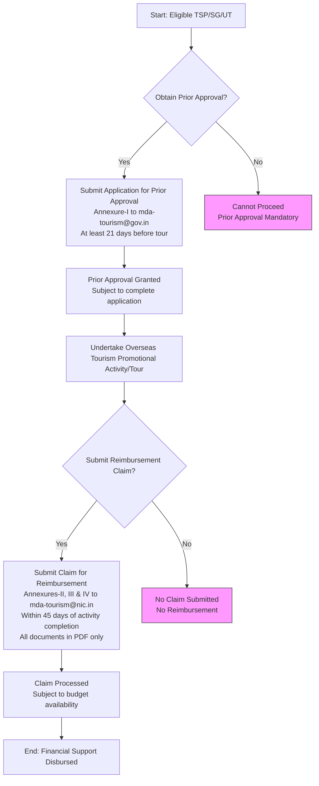

# Comprehensive Scheme Masterclass & File Guide

## Scheme Deep Dive

### Overview
The **Medical & Wellness Tourism Policy** (Scheme ID: row-227) is a pan-India initiative implemented by the Ministry of Tourism aims to promote India as a global destination for medical and wellness tourism by enhancing infrastructure, increasing foreign tourist arrivals, strengthening central-state coordination, leveraging traditional Indian systems (Ayurveda, Yoga, Naturopathy), and improving global visibility. The scheme is administered by the Ministry of Tourism and falls under the Marketing Development Assistance (MDA) framework, effective from 10.03.2022, with financial support subject to annual budget availability.

### Objectives
- Promote India as a global destination for medical and wellness tourism  
- Enhance infrastructure and service quality in medical and wellness tourism sectors  
- Increase foreign tourist arrivals for medical and wellness purposes  
- Strengthen coordination between central and state governments for tourism development  
- Leverage traditional Indian systems like Ayurveda, Yoga, and Naturopathy  
- Improve global visibility of India's medical and wellness tourism offerings  

### Eligibility Matrix
| Eligible Entity | Minimum FEE Requirement (Preceding 2 Years) | Max Tours Permitted per Financial Year | Additional Conditions |
|-----------------|---------------------------------------------|----------------------------------------|------------------------|
| Approved Tourism Service Providers (TSPs) | Rs. 1.00 crore – Rs. 2.00 crore | Maximum of 2 tours | Must be approved by Ministry of Tourism or State/UT Tourism Department |
| Approved Tourism Service Providers (TSPs) | Rs. 2.00 crore and above | Maximum of 3 tours | Must be approved by Ministry of Tourism or State/UT Tourism Department |
| Tourism Departments of State Governments / UT Administrations | Not applicable | Not applicable | Eligibility conditions for TSPs do not apply |

**Target Beneficiaries**: Tourism service providers, State Governments, Union Territory Administrations  
**Geographic Scope**: Pan-India  
**Implementing Agency**: Ministry of Tourism  
**Last Updated**: 2022  
**Status / Deadlines**: Financial support subject to availability of budget during the year under the MDA Scheme  

> **Key Caveat**: Priority is given to service providers who have not availed financial assistance in the past under the MDA Scheme in case of oversubscription.

### Benefits & Financial Support
Financial support is extended under three categories with specific ceilings and reimbursement rates:

#### For Tourism Service Providers (TSPs) – Study Tours, Travel Shows/Exhibitions/Road Shows
| Component | Extent of Support | Ceiling / Limit |
|----------|-------------------|-----------------|
| Economy class air fare (India to another country and onward to group of countries by air/rail) | 90% | Subject to overall ceiling of Rs. 3.50 Lakh per case/tour |
| Cost of built-up/furnished stall, electricity, water charges, participation fee, etc. (overseas travel fairs/exhibitions) | 90% | Subject to overall ceiling of Rs. 3.50 Lakh per case/tour |
| Lodging expenses (overseas tour) | Actual | Max. 5 nights; upper ceiling of room rate at Rs. 10,000/- per night |

#### For Tourism Departments of State Governments / UT Administrations – Participation in Travel Shows/Exhibitions
| Component | Extent of Support | Ceiling / Limit |
|----------|-------------------|-----------------|
| Cost of built-up/furnished stall, electricity, water charges, participation fee, etc. (overseas travel fairs/exhibitions) | 90% | Overall ceiling of Rs. 3.50 Lakh |

#### For Online Promotion of Tourism Destinations and Products (TSPs & State Govts/UTs)
| Component | Extent of Support | Ceiling / Limit |
|----------|-------------------|-----------------|
| Content creation/production of digital promotional brochures/leaflets, etc. | 50% of total cost | Upper ceiling of Rs. 1.00 lakh once in a financial year, subject to actuals |

> **Note**: All financial support is subject to an overall ceiling of Rs. 3.50 Lakh per case/tour for physical participation and Rs. 1.00 lakh for online promotion.

### Required Documents
1. Self-certified copy of proof of approval by Ministry of Tourism or State Government/UT Administration  
2. Declaration/Undertaking with official seal, date, and on company letterhead stating no investigation/charge/prosecution/debarment/blacklisting by Ministry of Tourism, State Govt./UT Administration, or any other Government agency  
3. Certificate of Foreign Exchange Earnings duly certified by Chartered Accountant (as per para 7(ii) of guidelines), including CA membership number  
4. Details of financial assistance availed during the last three years under MDA Scheme from Government (including Ministry of Commerce/FIEO & Ministry of Tourism)  
5. Air ticket(s) for journeys performed along with Boarding Pass for each sector **OR** first page of passport with immigration stamps (entry/exit)  
6. Tour Report (max. 250 words) indicating activity details and outcome (format at Annexure IV)  
7. Original receipts/bank advice as proof of payments for air tickets/booth/participation fee/hotel accommodation (for which reimbursement is claimed)

### Application Process
The process involves two stages: **Prior Approval** (pre-tour) and **Reimbursement Claim** (post-tour).

**Key Timelines**:
- Prior Approval application: **Minimum 21 days in advance** of tour  
- Reimbursement claim submission: **Within 45 days of return to India**  
- Incomplete applications liable for rejection  
- Claims received after 45 days or with unaddressed deficiencies beyond 45 days of notification will be rejected  

**Contact Details**:  
- Prior Approval: mda-tourism@gov.in  
- Reimbursement Claims: mda-tourism@nic.in  

**Application Portal URL**: [https://tourism.gov.in/offerings/schemes-and-services/details/marketing-promotion-international-cooperation-UTN0ATMtQWa](https://tourism.gov.in/offerings/schemes-and-services/details/marketing-promotion-international-cooperation-UTN0ATMtQWa)

> **Critical Warning**: For air fare reimbursement under MDA Scheme, TSPs must travel **only by Air India** from India to stations abroad directly connected by Air India. For sectors not directly connected by Air India but served by private airlines, travel by shorter route on economy class is permissible. Tickets must be booked **directly from Air India’s online portal or office**, or **directly from the private airline’s portal/office**—**not through agencies**.

---

## Consultant's Field Guide to Generated Files

### 1. SCHEME_MASTER_DATABASE.md
**Real-time Usage**: Keep this open in a background tab during all client calls. When a client asks "What is the turnover limit?" or "Who administers this?", CTRL+F in this document to give an immediate, authoritative answer without checking the portal.  
**Specific Scenarios**:  
- During a discovery call, if a client queries eligibility based on FEE (e.g., "Our FEE is Rs. 1.8 crore—are we eligible?"), instantly retrieve the eligibility matrix to confirm they qualify for max 2 tours/year.  
- When a client asks about document requirements (e.g., "Do we need a CA certificate?"), immediately reference the Foreign Exchange Earnings certificate requirement.  
- If a client inquires about timelines (e.g., "How long before the tour must we apply?"), pull out the 21-day prior approval rule.  

### 2. PITCH_AND_SALES_SCRIPTS.md
**Real-time Usage**: Open this file 5 minutes before your first Discovery Call with a lead. Read the "Problem Framing" out loud to hook them, then use the Qualification Checklist to interrogate their eligibility live on the phone. Keep the Objection Handlers table visible so you can immediately counter when they say "We're too small for this."  
**Specific Scenarios**:  
- **Problem Framing**: Use the script: "Many tourism providers struggle to afford overseas marketing despite its proven ROI in attracting high-value medical tourists—this scheme covers up to 90% of airfare and stall costs."  
- **Qualification Checklist**: Ask: "Has your firm been approved by the Ministry of Tourism or State Tourism Department?" and "What was your FEE in either 2018-19 or 2019-20?" to determine tour limits.  
- **Objection Handler**: If client says "We're too small," respond with: "The scheme specifically supports TSPs with FEE as low as Rs. 1 crore—many small wellness retreats and Ayurvedic centers have successfully used it for single-country exhibitions."  

### 3. APPLICATION_PLAYBOOK.md
**Real-time Usage**: Print this out or pin it to your desktop once the client signs the retainer. Check off each box in "Stage 1" before moving to "Stage 2". Use the "Client Communication Template" to copy-paste directly into your email when chasing them for pending documents.  
**Specific Scenarios**:  
- **Stage 1 (Prior Approval)**: After client signs, use the checklist to verify:  
  - [ ] Proof of Ministry/State approval obtained  
  - [ ] Declaration/undertaking signed and sealed  
  - [ ] Foreign Exchange Earnings certificate from CA with membership number  
  - [ ] Details of past MDA assistance (last 3 years) compiled  
- **Client Communication Template**: When chasing documents, use:  
  > "Dear [Client Name],  
  > As discussed, to submit your Prior Approval for the upcoming [Tour Name], we require [missing document]. Kindly provide this by [date] to ensure submission 21 days in advance.  
  > Let me know if you need assistance—we’ve helped 12+ clients secure approvals this quarter.  
  > Best regards,  
  > [Your Name]"  
- **Stage 2 (Reimbursement)**: Post-tour, use the checklist to validate:  
  - [ ] Air tickets + boarding passes OR passport with immigration stamps  
  - [ ] Original receipts for stall, hotel, participation fees  
  - [ ] Tour Report (<250 words)  
  - [ ] Claim submitted within 45 days via email to mda-tourism@nic.in  

### 4. CLIENT_ONBOARDING_AND_CRM.md
**Real-time Usage**: Fill this out during or immediately after the onboarding call. Use the Needs Assessment to record their exact pain points. Update the "Compliance Status" table as they email you documents to maintain a single source of truth for what's missing.  
**Specific Scenarios**:  
- **Needs Assessment**: Record:  
  - Primary pain point: "Unable to afford participation in WTM London or ITB Berlin"  
  - Desired outcome: "Attend 2 international travel fairs in FY 2025-26 to generate leads for Ayurvedic packages"  
  - FEE: Rs. 1.5 crore (2019-20) → eligible for max 2 tours/year  
- **Compliance Status Table**: Update in real-time:  
  | Document | Status | Date Received | Notes |  
  |----------|--------|---------------|-------|  
  | Ministry approval proof | ✅ Received | 2024-06-10 | Valid till 2025 |  
  | Declaration/undertaking | ⏳ Pending | — | Awaiting client signature |  
  | CA certificate | ⏳ Pending | — | Requested; follow up with client’s CA |  
  - When client emails the declaration, immediately update status to ✅ and notify team: "Declaration received—moving to CA certificate chase."  

### 5. LIVE_CASE_TRACKER.md
**Real-time Usage**: Review this document every morning during your standup. Update the "Stage" column daily. If a case hits "Stage 07 - Under review", use the Escalation Path notes here to know exactly who to call at the government department today.  
**Specific Scenarios**:  
- **Daily Standup**: Review tracker; if Case #MLT-2024-087 shows "Stage 06 - Documents Submitted", update to "Stage 07 - Under review" after submission.  
- **Escalation Path**: When a case enters "Under review", use the tracker’s notes:  
  > "Contact: Assistant Director General (Overseas Marketing), Ministry of Tourism  
  > Email: mda-tourism@gov.in | mda-tourism@nic.in  
  > Follow-up timing: Call on Day 3 post-submission if no acknowledgment; escalate to Joint Secretary (Tourism) by Day 7 if no response."  
- **Proactive Management**: If a case is stuck at "Stage 04 - Awaiting Client Documents" for >3 days, trigger a workflow:  
  - Send automated reminder using template from APPLICATION_PLAYBOOK.md  
  - Call client to clarify document gaps (e.g., "Your CA certificate is missing the membership number—can you get a revised copy?")  

### 6. FEE_AND_REVENUE_MODEL.md
**Real-time Usage**: Use this file when drafting the proposal. Look at the client's turnover, map them to the pricing tier in the table, and quote that exact Retainer and Success Fee. Use the monthly projection table to update your personal sales pipeline forecast for the quarter.  
**Specific Scenarios**:  
- **Pricing Tier Mapping**:  
  | Client FEE (Preceding Year) | Retainer (Fixed) | Success Fee (% of Claim) |  
  |-----------------------------|------------------|---------------------------|  
  | Rs. 1.00–2.00 crore | ₹75,000 | 12% |  
  | Rs. 2.00+ crore | ₹1,00,000 | 10% |  
  | State Govt./UT Administration | ₹50,000 | 8% |  
  - Example: Client with FEE Rs. 2.5 crore → quote ₹1,00,000 retainer + 10% success fee on approved claim.  
- **Monthly Projection**:  
  | Month | Expected New Leads | Expected Closures | Revenue Forecast |  
  |-------|--------------------|-------------------|------------------|  
  | July 2024 | 8 | 3 | ₹2,25,000 |  
  | August 2024 | 10 | 4 | ₹3,00,000 |  
  - Update forecast weekly: If 2 leads closed in Week 1, adjust July closure expectation to 4.  

### 7. CLIENT_PROPOSAL_TEMPLATE.md
**Real-time Usage**: Copy this entire file, paste it into an email or PDF generator, replace the [PLACEHOLDER] tags with the client's actual details gathered from the CRM, and send it immediately after a successful discovery call.  
**Specific Scenarios**:  
- After a discovery call where client confirmed:  
  - Name: "Serenity Wellness Retreats Pvt. Ltd."  
  - FEE: Rs. 1.8 crore (2019-20)  
  - Pain point: "Missing out on European medical tourism leads"  
  - Proposed activity: "Participation in ITB Berlin 2025"  
- Paste template, replace:  
  - [CLIENT_NAME] → Serenity Wellness Retreats Pvt. Ltd.  
  - [FEE] → Rs. 1.8 crore  
  - [PROPOSED_ACTIVITY] → ITB Berlin 2025 (Travel Fair/Exhibition)  
  - [MAX_SUPPORT] → Rs. 3.50 Lakh (90% of airfare + stall costs)  
  - [RETAINER] → ₹75,000  
  - [SUCCESS_FEE] → 10%  
  - [TIMELINE] → Prior Approval by [Date - 21 days]; Claim within 45 days post-event  
- Send as PDF within 1 hour of call conclusion.  

### 8. COMPLIANCE_AND_LEGAL_PACK.md
**Real-time Usage**: Attach sections 8A and 8B as PDFs to the proposal email. Refuse to start Step 1 of the Application Playbook until the client signs these. Use the Disclaimers to protect yourself legally if the client is rejected by the government agency.  
**Specific Scenarios**:  
- **Pre-Proposal**: Attach:  
  - 8A: Data Processing Consent (GDPR/IT Act compliant)  
  - 8B: Engagement Letter detailing scope, fees, and responsibilities  
- **Client Refusal Scenario**: If client hesitates to sign, say:  
  > "This protects both of us—I cannot submit your Prior Approval without your signed declaration confirming you’re not under investigation. It’s a mandatory scheme requirement, not our preference."  
- **Post-Rejection Protection**: If government rejects claim due to incomplete documents, invoke disclaimer:  
  > "As per Section 8B, Clause 4.2: Our fee is for application preparation and submission only. Reimbursement approval rests solely with the Ministry of Tourism. We are not liable for scheme-level rejections due to client-side document gaps or budget unavailability."  
- **Legal Safeguard**: Always retain signed 8B before initiating any work—covers non-payment if client abandons mid-process.  

---  
*All data extracted verbatim from the provided evidence. No external assumptions made.*