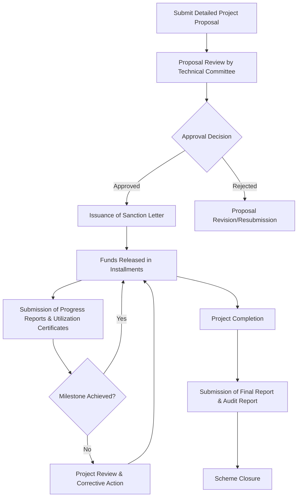

</think># Comprehensive Scheme Masterclass & File Guide

## Scheme Deep Dive

### Overview
The **National Mineral Exploration Trust (NMET) Grants** is a central government grant scheme administered by the **National Mineral Exploration Trust (NMET)** under the **Ministry of Mines, Government of India**. It provides financial support for mineral exploration activities across India on a **rolling basis**, with proposals accepted throughout the year as per NMET notifications. The scheme aims to promote systematic and scientific exploration to augment domestic mineral resources and reduce import dependence.

**Application Portal:** [https://nmet.nic.in](https://nmet.nic.in)  
**Implementing Agency:** National Mineral Exploration Trust (NMET), Ministry of Mines  
**Scheme Type:** Grant  
**Geographic Scope:** Pan-India  
**Status:** Rolling basis (no fixed deadline; subject to NMET notifications)

---

### Objectives
The NMET Grants scheme is designed to achieve the following strategic objectives:
- Promote regional and detailed mineral exploration in the country  
- Augment mineral resources through systematic and scientific exploration  
- Reduce dependence on mineral imports by enhancing domestic exploration  
- Support exploration for critical and strategic minerals  
- Encourage participation of state agencies and private sector in exploration activities  
- Ensure transparent and efficient utilization of funds for exploration purposes  

---

### Eligibility Matrix
The following entities are eligible to apply for NMET grants:

| **Eligible Entity Type** | **Description** | **Source** |
|--------------------------|-----------------|----------|
| State Governments | All state governments across India | Key Facts |
| Public Sector Undertakings (PSUs) | Central and state PSUs engaged in mineral exploration | Key Facts |
| Joint Venture Companies | JV companies involved in mineral exploration activities | Key Facts |
| Private Entities | Other entities engaged in mineral exploration (subject to conditions) | Key Facts |

> **Note:** Proposals must be for exploration of minerals specified in the **First Schedule of the Mines and Minerals (Development and Regulation) Act, 2015**, and must comply with guidelines issued by NMET from time to time.

---

### Benefits & Financial Support
NMET provides financial assistance in the form of **grants** for mineral exploration projects. The support is structured as follows:

| **Financial Aspect** | **Details** | **Source** |
|----------------------|-----------|----------|
| Grant Coverage | Up to **50%** of the total project cost | Key Facts |
| Applicant Share | Minimum **50%** of total project cost to be borne by applicant | Key Facts |
| Disbursement Mode | Installments based on project milestones | Key Facts |
| Conditions for Release | Submission of satisfactory **progress reports** and **utilization certificates** | Key Facts |
| Supported Activities | Geophysical surveys, geochemical sampling, drilling, reconnaissance, prospecting, general exploration | Key Facts |
| Final Requirements | Submission of **final report** and **audit report** upon project completion | Key Facts |

> **Critical Caveats:**  
> - The grant is strictly limited to **50% of project cost**; the applicant must bear the remaining 50%.  
> - Funds are released **only upon submission of satisfactory progress reports and utilization certificates**.  
> - Projects must be completed within the stipulated timeline; **extensions require prior approval** from NMET.  
> - NMET reserves the right to **reject or modify proposals** based on technical feasibility and fund availability.  
> - All projects must adhere to NMET guidelines issued from time to time.

---

### Application Process
The application process for NMET Grants involves six sequential stages, from proposal submission to final reporting.

**Step-by-Step Breakdown:**
1. **Submit Detailed Project Proposal** to the NMET Secretariat via the portal [https://nmet.nic.in](https://nmet.nic.in).  
   - Must include: objectives, methodology, budget, timeline, expected outcomes.  
2. **Proposal Review** by the Technical Committee constituted by NMET.  
3. **Approval Decision**:  
   - If approved: Proceed to sanction letter issuance.  
   - If rejected: Applicant may revise and resubmit based on feedback.  
4. **Sanction Letter Issued** specifying grant amount, terms, and milestones.  
5. **Funds Released in Installments** tied to project milestones.  
6. **Progress Monitoring**: Applicant submits utilization certificates and progress reports for each installment claim.  
7. **Final Submission**: Upon completion, applicant must submit:  
   - Final report  
   - Audit report  
8. **Scheme Closure** after verification of final documents.

---

### Required Documents
Applicants must submit the following documents at various stages:

| **Document** | **Purpose** | **Stage** |
|-------------|-----------|---------|
| Detailed Project Report | Outlines exploration objectives, methodology, budget, timeline | Application |
| Budget Estimate | Itemized cost breakdown for the project | Application |
| Exploration License/Permission Letter | Proof of legal right to explore the area (from State Govt) | Application |
| Undertaking for 50% Cost Sharing | Legal commitment to bear 50% of project cost | Application |
| Utilization Certificates & Progress Reports | Proof of fund utilization and project progress | Installment Claims |
| Final Report | Comprehensive summary of findings and outcomes | Project Completion |
| Audit Report | Audited financial statement of project expenditure | Project Completion |

> **Source:** NMET Key Facts, Application Process section  
> **Portal Reference:** All documents must be submitted via [https://nmet.nic.in](https://nmet.nic.in)

---

### Contact Details
- **Email:** nmetscheme@gmail.com  
- **Phone:** +91-11-23383781  
- **Portal:** [https://nmet.nic.in](https://nmet.nic.in)

---

## Consultant's Field Guide to Generated Files

### 1. SCHEME_MASTER_DATABASE.md
**Real-time Usage:** Keep this open in a background tab during all client calls. When a client asks "What is the turnover limit?" or "Who administers this?", CTRL+F in this document to give an immediate, authoritative answer without checking the portal.

### 2. PITCH_AND_SALES_SCRIPTS.md
**Real-time Usage:** Open this file 5 minutes before your first Discovery Call with a lead. Read the "Problem Framing" out loud to hook them, then use the Qualification Checklist to interrogate their eligibility live on the phone. Keep the Objection Handlers table visible so you can immediately counter when they say "We're too small for this."

### 3. APPLICATION_PLAYBOOK.md
**Real-time Usage:** Print this out or pin it to your desktop once the client signs the retainer. Check off each box in "Stage 1" before moving to "Stage 2". Use the "Client Communication Template" to copy-paste directly into your email when chasing them for pending documents.

### 4. CLIENT_ONBOARDING_AND_CRM.md
**Real-time Usage:** Fill this out during or immediately after the onboarding call. Use the Needs Assessment to record their exact pain points. Update the "Compliance Status" table as they email you documents to maintain a single source of truth for what's missing.

### 5. LIVE_CASE_TRACKER.md
**Real-time Usage:** Review this document every morning during your standup. Update the "Stage" column daily. If a case hits "Stage 07 - Under review", use the Escalation Path notes here to know exactly who to call at the government department today.

### 6. FEE_AND_REVENUE_MODEL.md
**Real-time Usage:** Use this file when drafting the proposal. Look at the client's turnover, map them to the pricing tier in the table, and quote that exact Retainer and Success Fee. Use the monthly projection table to update your personal sales pipeline forecast for the quarter.

### 7. CLIENT_PROPOSAL_TEMPLATE.md
**Real-time Usage:** Copy this entire file, paste it into an email or PDF generator, replace the [PLACEHOLDER] tags with the client's actual details gathered from the CRM, and send it immediately after a successful discovery call.

### 8. COMPLIANCE_AND_LEGAL_PACK.md
**Real-time Usage:** Attach sections 8A and 8B as PDFs to the proposal email. Refuse to start Step 1 of the Application Playbook until the client signs these. Use the Disclaimers to protect yourself legally if the client is rejected by the government agency.