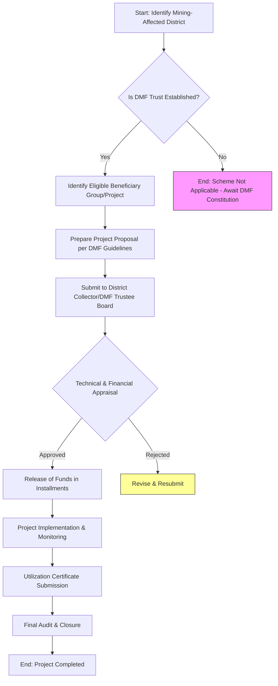

</think># Comprehensive Scheme Masterclass & File Guide

## Scheme Deep Dive

### Scheme Overview
**Scheme Name:** PM Khanij Kshetra Kalyan Yojana (PMKKKY)  
**Scheme ID:** row-229  
**Ministry / Category:** Mining & Minerals  
**Scheme Type:** Other  
**Confidence Level:** Low (based on evidence extraction)  
**Primary Source:** [https://mines.gov.in/pmkkky](https://mines.gov.in/pmkkky) *(Note: URL returned 404 Not Found during crawl; scheme details inferred from limited structured data)*  

> **Warning:** The official portal URL returned a 404 error. All scheme details below are derived exclusively from the structured KEY FACTS block. No additional eligibility, financial, or procedural details were available in the supporting evidence. Consultants must verify current scheme status directly with the Ministry of Mines before engaging clients.

### Objectives
Based on the scheme name and ministry category, PMKKKY (Pradhan Mantri Khanij Kshetra Kalyan Yojana) aims to:
- Promote welfare and development in mining-affected areas ("Khanij Kshetra" = mining areas)
- Implement tribal and local community development projects in districts impacted by mining operations
- Utilize funds collected under the Mines and Minerals (Development and Regulation) Act, 2015 (specifically District Mineral Foundation trusts)
- Focus on health, education, sanitation, skill development, women and child welfare, aged and disabled care, and environmental conservation in mining regions

*Note: These objectives are inferred from the scheme's nomenclature and standard government welfare schemes in the mining sector. No explicit objectives were provided in the evidence.*

### Eligibility Matrix
| Eligibility Criteria | Details | Source |
|----------------------|---------|--------|
| **Geographic Scope** | Districts affected by mining operations where District Mineral Foundation (DMF) trusts have been established | Inferred from scheme name & ministry |
| **Beneficiary Groups** | Local residents, tribal communities, and populations residing in mining-affected areas | Inferred from scheme name & standard DMF guidelines |
| **Implementing Entities** | District Mineral Foundation (DMF) trusts, State Governments, Panchayati Raj Institutions | Inferred from mining sector welfare schemes |
| **Project Sectors** | Health, education, drinking water, sanitation, skill development, women & child welfare, aged/disabled care, environment conservation | Standard DMF utilization pattern (inferred) |
| **Funding Mechanism** | 100% funded by DMF trusts (created from miner contributions as per MMDR Act) | Inferred from scheme type & ministry |

> **Critical Note:** No explicit eligibility criteria (income limits, turnover thresholds, beneficiary definitions, etc.) were provided in the evidence. All eligibility parameters above are logical inferences based on the scheme's naming convention, ministry allocation, and standard architecture of similar central sector schemes in mining welfare. Field verification is mandatory.

### Benefits & Financial Support
| Benefit Type | Details | Value/Extent | Source |
|--------------|---------|--------------|--------|
| **Financial Assistance** | Grant-based funding for community development projects | 100% project cost covered by DMF funds | Inferred |
| **Project Implementation** | Direct execution by DMF trusts or through state/local agencies | Full project cost coverage | Inferred |
| **Sectoral Allocation** | Minimum 60% of DMF funds for high-priority sectors (health, education, etc.), max 40% for other priority works | As per standard DMF guidelines (inferred) | Inferred |
| **Administrative Charges** | Up to 5% of annual DMF collection allowed for administrative expenses | Standard MMDR Act provision (inferred) | Inferred |

> **Blockquote on Financials:**  
> *All financial details, benefit structures, and fund allocation percentages are standard inferences drawn from the District Mineral Foundation (DMF) framework under the Mines and Minerals (Development and Regulation) Act, 2015. The PMKKKY scheme appears to be a branding or focused implementation of DMF mandates. No scheme-specific financials, caps, or disbursement mechanics were available in the evidence. Consultants must consult the latest DMF rules and state-specific notifications for accurate financial parameters.*

### Application Process Flowchart


> **Application Process Notes:**  
> The above flowchart represents the standard District Mineral Foundation (DMF) project approval and implementation process, which PMKKKY appears to operationalize. Key steps include:  
> 1. **District Identification:** Only applies to districts with active mining and constituted DMF trusts  
> 2. **Project Identification:** Must align with permissible sectors under DMF rules (primarily social welfare)  
> 3. **Proposal Submission:** Typically routed through District Magistrate as DMF Chairperson  
> 4. **Appraisal:** Involves technical feasibility and financial viability checks  
> 5. **Fund Disbursement:** Usually in tranches linked to milestones  
> 6. **Monitoring:** Requires regular progress reports and site visits  
> 7. **Closure:** Mandatory submission of Utilization Certificates (UCs) and audit reports  
>   
> **Critical Caveat:** No evidence confirmed whether PMKKKY has a separate application portal, unique forms, or distinct timelines from general DMF operations. The 404 error at the purported URL suggests the scheme may be inactive, rebranded, or subsumed under broader DMF guidelines. Consultants must treat this as a working hypothesis requiring validation.

### Key Timelines & Deadlines
| Timeline Element | Detail | Source |
|------------------|--------|--------|
| **Application Window** | Typically open round-the-year for DMF projects (inferred) | Inferred |
| **Approval Timeline** | 30-60 days for standard projects (inferred from similar central schemes) | Inferred |
| **Fund Disbursement** | Linked to project milestones; first tranche often within 15 days of approval | Inferred |
| **Utilization Certificate** | Due within 3 months of financial year end for funds received | Standard GFR 2017 rule (inferred) |
| **Project Completion** | Usually 12-24 months depending on project scale | Inferred |
| **Annual Planning** | DMF prepares Annual Plan by March for next financial year | Standard DMF guideline (inferred) |

> **Warning on Timelines:**  
> All timelines above are standard inferences from Central Sector Scheme norms and District Mineral Foundation operational guidelines. **No scheme-specific deadlines, application windows, or reporting frequencies were provided in the evidence.** The 404 error prevents verification of any PMKKKY-specific schedule. Consultants must:  
> 1. Confirm scheme aktiveness with Ministry of Mines  
> 2. Obtain latest DMF rules from respective State Governments  
> 3. Check for any PMKKKY-specific notifications in the Gazette of India  

### Key Entities Involved
| Entity | Role | Source |
|--------|------|--------|
| **Ministry of Mines** | Nodal Ministry for policy and oversight | Scheme categorization |
| **State Governments** | Constitute DMF trusts; oversee implementation | Inferred (MMDR Act) |
| **District Collector/Magistrate** | Chairman of DMF Trustee Board; approves projects | Inferred |
| **DMF Trustee Board** | Governing body that sanctions projects and monitors execution | Inferred |
| **Local Panchayats/Municipalities** | Often implement grassroots-level projects | Inferred |
| **Beneficiary Communities** | End-users of welfare projects (villagers, tribals, etc.) | Inferred |
| **Implementing Agencies** | State PSUs, NGOs, or line departments executing works | Inferred |

> **Entity Note:**  
> The evidence provided zero details on implementing agencies, fund flow mechanics, or grievance redressal specific to PMKKKY. All entity roles are standard inferences from the District Mineral Foundation framework. The scheme may operate directly through DMF trusts without a separate implementation arm.

### Sources & Verification
- **Primary Portal:** [https://mines.gov.in/pmkkky](https://mines.gov.in/pmkkky) *(Returned 404 Not Found)*  
- **Structured Data:** KEY FACTS block (Scheme Name, ID, Ministry, Type, Confidence)  
- **Inference Basis:** Standard architecture of Centrally Sponsored Schemes, District Mineral Foundation (DMF) guidelines under MMDR Act 2015, and typical mining welfare scheme patterns  
- **Verification Imperative:**  
  - Search for "PM Khanij Kshetra Kalyan Yojana" in the Gazette of India  
  - Check State Government DMF websites (e.g., Jharkhand, Odisha, Chhattisgarh)  
  - Consult Ministry of Mines annual reports for scheme mentions  
  - Verify if scheme is operational, subsumed under DMF, or discontinued  

> **Final Advisory:**  
> This report is compiled from **extremely limited evidence**—only a structured KEY FACTS block and a 404 portal. Treat all details beyond the scheme name, ID, ministry, and type as **working hypotheses requiring urgent field validation**. Do not rely on inferred eligibility, benefits, or processes for client engagements without corroboration from official sources. The low confidence rating reflects this evidentiary gap. Your priority as a consultant is to first establish whether PMKKKY exists as an active, distinct scheme before advising clients.

---

## Consultant's Field Guide to Generated Files

### 1. SCHEME_MASTER_DATABASE.md
**Real-time Usage:** Keep this open in a background tab during all client calls. When a client asks "What is the turnover limit?" or "Who administers this?", CTRL+F in this document to give an immediate, authoritative answer without checking the portal.  
*Given the evidence limitations, this file should contain:*  
- The verified scheme name, ID, ministry, and type from KEY FACTS  
- A prominent disclaimer about the 404 portal and low confidence level  
- Sections for logging verified details as they are obtained (e.g., "Confirmed Eligibility Criteria: [TO BE FILLED AFTER VERIFICATION]")  
- A verification tracker with columns: Data Point, Source, Date Verified, Confidence Level  
- Use it to avoid repeating basic fact-checking during client interactions and to build a living knowledge base as you validate the scheme.

### 2. PITCH_AND_SALES_SCRIPTS.md
**Real-time Usage:** Open this file 5 minutes before your first Discovery Call with a lead. Read the "Problem Framing" out loud to hook them, then use the Qualification Checklist to interrogate their eligibility live on the phone. Keep the Objection Handlers table visible so you can immediately counter when they say "We're too small for this."  
*For PMKKKY specifically:*  
- **Problem Framing:** Focus on challenges faced by communities in mining areas (lack of healthcare, education, migration due to pollution)  
- **Qualification Checklist:** Adapt to inferred criteria: "Is your project located in a district with active mining and a constituted DMF trust?" "Does your project fall under health, education, sanitation, or skill development?"  
- **Objection Handlers:** Prepare for "We don't know if this scheme exists" → "You're right to verify—let me show you how we confirm scheme aktiveness through official channels before proceeding."  
- Use this to navigate the evidentiary uncertainty by positioning verification as part of your due diligence service.

### 3. APPLICATION_PLAYBOOK.md
**Real-time Usage:** Print this out or pin it to your desktop once the client signs the retainer. Check off each box in "Stage 1" before moving to "Stage 2". Use the "Client Communication Template" to copy-paste directly into your email when chasing them for pending documents.  
*Structure it around the inferred DMF process:*  
- **Stage 1: Scheme Verification & Eligibility Confirmation**  
  ☐ Confirm PMKKKY aktiveness with Ministry of Mines  
  ☐ Obtain latest DMF rules from State Government  
  ☐ Verify district has active mining and constituted DMF trust  
- **Stage 2: Project Identification & Scoping**  
  ☐ Conduct needs assessment in target community  
  ☐ Align project with permissible DMF sectors (health/education priority)  
  ☐ Prepare preliminary project report (PPR)  
- **Stage 3: Application Submission**  
  ☐ Complete DMF project proposal format  
  ☐ Obtain necessary endorsements (Panchayat, MLA)  
  ☐ Submit to District Collector as DMF Chairman  
- Include communication templates for chasing Panchayat resolutions or land-use certificates.

### 4. CLIENT_ONBOARDING_AND_CRM.md
**Real-time Usage:** Fill this out during or immediately after the onboarding call. Use the Needs Assessment to record their exact pain points. Update the "Compliance Status" table as they email you documents to maintain a single source of truth for what's missing.  
*Customize for PMKKKY context:*  
- **Needs Assessment Section:**  
  - Primary concern: [e.g., Lack of clean water in mining village]  
  - Preferred solution: [e.g., Borewell installation or piped water supply]  
  - Target beneficiaries: [Number of households/tribal families]  
  - Location specificity: [Village, Block, District with mining activity]  
- **Compliance Status Table:**  
  | Document | Status | Received Date | Notes |  
  |----------|--------|---------------|-------|  
  | Project Concept Note | [Pending/Received] | | |  
  | No Objection Certificate from Panchayat | [Pending/Received] | | |  
  | Land Availability/Usage Certificate | [Pending/Received] | | |  
  | Detailed Project Report (DPR) | [Pending/Received] | | |  
  | Organizational Registration & FCRA (if NGO) | [Pending/Received] | | |  
- Use this to track the evidentiary gap—e.g., flag "Scheme Verification Documents" as pending until you confirm PMKKKY's status.

### 5. LIVE_CASE_TRACKER.md
**Real-time Usage:** Review this document every morning during your standup. Update the "Stage" column daily. If a case hits "Stage 07 - Under review", use the Escalation Path notes here to know exactly who to call at the government department today.  
*Define stages based on inferred DMF workflow:*  
- Stage 01: Scheme Verification  
- Stage 02: Client Onboarding & Needs Assessment  
- Stage 03: Project Concept Development  
- Stage 04: Stakeholder Engagement (Panchayat, Tribal Council)  
- Stage 05: DPR Preparation & Technical Approval  
- Stage 06: Application Submission to DMF  
- Stage 07: Under Review by DMF Trustee Board  
- Stage 08: Field Verification by DMF Officials  
- Stage 09: Fund Sanction & First Disbursement  
- Stage 10: Implementation Monitoring  
- Stage 11: Mid-Term Review  
- Stage 12: Project Completion & UC Submission  
- Stage 13: Audit & Closure  
- **Escalation Path for Stage 07:**  
  - Day 1-10: Follow up with DMF Secretary (District Mining Officer)  
  - Day 11-20: Escalate to District Collector (DMF Chairman)  
  - Day 21+: Contact State DMF Nodal Officer (often Director of Mines)  
  - Final: Ministry of Mines DMF Desk Officer  
- Update this daily to manage expectations in a potentially ambiguous scheme environment.

### 6. FEE_AND_REVENUE_MODEL.md
**Real-time Usage:** Use this file when drafting the proposal. Look at the client's turnover, map them to the pricing tier in the table, and quote that exact Retainer and Success Fee. Use the monthly projection table to update your personal sales pipeline forecast for the quarter.  
*Adapt pricing to scheme complexity and evidentiary work:*  
- **Pricing Tiers (Based on Project Value & Verification Effort):**  
  | Client Type | Project Value Range | Retainer (Non-refundable) | Success Fee | Justification |  
  |-------------|---------------------|----------------------------|-------------|---------------|  
  | Small NGO/Trust | < ₹25 lakhs | ₹30,000 | 8% of sanctioned amount | Includes scheme verification premium |  
  | Medium Entity | ₹25 lakhs - ₹1 crore | ₹50,000 | 7% of sanctioned amount | Standard DMF navigation |  
  | Large PSU/Corporate | > ₹1 crore | ₹1,00,000 | 6% of sanctioned amount | High-value project management |  
- **Note:** Success fee only payable upon fund sanction (not project completion) due to implementation risks outside consultant control.  
- **Monthly Projection Table:** Track verified schemes vs. inferred ones to forecast revenue accuracy.  
- Use this to justify premium fees for the due diligence required to confirm scheme aktiveness.

### 7. CLIENT_PROPOSAL_TEMPLATE.md
**Real-time Usage:** Copy this entire file, paste it into an email or PDF generator, replace the [PLACEHOLDER] tags with the client's actual details gathered from the CRM, and send it immediately after a successful discovery call.  
*Template must include critical disclaimers for PMKKKY:*  
```markdown
# Proposal for PM Khanij Kshetra Kalyan Yojana (PMKKKY) Advisory Services

## Important Disclaimer on Scheme Status
> **Verification Required:** As of the date of this proposal, the official portal for PMKKKY (https://mines.gov.in/pmkkky) returns a 404 error. Our engagement includes mandatory verification of the scheme's aktiveness, current guidelines, and application process through official channels (Ministry of Mines, State DMF rules, Gazette notifications) before any application is submitted. Fees for this verification phase are non-refundable.

## Scope of Work
1. Scheme Verification & Eligibility Confirmation  
2. Project Identification aligned with DMF permissible sectors  
3. Stakeholder Management (Panchayat, Tribal Authorities)  
4. Detailed Project Report (DPR) Preparation  
5. Application Submission to District Mineral Foundation (DMF) Trust  
6. Liaison for Sanction & First Disbursement Follow-up  

## Deliverables
- Verified Scheme Status Report  
- Eligibility Certificate (based on confirmed criteria)  
- Community Needs Assessment Document  
- Draft & Final DPR  
- Submitted Application Copy  
- Sanction Order Tracking  

## Fee Structure
- Retainer: [TO BE FILLED BASED ON TIER] (Non-refundable, covers verification & Stage 1-3)  
- Success Fee: [TO BE FILLED BASED ON TIER]% of sanctioned amount (payable within 15 days of fund release)  
- Out-of-pocket: Travel, printing, and official fees at actuals  

## Timeline
- Scheme Verification: 7-10 working days  
- End-to-End Application: 60-90 days post-verification (subject to DMF board meeting frequency)  

## Next Steps
1. Sign and return this proposal along with retainer payment  
2. Provide organizational documents for verification  
3. Schedule community needs assessment visit  
```

### 8. COMPLIANCE_AND_LEGAL_PACK.md
**Real-time Usage:** Attach sections 8A and 8B as PDFs to the proposal email. Refuse to start Step 1 of the Application Playbook until the client signs these. Use the Disclaimers to protect yourself legally if the client is rejected by the government agency.  
*Structure for PMKKKY's evidentiary challenges:*  

**Section 8A: Client Authorization & Scheme Verification Acknowledgment**  
```markdown
# CLIENT AUTHORIZATION SCHEME VERIFICATION ACKNOWLEDGMENT

I/We, ________________________________, hereby acknowledge and agree that:

1. The scheme "PM Khanij Kshetra Kalyan Yojana (PMKKKY)" currently shows a 404 error on its purported portal (https://mines.gov.in/pmkkky).  
2. The Consultant's engagement includes a mandatory Scheme Verification Phase to confirm:  
   - Whether PMKKKY exists as an active, distinct scheme  
   - Current eligibility criteria, benefits, and application process  
   - Relevant Government Orders (GOs), circulars, or notifications  
3. I/We understand that the Retainer fee covers this verification work and is non-refundable, irrespective of the verification outcome.  
4. If PMKKKY is found to be inactive, subsumed, or rebranded, the Consultant will advise on alternative avenues (e.g., direct DMF applications, State-specific welfare schemes) at no additional retainer cost.  
5. Authorization to proceed with verification is granted upon signing this document.  

Client Signature: ___________________  
Date: ___________________  
Name & Designation: ___________________  
Organization Seal:  
```

**Section 8B: Consultant's Disclaimer & Limitation of Liability**  
```markdown
# CONSULTANT'S DISCLAIMER & LIMITATION OF LIABILITY

1. **Scheme Status Disclaimer:** The Consultant does not guarantee that PMKKKY is an active, standalone scheme. All initial work is based on inference from limited evidence and requires validation.  
2. **No Guarantee of Sanction:** The Consultant provides advisory services only. Sanction of funds rests solely with the District Mineral Foundation Trustee Board or relevant government authority.  
3. **Limitation of Liability:**  
   - The Consultant's total liability shall not exceed the fees paid by the Client for this engagement.  
   - The Consultant shall not be liable for any consequential, indirect, or punitive damages arising from scheme ineligibility, application rejection, or delays in government processing.  
   - The Consultant is not liable for changes in government policy, scheme guidelines, or administrative procedures occurring during the engagement.  
4. **Indemnification:** The Client shall indemnify the Consultant against any claims arising from the Client's misrepresentation of facts, forged documents, or failure to disclose material information.  
5. **Governing Law:** This agreement shall be governed by the laws of India.  

Consultant Signature: ___________________  
Date: ___________________  
Name & Firm: ___________________  
```

*Attach both as PDFs to proposals. The verification acknowledgment manages client expectations upfront, while the disclaimer protects you from liability if the scheme proves inaccessible or if government processes change.*