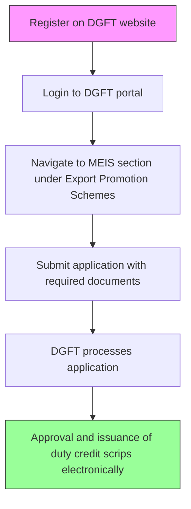

# Comprehensive Scheme Masterclass & File Guide

## Scheme Deep Dive

### Overview
The Merchandise Exports from India Scheme (MEIS) is a subsidy scheme implemented by the Directorate General of Foreign Trade (DGFT), Ministry of Commerce and Industry, Government of India. It aims to promote the manufacture and export of notified goods/products, offset infrastructural inefficiencies, enhance India's export competitiveness, provide incentives through duty credit scrips, and support MSME participation in international trade. The scheme applies pan-India and is administered by DGFT. The application portal is https://dgft.gov.in. Applications are typically submitted within the financial year of export, with specific timelines notified by DGFT from time to time. The scheme was last updated in 2026.

### Objectives
- Promote the manufacture and export of notified goods/products  
- Offset infrastructural inefficiencies and associated costs involved in exporting goods/products  
- Enhance India's export competitiveness in global markets  
- Provide incentives through duty credit scrips to eligible exporters  
- Support MSME participation in international trade  

### Eligibility Matrix
| Eligibility Criteria | Details | Source |
|----------------------|---------|--------|
| Exporter Type | Exporters of notified goods/products as per the Foreign Trade Policy (FTP) | Key Facts |
| IEC Requirement | Must have a valid Importer Exporter Code (IEC) granted by DGFT | Key Facts |
| Product Specificity | Eligibility determined based on product description and ITC(HS) code as notified under the scheme from time to time | Key Facts |
| Target Beneficiaries | Exporters; manufacturers; MSME | Key Facts |
| Geographic Scope | Pan-India | Key Facts |
| Scheme Status | Discontinued for exports made on or after 1 January 2021, with RoSCTL replacing it for textiles and garments | Key Facts (Key Caveats) |

### Benefits & Financial Support
| Benefit Type | Details | Source |
|--------------|---------|--------|
| Form of Support | Duty credit scrips, calculated as a percentage of the FOB value of exports of notified products | Key Facts |
| Utilization of Scrips | Can be used for payment of customs duty, excise duty, service tax, and other dues | Key Facts |
| Transferability | Scrips are transferable and can be traded in the market | Key Facts |
| Incentive Rate | Product-specific and notified periodically by DGFT | Key Facts |
| Objective Alignment | Provides duty credit scrips as a percentage of FOB value of exports, usable for basic customs duty on imports, service tax payment, and settlement of other dues | Key Facts |

### Required Documents
| Document | Purpose | Source |
|----------|---------|--------|
| Shipping Bill | Proof of export shipment | Key Facts |
| Proof of realization of export proceeds | Evidence of foreign exchange inflow | Key Facts |
| Importer Exporter Code (IEC) certificate | Mandatory identification for exporters | Key Facts |
| Bank realization certificate | Bank-certified proof of export proceeds realization | Key Facts |
| Packing list | Details of packaged goods | Key Facts |
| Invoice | Commercial invoice for the export transaction | Key Facts |

### Application Process

**Steps in Detail:**  
1. Register on the DGFT website (https://dgft.gov.in) with a valid email and mobile number.  
2. Login to the DGFT portal.  
3. Navigate to the MEIS section under Export Promotion Schemes.  
4. Submit an application for MEIS benefits along with required documents such as shipping bills, realization proof, and IEC details.  
5. The application is processed by DGFT, and upon approval, duty credit scrips are issued electronically.  

### Key Caveats
> **Benefits are available only for notified products as per the Foreign Trade Policy**  
> **The scheme is subject to periodic review and revision by DGFT**  
> **MEIS has been discontinued for exports made on or after 1 January 2021, with RoSCTL replacing it for textiles and garments**  
> **Incentive rates vary by product and are notified periodically**  

### Contact Details
- Helpline: 1800-572-1550 / 1800-111-550  
- Email: dgftedi[at]nic[dot]in  
- Headquarters: Vanijya Bhawan, 'A' Wing, 16 Akbar Road, New Delhi – 110011  

### Application Portal
**Official Portal:** https://dgft.gov.in  
*All applications must be submitted through the official DGFT website.*  

---

## Consultant's Field Guide to Generated Files

### 1. SCHEME_MASTER_DATABASE.md
**Real-time Usage:** Keep this open in a background tab during all client calls. When a client asks "What is the turnover limit?" or "Who administers this?", CTRL+F in this document to give an immediate, authoritative answer without checking the portal.

### 2. PITCH_AND_SALES_SCRIPTS.md
**Real-time Usage:** Open this file 5 minutes before your first Discovery Call with a lead. Read the "Problem Framing" out loud to hook them, then use the Qualification Checklist to interrogate their eligibility live on the phone. Keep the Objection Handlers table visible so you can immediately counter when they say "We're too small for this."

### 3. APPLICATION_PLAYBOOK.md
**Real-time Usage:** Print this out or pin it to your desktop once the client signs the retainer. Check off each box in "Stage 1" before moving to "Stage 2". Use the "Client Communication Template" to copy-paste directly into your email when chasing them for pending documents.

### 4. CLIENT_ONBOARDING_AND_CRM.md
**Real-time Usage:** Fill this out during or immediately after the onboarding call. Use the Needs Assessment to record their exact pain points. Update the "Compliance Status" table as they email you documents to maintain a single source of truth for what's missing.

### 5. LIVE_CASE_TRACKER.md
**Real-time Usage:** Review this document every morning during your standup. Update the "Stage" column daily. If a case hits "Stage 07 - Under review", use the Escalation Path notes here to know exactly who to call at the government department today.

### 6. FEE_AND_REVENUE_MODEL.md
**Real-time Usage:** Use this file when drafting the proposal. Look at the client's turnover, map them to the pricing tier in the table, and quote that exact Retainer and Success Fee. Use the monthly projection table to update your personal sales pipeline forecast for the quarter.

### 7. CLIENT_PROPOSAL_TEMPLATE.md
**Real-time Usage:** Copy this entire file, paste it into an email or PDF generator, replace the [PLACEHOLDER] tags with the client's actual details gathered from the CRM, and send it immediately after a successful discovery call.

### 8. COMPLIANCE_AND_LEGAL_PACK.md
**Real-time Usage:** Attach sections 8A and 8B as PDFs to the proposal email. Refuse to start Step 1 of the Application Playbook until the client signs these. Use the Disclaimers to protect yourself legally if the client is rejected by the government agency.