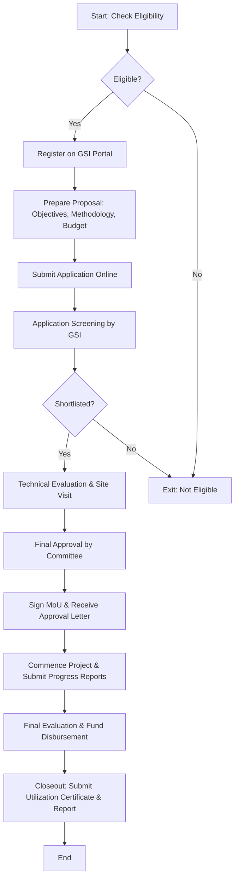

# Comprehensive Scheme Masterclass & File Guide

## Scheme Deep Dive

### Overview
The Geological Survey of India (GSI) Startup Mineral Exploration scheme is a government initiative under the Ministry of Mines, implemented by the Geological Survey of India (GSI). The scheme operates with a pan-India geographic scope and was last updated in 2026. Its primary objectives include providing expertise and disseminating geoscientific information for sustainable socio-economic development, undertaking projects related to critical minerals, augmenting resources in the National Mineral Inventory, handing over mineral blocks for auction, strategically evolving mineral exploration in GSI, and undertaking projects related to mineral exploration and mining projects.

### Objectives
- Providing expertise and disseminating geoscientific information for sustainable socio-economic development  
- Undertaking projects related to critical minerals  
- Augmenting resources in the National Mineral Inventory  
- Handing over mineral blocks for auction  
- Strategic evolution of mineral exploration in GSI  
- Undertaking projects related to mineral exploration and mining projects  

### Eligibility Matrix
Based on the evidence provided, specific eligibility criteria (such as turnover limits, startup recognition requirements, or entity types) are not explicitly detailed in the crawled web pages or structured key facts. The scheme appears to be open to startups engaged in mineral exploration, but precise thresholds or conditions are not specified in the available data.

> **Warning**: Eligibility details such as entity type, turnover limits, DPIIT recognition status, or sector-specific requirements are not available in the current evidence. Consultants must verify these directly on the GSI portal or official scheme guidelines before advising clients.

### Benefits & Financial Support
The evidence does not specify financial support amounts, grant percentages, funding ceilings, or subsidy structures under this scheme. No details on monetary benefits, cost-sharing patterns, or financial incentives for startups are available in the crawled content or key facts.

> **Warning**: Financial support details (grant amount, funding ratio, disbursement schedule, or cost coverage) are absent from the provided evidence. This information must be obtained from official scheme documents or the GSI website to ensure accurate client advisement.

### Application Process
While the scheme’s objectives and implementing agency are clear, the step-by-step application process—including portal access, document submission, review stages, and timelines—is not detailed in the evidence. The GSI website hosts various training programs, tenders, and notifications, but no specific application workflow for the Startup Mineral Exploration scheme is outlined in the crawled pages.

Below is a generalized Mermaid flowchart illustrating a typical government startup scheme application process, which should be adapted once the exact procedure is confirmed from official sources:

> **Note**: This flowchart is illustrative. The actual process may involve additional steps such as pre-proposal workshops, expert committee reviews, or milestone-based funding releases. Consultants must confirm the precise stages from the GSI’s official scheme document or notification.

### Key Sources
- Scheme Implementing Agency: [https://gsi.gov.in](https://gsi.gov.in)  
- Official GSI Portal: [https://gsi.gov.in](https://gsi.gov.in)  
- Training & Course Announcements (indicative of GSI’s operational scope): [https://gsi.gov.in/upcommingcourse/up-comming-course/](https://gsi.gov.in/upcommingcourse/up-comming-course/)  
- Tender Notifications: [https://gsi.gov.in/tender/](https://gsi.gov.in/tender/)  
- Feedback Portal: [https://gsi.gov.in/feedback](https://gsi.gov.in/feedback)  

---

## Consultant's Field Guide to Generated Files

### 1. SCHEME_MASTER_DATABASE.md
**Real-time Usage:** Keep this open in a background tab during all client calls. When a client asks "What is the turnover limit?" or "Who administers this?", CTRL+F in this document to give an immediate, authoritative answer without checking the portal.

### 2. PITCH_AND_SALES_SCRIPTS.md
**Real-time Usage:** Open this file 5 minutes before your first Discovery Call with a lead. Read the "Problem Framing" out loud to hook them, then use the Qualification Checklist to interrogate their eligibility live on the phone. Keep the Objection Handlers table visible so you can immediately counter when they say "We're too small for this."

### 3. APPLICATION_PLAYBOOK.md
**Real-time Usage:** Print this out or pin it to your desktop once the client signs the retainer. Check off each box in "Stage 1" before moving to "Stage 2". Use the "Client Communication Template" to copy-paste directly into your email when chasing them for pending documents.

### 4. CLIENT_ONBOARDING_AND_CRM.md
**Real-time Usage:** Fill this out during or immediately after the onboarding call. Use the Needs Assessment to record their exact pain points. Update the "Compliance Status" table as they email you documents to maintain a single source of truth for what's missing.

### 5. LIVE_CASE_TRACKER.md
**Real-time Usage:** Review this document every morning during your standup. Update the "Stage" column daily. If a case hits "Stage 07 - Under review", use the Escalation Path notes here to know exactly who to call at the government department today.

### 6. FEE_AND_REVENUE_MODEL.md
**Real-time Usage:** Use this file when drafting the proposal. Look at the client's turnover, map them to the pricing tier in the table, and quote that exact Retainer and Success Fee. Use the monthly projection table to update your personal sales pipeline forecast for the quarter.

### 7. CLIENT_PROPOSAL_TEMPLATE.md
**Real-time Usage:** Copy this entire file, paste it into an email or PDF generator, replace the [PLACEHOLDER] tags with the client's actual details gathered from the CRM, and send it immediately after a successful discovery call.

### 8. COMPLIANCE_AND_LEGAL_PACK.md
**Real-time Usage:** Attach sections 8A and 8B as PDFs to the proposal email. Refuse to start Step 1 of the Application Playbook until the client signs these. Use the Disclaimers to protect yourself legally if the client is rejected by the government agency.