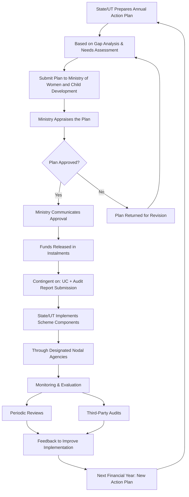

</think># Comprehensive Scheme Masterclass & File Guide

## Scheme Deep Dive

### Overview
**Mission Shakti – Women Safety & Empowerment** is a centrally sponsored subsidy scheme implemented by the **Ministry of Women and Child Development** with pan-India geographic scope. The scheme operates on an **annual cycle**, requiring States and Union Territories to submit Action Plans each financial year, typically before the fiscal year begins. With a total fund size of **₹20,989 crore**, it represents one of the largest government initiatives focused on women's safety, security, and empowerment across India.

### Objectives
The scheme pursues eight core objectives:
- Ensure safety and security of women in public and private spaces  
- Promote gender equality and women's empowerment  
- Provide access to rights and entitlements for women  
- Strengthen institutional mechanisms for implementation  
- Enhance convergence of schemes and programs for women  
- Build capacity of functionaries and stakeholders  
- Create awareness on women's rights and legal provisions  
- Establish One Stop Centres and Women Helplines across districts  

### Eligibility Matrix
The scheme targets all women and girls in India, with implementation carried out through State Governments and UT Administrations based on need assessment and gap analysis.

| **Beneficiary Category**       | **Specific Groups Prioritized**                                                                 | **Implementation Mechanism**                     |
|-------------------------------|-----------------------------------------------------------------------------------------------|--------------------------------------------------|
| Women                         | All women in India                                                                            | State Governments/UT Administrations             |
| Girl children                 | All girl children                                                                             | State Governments/UT Administrations             |
| Adolescent girls              | Adolescent girls                                                                              | State Governments/UT Administrations             |
| Pregnant and lactating mothers| Pregnant and lactating women                                                                  | State Governments/UT Administrations             |
| Elderly women                 | Elderly women                                                                                 | State Governments/UT Administrations             |
| **Vulnerable/Marginalized Focus** |                                                                                               |                                                  |
| Affected by violence          | Women survivors of domestic, sexual, or gender-based violence                                 | Need assessment & gap analysis                   |
| SC/ST/OBC communities         | Women belonging to Scheduled Castes, Scheduled Tribes, Other Backward Classes                 | Need assessment & gap analysis                   |
| Rural and tribal areas        | Women residing in rural, remote, and tribal regions                                           | Need assessment & gap analysis                   |
| Economically weaker sections  | Women from low-income households                                                              | Need assessment & gap analysis                   |

> **Key Eligibility Note**: While the scheme targets all women and girls nationally, **funds are disbursed only to State Governments and UT Administrations** (not directly to individuals or NGOs). Eligibility for funding is determined by the quality of the Annual Action Plan submitted, which must demonstrate need-based planning and alignment with scheme objectives.

### Financial Support Structure
Funding is provided as a centrally sponsored scheme with variable cost-sharing ratios:

| **Entity Type**                               | **Funding Ratio (Centre:State)** | **Conditions**                                                                 |
|-----------------------------------------------|----------------------------------|------------------------------------------------------------------------------|
| North Eastern and Himalayan States            | 90:10                            | Centre provides 90%, State contributes 10%                                   |
| All other States                              | 60:40                            | Centre provides 60%, State contributes 40%                                   |
| Union Territories without Legislature         | 100:0                            | 100% central funding; no state contribution required                         |
| Union Territories with Legislature            | Not specified in evidence        | Follows standard State pattern unless otherwise notified                     |

**Fund Release Mechanism**:
- Funds released in **instalments** based on:
  - Utilization of previous grants
  - Submission of Utilization Certificates (UCs)
  - Submission of Audit Reports
  - Approval of Annual Action Plan
- **Contingency**: Release is **contingent upon** submission of UCs and Audit Reports
- **State Obligation**: States/UTs **must contribute their share** as per prescribed ratio
- **Usage Restriction**: Funds **cannot be diverted** to other schemes or purposes
- **Oversight**: Third-party monitoring and evaluation may be conducted

### Benefits & Financial Support
The scheme provides both financial and non-financial support across multiple components:

| **Benefit Category**         | **Specific Components**                                                                 | **Financial/Non-Financial** |
|------------------------------|---------------------------------------------------------------------------------------|-----------------------------|
| Infrastructure Support       | One Stop Centres (OSCs)                                                               | Financial                   |
|                              | Women Helplines (WHLs)                                                                | Financial                   |
|                              | Sakhi Niwas (working women's hostels)                                                 | Financial                   |
|                              | Strengthening Swadhar Grehs and Ujjwala Homes                                         | Financial                   |
| Programmatic Support         | Beti Bachao Beti Padhao (BBBP) activities                                             | Financial                   |
|                              | Capacity building and training of stakeholders                                        | Financial                   |
|                              | Awareness generation campaigns                                                        | Financial                   |
| Direct Services              | Improved access to justice                                                            | Non-financial               |
|                              | Counselling services                                                                  | Non-financial               |
|                              | Medical aid                                                                           | Non-financial               |
|                              | Legal assistance                                                                      | Non-financial               |
|                              | Temporary shelter for women in distress                                               | Non-financial               |
| Institutional Strengthening  | Strengthening existing institutions                                                   | Financial                   |
|                              | Enhanced convergence of women-focused schemes                                         | Non-financial               |
|                              | Capacity building of functionaries                                                    | Financial                   |

> **Critical Financial Detail**: The total scheme allocation is **₹20,989 crore** for the implementation period. This represents the **combined central and state commitment** under the respective funding ratios. Actual central expenditure will vary based on state compliance with matching fund requirements.

### Required Documents
States/UTs must submit the following documents as part of the application and fund release process:

1. **Annual Action Plan** – Primary planning document based on gap analysis and needs assessment  
2. **Utilization Certificate of previous funds** – Proof of prior fund usage (mandatory for release)  
3. **Audit Report** – Financial audit of previous grant utilization (mandatory for release)  
4. **Progress Report** – Status update on ongoing implementation  
5. **Bank details for fund transfer** – For direct fund disbursement  
6. **List of beneficiaries covered** – Demographic and service coverage data  
7. **Details of infrastructure developed** – Physical assets created (OSCs, WHLs, hostels, etc.)  

> **Document Caveat**: Failure to submit Utilization Certificates and Audit Reports will **block fund release** for subsequent instalments, regardless of Action Plan approval.

### Application Process Flow
The following Mermaid flowchart illustrates the end-to-end application and fund disbursement process:

**Process Notes**:
- The cycle repeats **annually** with each financial year
- States/UTs must implement through **designated nodal agencies** (typically Departments of Women and Child Development or Social Welfare)
- **Monitoring is continuous** via periodic reviews and potential third-party audits
- **Non-compliance** (missing UCs, audit reports, or diversion of funds) can result in **withholding of future instalments**

### Key Caveats & Compliance Requirements
> **Critical Compliance Points**:
> - **Fund release is strictly contingent** upon submission of Utilization Certificates and Audit Reports from previous grants
> - States/UTs **must contribute their matching share** as per the 90:10 (NE/Hill), 60:40 (other States), or 100:0 (UT without legislature) ratio
> - All implementation **must follow Ministry-issued guidelines and norms**
> - **Zero tolerance for fund diversion** – funds cannot be used for any purpose outside Mission Shakti components
> - The Ministry reserves the right to conduct **third-party monitoring and evaluation** at any time
> - Utilization Certificates must be submitted in the **prescribed format** and audited by a Chartered Accountant or equivalent authority
> - Annual Action Plans must be submitted **before the start of the fiscal year** to ensure timely fund release

### Application Portal & Sources
- **Primary Portal**: [Ministry of Women and Child Development - Mission Shakti](https://wcd.nic.in/mission-shakti)  
- **Key References**: Scheme guidelines, annual circulars, and financial rules issued by the Ministry of Women and Child Development (confidence: medium)  

---

## Consultant's Field Guide to Generated Files

### 1. SCHEME_MASTER_DATABASE.md
**Real-time Usage**: Keep this open in a background tab during all client calls. When a client asks "What is the turnover limit?" or "Who administers this?", CTRL+F in this document to give an immediate, authoritative answer without checking the portal.  
**Specific Scenarios**:  
- During a discovery call with a State Women and Child Development officer, if they ask about the funding ratio for their state category, instantly retrieve the exact 60:40 or 90:10 split from the Financial Support table.  
- When a UT administrator queries whether they need to provide matching funds, immediately confirm 100% central funding status for UTs without legislature using the eligibility matrix.  
- If a client questions the documentation requirements, pull up the Required Documents list to explain why their pending Audit Report is blocking the next instalment.  

### 2. PITCH_AND_SALES_SCRIPTS.md
**Real-time Usage**: Open this file 5 minutes before your first Discovery Call with a lead. Read the "Problem Framing" out loud to hook them, then use the Qualification Checklist to interrogate their eligibility live on the phone. Keep the Objection Handlers table visible so you can immediately counter when they say "We're too small for this."  
**Specific Scenarios**:  
- **Before the call**: Review the "Problem Framing" script: *"Many States struggle to utilize their full Mission Shakti allocation due to delayed UC submissions – is this affecting your fund flow?"* to immediately resonate with pain points.  
- **During eligibility check**: Use the Qualification Checklist to verify: ✓ State/UT status ✓ Previous UC submission status ✓ Nodal agency designation – ticking boxes in real time as the client confirms.  
- **Handling objections**: When a client says *"We don’t have the capacity to manage another scheme,"* deploy the Objection Handler: *"Mission Shakti actually reduces administrative burden by converging existing services – let me show you how Odisha cut reporting time by 30% through integrated OSC-WHL management."*  

### 3. APPLICATION_PLAYBOOK.md
**Real-time Usage**: Print this out or pin it to your desktop once the client signs the retainer. Check off each box in "Stage 1" before moving to "Stage 2". Use the "Client Communication Template" to copy-paste directly into your email when chasing them for pending documents.  
**Specific Scenarios**:  
- **Day 1 post-retention**: Open Stage 1 (Preparation) and verify completion of:  
  ☐ Confirm State/UT eligibility and funding ratio  
  ☐ Obtain last year’s Utilization Certificate and Audit Report  
  ☐ Map nodal agency structure  
  Check each box as tasks are completed, preventing premature advancement.  
- **Document chase**: When the client hasn’t sent the Progress Report, open the "Client Communication Template":  
  *Subject: Urgent: Pending Document for Mission Shakti Action Plan – [State Name]*  
  *Body: As discussed, we require your Progress Report covering Q1-Q3 to finalize the Annual Action Plan. Without this, we cannot submit to the Ministry by the [deadline] date. Please share by EOD tomorrow.*  
  Copy-paste, insert state name and deadline, and send immediately.  
- **Stage gate**: Before advancing to Stage 3 (Submission), confirm all Stage 2 boxes are checked:  
  ☐ Annual Action Plan drafted per Ministry norms  
  ☐ All 7 required documents compiled  
  ☐ State share funds allocated in budget  

### 4. CLIENT_ONBOARDING_AND_CRM.md
**Real-time Usage**: Fill this out during or immediately after the onboarding call. Use the Needs Assessment to record their exact pain points. Update the "Compliance Status" table as they email you documents to maintain a single source of truth for what's missing.  
**Specific Scenarios**:  
- **Onboarding call**: Use the Needs Assessment section to capture:  
  *Pain Point: "We lost Q3 funds because our UC was rejected due to incorrect format."*  
  *Goal: "Submit Action Plan by Jan 15 to avoid missing Q1 release."*  
  *Risk: "State share funds not yet approved in budget."*  
- **Daily CRM update**: As documents arrive, update the Compliance Status table:  
  | **Document**               | **Status**     | **Date Received** | **Notes**                          |  
  |----------------------------|----------------|-------------------|------------------------------------|  
  | Annual Action Plan         | Draft Received | 2024-01-10        | Under review for gap analysis      |  
  | Utilization Certificate    | ❌ Missing     | –                 | Rejected last year – needs CA cert |  
  | Audit Report               | ✅ Received    | 2024-01-12        | Clean audit for FY 2022-23         |  
  | ...                        | ...            | ...               | ...                                |  
  This provides instant visibility into what’s blocking progress.  
- **Escalation trigger**: If the Utilization Certificate remains "Missing" for >5 days, flag it in the CRM for immediate consultant follow-up using the escalation path from LIVE_CASE_TRACKER.  

### 5. LIVE_CASE_TRACKER.md
**Real-time Usage**: Review this document every morning during your standup. Update the "Stage" column daily. If a case hits "Stage 07 - Under review", use the Escalation Path notes here to know exactly who to call at the government department today.  
**Specific Scenarios**:  
- **Morning standup**: Open the tracker, review all active cases:  
  | **Case ID** | **Client (State/UT)** | **Current Stage**       | **Last Updated** | **Action Required**              |  
  |-------------|------------------------|-------------------------|------------------|----------------------------------|  
  | MS-2024-087 | Maharashtra            | 05 - Documents Submitted| 2024-01-10       | Follow up on UC status           |  
  | MS-2024-092 | Ladakh                 | 07 - Under review       | 2024-01-09       | **ESCALATE: Call JS (WCD) today**|  
  | MS-2024-076 | Sikkim                 | 03 - Plan Preparation   | 2024-01-08       | Send UC template                 |  
- **Stage 07 action**: For Ladakh (MS-2024-092), open the Escalation Path:  
  *"If under review >10 days: Contact Joint Secretary (Mission Shakti), Ministry of WCD – Direct line: [redacted]. Reference: UC/Audit compliance. Have client’s Utilization Certificate and Audit Report ready for verification."*  
  Make the call, note the outcome, and update the tracker.  
- **Stage progression**: When the Ministry approves the Plan, manually update the stage from 06 to 07, then to 08 upon fund release trigger, ensuring real-time accuracy.  

### 6. FEE_AND_REVENUE_MODEL.md
**Real-time Usage**: Use this file when drafting the proposal. Look at the client's turnover, map them to the pricing tier in the table, and quote that exact Retainer and Success Fee. Use the monthly projection table to update your personal sales pipeline forecast for the quarter.  
**Specific Scenarios**:  
- **Proposal drafting**: For a client State with annual turnover of ₹8,500 crore (indicating large fiscal capacity):  
  - Locate the pricing tier: *"States with FY turnover >₹5,000 crore"*  
  - Quote: **Retainer: ₹2,50,000** | **Success Fee: 8% of sanctioned amount**  
  - Justify in proposal: *"Fee aligned with scheme complexity and state fiscal capacity per FARM guidelines."*  
- **Pipeline forecasting**: At month-end, update the projection table:  
  | **Month**   | **Expected Retainers** | **Expected Success Fees** | **Probability-Weighted Total** |  
  |-------------|------------------------|---------------------------|--------------------------------|  
  | Jan 2024    | ₹3,00,000              | ₹0                        | ₹3,00,000                      |  
  | Feb 2024    | ₹2,50,000              | ₹1,80,000                 | ₹4,30,000                      |  
  | Mar 2024    | ₹2,00,000              | ₹3,20,000                 | ₹5,20,000                      |  
  - Adjust probabilities based on LIVE_CASE_TRACKER stages (e.g., 70% weight for Stage 06 cases).  
- **Retainer negotiation**: If a UT without legislature (e.g., Chandigarh) pushes back on retainer, show the FARM table:  
  *"UTs without legislature pay 100% central funding – our retainer reflects reduced state coordination complexity vs. 60:40 States."*  

### 7. CLIENT_PROPOSAL_TEMPLATE.md
**Real-time Usage**: Copy this entire file, paste it into an email or PDF generator, replace the [PLACEHOLDER] tags with the client's actual details gathered from the CRM, and send it immediately after a successful discovery call.  
**Specific Scenarios**:  
- **Post-discovery call**: Within 15 minutes of a positive discovery call with Assam’s WCD department:  
  1. Open CLIENT_PROPOSAL_TEMPLATE.md  
  2. Replace all placeholders:  
     - `[CLIENT_NAME]` → *Government of Assam, Department of Women and Child Development*  
     - `[SCHEME_NAME]` → *Mission Shakti – Women Safety & Empowerment*  
     - `[ANNUAL_ALLOCATION_ESTIMATE]` → *₹420 crore (based on 60:40 ratio and past utilization)*  
     - `[RETAINER_FEE]` → *₹2,50,000*  
     - `[SUCCESS_FEE]` → *8% of sanctioned amount*  
     - `[DEADLINE_FOR_ACTION_PLAN]` → *January 31, 2024*  
     - `[NODAL_AGENCY]` → *Assam State Social Welfare Board*  
  3. Generate PDF and email:  
     *Subject: Proposal: Mission Shakti Annual Action Plan Support – Government of Assam*  
     *Body: [Paste proposal content]*  
  4. Attach COMPLIANCE_AND_LEGAL_PACK sections 8A and 8B as PDFs.  
- **Speed to send**: Use the template’s pre-approved language to avoid delays – no rewriting needed after validation.  
- **CRM sync**: After sending, update CLIENT_ONBOARDING_AND_CRM.md with:  
  *Proposal Sent: Yes | Date: 2024-01-15 | Version: 1.0 | Next Step: Await client signature on retainer agreement*  

### 8. COMPLIANCE_AND_LEGAL_PACK.md
**Real-time Usage**: Attach sections 8A and 8B as PDFs to the proposal email. Refuse to start Step 1 of the Application Playbook until the client signs these. Use the Disclaimers to protect yourself legally if the client is rejected by the government agency.  
**Specific Scenarios**:  
- **Proposal attachment**: When sending the CLIENT_PROPOSAL_TEMPLATE, always attach:  
  - `8A_Data_Privacy_and_Confidentiality_Agreement.pdf`  
  - `8B_Retainer_and_Success_Fee_Terms.pdf`  
  Name files clearly in email: *"Required Legal Attachments – Please Review and Sign"*  
- **Pre-work blockade**: If a client emails saying *"Please start work on the Action Plan while we review the contract,"* firmly respond:  
  *"Per our engagement policy and Section 8B, Clause 3.1, no work can commence until signed retainer agreement is received. This protects both parties – I’ll begin immediately upon receipt of your signed copy."*  
  Do not proceed to Application Playbook Stage 1 without signed documents.  
- **Disclaimer deployment**: If the Ministry rejects the Action Plan due to the client’s incomplete UC submission:  
  1. Open COMPLIANCE_AND_LEGAL_PACK.md  
  2. Reference Section 8C: *"Consultant is not liable for rejection due to client’s failure to provide mandatory documents (Utilization Certificate, Audit Report) as specified in scheme guidelines."*  
  3. Share this section with the client to clarify responsibility boundaries.  
  4. Use it to pivot to remediation: *"Let’s focus on fixing the UC format issue – I’ve attached the Ministry’s template and a CA checklist to resolve this in 72 hours."*  
- **Audit trail**: Maintain signed copies in a dedicated folder; reference the pack’s version control in case of future disputes.  

---