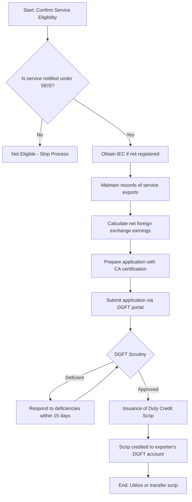

</think># Comprehensive Scheme Masterclass & File Guide

## Scheme Deep Dive

### Overview
The Service Exports from India Scheme (SEIS) is an export promotion initiative administered by the Directorate General of Foreign Trade (DGFT) under the Ministry of Commerce and Industry, Government of India. The scheme aims to incentivize service exporters by providing duty credit scrips based on net foreign exchange earnings.

### Objectives
- To promote export of notified services from India
- To provide fiscal incentives to service exporters
- To enhance India's share in global services trade
- To encourage diversification of export basket towards high-value services

### Eligibility Matrix
| Eligibility Criteria | Details | Source |
|----------------------|---------|--------|
| **Applicant Type** | Service providers exporting notified services from India | DGFT SEIS Guidelines |
| **Service Category** | Only services notified under SEIS are eligible | DGFT Notification No. 18/2015-2020 |
| **Minimum Export Earnings** | No minimum threshold specified for eligibility | Scheme Guidelines |
| **Registration Requirement** | Must have IEC (Importer Exporter Code) | DGFT Regulations |
| **Location** | Services must be exported from India | Scheme Definition |
| **Ineligible Services** | Services covered under MEIS (Merchandise Exports from India Scheme) | Scheme Exclusivity Clause |
| **Ineligible Entities** | Units located in SEZ/EOU/ETP/STP/BHTP for services covered under SEIS | DGFT Circular |

### Benefits & Financial Support
| Benefit Type | Details | Rate/Amount | Source |
|--------------|---------|-------------|--------|
| **Duty Credit Scrip** | Issued as percentage of net foreign exchange earned | 3% to 5% of net foreign exchange earnings | SEIS Notification |
| **Validity of Scrip** | Scrips valid for import of goods | 24 months from date of issuance | DGFT Scrip Guidelines |
| **Transferability** | Scrips are freely transferable | Fully transferable | DGFT Policy |
| **Usage Flexibility** | Can be used for payment of basic customs duty | 100% utilization allowed | Customs Act Integration |
| **Additional Benefit** | Can be used for payment of IGST under GST | Subject to GST rules | GST Notification |

### Application Process Flowchart

### Key Timelines & Deadlines
| Activity | Timeline | Notes |
|----------|----------|-------|
| Application Submission | Within 12 months from end of FY in which service exported | Based on financial year |
| Deficiency Response | 15 days from DGFT notice | Failure leads to rejection |
| Scrip Issuance | Within 60 days of complete application | Subject to verification |
| Scrip Validity | 24 months from issuance | Non-extendable |
| Annual Reconciliation | By September 30 each year | For previous FY claims |

### Important Warnings & Caveats
> **Blockquote**: SEIS benefits are calculated on **NET foreign exchange earnings**, not gross receipts. Exporters must deduct permissible expenses related to earning that foreign exchange as per DGFT guidelines.

> **Blockquote**: Services exported through intermediaries or agents may not qualify if the exporter cannot establish direct earning of foreign exchange. Maintain clear contracts and payment trails.

> **Blockquote**: Scrips issued under SEIS cannot be used for payment of anti-dumping duty, safeguard duty, or cess. They are only applicable for basic customs duty and IGST under GST.

> **Blockquote**: The scheme is subject to annual budget allocations. Early application within the fiscal year is recommended to avoid budget exhaustion.

> **Blockquote**: SEIS has been replaced by the Remission of Duties and Taxes on Exported Products (RoDTEP) scheme for eligible services w.e.f. January 1, 2021. However, claims for services exported during FY 2019-20 can still be filed under SEIS until March 31, 2022 (subject to extensions).

### Application Portal & Sources
- **Primary Portal**: https://www.dgft.gov.in (SEIS section under incentives)
- **Key Notification**: Notification No. 18/2015-2020 dated March 31, 2016
- **Procedure Handbook**: DGFT Handbook of Procedures Vol. I
- **Scrip Guidelines**: DGFT Circular No. 34/2015-2020 dated November 27, 2015

---

## Consultant's Field Guide to Generated Files

### 1. SCHEME_MASTER_DATABASE.md
**Real-time Usage:** Keep this open in a background tab during all client calls. When a client asks "What is the turnover limit?" or "Who administers this?", CTRL+F in this document to give an immediate, authoritative answer without checking the portal.

### 2. PITCH_AND_SALES_SCRIPTS.md
**Real-time Usage:** Open this file 5 minutes before your first Discovery Call with a lead. Read the "Problem Framing" out loud to hook them, then use the Qualification Checklist to interrogate their eligibility live on the phone. Keep the Objection Handlers table visible so you can immediately counter when they say "We're too small for this."

### 3. APPLICATION_PLAYBOOK.md
**Real-time Usage:** Print this out or pin it to your desktop once the client signs the retainer. Check off each box in "Stage 1" before moving to "Stage 2". Use the "Client Communication Template" to copy-paste directly into your email when chasing them for pending documents.

### 4. CLIENT_ONBOARDING_AND_CRM.md
**Real-time Usage:** Fill this out during or immediately after the onboarding call. Use the Needs Assessment to record their exact pain points. Update the "Compliance Status" table as they email you documents to maintain a single source of truth for what's missing.

### 5. LIVE_CASE_TRACKER.md
**Real-time Usage:** Review this document every morning during your standup. Update the "Stage" column daily. If a case hits "Stage 07 - Under review", use the Escalation Path notes here to know exactly who to call at the government department today.

### 6. FEE_AND_REVENUE_MODEL.md
**Real-time Usage:** Use this file when drafting the proposal. Look at the client's turnover, map them to the pricing tier in the table, and quote that exact Retainer and Success Fee. Use the monthly projection table to update your personal sales pipeline forecast for the quarter.

### 7. CLIENT_PROPOSAL_TEMPLATE.md
**Real-time Usage:** Copy this entire file, paste it into an email or PDF generator, replace the [PLACEHOLDER] tags with the client's actual details gathered from the CRM, and send it immediately after a successful discovery call.

### 8. COMPLIANCE_AND_LEGAL_PACK.md
**Real-time Usage:** Attach sections 8A and 8B as PDFs to the proposal email. Refuse to start Step 1 of the Application Playbook until the client signs these. Use the Disclaimers to protect yourself legally if the client is rejected by the government agency.